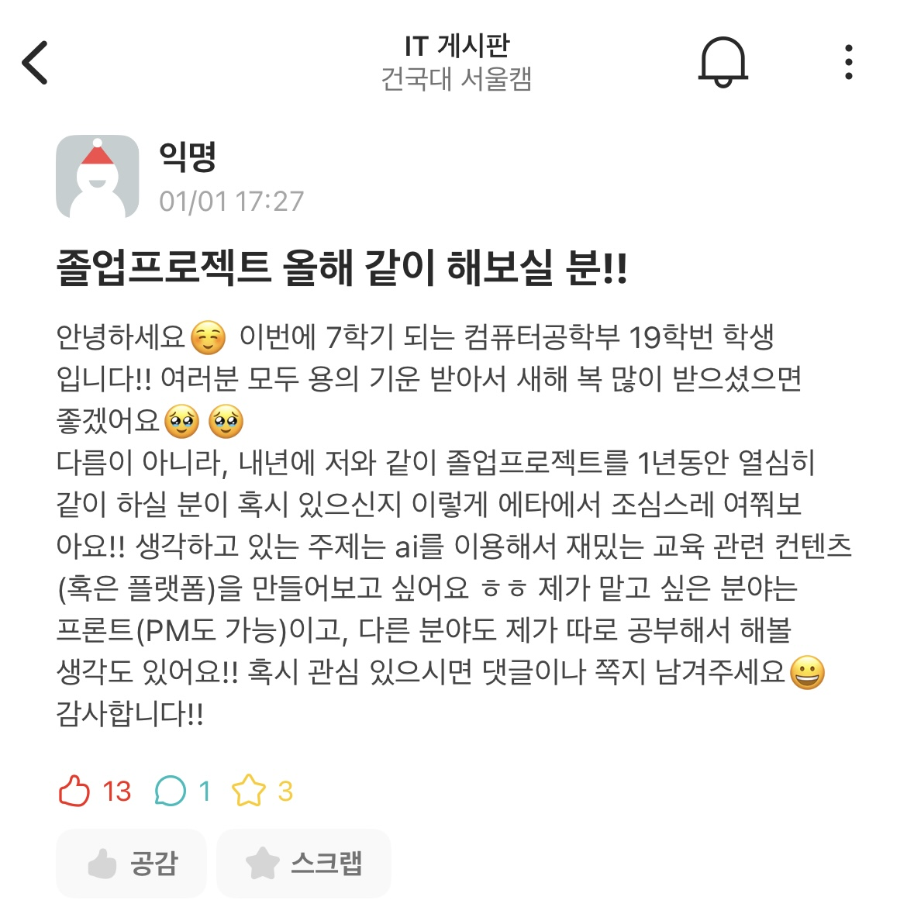
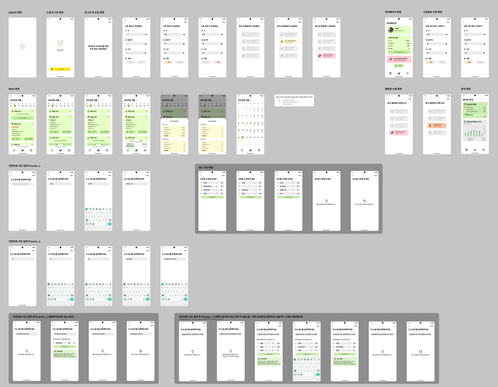
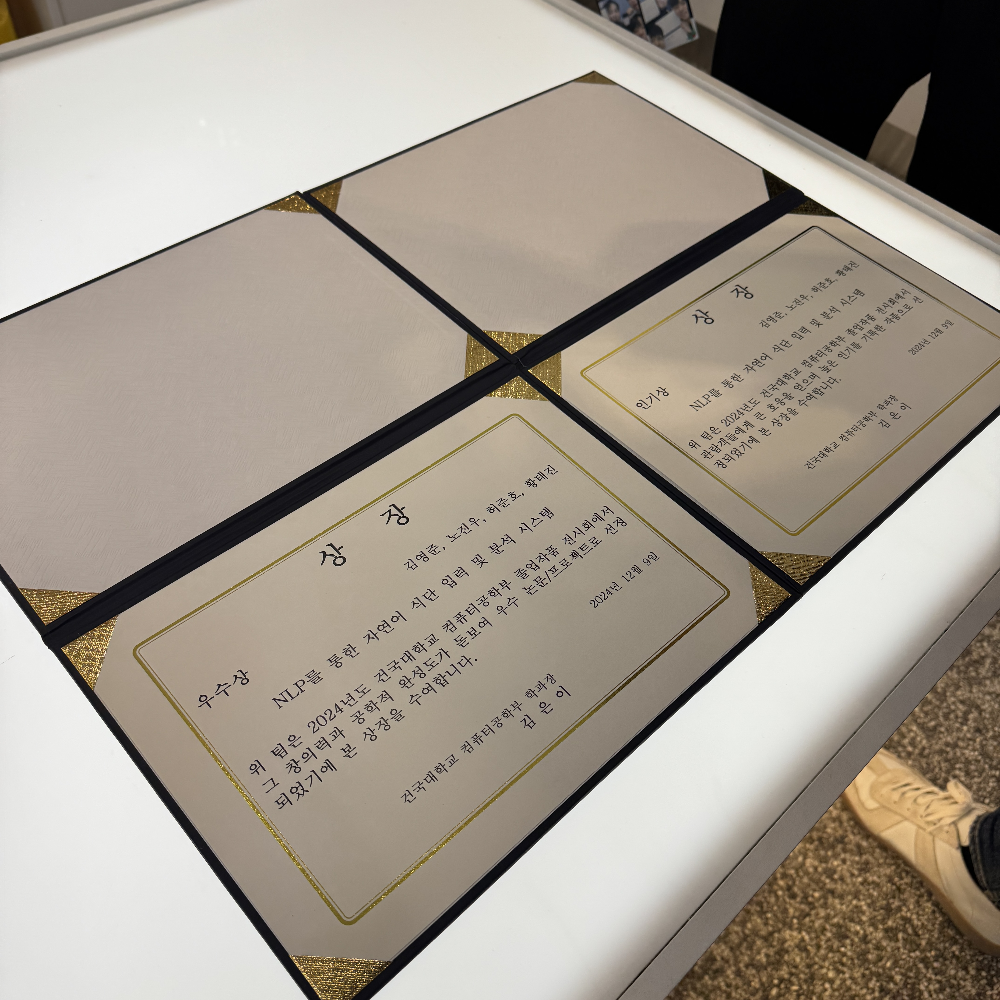
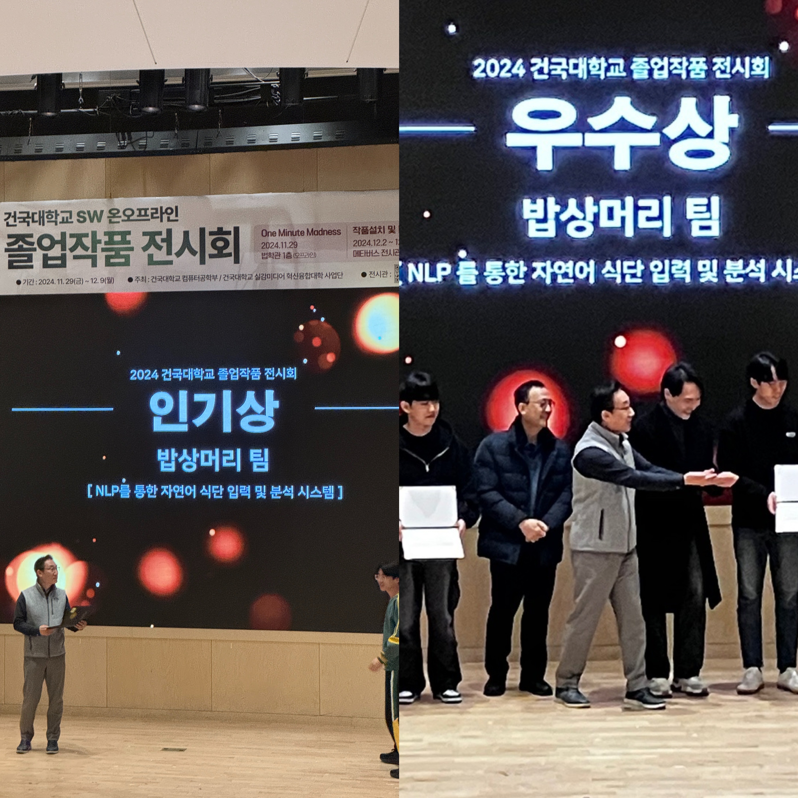
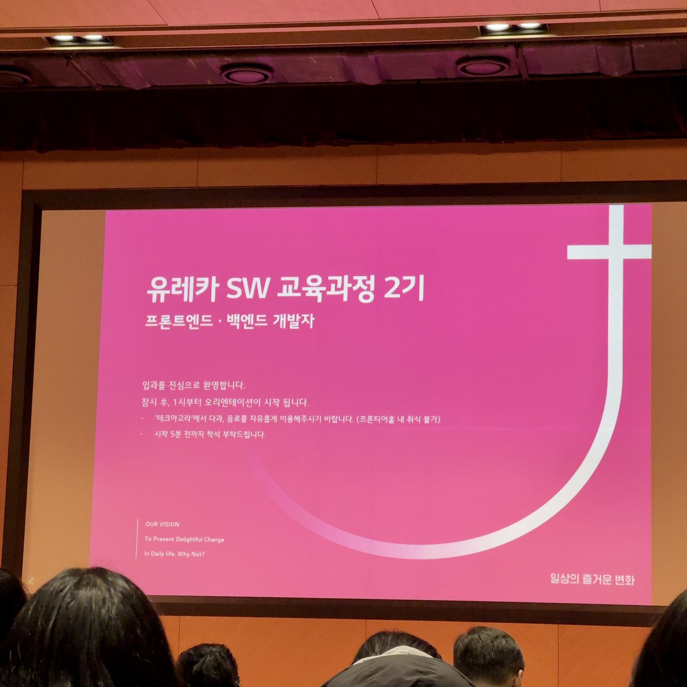
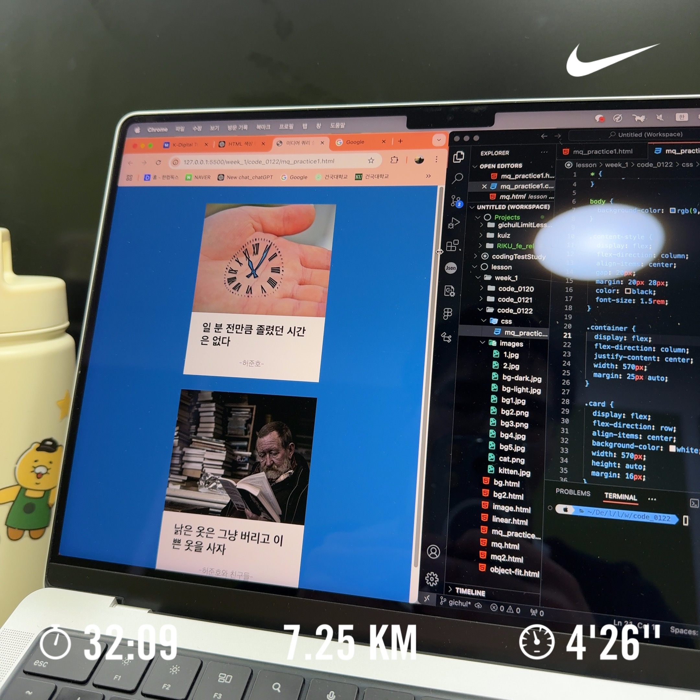

---
# [해당 부분은 인트로(글 제목, 카테고리, 썸네일 이미지 등) 관련 정보]
title: "시작이 반이다"
# date: 2025-01-29 14:00:00 +0900 (명시적으로 제목에 작성일을 기입했으므로 필요 없음)
categories: [글쓰기연습, 일상]
tags: [블로그, 일상]
image:
  path: "../assets/img/posting-images/0128/0128_cover1.JPG"
  alt: "그냥 갤러리에 있던 사진 중에서 이쁜 걸로 한 장 가져왔습니다."
  width: 1200   # 이미지의 너비 조정
  height: 1200   # 이미지의 높이 조정
  # dark: "/assets/img/dark-cover.jpg"  # 다크 모드에서 다른 이미지 사용
---

> Markdown이라는 언어가 생소한 기처리.. 드디어 Markdown과 github pages를 이용해서 블로그 포스팅을 시작했다!

이전부터 내가 성취하고 싶던 로망이 있었다. 바로, 나만의 인터넷 공간을 꾸미는 것. 그런데, 이는 생각보다 쉬운 일이 아니었다. 
핑계를 대보자면, 다른 일들에 치여 나만의 공간을 만드는 일은 뒷전이었던 것이다.
 
 
 

## 2024년, 새롭게 배운 것이 많았지만 뭔가 정리되진 못한 느낌..
2024년이 시작했을 때, 난 졸업 작품으로 많은 고민을 했었다. 프론트엔드를 할지, 백엔드를 할 지.. 제대로 정하지도 못했던 혼란의 시기였던 것 같다. 블로그 만들어야지! 하고 결국은 github.io 리포지토리를 만들고 지우고를 반복할 뿐이었다. 결국 귀찮다고 블로그는 못 만들었다. 
다른 일들에만 집중하게 되었다. 옆에는 gpt를 끼고, 어찌저찌 졸업작품 만들기를 시작했다. 팀원을 에브리타임으로 모으고, 우선 내가 할 줄 아는 것이 없으니 프론트엔드 개발을 하겠다고 선언했다. 
아무것도 모른 상태로 Figma로 디자인을 끄적이고, React를 해보지도 않았는데 React Native로 Cross-Platform 앱을 만들려고 하고.. 졸업작품을 하면서 새로운 시도를 정말 많이 했던 것 같다.

  <figure>
    
    <figcaption>졸업작품 팀원 모으겠다고 에브리타임에 이런 글까지 써버렸다고 함..</figcaption>
  </figure>
  
  <figure>
    
    <figcaption>생전 써본 적 없던 Figma도 열심히 했네요..어쩌다보니 디자인까지..🧑‍🎨</figcaption>
  </figure>

 
 

## 졸업작품의 성공적인 마무리와 개발 방향성 설정
그러한 혼란의 시기를 맞이한 지 일년이 다 되갈때 쯤, 스스로는 정신 없이 졸업작품을 한 것 치고는.. 학교 졸업작품 전시회에서 우수상, 인기상 중복수상이라는 쾌거를 이루었고, **React Native, React, TypeScript** 등의 프론트엔드 기술 스택을 어쩌다 보니 많이 익히게 되었던 계기가 되었다.  

  <figure>
    
    <figcaption>대학교 다니면서 상장 받아본 건 처음이에요..🥹</figcaption>
  </figure>
  <figure>
    
    <figcaption>밥상머리 화이팅🏆</figcaption>
  </figure>

 
졸업작품이 끝나고 내가 진정으로 프론트엔드 분야를 좋아하는지 고민을 해봤다. 사용자와 상호작용하는 Client 단계를 설계하는 일, 내가 힙합 동아리를 하면서 공연을 통해 사람들과 상호작용하는 무대를 설계하는 일과 어찌보면 매우 비슷한 일인 것 같다. 나의 전공분야 중 내 창의력을 마음껏 발휘할 수 있는 가장 적합한 무대이지 않을까 하는 생각이 든다.
 
 
물론 기초가 매우 부족한 상태에서 GPT에 의존하여 프론트엔드 분야를 찍먹?한 상황이기에, 얼른 기초를 쌓아야 하는 상황이다. 기업들의 코딩 테스트를 통과하기 위해 알고리즘 공부도 열심히 해야 하고 말이다. 내 머릿속엔 DP, 그리디, Binary Search 등의 기초 알고리즘, 자료구조 지식들이 떠돌아 다닐 뿐 적용은 전혀 되지 않는 상황이다.

 
 

## 2025년, 그래서 나의 목표는..🏁

  <figure>
    
    <figcaption>나의 부족한 실력으로 이 교육을 들으러 온 것은 내게 너무나 큰 기회이자 영광이었다.</figcaption>
  </figure>
  <figure>
    
    <figcaption>HTML, CSS, JavaScript의 기초부터 탄탄히 다져보고자 한다.</figcaption>
  </figure>

 
이제 벌써 28일이나 지난 1월, 정말 운이 좋게도 LG유플러스에서 주최하는 부트캠프인 유레카 과정에 참여하게 되면서 난 마음가짐을 새로 하게 되었다. 정말 열심히 자신의 꿈을 향해 달려가는 사람들이 모인 이 자리에서 나도 누를 끼치지 않도록 열심히 해야 겠다는 생각이 들었다. 내 일기장에도 적었지만, 아래의 3가지 목표는 확실하기 이루고자 한다.
 
 

> 1. 가족과 주변의 소중한 사람들, 그리고 나의 건강한 한 해가 되도록 노력하자.
> 2. 사람들에게 주눅 들지 않는 한 해가 되도록 노력하자.
> 3. 좋은 사람들과 좋은 인연을 맺는 한 해가 되도록 노력하자.

 
두루뭉실한 계획이라 생각이 들 수 있겠지만, 이러한 목표들을 이루기 위해서는 우선 운동을 열심히 하고, 공부를 열심히 하고, 좀 더 사교적인 사람이 되어야 할 것이다.
 
 
턱걸이 한 개를 하기 위해서 얼마나 많은 노력을 했는지를 생각해보자. 올해 이루려는 목표 또한, 턱걸이 1개를 하려 노력했던 그 마음가짐으로 시작해봐야 하지 않을까. 
취업이 내 궁극적인 목표가 되면 절대 안될 것이다. 내가 정말 좋아하는 일은 그 너머에 있을 테니까. 
정말 열심히 살아야 겠다. 드디어 만들게 된 나만의 공간, 기술 블로그도 열심히 써야지.