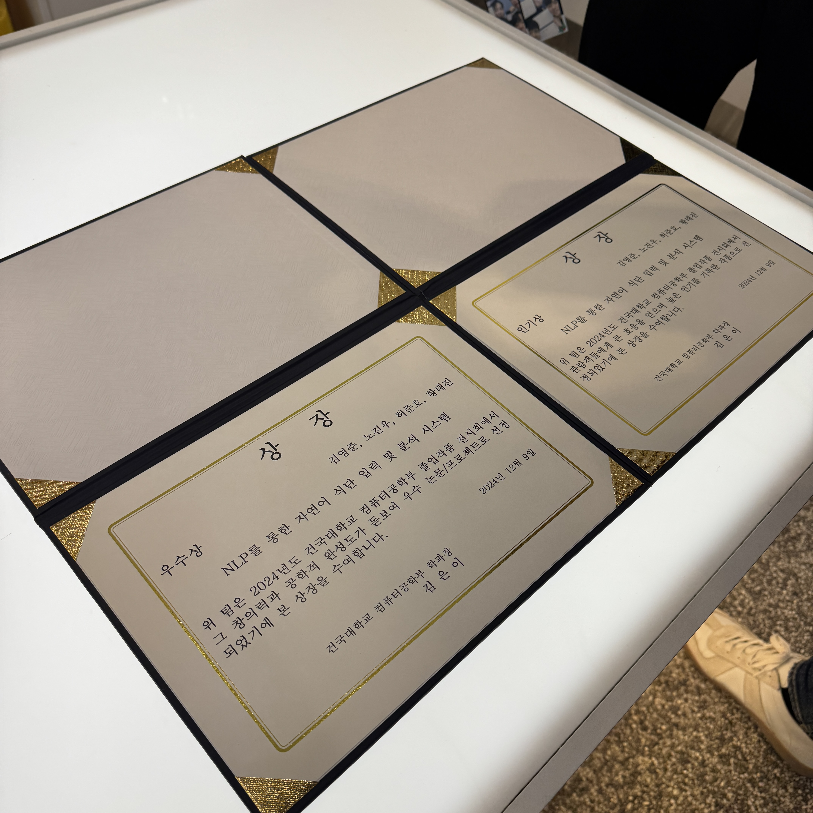

> Markdown이라는 언어가 생소한 기처리.. 드디어 Markdown과 github pages를 이용해서 블로그 포스팅을 시작했다!

이전부터 내가 성취하고 싶던 로망이 있었다. 바로, 나만의 인터넷 공간을 꾸미는 것. 그런데, 이는 생각보다 쉬운 일이 아니었다.

## 2024년, 새롭게 배운 것이 많았지만 뭔가 정리되진 못한 느낌..
2024년이 시작했을 때, 난 졸업 작품으로 많은 고민을 했었다. 프론트엔드를 할지, 백엔드를 할 지.. 제대로 정하지도 못했던 혼란의 시기였던 것 같다. 블로그 만들어야지! 하고 결국은 github.io 리포지토리를 만들고 지우고를 반복할 뿐이었다. 결국 귀찮다고 블로그는 못 만들었다. 
다른 일들에만 집중하게 되었다. 옆에는 gpt를 끼고, 어찌저찌 졸업작품 만들기를 시작했다. 팀원을 에브리타임으로 모으고, 우선 내가 할 줄 아는 것이 없으니 프론트엔드 개발을 하겠다고 선언했다. 
아무것도 모른 상태로 Figma로 디자인을 끄적이고, React를 해보지도 않았는데 React Native로 Cross-Platform 앱을 만들려고 하고.. 졸업작품을 하면서 새로운 시도를 정말 많이 했던 것 같다.

 
 
 

## 졸업작품의 성공적인 마무리와 개발 방향성 설정
그러한 혼란의 시기를 맞이한 지 일년이 다 되갈때 쯤, 스스로는 정신 없이 졸업작품을 한 것 치고는.. 졸업작품 전시회에서 우수상, 인기상 중복수상이라는 쾌거를 이루었고, React Native, React, TypeScript 등의 프론트엔드 기술 스택을 어쩌다 보니 많이 익히게 되었던 계기가 되었다.  

내가 좋아하는 분야가 진정으로 무엇인지 고민하는 계기가 되었다.
 
 
 

## 2025년, 그래서 나의 목표는..🏁
이제 벌써 28일이나 지난 1월, LG유플러스 유레카 과정에 참여하게 되면서 난 마음가짐을 새로 하게 되었다. 정말 열심히 자신의 일을 하는 사람들이 모인 이 자리에서 나도 누를 끼치지 않도록 열심히 해야 겠다는 생각이 들었다. 내 일기장에도 적었지만, 아래의 3가지 목표는 확실하기 이루고자 한다.

> 1. 가족과 주변의 소중한 사람들, 그리고 나의 건강한 한 해가 되도록 노력하자.
> 2. 사람들에게 주눅 들지 않는 한 해가 되도록 노력하자.
> 3. 좋은 사람들과 좋은 인연을 맺는 한 해가 되도록 노력하자.

정말 열심히 살아야 겠다. 드디어 만들게 된 나만의 공간, 기술 블로그도 열심히 써야지.