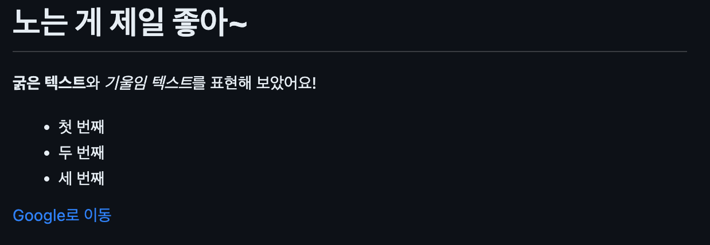
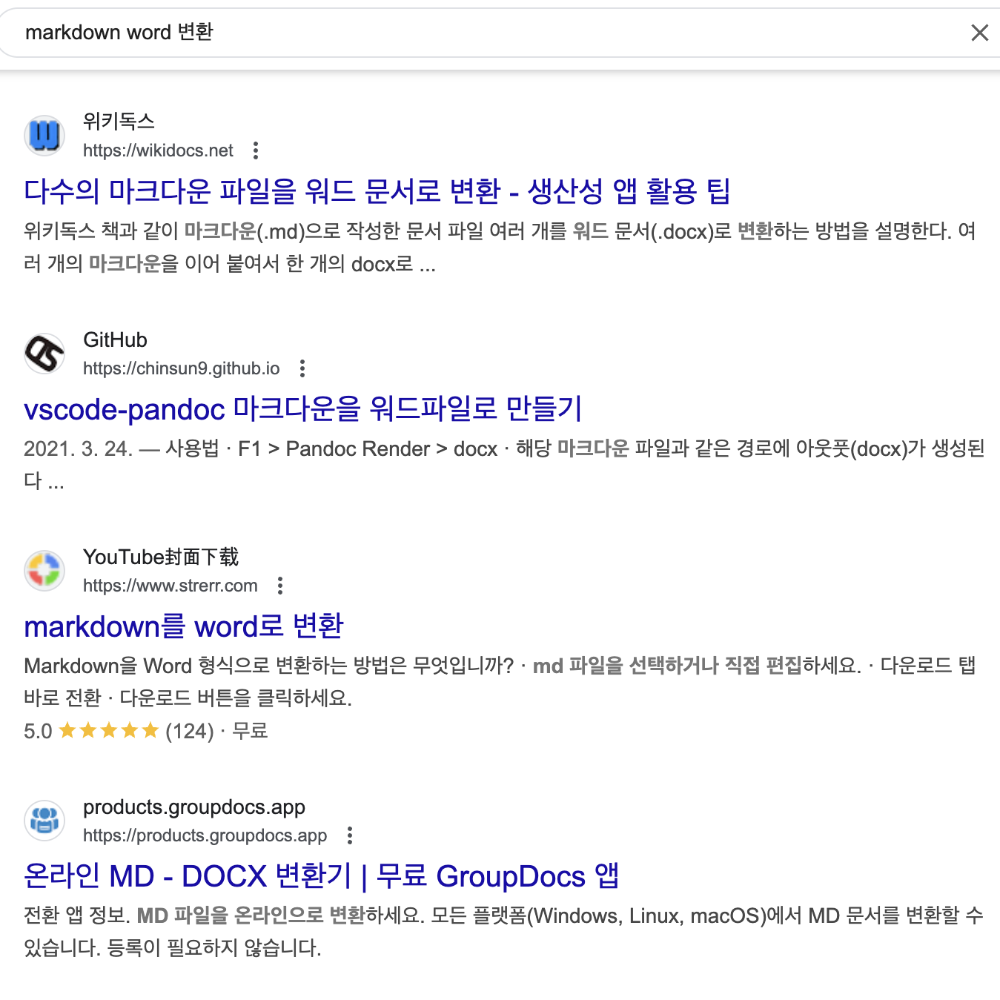
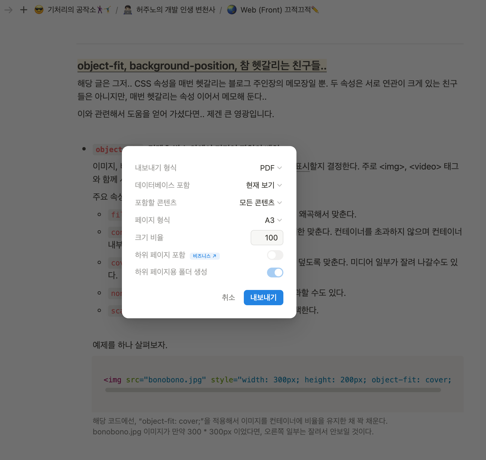

---
# [해당 부분은 인트로(글 제목, 카테고리, 썸네일 이미지 등) 관련 정보]
title: "Markdown(1)-이 친구는 누구인가?"
categories: [HTML/CSS/Markdown, Markdown]
tags: [Markdown, 기초]
image:
  path: "../assets/img/posting-images/0130/0130-thumbnail.png"
  alt: "Markdown은 처음엔 낯설지만, 익숙해지면 나름 재밌는 친구가 되겠죠?"
  width: 1200   # 이미지의 너비 조정
  height: 1200   # 이미지의 높이 조정
  # dark: "/assets/img/dark-cover.jpg"  # 다크 모드에서 다른 이미지 사용
---

> 단지 블로그 포스팅을 위해서 정리해 놓은 Markdown 정보, 다른 분들께 도움이 되면 제겐 너무 영광입니다✨ 

Github Pages를 이용해서 나만의 블로그를 만들 때 만나게 되는 진입장벽 중 하나가 바로 **Markdown**으로 블로그 포스팅을 작성해야 한다는 것이라 생각한다. <br>
기존의 네이버 블로그 등의 플랫폼에서 사용했던 방식과 달리, Markdown(.md)은 정해진 문법에 따라 문서를 작성해야 한다. 
<br>
<br>
우선, 본격적으로 Markdown 문법에 대해 알아보기 전, 이 친구가 누구인지부터 알아보고 가자.

<br>
<br>
<br>

## **✔️Markdown이란?**
**Markdown**은 일반 텍스트(Plain text) 기반의 *경량 마크업 언어*이다. 개발자와 비개발자 모두가 쉽게 읽고 쓸 수 있도록 설계 되었으며, 간단한 문법을 사용해서 웹 문서를 작성할 수 있다. 특히 기술 문서, 블로그 포스트, README 파일, 이메일 서식 등에 널리 활용되는 언어이다.
> Q. 여기서 잠깐, 마크업 언어(Markup Language)가 어떤 친구인데?
>> A. **마크업 언어**는 태그 등을 이용해서 문서나 데이터의 구조를 명기하는 언어의 한 종류이다. 태그는 원래 텍스트와는 별도로 원고의 교정부호와 주석을 표현하기 위한 것이었으나, 용도가 점차 확장되면서 문서의 구조를 표현하는 역할을 하게 되었다. 이러한 태그 방법의 체계를 마크업 언어라고 칭한다. <br> 일반적으로 데이터를 기술하는 정도로만 사용되기 때문에 프로그래밍 언어와는 구별된다. *(출처: 위키피디아)*

정리하면, Markdown은 개발자와 비개발자 모두가 ★쉽게★ 읽고 쓸 수 있게 만들어진 데이터 표현을 위한 언어라는 것이다. ~~(쉬운 거 맞나..?)~~ 
<br>
<br>
<br>

## **✔️Markdown의 특징**
그럼 이제, Markdown의 대표적인 특징 4가지를 알아보자.
### 1. 간결한 문법
HTML과 같은 마크업 언어에 비해 문법이 매우 단순하기에, 누구나 쉽게 사용할 수 있다고... 한다.
### 2. 좋은 가독성
코드와 일반 텍스트가 혼합된 문서에서도 가독성이 뛰어나며, 변환 없이도 쉽게 읽어 내려갈 수 있다.<br>
확실히 좋은 가독성인지는 잘 모르겠는데 일단.. 동일한 것을 표현하기 위해 각각 작성된 HTML과 Markdown 언어를 각각 살펴보면 되지 않을까?
<figure>
  
  <figcaption>이와 같은 화면을 표현하기 위해 HTML, Markdown은 각각 어떻게 표현 되는지 살펴보자.</figcaption>
</figure>

**📌HTML**
```html
<h1>노는 게 제일 좋아~</h1>
<p><strong>굵은 텍스트</strong>와 <em>기울임 텍스트</em>를 표현해 보았어요!</p>
<ul>
    <li>첫 번째</li>
    <li>두 번째</li>
    <li>세 번째</li>
</ul>
<a href="https://www.google.com">Google로 이동</a>
```

**📌Markdown**
```md
# 노는 게 제일 좋아~

**굵은 텍스트**와 *기울임 텍스트*를 표현해 보았어요!

- 첫 번째
- 두 번째
- 세 번째

[Google로 이동](https://www.google.com)
```

확실히 HTML에 비해선 가독성 좋긴 하네.. 이건 인정!

### 3. 다양한 변환 기능
Markdown 문서는 HTML, PDF, Word 등의 다양한 형식으로 변환할 수 있어 확장성이 높다.
<br>
구글에 검색해 보면, Markdown 문서를 MS 워드로 변환할 수 있는 여러 툴이 존재한다. 그리고, Notion에서는 자신이 작성한 문서를 pdf로 추출할 수 있는 기능이 있다. 이러한 기능들이 가능한 것은 모두 Markdown의 높은 확장성 덕분이다.
<div class="image-container">
  <figure>
    
    <figcaption>Google에 "Markdown word 변환" 관련해서 검색하면 이렇게 많은 검색 결과가 나온다.</figcaption>
  </figure>
  <figure>
    
    <figcaption>Notion이라는 문서 자체가 Markdown 언어 기반으로 작성된다. 해당 문서를 pdf 혹은 Markdown 형태로 내려 받을 수 있다.
    이미 많은 사람들이 알고 있을수도 있는 사실 한 가지 더 얘기해 보자면, chatGPT가 답변을 작성할 때 사용하는 언어 또한 Markdown 형태로 작성된다.</figcaption>
  </figure>
</div>

### 4. 광범위한 사용처
Github, Notion, Jupyter Notebook, 블로그 플랫폼(Github Pages, Velog 같은 것들..) 등 다양한 환경에서 지원된다.<br>
은근히 쓸 데가 많은 친구였잖아? 잘 배워 놓을게요..

<br>
<br>
<br>

## **✔️Markdown의 활용 분야**
앞서 잠시 언급했듯, 은근 쓸 곳이 많은 친구이다. 대표적인 활용 분야가 어디인지 간단히 알아보도록 하자.
### 1. 기술 문서 및 README 작성
GitHub 등의 플랫폼에서 프로젝트 설명을 위해서 README.md 파일을 많이 작성한다.
쉽게 설명하면, 다양한 프로젝트에서 이해를 돕기 위해 작성하는 문서로 Markdown을 많이 사용 한다는 것이다.
<figure>
  
  <figcaption>Markdown을 이용해서 이런 쓸데없는(?) 것도 작성할 수 있다는 것이다..!!</figcaption>
</figure>

### 2. 블로그 및 문서 작성
개발 블로그, 학술 논문 초안, 메모 등에 활용될 수 있다. Jekyll 등과 같은 정적 사이트 생성기에서도 주로 사용되는 문서 형태이다.

### 3. 협업 도구에서의 활용
Notion, Slack 등의 대표적인 협업 도구에서도 Markdown을 지원하기에 간편한 문서 작성을 돕는다.

<br>
<br>
<br>

## **✔️Markdown의 기본 문법 예제?**
Markdown이 어떤 친구인지, 그리고 어디에, 어떻게 쓰이는지 잘 알아 보았으니.. 이제 이 친구를 사용하는 방법을 알아야 겠죠?<br>
상세한 문법들에 대해서는 다음 시간에 알아 보도록 하고, 이 친구의 기본적인 작성법부터 알아보도록 하자.

### 1. 제목(Header)
```md
  # 제목 1 (html에서의 <h1>과 비슷한 역할)
  ## 제목 2 (html에서의 <h2>와 비슷한 역할)
  ### 제목 3 (html에서의 <h3>과 비슷한 역할)
```

### 2. 글씨 강조(굵게, 기울임, 취소선)
```md
  **글자를 굵게**
  *글자를 기울임*
  ~~글자에 취소선 긋기~~
```

### 3. 리스트(List) 작성하기
```md
  - 순서 없는 리스트
    - 하위 항목

  1. 순서 있는 리스트
  2. 두 번째 항목
```

### 4. 링크 & 이미지
```md
  [Github] (https://github.com) 
  
```

### 5. 코드 블록(Code Block)
```md
  ```python 
    def hello():
    print("Hello, Markdown!") 
  
    # 코드 블럭 양 끝으로 백틱(`) 기호를 3개씩 입력하고 닫아야 함(위에서는 코드 블록 영역 문제로 인해 시작 부분만 표기)
    # 그 오른쪽엔 언어명 입력 (ex. ```python)
    # 백틱 기호 3개를 입력한 곳의 들여쓰기 level이 맞아야 함 (아래 예시 참고)
    # ex. ```python
    #       def hello():
    #       print("안녕, 마크따운!") 
    #     ```

```
<br>
<br>
<br>

## **🤪정리**
뭐 암튼 지금까지, 블로그 포스팅 하면서 내 나름대로 정리한.. Markdown에 대한 기본 내용이었다.<br>
정리하면, Markdown은 HTML 등의 다른 마크업 언어와 다르게 간단하면서도 강력한 기능을 제공하기에 다양한 분야에서.. 활용되고 있다고 한다.<br>
나중에도 설명하겠지만, Markdown이란 언어는 html의 img, div 태그 등과 함께 사용할 수 있는 은근히 대단한 친구이다!<br>
다음 시간엔 Markdown의 좀 더 다양한 문법(작성법?)들에 대해서 알아보도록 하자.<br>
Markdown에 대해서 좀 더 익숙해져서 보다 체계적이고 가독성 높은 문서를 많이 작성해서 더 발전된 개발자가 될 수 있도록 노력해 보자✨
<div class="image-container">
  <figure>
    
    <figcaption>다들 공부 하면서도 건강을 놓치시면 안됩니다. 가끔은 날 좋을 때 등산을 해보시는 건 어떨까요? 너무 뜬금없는 얘기 하는 거 아니냐구요? 
    그런데, 그만큼 건강 챙기시는 게 중요합니다💪</figcaption>
  </figure>
  <figure>
    
    <figcaption>귀여운 거 보고 공부 하시면서 힘 한 번 내보시는 건 어떨까요? 전 참고로 춘식이를 정말 좋아합니다. 너무 TMI 아니냐구요? 죄송합니다.</figcaption>
  </figure>
</div>