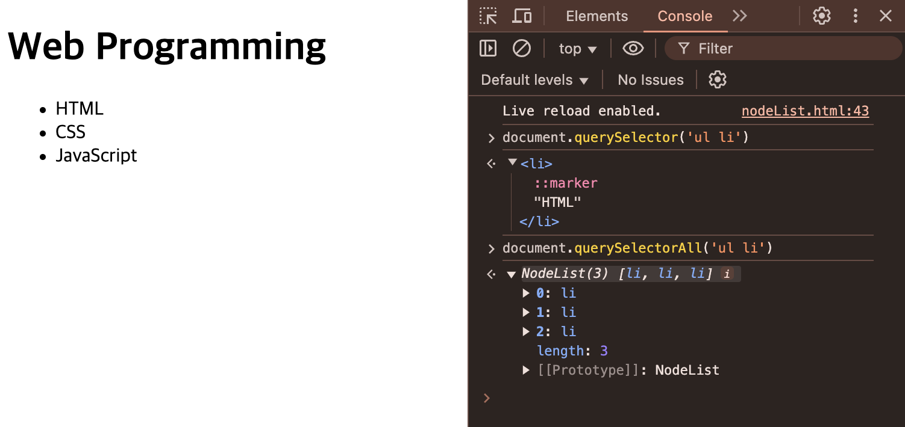
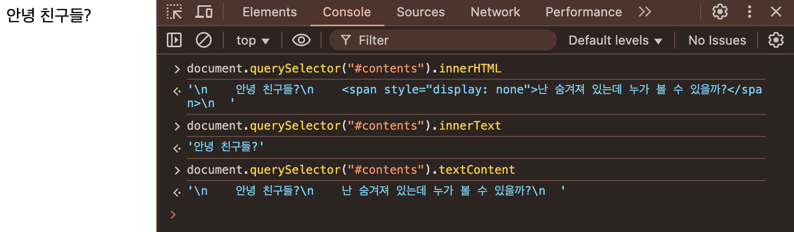
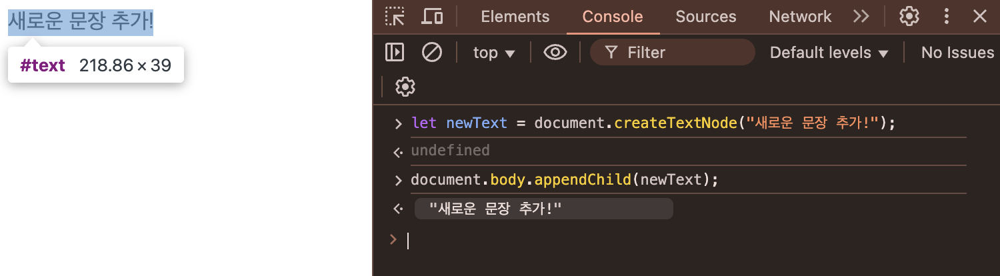
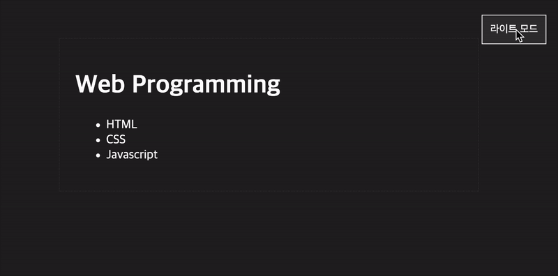

---
# [해당 부분은 인트로(글 제목, 카테고리, 썸네일 이미지 등) 관련 정보]
title: "JavaScript에서 DOM을 다뤄보자!"
categories: [웹]
tags: [JavaScript, 프론트엔드]
image:
  path: "../assets/img/posting-images/0203/0203_thumbnail.png"
  alt: "뭔가 요소들 간에 관계를 그려낸 것 같긴 한데, 벌써부터 머리 아프다"
  width: 1200   # 이미지의 너비 조정
  height: 1200   # 이미지의 높이 조정
  # dark: "/assets/img/dark-cover.jpg"  # 다크 모드에서 다른 이미지 사용
---

> 객체를 사용해서 웹 문서에 체계적으로 접근하고 제어할 수 있는 방법인 DOM을 알아보자!🍀

프론트엔드 개발을 하다 보면, HTML 요소를 숨겨야 한다던가, CSS 스타일을 바꿔야 한다던가.. 뭐 하여튼 동적으로 조작해야 하는 경우가 매우 많다. 이를 위해서 JavaScript에는 **문서 객체 모델(DOM, Document Object Model)**을 지원한다. 이를 활용하면 HTML 요소를 선택하고, 변경하고, 이벤트를 추가하는 등의 작업을 수행할 수 있다. 오늘은 JavaScript에서 이렇게 고마운 친구인 DOM을 다루는 법을 알아 보도록 하자!
<br><br><br>

## **✔️문서 객체 모델(DOM)는 뭐하는 친구이더냐..?**
DOM(Document Object Model)은 웹 문서를 JavaScript에서 다룰 수 있도록 트리 구조로 표현한 것이다. **쉽게 말하면, 웹 문서를 구성하고 있는 요소 간의 관계를 체계적으로 표현한 것이라 이해하면 된다.** 이러한 구조를 통해서, JavaScript로 HTML 요소를 선택하고, 수정하고, 이벤트를 추가하는 등의 놀라운(?) 작업을 할 수 있다.
### 🌲DOM 트리
HTML 문서는 계층적인 구조로 이루어져 있으며, DOM 트리는 부모-자식 관계를 형성한다. 그 계층 관계를 표현한 것을 **DOM 트리**라고 부른다. 예를 들어, 아래와 같은 html 문서가 있다고 하면..
```html
  <!DOCTYPE html>
  <html>
  <head>
      <title>참돔, 감성돔, 그저 DOM...</title>
  </head>
  <body>
      <h1 id="title">집에 가고 싶어요</h1>
      <p class="description">JavaScript 재미 있어질 수 있을까요?</p>
  </body>
  </html>
```
위의 html 문서를 DOM 트리로 표현하면 다음과 같다고 볼 수 있다.
```text
  html
  ├── head
  │   ├── title ("참돔, 감성돔, 그저 DOM...")
  ├── body
  │   ├── h1#title ("집에 가고 싶어요")
  │   ├── p.description ("JavaScript 재미 있어질 수 있을까요?")
```
id 속성은 명칭 앞에 **#**를 붙이고, class 속성은 명칭 앞에 **.**를 붙여 식별하는 것을 생각하면, 위에 표현되어 있는 계층 구조의 표현법이 이해가 갈 것이다🙂‍↕️🙂‍↕️
<br><br><br>


## **✔️DOM 요소에 접근하기**
웹 문서에서 특정 요소를 선택하는 방법에는 대표적으로 2가지가 있다. 지금부터 그 방법들을 하나씩 알아볼까?
### 1. ```getElement-*``` 메서드 사용하기
JavaScript에서 특정 요소를 선택하는 가장 기본적인 방법이다. ```getElementById```, ```getElementByClassName```, ```getElementsByTagName``` 메서드를 제공한다. 아래의 간단한 예시들을 살펴보자.
```javascript
  let title = document.getElementById("title"); // ID로 요소 선택하기!
  let descriptions = document.getElementsByClassName("description"); // 클래스명으로 요소 선택하기!
  let paragraphs = document.getElementsByTagName("p"); // 태그명(p, h1 등)으로 요소 선택하기!
```
참고로 document 객체는 웹 페이지 그 자체를 의미한다. *(쉽게 말하면.. 웹 문서의 최상단 부모 객체라고 생각하면 된다)*

### 2. ```querySelector()```와 ```querySelectorAll()``` 사용하기
위의 메소드들은 상당히 길다. 어느 세월에 getElementsByTagName 어쩌구를 치고 앉아있을 테인가... 다행히 더 간편한 방법이 준비되어 있다! 바로 ```querySelector()```와 ```querySelectorAll()```!!
```javascript
  let title = document.querySelector("#title"); //ID 선택
  let descriptions = document.querySelector(".description"); //클래스 선택
  let allDescriptions = document.querySelectorAll(".description"); //여러 개 선택(NodeList를 반환)
  let image = document.querySelector("img"); // 태그 선택 (여러 개일 경우 첫 번째  요소만 반환)
  let images = document.querySelectorAll("img"); // 태그 선택 (모든  요소들 NodeList로 반환)
```
```querySelector()```는 **해당하는 첫 번째 요소**만 반환하고, ```querySelectorAll()```은 **모든 요소**를 반환한다. 이 차이점을 잘 기억해 두자!
<figure>
  
  <figcaption>크롬 개발자 도구로 확인한 위의 사진을 보면 알 수 있듯이, 같은 매개변수에 관하여 querySelector()는 해당하는 첫 번째 요소만 반환하고, querySelectorAll()은 관련한 모든 요소를 반환한다.</figcaption>
</figure>
<br><br><br>


## **✔️DOM 요소 내용 변경하기**
선택한 요소에 관해서 텍스트 내용에 접근하고 수정할 수 있다. 접근하는 3가지 옵션이 있는데, 이들은 미묘한 차이가 있다. <br>
- ```innerText```: 요소의 텍스트에 대해서 접근
- ```innerHTML```: HTML 태그를 포함하여 접근
- ```textContent```: HTML 태그를 무시하고 순수 텍스트에만 접근

이렇게만 들으면 진짜 뭐라는지 하나도 모르겠다, 짚고 넘어갈 필요가 있다! 아래의 예제를 살펴보자.
```html
  <div id="contents">
    안녕 친구들?
    <span style="display: none">난 숨겨져 있는데 누가 볼 수 있을까?</span>
  </div>
```
위와 같은 간단한 html 문서에 대해서, id가 contents인 div에 다양한 방식으로 접근한 결과를 크롬 개발자 도구를 이용해서 확인해 보면 아래와 같다.
<figure>
  
  <figcaption>innerText는 말 그대로, 요소 내부의 사용자에게 '보이는' 텍스트(display: none인 글자엔 접근하지 않으니까!)에만 접근하고, innerHTML은 html 태그를 포함한 내부의 모든 요소에 접근하고, textContent는 html 태그를 제외한 모든 텍스트에 접근하는 것을 확인 가능하다!</figcaption>
</figure>
<br><br><br>

## **✔️DOM에서 이벤트 처리하기**
웹 페이지에서 사용자와 상호작용하려면 클릭, 마우스 커서 갖다 대기 등의 다양한 이벤트를 처리해야 한다. 이와 관련된 내용에 대해서도 한 가지씩 알아보자.<br>
### 1. 이벤트 연결 방법
이벤트를 DOM 요소에 연결하는 방법엔 우선, DOM 요소에 함수를 직접 연결하는 방법이 있다.
```javascript
  title.onclick = function() {
    alert("제목이 클릭되었습니다!!");
  }
```
또는 addEventListener()를 사용해서 DOM 요소와 연결할 수도 있다. 
```javascript
  title.addEventListener("click", function() {
    alert("제목이 클릭되었습니다!!");
  });
```

### 2. ```this``` 예약어 사용 관련
이벤트가 발생한 요소를 직접 가리킬 때, ```this```를 사용할 수도 있다. 
```javascript
  title.addEventListener("click", function() {
    this.style.color = "blue"; // "click" 이벤트가 발생한 'title'의 color를 바꾸려 들고 있다!
  })
```
```this```를 사용할 때 한 가지 유의할 점이 있다면, **화살표 함수에선 사용할 수 없다는 점**이다.

### 3. ```addEventListener()```와 ```event```객체 활용
```addEventListener()```를 사용하면 이벤트 핸들러 함수에 **event 객체**를 전달받을 수 있다. 이 객체를 활용하면 이벤트에 관한 다양한 정보를 얻을 수 있다.
```javascript
  title.addEventListener("click", function(event) {
    console.log("이벤트 유형": event.type); //발생한 이벤트의 유형("click", "change" 등..)
    console.log("클릭된 요소": event.target); //이벤트가 발생한 요소(여기에선 'title'을 가리킬 것임)
  })
```
<br><br><br>


## **✔️DOM에서 요소 추가 및 삭제하기**
### 1. 요소 추가하기
새로운 요소를 동적으로 생성할 때는 ```createElement()``` 와 ```appendChild()```를 사용한다. *(새로운 텍스트 노드를 생성하기 위해 ```createTextNode()```를 사용하기도 한다)*
```javascript
  let new_Paragraph = document.createElement("p"); //새로운 요소 <p> 생성
  new_Paragraph.innerText = "집가서 누워 있고 싶어요"; //new_Paragraph 요소의 텍스트 내용 변경
  document.body.appendChild(new_Paragraph); //body의 child(자식) 요소로 new_Paragraph 추가
```
> **📌```innerText``` vs ```createTextNode()```**<br>
> 두 방법 모두 요소의 텍스트를 변경하는 데 사용할 수 있지만, 동작 방식이 다른 것을 알아 두어야 한다!<br>
> ```innerText```는 기존 요소의 텍스트를 변경하는 데 사용 되지만, ```createTextNode()```는 새로운 텍스트 노드를 생성해서 문서에 추가하는 데 사용된다.
> 정리하면, ```innerText```는 기존의 html 구조를 유지 하면서 내용을 바꾸는 반면, ```createTextNode()```는 독립적인 텍스트 노드를 추가할 때 유용하게 사용된다!
> <figure>
>  
>  <figcaption>개발자 도구로 살펴 봤을 때, createTextNode()는 기존의 html 구조가 변하며, 아예 독립적인 노드가 생기는 것을 확인 가능하다.</figcaption>
> </figure>

### 2. 요소 삭제하기
새로운 요소를 동적으로 삭제할 때는 ```remove()```를 활용한다
```javascript
  new_Paragraph.remove(); //요소 삭제
```

### 3. 클래스 속성 추가 및 삭제하기
특정 요소의 class 속성을 추가 하거나, 삭제 하고 싶을 때도 있을 것이다. 그런 경우엔 ```classList```의 ```add()```, ```remove()```, ```toggle()``` 메소드를 활용하면 유용할 것이다!
```javascript
  title.classList.add("highlight"); // title 요소에 'highlight' class 속성 추가
  title.classList.remove("highlight"); // title 요소에 'highlight' class 속성 추가
  title.classList.toggle("active"); // title 요소에 대한 class 토글 ('active' class 속성을 추가(add)/제거(remove)를 번갈아 가며 수행)
```
<br><br><br>

지금까지 JavaScript에서 DOM을 다루는 기본적인 방법들을 알아 보았다.<br>
아래의 예시를 살펴 보며 DOM을 어떻게 사용하는지 복습하며 마무리해 보도록 하자. 각 코드에 대한 설명은 주석으로 상세히 기록해 놓았다.<br>
```javascript
  //이와 관련된 html, CSS 코드는 분량 상 생략함
  document.getElementById('modeSwitcher').addEventListener('click', () => {
    const bodyElement = document.body;
    const modeSwitcher = document.getElementById('modeSwitcher');

    // body 클래스를 토글해서 라이트 모드와 다크 모드 전환
    bodyElement.classList.toggle('dark-mode'); //'dark-mode'가 class 속성으로 들어가 있으면 제거, 없으면 추가
    bodyElement.classList.toggle('light-mode'); //'light-mode'가 class 속성으로 들어가 있으면 제거, 없으면 추가

    // 버튼 텍스트 업데이트
    if (bodyElement.classList.contains('dark-mode')) { //bodyElement 요소의 class 속성에 'dark-mode'가 포함되어 있다면
      modeSwitcher.textContent = '라이트 모드'; //modeSwitcher 요소의 텍스트를 '라이트 모드'로 변경
    } else {
      modeSwitcher.textContent = '다크 모드'; //modeSwitcher 요소의 텍스트를 '다크 모드'로 변경
    }

    // 삼항 연산자
    // bodyElement.classList.contains('dark-mode') ?
    // modeSwitcher.textContent = '라이트 모드' :
    // modeSwitcher.textContent = '다크 모드';
  });
```
위의 코드를 통해 아래와 같이 동적으로 라이트/다크 모드를 토글할 수 있는 간단한 UI를 완성할 수 있었다.
<figure>
  
  <figcaption>DOM을 다루는 법을 익혀 멋진 홈페이지를 만드는 데에 기여해 보자!!</figcaption>
</figure>
<br><br><br>

## **🤪정리**
오늘 열심히 알아봤던 내용은 아래와 같다.
>- DOM 트리와 요소 접근 방법
>- HTML 요소의 내용 변경 방법
>- 이벤트 처리 및 요소 추가/삭제 방법<br>

실제 프로젝트에서 DOM을 조작하는 다양한 상황이 발생할 것이다. 라이트/다크 모드는 물론이고, 팝업 on/off 등등 생각해보면.. 사용할 만한 곳이 정말 많지 않은가?! 나도 수업 시간에 배우면서 헷갈려서 수업 중엔 실습을 제대로 완성하지 못했다...🙂‍↕️ 차분히 **html 문서 내부의 요소들에 접근하는 다양한 방법**들을 복습하고 넘어가도록 하자!
