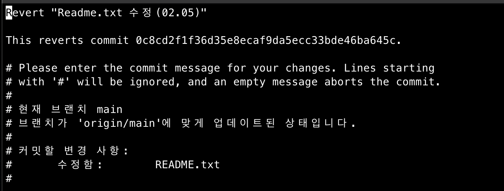
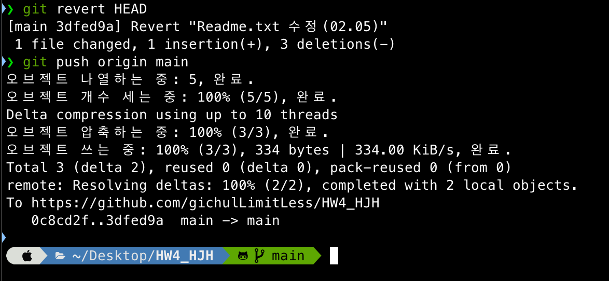
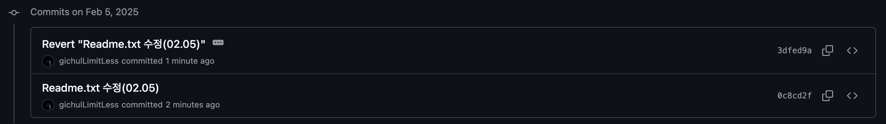
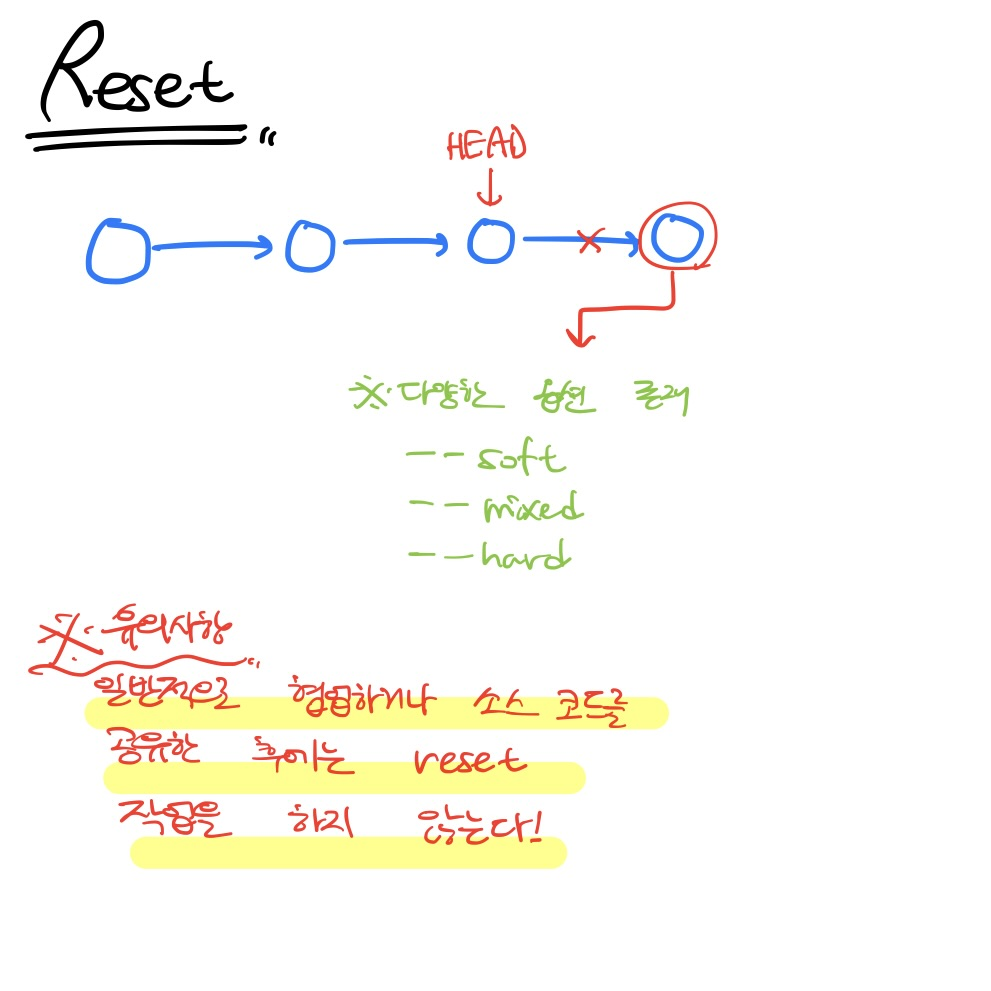
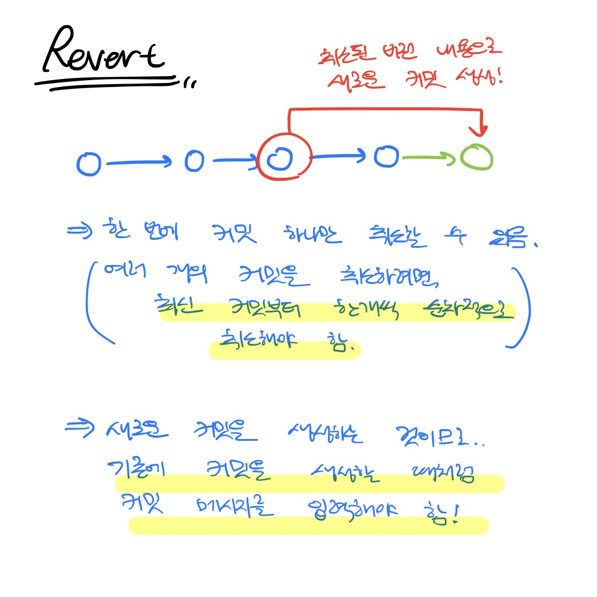
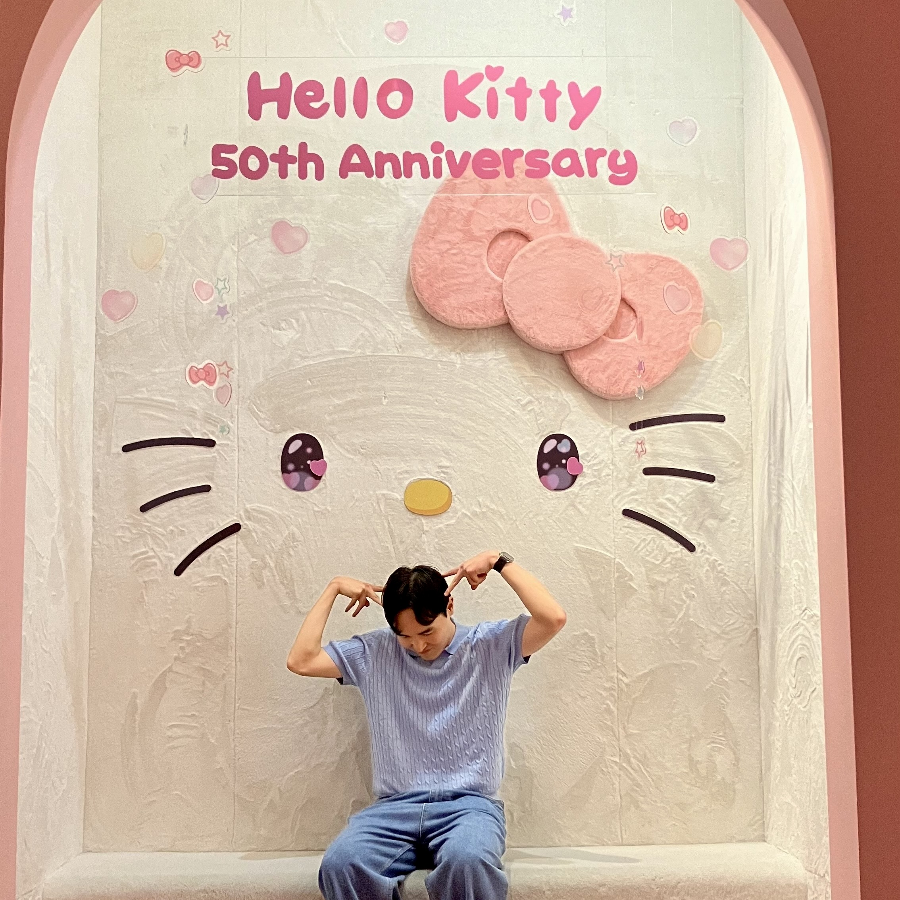

---
# [해당 부분은 인트로(글 제목, 카테고리, 썸네일 이미지 등) 관련 정보]
title: "Github commit 복구/수정.. 이젠 자신있게 하자!"
categories: [협업, Git]
tags: [협업, Git, Github]
image:
  path: "../assets/img/posting-images/0205/0205-thumbnail.JPG"
  alt: "여러분들도 머리가 아플 땐 유튜브에 '이마트'를 검색하시고 5시간짜리 영상을 틀고 노동요로 즐겨보세요."
  width: 1200   # 이미지의 너비 조정
  height: 1200   # 이미지의 높이 조정
  # dark: "/assets/img/dark-cover.jpg"  # 다크 모드에서 다른 이미지 사용
---

오늘 수업이 끝난 후, 자리 짝꿍이 깃허브에 오늘 수업 자료 파일 하나를 잘못 지운 채로 커밋을 해버렸다. 그리고, 잘못 푸시한 이 커밋 이력을 다시 되돌리는 방법이 없는지 찾아보고 있었다. 나도 도움을 주고 싶어 같이 해결방법을 찾아보다 결국 어찌저찌..🧐 해결했다. 그런데, 어떻게 해결했는지, 그 원인이 무엇인지 둘 다 제대로 파악하지 못하고 끝났다.

이전에 나도 프로젝트 파일의 버전 관리를 하면서 이런 상황을 종종 겪었는데, 그때마다 GPT 형님의 힘을 빌려 해결을 해서 그런가.. “Already up to date”, 하튼 뭐 이런 거 뜨기만 하면 두려움부터 밀려왔다😖 정작 원인이 무엇이고, 해결 방법이 무엇인지 제대로 정리를 안해 놓았던 것 같다. 맨날 복구할 상황이 오면 파일 잘못 될까봐 무서워나 하고.. 언제까지 이러고 있을건가!!🥲

오늘, 그동안 대충 넘어갔던 이 내용을 제대로 짚고 넘어가 보고자 한다.
<br><br><br>

## **🧹Git에서 커밋을 되돌려보자! `reset`과 `revert`**

Git에서 commit을 되돌리는 대표적인 방법 2가지는 `reset`과 `revert`를 사용하는 것이다. 각 명령어에 대해 이젠 그만 헷갈리려면.. 살펴보고 넘어 가야겠지?

### `git reset`: 내 로컬 커밋을 되돌리기

`git reset`은 특정 커밋 이전 상태로 현재 브랜치를 되돌리는 명령어다. 옵션에 따라 되돌리는 범위가 달라진다.

| 옵션 | 설명 |
| --- | --- |
| —soft | 커밋만 되돌리고, 변경 사항은 스테이징 영역에 유지 |
| —mixed **(기본값)** | 커밋과 스테이징을 되돌리고, 변경 사항은 작업 디렉토리에 유지 |
| —hard | 커밋, 스테이징, 그리고 작업 디렉토리의 변경사항까지 모두 삭제 **(⚠️복구 불가하니 주의)** |

가장 최근 커밋(HEAD)을 삭제하는 경우에 대해서 예시를 한 번 살펴보고 넘어가자!

```bash
# 마지막 커밋을 취소하고, 변경 사항은 스테이징에 유지 (add는 된 상태로 복구)
git reset --soft HEAD~1

# 마지막 커밋을 취소하고, 변경 사항을 스테이징에서 제거 (add 부터 다시 해야 한다)
git reset --mixed HEAD~1

# 마지막 커밋을 완전히 삭제 (작업 디렉토리의 파일 변경사항까지 다 삭제한다 / 복구 불가함!)
git reset --hard HEAD~1
```

### `git revert`: 안전하게 커밋 되돌릴 수 있는 마법(?)같은 친구..

`git revert`는 `git reset`과 달리, **이미 원격 저장소(GitHub 등)에 푸시된 커밋을 취소할 때 유용하게 사용**할 수 있는 명령어이다. 신기방기한 것이.. `reset`과 달리 기존 커밋을 삭제하지 않고, 커밋을 이번 버전으로 되돌리고, 그에 대해 **새로운 커밋**을 만들게 된다!  커밋을 새로 만드니까.. 협업할 때 훨씬 안전한 방법이겠지?!🙂‍↕️ 깃허브에 푸시할 때도 이것이 훨씬 문제가 덜할 것이다..

아래 예시를 살펴보자.

```bash
# 마지막 커밋을 되돌리는 새 커밋 생성
git revert HEAD

# 특정 커밋을 되돌리는 새 커밋 생성
git revert <커밋 해시값>
```

git revert를 실행하면, 자동으로 되돌리는 커밋 메시지를 입력하는 창이 뜨고, 기본 메시지를 그대로 두거나, 바꾸고 싶으면 커밋 메시지를 변경하고 저장하면 된다!
<figure>
  
  <figcaption>기본적으로 “revert [없애고 싶은 커밋의 커밋메시지]”으로 커밋 메시지가 설정 되어있다. 이게 아무래도 제일 직관적이니까.. 그냥 두고 저장하고 나가자. 그러면 알아서 커밋이 생성되고, 새로운 커밋이 생성 되었기에 문제 없이 원격 저장소에도 푸시가 가능할 것이다!</figcaption>
</figure>
<figure>
  
  <figcaption>문제 없이 과정이 수행되는 것을 확인할 수 있다.</figcaption>
</figure>
<figure>
  
  <figcaption>github에도 잘 적용된 것을 확인할 수 있다🥹</figcaption>
</figure>

### `git reset` vs `git revert`: 언제 어떤 걸 써 그럼..?

요약된 표를 통해서 간단히 살펴보고 넘어가자.

| 상황 | 추천 방법 | 이유 |
| --- | --- | --- |
| 아직 푸시 안 한 커밋 되돌리기 | git reset | 로컬에서만 변경하기 때문에 안전 |
| 이미 푸시한 커밋 되돌리기 | git revert | 팀원들에게 영향을 주지 않고 기록 유지 | 
| 과거 특정 커밋을 되돌리기 | git revert <커밋 해시> | 원하는 부분만 되돌릴 수 있음 |
| 커밋을 완전히 삭제하고 싶을 때 | git reset --hard | (⚠️ 신중하게 사용!) |

<br><br><br>

## **❌`git reset` 을 원격 저장소에 적용하려면? (force push) - 왠만하면 쓰지 마라**

로컬에서 `reset`을 한 다음, 이미 GitHub에 푸시한 상태라면, `git push`만으로는 변경 사항이 적용 안된다! 왜냐하면, Git은 **한 번 푸시된 커밋이 변경되는 것을 기본적으로 막기 때문**이다.

이럴 땐, 어쩔 수 없이 **강제 푸시(force push)**를 해야 한다🚨

```bash
git push origin <브랜치명> --force
```

근데, 이 방법은 협업할 땐 문제가 생길 수 있다! 협업하는 다른 팀원이 같은 브랜치를 끌어다 작업하고 있다면, 이 행동이 다른 사람의 히스토리를 꼬이게 만들 수 있거든.. 개인 작업물이면 모를까.. 협업하고 있다면 사용을 애초에 하지 말자🤯

이런 문제를 해결하기 위해, 다른 사람이 브랜치를 업데이트 한 경우엔, 강제 푸시를 하지 않도록 도와주는 `—force-with-lease` 옵션이 있다고 하네. 이 옵션을 써보도록 하자. ~~(무엇보다, 애초에 이렇게 히스토리가 꼬일 상황을 만들지 말자. 걍 싸우기 전에 revert 써..)~~

```bash
git push origin <브랜치명> --force-with-lease
```
<br><br><br>

## **☕️`git reset`과 `git revert`의 차이 요약**

| 명령어 | 설명 | 원격 저장소 푸시 가능 여부 |
| --- | --- | --- |
| `git reset` | 커밋을 삭제하고 과거 상태로 되돌림 | 🚫(푸시 후 사용 시 `--force` 필요) |
| `git revert` | 특정 커밋을 되돌리는 새 커밋 생성 | ✅(안전하게 되돌릴 수 있음) | 


팀 프로젝트나 이미 원격 저장소와 연결된 프로젝트에 대해선 `revert`, <br>
혼자 로컬에서 작업한 파일은 `reset`을 주로 사용하면 될 듯 하다..
<br><br><br>

✅ **혼자 작업 중이거나, 원격 푸시 안 했을 땐?**

→ `git reset`을 사용해도 오케이, 필요하면 `--soft`, `--mixed`, `--hard` 선택 가능.

✅ **팀 프로젝트 하고 있거나, 이미 GitHub에 푸시한 상태라면?**

→ `git revert`를 사용해서 안전하게 되돌리자.

✅ **진짜로 원격 저장소에서도 커밋을 없애고 싶을 땐..**

→ `git reset --hard` + `git push --force-with-lease`, 하지만 매우 주의해서 사용하자. ~~(싸우기 싫으면.. 그리고 과거의 나를 원망하기 싫으면..)~~
<br><br><br>
`reset` `revert` 관련해서 아래 그림으로 동작 방식을 정리해 놓았으니 참고하면 좋을 것 같다..!
<div class="image-container">
  <figure>
    
    <figcaption>reset은 그냥 쌩으로 커밋을 없애는 것이다!</figcaption>
  </figure>
  <figure>
    
    <figcaption>revert는 이전 버전 내용으로 새로운 커밋을 새로 파는 것이다!</figcaption>
  </figure>
</div>


<br><br><br>

## **🤪정리**

개발하다 보면, 언젠가 한 번쯤 비슷한 상황을 맞이하게 되겠지..

**“아, 저 커밋 날려야 되는데..”**

그리고, 난 지금까진 이런 실수를 했을 때 항상 이랬지..

**“망했다, GPT 형 해-줘.”**

하지만, 이제부턴 세상에 자신있게 외쳐본다(?)

**“아, 나도 이제 커밋 자신있게 되돌릴 수 있다!!🫡”**
<div class="image-container">
  <figure>
    
    <figcaption>저희 아무리 인생에 힘든 일이 있어도..</figcaption>
  </figure>
  <figure>
    
    <figcaption>웃으면 복이 와요😄</figcaption>
  </figure>
</div>