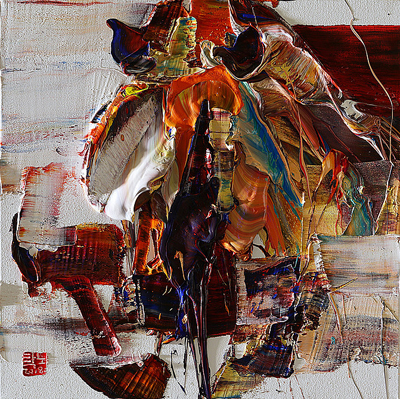
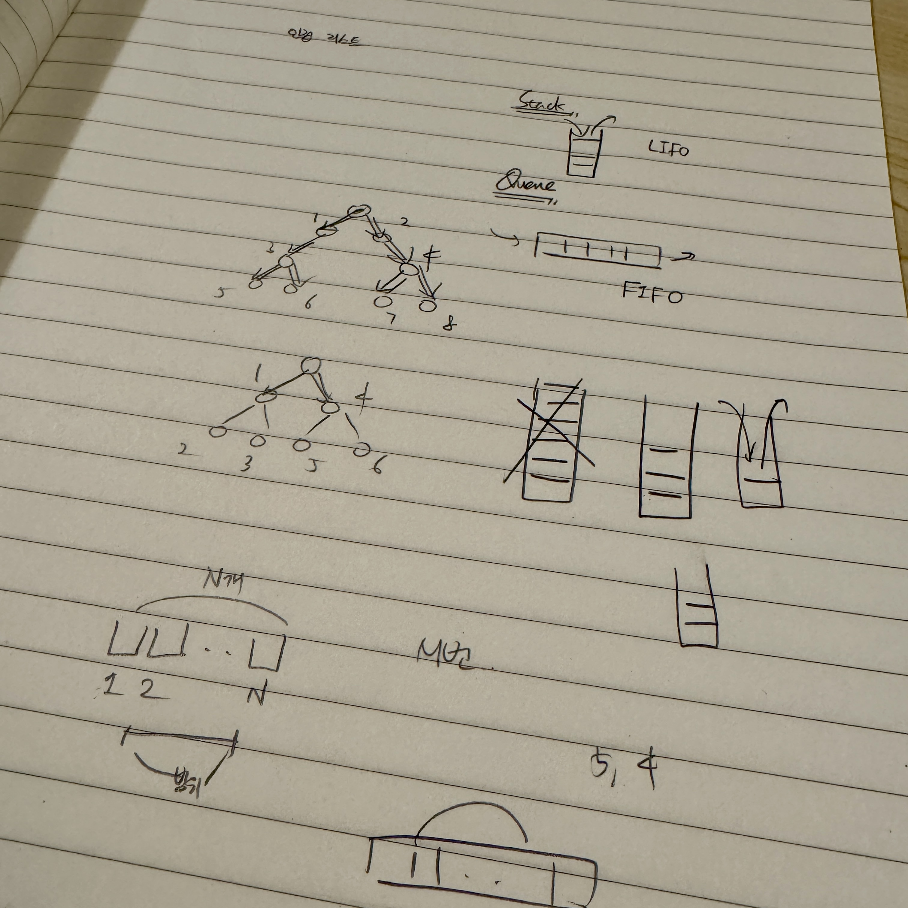
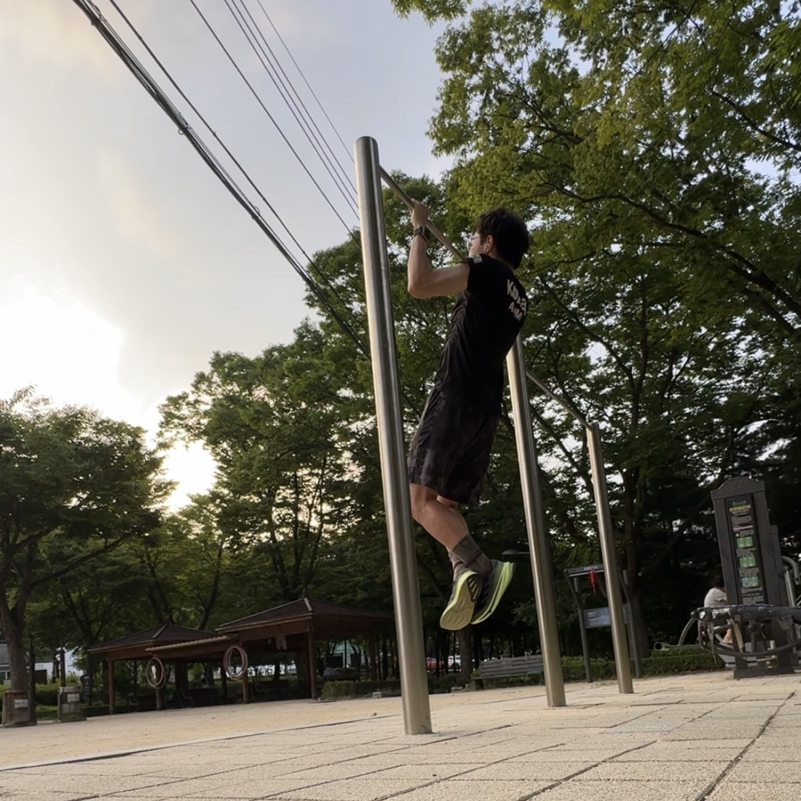
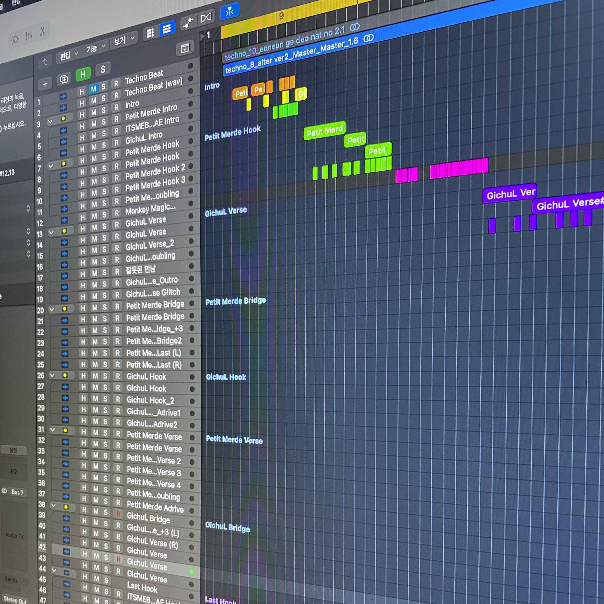
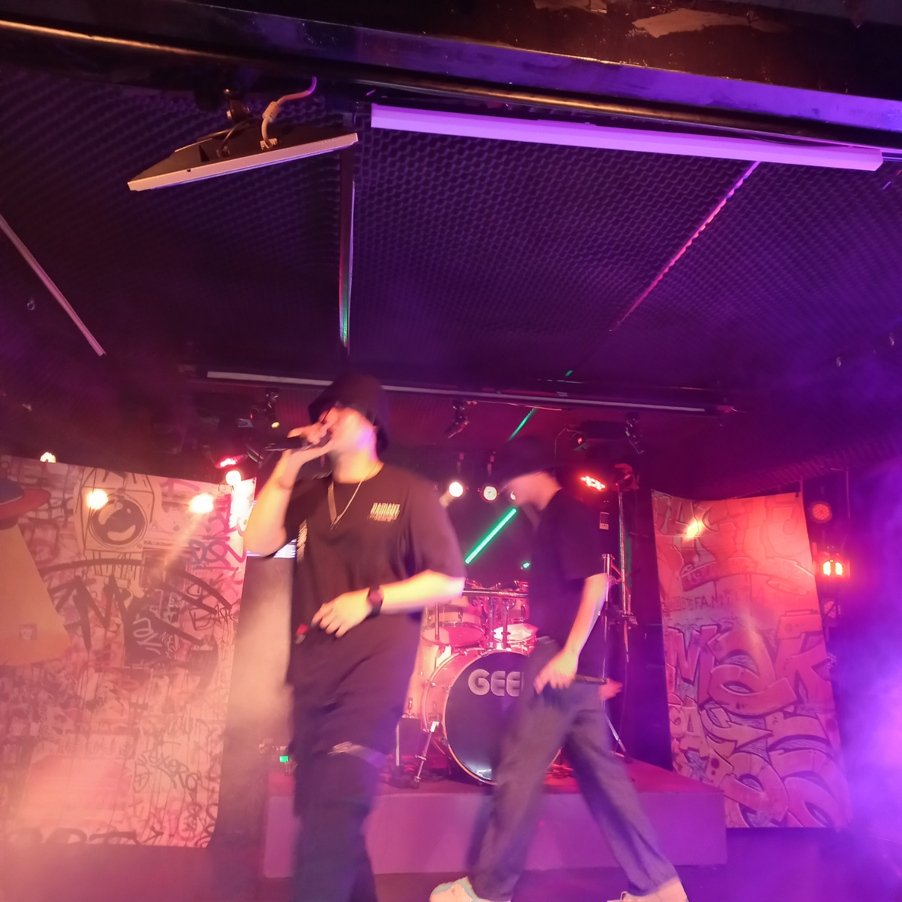
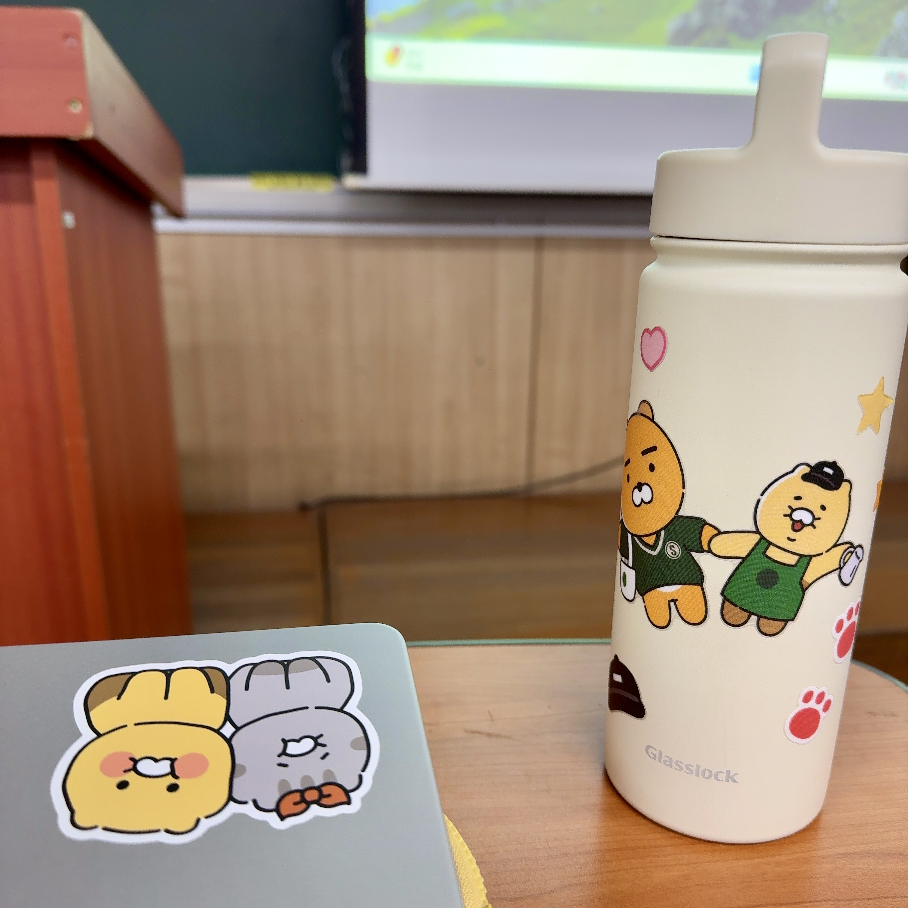
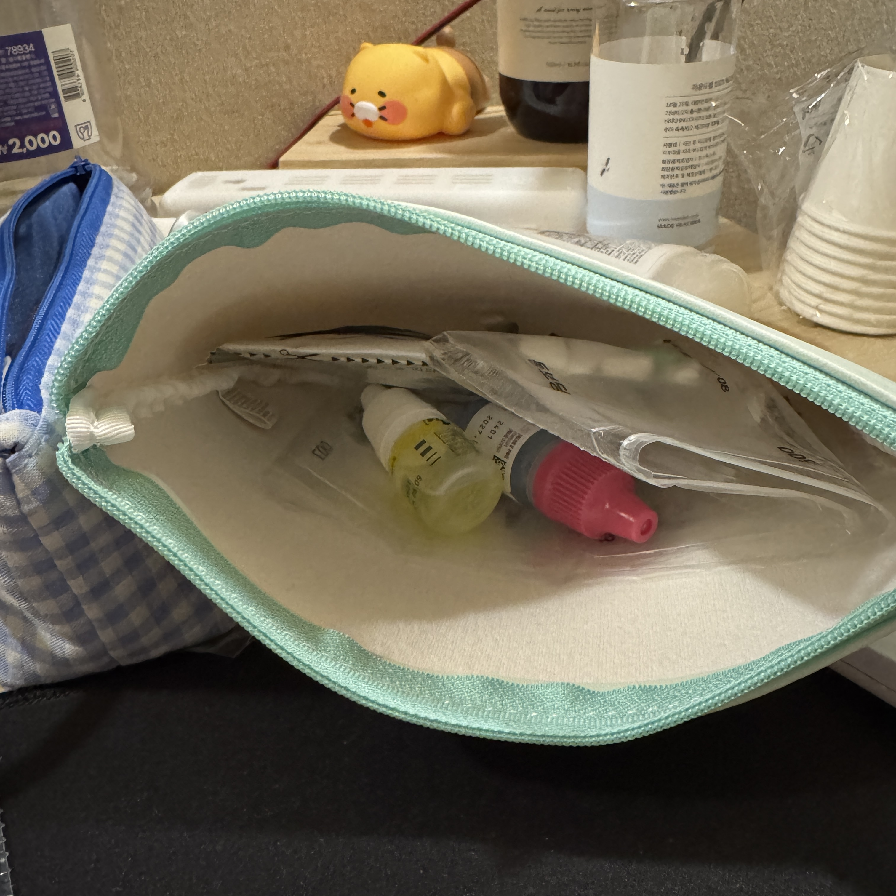

---
# [해당 부분은 인트로(글 제목, 카테고리, 썸네일 이미지 등) 관련 정보]
title: "우리는 모두 화가가 되어야 한다"
categories: [글쓰기연습, 일상]
tags: [일상, 자신감, 자존감]
image:
  path: "../assets/img/posting-images/0211/0211-thumbnail.jpg"
  alt: "우린 모두 그림을 그릴 수 있다. 그것이 차마 서투르더라도 말이다."
  width: 1200   # 이미지의 너비 조정
  height: 1200   # 이미지의 높이 조정
  # dark: "/assets/img/dark-cover.jpg"  # 다크 모드에서 다른 이미지 사용
---

## **덧칠하는 삶**

화가는 붓과 물감을 들고 빈 캔버스 앞에 선다. 처음에는 단순한 점과 선이 그려지지만, 그것이 하나둘 쌓이며 형태를 이루고, 색이 더해지며 깊이가 생겨난다. 어떤 부분은 처음 의도한 것과 다르게 번지기도 하고, 마음에 들지 않는 부분은 다시 덧칠 하기도 한다. 그렇게 여러 번의 수정과 변화를 거친 끝에, 비로소 한 폭의 그림이 완성된다.

이 과정에서 화가들이 자주 사용하는 기법이 있다. 바로 **레이어링(Layering) 기법**. 밑그림 위에 여러 층의 색을 덧칠하면서 그림을 완성하는 방식이라고 한다. 원래의 의도와는 다르게 흘러가더라도, 다시 색을 쌓고 자신의 나름대로 이를 조정하며 마침내 새로운 작품을 탄생시킨다.

<figure>
  
  <figcaption>다른 오브제를 사용하지 않고 물감 덧칠만으로 야생의 기운을 표현한 탁노 작가의 작품 ‘Wild aura 2018 Rhinoceros 001 60.0x60.0㎝ Oil on canvas(1)</figcaption>
</figure>

그런데, 문득 이런 생각이 들었다. 우리의 삶이 그려져 가는 과정이 결국 이런 과정일수도 있지 않을까.. 하고 말이다.
   

## **젊음, 우리가 열심히 덧칠할 수 있는 시기**

살다 보면 자신이 가는 방향이 맞는지 혼란스러울 때가 있다. 당연하게도, 나 또한 그런 순간을 여러 번 겪었다.

대학 시절, 힙합 동아리에서 공연을 하고, 음악을 만들었다. 러닝 동아리에선 꾸준한 건강 관리를 통해 결과적으로 42km를 뛰는 풀마라톤을 완주했고, 교직 이수를 통해 다양한 학과의 사람들을 만나서 생각을 교류했다. 지금 돌이켜 보면, 그때의 나는 하고 싶은 것들에 망설임 없이 뛰어들었던 것 같다.

그러나, 시간이 지나 ‘취업 준비생’이라는 타이틀을 달았을 때, 문득 내가 제대로 가고 있는지 확신이 들지 않았다. 남들은 나보다 훨씬 앞서 나가고 있는 것처럼 보였고, 나는 여전히 이 길을 가도 되는지 고민했다. 하지만 돌이켜보면, **그 순간들이 결국 나의 삶에 덧칠이 되고 있던 것이었다.**

어쩌면 젊음이란 것은, **활발히 계속 덧칠할 수 있는 시기**인지도 모른다. 색을 잘못 골랐다면 다시 칠하면 그만이다. 실패했다고, 남들보다 늦는다고 조급해할 필요, 전혀 없을 것 같다. 지금의 선택이 꼭 완벽하지 않아도 될 것이다. 중요한 건, 계속해서 색을 더하는 과정에 우리는 꾸준히 집중해야 할 것이다.

  <figure>
    
    <figcaption>내가 하고 있는 선택에 색을 더하는 과정에 우리는 집중해야 할 것이다.</figcaption>
  </figure>
  <figure>
    
    <figcaption>그것이 아무리 우리에게 불안감을 선사해 주어도 말이다. 일단 칼이라도 뽑았으면, 무라도 썰어봐야 하지 않을까?</figcaption>
  </figure>

   

## **성공이란 상대적인 그림**

어느 순간, 나보다 먼저 취업한 친구들이 늘어갔다. 취업난에 번듯한 취직한 친구들이 주변에 많으니, 나는 한동안 나의 능력을 부정하며 박탈감을 느꼈고, 사람들과 연락을 잠시 끊고 지낸 적도 있었다. 남들보다 느리다는 생각이 자꾸 나를 힘들게 만들었다.

그런데 문득, 과거의 내가 했던 생각이 떠올랐다.

**“무조건 빨리 취직하는 것이 성공은 아니야.”**

과거의 나는 이미 답을 알고 있었다. 하지만 현실이 닥치자, 내가 진정으로 중요하게 여기던 가치관이 점점 희미해졌다.

**“내가 진짜 좋아하는 것부터 찾아볼 거야. 그러니 남들보다 취직 좀 늦게 할 수도 있겠지.”**

남들과 비교하기 시작하니, 내가 원래 중요하게 생각했던 가치들이 점점 흐려져 갔다.

**성공이란 상대적인 개념이다.**

어떤 사람에게는 안정적인 직장이, 어떤 사람에겐 자유로운 삶이, 또 다른 누군가에겐 도전 자체가 성공일 수 있다. 모두 같은 그림을 그릴 필요는 전혀 없지 않을까? 우리는 각자가 원하는 그림을 그리면 그만일 것이다.

내가 선택한 길이 남들과 다를지라도, 나만의 색을 입혀가면 되는 것일 뿐이다.

  <figure>
    
    <figcaption>우리는 우리만의 그림을 각자 완성해 나가고 있는 것일 거다. 성공의 판단 기준은 절대적일 수 없다.</figcaption>
  </figure>
  <figure>
    
    <figcaption>돌아봤을 때 자신이 후회하지 않는다면, 그러면 된 거지 않을까? 삶의 방식이 다른 것일 뿐일거야.</figcaption>
  </figure>

   

## **나를 사랑해야, 내 삶이 아름다워지지 않을까?**

우리는 끊임없이 남들과 비교하는 세상에 살고 있다. 인스타그램 같은 SNS에는 남들의 화려한 일상이 끊임없이 올라오고, 회사에서도, 학교에서도 우리는 늘 누군가의 비교 대상이 되며 평가되는 경우가 많다.

이런 사회일수록, 비교가 아니라 나를 사랑하는 법을 배워야 할 것이다. 나를 사랑해주는 건 결국 나 자신이 해야 하는 영순위 미션이지 않을까?

> 📌 **남들보다 앞서는 게 아니라, 어제의 나보다 나아지는 것에 집중하기.** 
> 📌 **내가 좋아하는 것, 나만의 개성을 찾는 것.**  
> 📌 **완벽하지 않더라도, 있는 그대로의 나를 받아들이는 것.**

위의 목표들을 실천하기 위해, 나는 한때 이런 방법들을 시도했다. 무조건 실천 하겠다는 마음으로, 집에 있는 책상에 적어서 붙여 놓기도 했다.

> **✨ 필요없는 것엔 무관심으로 대응하기** 
> **✨ 디지털 디톡스 수행하기(→특히, SNS 디톡스를 해야 함)** 
> **✨ 해야할 일을 귀찮아 하지 말기**

이런 작은 변화들이 쌓이자, 내 삶의 색이 조금씩 선명해져 갔다, 그리고 마음 깊이 깨달았던 것 같다.

**"내가 나를 사랑할 때, 비로소 내 인생이 진짜 나다운 아름다운 작품이 된다."**

  <figure>
    
    <figcaption>나를 사랑해 주자. 나를 사랑해 주는 걸, 내가 아니면 누가 해주겠는가?</figcaption>
  </figure>
  <figure>
    
    <figcaption>나만의 개성을 찾아야 한다. '나'라는 존재는 유일한 것일 테니까.</figcaption>
  </figure>

   

## **덧칠하며 살아가자**

나는 좋아하는 노래의 가사를 인용하며 이 글을 마무리하고 싶다.

>"삶이란 찢겨진 캔버스  
>그 상처의 물감이 번져  
>다시 새로운 삶이 내게 그려져  
>화가들아 get on the bus" 

> – *리쌍, 화가(火哥) 중 일부...*

우리의 삶은 완벽한 밑그림이 그려진 채로 주어지는 것이 당연히 아닐 것이다. 인생에 정답이 어디 있겠는가? 때로는 예상치 못한 상처가 번지고, 예상과 다른 방향으로 흘러가기도 할 것이다. 하지만 그것이 끝이 아니다. **그 위에 새로운 색을 덧칠하면 된다.**

너무 조급해하지 말자.

너무 쉽게 포기하지 말자.

자신감을 갖고 덧칠해 보자.

뒤처진다고 느껴질 때, 앞서가는 사람들을 미워하지 말자. 대신, 나만의 그림을 그려내는 데에 더 집중해 보자. 그렇게 한 겹씩 색을 쌓다 보면, 언젠간 우리도 우리의 인생을 감탄하며 바라볼 날이 올 테니까.

**그러니, 붓을 놓지 말자. 우리는 모두 화가가 되어야 한다. 그리고 당연하게도, 우리는 모두 훌륭한 화가가 될 수 있다.**

  <figure>
    
    <figcaption>남들이 나를 제치고 많이 앞서 가있다고 생각이 들 때, 너무 힘들어 하지 말자. 우리 속에 생긴 상처 위에 자신감 있게 덧칠을 해보자.</figcaption>
  </figure>
  <figure>
    
    <figcaption>이럴 때일수록 우리의 건강을 챙겨야 할 것이다. 힘차게 달려가기 위해서는 우선 몸부터 튼튼해야 할 것이기 때문이다. 너무나도 당연한 이야기 아닌가? 아프지 말고 건강하자.</figcaption>
  </figure>

   