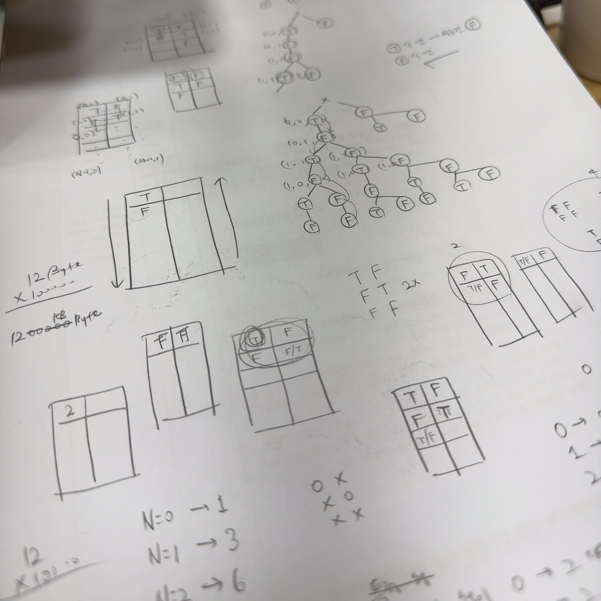
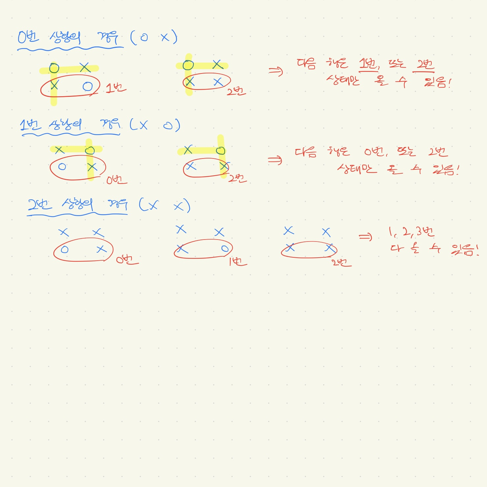

---
# [해당 부분은 인트로(글 제목, 카테고리, 썸네일 이미지 등) 관련 정보]
title: "DP라는 아이는 너무 어려워요, 그치만 난 정복할 거에요!"
categories: [알고리즘]
tags: [알고리즘, DP]
image:
  path: "../assets/img/posting-images/20250402/0402_thumbnail_2.JPG"
  alt: "Dynamic한 인생...은 재미있고(?) Dynamic한 프로그래밍...은 좀 어렵더라"
  width: 1200   # 이미지의 너비 조정
  height: 1200   # 이미지의 높이 조정
  # dark: "/assets/img/dark-cover.jpg"  # 다크 모드에서 다른 이미지 사용
---

수업 끝나고 자습 시간에 옆자리 짝꿍이랑 대충 백준에서 문제 훑어보고 있었는데, 내가 ‘동물원’이라는 문제 제목 보고… 오 재밌겠는데? 풀어봐라 라고 문제 추천을 해줬다. 실버1 문제여서 막 엄청 죽도록 어렵진 않겠다… 생각해서 나도 그냥 호기롭게 도전을 해봤는데, 어제 못풀고, 결국 오늘도 풀려다가 실패해서 GPT 형님 도움을 받았다🥲

그 과정에서 내가 놓친 점과 이후 깨달음을 통해 어떤 보완이 필요한지를 GPT 형님과 함께 정리해 봤다. 글 쓰면서 내가 놓쳤던 건 무엇인지, 내가 얻어갈 건 무엇인지.. 그냥 기록해볼래.

<br>

## **🤯 문제 풀이 과정**

[해당 문제 링크(클릭시 넘어갑니다)](https://www.acmicpc.net/problem/1309)

우선 문제 조건을 요약해 보면 아래와 같다.

- 2×N 배열의 우리에 사자를 배치한다.
- 사자는 가로든 세로든 **붙어 있으면 안 된다.**
- 사자를 **배치하지 않는 경우**도 유효한 경우로 간주된다.
- 가능한 배치의 수를 **9901로 나눈 나머지**를 출력해야 한다.

아니 나는 처음엔, 2 * N 배열의 우리에 사자 배치? 인접하면 안된다고? 사방을 탐색해야 되나… 이런 사고 방식에 이어서 배열 다 탐색해야 겠구나… 생각하고 완전탐색(DFS 아니면 BFS..)를 생각했다. 적당히 백트래킹 하면 2초 안에 풀 수 있을 줄 알고… 내가 문제 풀면서 적어 놨던 주석의 일부를 가져왔다 일단.

```text
- 2×N 배열을 만들고, 각 칸을 기준으로 사자 배치 가능 여부 판단
- 인접 조건을 고려하여 DFS로 탐색
- 방문 여부 체크를 위한 visited 배열 사용
```

내가 처음에 생각했던 이 방식의 핵심 아이디어는..

- "모든 경우를 따져야 한다" → DFS/재귀 탐색
- 각 칸에 사자를 두는 경우와 두지 않는 경우로 나눠서 경우의 수 계산

이런 방식으로 경우의 수를 다 구하려 했다. 그래프 탐색도 생각했다 ~~(미친거지).~~ 시간 초과 날 거 알면서도 여기에서 벗어나는 데에도 방법을 바꾸는 데 시간이 많이 걸렸던 것 같다.

딱 봐도 시간 터질 것 같아서, 시간 터지는 걸 해결하려면 어떻게 해야 될까.. 백트래킹도 안될 것 같은데.. 이런 고민 많이 했던 것 같은데, 도저히 생각이 안 나서 이 문제의 알고리즘 분류가 뭔지 펼쳐봤다. 그런데, 이거 DP(Dynamic Programming)으로 푸는 거라고 써있더라고… 아. DP 한 번도 풀어본 적 없는데….

DP는 대충 메모이제이션 해갖고 중복 연산을 최소화 해서 빨리 답을 찾아내는 느낌이라고만 알고 있었다. 이 문제에 이러한 방법론을 어떻게 적용할 지 처음엔 감도 안 잡혔다. 그래서, 검색을 통해서 블로그의 살짝 참조해 봤다.

<br>

DP로 문제를 풀기 위해선, 문제에 다음과 같은 기본 특징이 있어야 한다고 하더라.

1. **Optimal Substructure**: 문제의 정답이 작은 문제의 정답으로 구성될 수 있어야 함
2. **Overlapping Subproblems**: 동일한 부분 문제를 여러 번 계산하게 되는 경우가 있어야 함

즉, 점화식을 세울 수 있도록 문제가 구성되어야 한다는 것이다. 그리고, 자주 사용하는 DP 방식은 아래와 같다고 한다.

방식 |  설명 | 특징
--- | --- | ---
Top-Down (Memoization) | 재귀 + 메모이제이션 | 처음에 큰 문제부터 시작해서 점점 작게 분해
Bottom-Up (Tabulation)	| 반복문으로 테이블 채우기	| 작은 문제부터 차근차근 정답을 만들어감

해당 문제에서의 핵심은 전체를 탐색 하려 들지 않고, 각 줄(행)의 상태를 보고, 다음 상태를 예측하는 방식으로 푼다는 방식이었다. 아… 이거 점화식 냄새 솔솔 나네. 근데, 생각해 보니, 옛날 알고리즘 수업 시간에 DP 풀려면 점화식 세워서 문제 풀어야 한다는 얘기를 들었던 것 같기도…🤪

> "각 줄(행)의 상태는 3가지밖에 없네"

| 상태 | 의미 |
| --- | --- |
| 0 | 왼쪽 칸에 사자 O, 오른쪽 칸 X |
| 1 | 왼쪽 칸 X, 오른쪽 칸 O |
| 2 | 두 칸 모두 X |

각 상태에 대해서, 가로/세로 인접한 곳엔 사자가 못 온다는 조건으로 인해서 그 다음 행에 올 수 있는 상태는 아래처럼 제한적인 것을 확인할 수 있었다.

> 이번 행이 0번 상태인 경우 → 다음 행은 1번 또는 2번 상태만 올 수 있음 <br>
> 이번 행이 1번 상태인 경우 → 다음 행은 0번 또는 2번 상태만 올 수 있음 <br>
> 이번 행이 2번 상태인 경우 → 다음 행은 0, 1, 2번 상태 모두 올 수 있음 

위의 제한적인 상태 3가지로 인해서, 아래와 같은 사실을 얻을 수 있다.

> 다음 행이 0번 상태인 경우 → 이전 행은 1번 또는 2번 상태만 올 수 있음 <br>
> 다음 행이 1번 상태인 경우 → 이전 행은 0번 또는 2번 상태만 올 수 있음 <br>
> 다음 행이 2번 상태인 경우 → 이전 행은 0, 1, 2번 상태 모두 올 수 있음

각 줄(행)의 다음 줄(행)의 상태는 이전 줄의 상태에 따라 제한적으로 결정된다, 이게 핵심이래.

<div class="image-container">
  <figure>
    
    <figcaption>이걸 일일이 완전탐색(DFS 아니면 BFS)과 약간의 백트래킹을 통해 2초 안에 풀려고 했으니.. 말도 안되는 생각이었지...</figcaption>
  </figure>
  <figure>
    
    <figcaption>각 상황(0,1,2번 상황)에 대해서 나올 수 있는 다음 경우의 수가 제한적인 것을 확인하고, DP 문제라는 것을 알아 차렸어야 했다.....</figcaption>
  </figure>
</div>

```python
dp[i][0] = dp[i-1][1] + dp[i-1][2]
dp[i][1] = dp[i-1][0] + dp[i-1][2]
dp[i][2] = dp[i-1][0] + dp[i-1][1] + dp[i-1][2]
```

직접 그려보면서 점화식 일반항을 세워보니, 이것만 세울 줄 알면 정말 쉬운 문제였다는 걸 느꼈다.

<br>

## **⚠️ 두 가지 중요한 깨달음**

### 1. 문제를 DP로 해결해야 한다는 감각 부족

2차원 배열에서 모든 경우의 수 탐색이라는 걸 보고.. DFS 아니면 BFS라는 고정관념이 어느 정도 있던 것 같다. 그동안 그래프 탐색 문제를 열심히 풀었으니 그런 것도 있던 것 같다. 상태 수가 제한적인 구조가 있다는 것을 파악 하질 못함. 어떻게 패턴화 시키는지에 대해 경험이 부족한 게 컸던 것 같다.

### 그래서 고민한 보완 방향:

- 완전탐색이 너무 비효율적이라 판단되면 → **DP 전환**을 의심하기
- 문제를 보면 **"상태의 수가 제한적인가?", "반복되는 패턴이 있는가?"** 를 먼저 점검해야 할 것 같다.

### 2. 모듈러 연산에 대한 이해 부족 (왜 `% 9901`을 계속해야 할까?)

"그냥 마지막에 한 번 나누면 되겠지?" 라는 안일한 생각을 당연히 했지. 중간에 수가 커지면 생기는 **메모리 초과**를 고려하지 못했다. Python과 같은 프로그래밍 언어에서 정수는 자동으로 커지긴 하지만, 메모리를 많이 차지하는 큰 정수를 반복적으로 다루면 메모리 터질 가능성이 매우 높다.

### 몰랐던 핵심 개념:

**✅모듈러 연산의 분배법칙**

```python
# 모듈러 연산의 분배법칙은 덧셈, 곱셈, 뺄셈 모두에 적용할 수 있다
(a + b) % m = ((a % m) + (b % m)) % m
(A * B) % p = ((A % p) * (B % p)) % p
(A - B) % p = ((A % p) - (B % p) + p) % p # 음수가 나오는 것을 방지하기 위해 divisor를 한 번 더해준다
```

→ 중간 계산마다 `% 9901`을 적용해도 최종 결과엔 영향이 없다. 동시에 메모리 절약과 시간 최적화를 얻는다.

### 깨달은 보완 방향:

- `% 연산`은 단순 출력용으로 준 게 아닐 가능성이 높다.
- 계산 도중 값이 커질 수 있는 DP 문제에서는 **반드시 중간에 나눠야** 한다는 점을 습관화하기

<br>

## **Python 풀이**

```python
MOD = 9901
N = int(input())
dp = [[0]*3 for _ in range(N)]
dp[0] = [1, 1, 1]  # 첫 줄의 세 가지 상태

for i in range(1, N):
    dp[i][0] = (dp[i-1][1] + dp[i-1][2]) % MOD
    dp[i][1] = (dp[i-1][0] + dp[i-1][2]) % MOD
    dp[i][2] = (dp[i-1][0] + dp[i-1][1] + dp[i-1][2]) % MOD

print(sum(dp[N-1]) % MOD)
```

DP로 풀면 코드 확 짧아지네… 이런 걸 일일이 DFS로 찾을 생각을 했으니.. 말도 안 됐던 거지. 요건 Bottom-Up 방식으로 풀은 풀이인 것으로 보인다.

<br>


## **🥕마무리**

DP 관련된 백준의 훌륭한(?) 문제들을 추천하며 마무리해 보고자 한다.

1. [백준 1149번 - RGB거리](https://www.acmicpc.net/problem/1149)
2. [백준 2156번 - 포도주 시식](https://www.acmicpc.net/problem/2156)
3. [백준 9465번 - 스티커](https://www.acmicpc.net/problem/9465)

DP는 아직까지는 내게 겁나게 어렵다. 그치만… 조금씩 부딪히면서… 깨져보면서… 크면 언젠간 DP라는 친구도 정복해 버릴 수 있지 않을까? 아좌좟!!👏💪