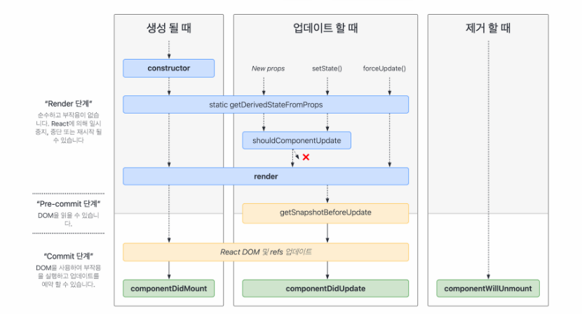

---
# [해당 부분은 인트로(글 제목, 카테고리, 썸네일 이미지 등) 관련 정보]
title: "React 컴포넌트야.. 잘 살고 있니? (Life-cycle & Hook 정리)"
categories: [웹, React]
tags: [React, Component, Hook]
image:
  path: "../assets/img/posting-images/20250407/20250407-thumbnail.JPG"
  alt: "무엇이든지 탄생을 하면, 죽음이 있습니다. 심지어, 저희가 매일 보는 숏츠에 있는 밈(Meme) 조차도요."
  width: 1200   # 이미지의 너비 조정
  height: 1200   # 이미지의 높이 조정
  # dark: "/assets/img/dark-cover.jpg"  # 다크 모드에서 다른 이미지 사용
---

React를 사용하다 보면, 자주 보게 되는 구문이 있다.

```jsx
const [step, setStep] = useState(1);
useEffect(() => {
	setStep(2);
}, [])
```

뭐 이런 것과 같이.. 하튼 use로 시작하는 이러한 친구들을 많이 봤을 거고, 나도 실제로 여러 React(React Native 포함) 프로젝트를 하면서 이러한 형태의 구문들을 많이 봐왔다. 그런데, 내가 정작 이 구문들을 왜 쓰고 있는지, 내부적으로 자세히 뜯어보며 분석했던 적은 없는 것 같다. 그러다, 이번 수업 시간에 React 컴포넌트의 일생(?)이라 볼 수 있는 **라이프사이클(Life-Cycle)**에 대해 알아보며, 내가 왜 저런 구문들을 써 왔는지 깊이 깨닫게 되었다.

<div class="image-container">
  <figure>
    
    <figcaption>React Component의 일생을 자세히 표현한 그림입니다.</figcaption>
  </figure>
</div>

<br>
<br>

## **📌클래스형 vs 함수형 컴포넌트**

**클래스형 컴포넌트**는 `React.Component` 클래스를 상속 받아(`extends`) 만든 컴포넌트를 말한다. `React.Component` 클래스엔 라이프사이클 메소드(아래에서도 살펴 보겠지만.. `getDerivedStateFromProps()`와 같은 친구들을 의미한다)가 제공되기 때문에, 당연히 이를 상속 받은 클래스형 컴포넌트에서도 이 메소드들을 사용할 수 있고, 우리가 직접 각 시점을 정의할 수 있다.

**함수형 컴포넌트**는 이러한 라이프사이클 메소드가 제공되지 않는다. 그러기에, 함수형 컴포넌트에서는 대안책으로 **Hook** 이라는 방법을 제공하게 되었다! 이 Hook이라고 하는 것은, 우리가 평소에 상태 관리 어쩌구 한다면서.. use로 시작하는 친구들(`useEffect()`, `useState()` 등을 의미)인 거다!

이제, 각 라이프사이클 단계에서 두 방식이 어떤 차이를 보이는 지에 대해, 내가 개발자 하다가 때려치고(?) 프랜차이즈 치킨 가게를 차리고 운영하는 상황을 가정하고, 이에 빗대어 설명해 보도록 하겠다.🍗🤪

<br>
<br>

## **⽣ React에서 컴포넌트의 생명 주기**

### 🐣 Mount: 컴포넌트의 탄생 (= 치킨 가게 오픈 준비)

**‘출생’** 이라는 뜻으로 받아들이면 될 것 같다. 내가 개발자 하다가 때려치고, 치킨집을 오픈하는 과정이랑 같다. 각 라이프사이클 단계를 수행하는 메소드와 치킨 가게 오픈 준비하는 과정을 비유해서 설명해 보도록 하겠다!

- `constructor`: 가게 문을 열기 전 준비 단계 (인테리어, 자금 확보 등의 세팅 과정)
- `getDerivedStateFromProps`: 오픈 전에 본사헹서 제공한 메뉴 반영
- `render`: 가게 문을 열고 내부를 꾸며서 손님을 맞이할 준비 완료!
- `componentDidMount`: 첫 손님이 들어오고 나서 진짜 장사 시작! (참고사항: 이때, 데이터를 서버에서 불러와야 한다)

> 이 때, 데이터를 서버에서 불러오는 요청(ajax, fetch 등)을 `componentDidMount`에서 하는 이유는, 먼저 DOM 렌더링을 하고 나서 데이터를 받아야 사용자 입장에서 빠르게 처리되는 것처럼 보이기 때문이다.
→ 비유하자면, 가게 문을 열고(=DOM 렌더링) 나서 재료를 받아야 손님 입장에서 빠르게 음식을 받을 수 있겠지..? 이렇게 생각하면 된다.
> 

**✅ 클래스형 컴포넌트**

```jsx
class ChickenStore extends React.Component {
  constructor(props) {
    super(props);
    this.state = { menu: [] };
    console.log('1. 치킨 가게 세팅 시작~');
  }

  static getDerivedStateFromProps(props, state) {
    console.log('2. 본사에서 초기 메뉴를 전달받음');
    return null;
  }

  componentDidMount() {
    console.log('4. 치킨 가게 문 열고 오픈 행사를 했다! (데이터 불러오기)');
  }

  render() {
    console.log('3. 치킨 가게 꾸미기.... (화면 렌더)');
    return <h1>기처리 치킨 건대점에 오신 여러분을 환영합니다!</h1>;
  }
}
```

예시에 있는 `getDerivedStateFromProps()`, `componentDidMount()`와 같은 메소드들은 `React.Component` 클래스에서 상속 받은 라이프사이클 메소드다. 클래스형 컴포넌트는 라이프사이클 메소드가 제공되기 때문에 우리가 각 시점에 수행해야 할 일들을 정의할 수 있다.

<br>

**✅ 함수형 컴포넌트 + useEffect**

```jsx
function ChickenStore() {
  const [menu, setMenu] = useState([]);

  useEffect(() => {
    console.log('🍗가게 오픈 후 첫 손님 맞이... (데이터 불러오기)');
    // 필요 시 fetch API 삽입
  }, []); // 컴포넌트가 처음 나타날 때만 실행

  return <h1>기처리 치킨 건대점에 오신 여러분을 환영합니다!</h1>;
}
```

함수형 컴포넌트에서는 라이프사이클 메소드가 없기 때문에, `useEffect`에 빈 배열([])을 넣어서 **“처음 한 번만 실행”**되는 효과를 줄 수 있다. 이건 위의 주석에서도 볼 수 있듯이, 가게 문을 처음 열고 첫 손님을 맞이하는 장면과 같다고 볼 수 있다. (참고로, `useEffect` 의 의존성 배열 자리를 빈 배열도 아닌… 아예 비워둘 수도 있는데, 이렇게 할 경우, 렌더링하는 매번 `useEffect` 내부에 있는 동작을 수행하게 된다. 이러면 당연히 성능이 저하되겠지..)

<br>

### **🔁 Update**: 상태 변화 (= 치킨 가게 운영하다가 메뉴 바뀜)

내가 치킨 집을 운영하다가 메뉴가 바뀌거나, 손님 수에 따라서 인테리어를 바꿀 수도 있지 않을까..? 가게는 주기적으로 리모델링 하고, 신메뉴도 나오고 하니까..

이 상태가 ‘변화’하는 **Update** 라이프 사이클 단계에 대해서, 코드로 한 번 살펴보자.

**✅ 클래스형 컴포넌트**

```jsx
componentDidUpdate(prevProps, prevState) {
	//이전 state와 현재 state를 비교해서 변화 판단
  if (prevState.menu !== this.state.menu) { 
    console.log('식당 메뉴 변경 되었습니다. 새로 준비할게요~');
  }
}
```

**✅ 함수형 컴포넌트 + useEffect**

```jsx
useEffect(() => {
  console.log('식당 메뉴 변경 되었습니다. 새로 준비할게요~');
}, [menu]);
```

클래스형에서는 이전 state와 현재 state를 비교해서 어떤 변화가 있었는지 판단하지만, 함수형에서는 변화에 반응하고 싶은 값(state나 props)를 의존성 배열(`useEffect()` 맨 뒤에 있는 [], 이 부분 의미함)에 넣어주기만 하면 알아서 감지한 후, 클래스형 컴포넌트의 `componentDidUpdate()`처럼 수행해 준다! CCTV로 계속 menu라는 친구를 감시하고 있다고 생각하면 된다.

### **🧹** Unmount: 컴포넌트 종료 (= 치킨 가게 폐업 준비)

내가 치킨 집을 운영하다가.. 옆 치킨집이 너무 잘 나가서… 경영난(?)으로 인해 문을 닫아야 하는 경우가 올 수?도 있다. 가게 문을 닫기 전엔 청소하고 정리를 해야겠지… **Unmount** 단계가 그런 단계인 거다.

**✅ 클래스형 컴포넌트**

```jsx
componentWillUnmount() {
  console.log('🧹 가게 폐업 전 청소 중입니다.');
}
```

**✅ 함수형 컴포넌트 + useEffect Cleanup**

```jsx
useEffect(() => {
  return () => {
    console.log('🧹 가게 문 닫기 전 청소 중입니다.');
  };
}, []);
```

컴포넌트가 사라질 때 어떤 정리 작업(ex. 타이머 정리, 이벤트 리스너 제거, 웹소켓 연결 해제 등)이 필요할 경우, 클래스형 컴포넌트에서는 `componentWillUnmount()` 를 사용해서, 함수형에서는 `useEffect` 안에서 return을 사용해서 “cleanup(청소) 함수”를 넣어주는 방식으로 처리한다.

지금까지, 치킨 가게의 탄생/변화/폐업… 일대기에 비유하면서 컴포넌트의 라이프 사이클을 살펴봤다. 표로 요약해 보면 아래와 같다.

| 라이프사이클 단계 | 클래스형 컴포넌트 | 함수형 컴포넌트(Hook) | 실생활 비유 |
| --- | --- | --- | --- |
| Mount | constructor → getDerivedStateFromProps → render → componentDidMount | `useEffect(() => {...}, [])` | 치킨 가게 오픈 |
| Update | componentDidUpdate | `useEffect(() => {...}, [state])` | 메뉴 변경 등 운영 중 변화 |
| Unmount | componentWillUnmount | `useEffect` 안에 return 문을 써서 cleanup! | 가게 폐업 정리 |

이제 살펴봐야 할 것은 컴포넌트의 전체적인 생명주기와 직접적인 관련은 없지만, 컴포넌트 내부에서 자주 사용되는 주요한 Hook들인 `useState`, `useReducer`, `useRef` , `useMemo`, `useCallback`이다.

<br>
<br>

## 📝 기타 주요한 Hook 정리 및 사용 예시

각 Hook이 어떤 역할을 하는지, 언제 사용하면 좋은지를 예제와 함께 살펴 보도록 하자. 사실, 개발하면서 꾸준히 자주 사용될 애들이니 중요한 내용들이다. 예시와 함께 잘 이해해 두도록 하자.
<br>

### ⚒️ `useState` - 간단한 상태 관리용으로다가…

```jsx
function Counter() {
  const [count, setCount] = useState(0);

  return (
    <div>
      <p>현재 카운트: {count}</p>
      <button onClick={() => setCount(count + 1)}>+1</button>
    </div>
  );
}
```

클릭할 때마다 숫자가 올라가는 간단한 카운터를 구현해 놓은 예시이다(이러한 예시는 좋아요 수, 장바구니 수량 등을 실시간으로 보여주는 UI에 자주 활용할 수 있을 것이다). 위에서 보면 알 수 있듯이, `useState`를 사용하면, 컴포넌트 내에서 **간단한 상태값을 저장**하고 변경할 수 있도록 도와준다. 입력값, 체크박스, 토글 상태 등의 단순한 상태를 관리할 때 주로 사용한다.

`useState`는 이게 끝이다, 간단한 개념이다. 그치만, 이것을 부모에서 자식으로 props로 넘기고 하는 과정에서, 관리를 제대로 하지 못하면 불필요한 재렌더링이 발생하는 등의 성능 최적화 문제가 발생할 수 있으니 유의해야 한다…!!!

그리고, 복잡한 상태 변화 로직이 모여있을 경우, `useState`로 하나씩 따로 처리하게 되면 상태 업데이트 로직이 여기저기 흩어지게 되고, 이벤트 처리할 때마다 `setState` 구조가 달라질 수 있고, 이로 인해 당연히 조건문 많아져서 복잡하고.. 코드 읽기 싫어지고…. 개발 때려 치고 싶고…….. 자 이럴 때 사용하기 좋은 놈이 있다. 바로 아래에 설명할 `useReducer`!

<br>

### ⚒️ `useReducer` - 복잡한 상태 변화 로직 분리를 위하여…

React에서 상태 관리를 할 때, `useState`를 많이 사용하지만, 상태 변화를 하는 과정이 복잡하거나 단계가 여러 개일 경우엔 `useState`만 사용하게 되면.. 지저분해질 수 있다. 그럴 때 사용하는 대안책…. 바로 `useReducer`! 라고 한다.

`useReducer`는 상태(state)를 업데이트하는 방법 중에 하나로(그냥.. `useState`의 확장판이라 생각하면 됨), 다음과 같은 구조를 가지고 있다.

```jsx
//useState 쓸 때도.. initialState 넣잖아.. 거기에다가 reducer 함수 하나 더 넣는다 생각하자!
const [state, dispatch] = useReducer(reducer, initialState);
```

- `state`: 현재 상태(데이터)
- `dispatch`: 어떤 action(명령어)를 실행할지 `reducer`에게 전달하는 함수
- `reducer`: action에 따라 상태를 어떻게 바꿀지 정의한 함수
- `initialState`: 초기 상태

무슨 말인지 이해 안가시지…? 모두의 쉬운 이해를 위해, 풀어서 해석해 보면… `dispatch`는 수행 버튼, `action`은 명령서, `reducer`는 그 명령어를 수행하는 로봇 친구라 보면 된다….. 

아, 참고로 이 명령서라고 생각하는 `action`이라는 객체는 `dispatch`를 통해 넘기는 객체로, **“무슨 명령인지” + “어떤 데이터인지”** 담고 있다. `action` 객체에 무엇을 담을지는 전적으로 개발자가 정의한 로직에 따라 달라진다. React의 `useReducer`는 다음과 같은 구조만 약속하고 있다.

```jsx
dispatch({ type: 'ACTION_TYPE', ...원하는_추가_데이터 });
```

즉, reducer 함수 내의 switch-case 문에 사용될 `type`만 필수이고, 나머지는 개발자 입맛대로 자유롭게 커스텀할 수 있다고 보면 된다. (`type` 외의 넘겨주는 데이터가 없어도 상관 없다)

우리 이제 지금부터 장바구니 예제를 보면서 `useReducer`의 동작 방식을 이해해 보자.

장바구니엔 상품 추가, 수량 조절, 삭제, 이렇게 3가지 주요 기능이 들어가야 할 것이다. 이러한 명령에 대해 정의를 해보면 다음과 같다.

- `ADD`: 상품 추가 (이미 있는 상품이라면 수량만 늘리기)
- `PLUS`: 상품 수량 +1
- `SUB`: 상품 수량 -1 (상품 수량이 0이 되면 confirm창을 띄우고, 삭제 여부 묻기)
- `REMOVE`: 상품 목록 삭제

이러한 명령마다 다른 조건 처리를 어디서 해야 할까…? 상태를 어떻게 바꿀지 정의한 함수에서 처리해야 할 것 같지 않아…? 음 그러면…!! `reducer` 함수에서 정의하면 되지 않겠어? 아래처럼 설계하면 될 것 같다.

```jsx
const reducer = (state, action) => {
  switch (action.type) {
    case command.ADD:
      // 이미 있는 상품이면 수량만 증가, 아니면 새로 추가
    case command.PLUS:
      // 수량 +1
    case command.SUB:
      // 수량 -1 (0되면 삭제할건지 confirm 창)
    case command.REMOVE:
      // 완전 삭제
    default:
      return state;
  }
};
```

자 이제, 각 기능(type) 별로 어떻게 함수를 추가해야 할지 로직을 한 번 세워보자. 모든 코드를 다 작성하면 가독성이 떨어지기에, 내부의 세부 기능을 구현한 코드는 생략하고, 간단한 로직만을 주석으로 처리해서 남겨 놓으려 한다. *(각 코드에 대해 초보자도 상세한 이해를 돕기 위해 정말 자세히 설명해 놓았다. 이미 코드를 읽고 충분히 이해했다면 간단히만 훑고 넘어가도 좋을 것 같다.)*

- **상품 추가 (`ADD`)**
    
    ```jsx
    case command.ADD:
      const existingItemIndex = state.findIndex((item) => item.name === action.payload.name);
      if (existingItemIndex !== -1) {
        // 이미 장바구니에 있던 상품이면 수량만 증가
      } else {
        // 없던 상품이면 새로 추가 (id는 Date.now()를 통해 부여 / item마다 모두 다른 id 부여)
      }
    ```
    
    해당 경우에 대해, 우선 지금 추가하려는 상품이 이미 `state` 안에 있는지 판단한다. `findIndex` 메소드를 통해서, 해당 상품명이 있는지를 찾고, 없으면 -1, 있다면 해당 상품이 있는 인덱스를 반환한다. 이를 통해, 이미 담은 상품(해당 상품이 있는 인덱스를 반환했을 경우)이라면, `quantity`만 증가하고, 새 상품(-1을 반환했다면)이면, `state`에 추가된다.
    
- **수량 증가 (`PLUS`)**
    
    ```jsx
    case command.PLUS:
      return state.map(item =>
        item.id === action.id ? { ...item, quantity: item.quantity + 1 } : item
      );
    ```
    
    해당 경우는 간단하다. `map` 함수를 통해 state를 쭉 훑으며, 해당하는 ID의 상품만 수량을 1 늘려준다.
    
    > **🙂‍↕️참고사항**: React가 컴포넌트를 리렌더링할지 말지는 객체 내부의 값이 바뀌었는지보다, 객체의 메모리 주소가 바뀌었나를 기준으로 판단한다. `…` (스프레드 연산자)는 1-depth만 복사하는 얕은 복사이긴 한데, 위의 예제에서는 `item` 객체 내부의 모든 값이 기본 자료형(primitive type)이기 때문에, 얕은 복사 만으로도 완벽하게 새로운 객체가 만들어진다. 즉, 위처럼 `quantity`만 바꾸더라도, 나머지 필드는 그대로 복사되고, 전체 객체는 React가 인식 가능한 새로운 객체가 된다!
    > 
- **수량 감소(`SUB`)**
    
    ```jsx
    case command.SUB:
      return state
        .map(item => {
          if (item.id === action.id) {
            if (item.quantity - 1 === 0) {
              const isConfirm = window.confirm("진짜 삭제할거임?");
              return isConfirm ? { ...item, quantity: 0 } : item;
            }
            return { ...item, quantity: item.quantity - 1 };
          }
          return item;
        })
        .filter(item => item.quantity > 0);
    ```
    
    위 경우에 대해서는 조건을 한 번 나누어야 한다. 우선 map 함수를 통해 state를 쭉 훑는 과정에서, 해당하는 ID의 상품에 대해서만 동작을 수행해야 하므로 한 번 조건을 if문으로 나눠준다. 그리고, 수량 감소(-) 버튼을 눌렀을 때 나타나는 결과(`item.quantity - 1`)의 값이 0이 되면, `windows.confirm` 객체를 통해 “진짜 삭제할거임?” 확인창을 브라우저에서 띄운다. 여기에서 사용자가 ‘확인’을 누르면 `true`, ‘취소’를 누르면 `false`를 반환한다. 이를 통해, 사용자가 ‘확인’을 누른다면 0으로 만들고, 이후 호출된 `filter` 함수의 조건(`item.quantity > 0`)으로 인해 해당 상품은 제거된다.
    
- **상품 삭제(`REMOVE`)**
    
    ```jsx
    case command.REMOVE:
      return state.filter(item => item.id !== action.id);
    ```
    
    해당 경우도 간단하게 처리 가능하다. `filter` 함수를 통해 `action`으로 들어온 id에 해당하는 상품을 제외하고는 다 `state`에 남겨 놓겠다는 소리다. 이렇게 되면, 삭제 하려는 상품만 삭제 될 것이다.
    
- **UI에서는…**
    
    ```jsx
    const sampleItem = {
      id: 1,
      name: "상품",
      details: {
        color: "red"
      }
    };
    
    const [items, dispatch] = useReducer(reducer, []);
    
    <button onClick={() => dispatch({ type: command.ADD, payload: sampleItem })}>
      주노야 힘내라
    </button>
    <button onClick={() => dispatch({ type: command.PLUS, id: item.id })}> + </button>
    <button onClick={() => dispatch({ type: command.SUB, id: item.id })}> - </button>
    <button onClick={() => dispatch({ type: command.REMOVE, id: item.id })}>
      삭제
    </button>
    ```
    
    버튼에다가 `onClick`으로 `dispatch` 함수와, 그에 해당하는 `action` 객체를 넘겨서 상품을 `dispatch` 할 수 있다. 각각에 해당하는 action type을 넘겨주면 기능이 정상적으로 동작할 것이다! 
    
    아, 그리고 또 다른 참고사항으로, 맨 위 버튼에서 `payload`라는 키 이름을 볼 수 있는데, `dispatch`를 통해서 실제로 전달하려는 데이터를 전달할 때, 이 키워드를 통해서 전달하는 게 **“사실상의” 표준**이다(이걸로 안해도 되기는 함… 그러나 다들 이 키워드로 사용함). 위에서는 `action` 객체에, 이 `payload`라는 키에다 `sampleItem`을 담아서 `reducer` 함수에 보내고 있는 것이다.
    

`useReducer`를 사용하면, 로직이 `reducer` 하나에 모이고, `dispatch`로 일관되게 처리할 수 있고, `switch-case` 구조로 가독성이 좋기 때문에 위처럼 복잡한 상태 변화 로직을 처리해야 하는 경우에 `useState`에 비해 매우 유용하게 사용될 수 있으니 잘 알아 두도록 하자…..

참고로, 나중에 Redux와 같은 전역 상태 관리 라이브러리를 배울 때에도, 이 `reducer + dispatch` 구조가 거의 동일하게 나오니 잘 기억해 두자….!🤸

<br>

### **👁️ `useRef` – DOM 요소 직접 제어 또는 이전 값 저장**

```jsx
function InputFocus() {
  const inputRef = useRef();

  useEffect(() => {
    inputRef.current.focus();
  }, []);

  return <input ref={inputRef} placeholder="자동 포커스 되는 입력창" />;
}
```

컴포넌트가 처음 렌더링될 때, input 요소에 자동으로 포커스를 주는 예제이다. 우리가 보통 사이트에 가면, 로그인 창에서 처음 커서가 입력창으로 이동하는 것을 볼 수 있는데, 이게 바로 그 예제이다. 

useRef는 클래스형 컴포넌트에선 `createRef`로 사용할 수 있는 Ref에 대한 Hook인데.. 하튼 이 Ref를 통해선 DOM 요소에 직접 접근하거나 컴포넌트가 리렌더링 되어도 유지되는 값을 저장한다(`state`와 달리 `Ref`는 값이 변해도 렌더링이 다시 되지 않는다). `Ref`는 DOM 요소에 직접 접근하거나 이전 값 저장, `setInterval` 같은 비동기 유지 변수 등에 자주 사용한다.

<br>

### **📝 `useMemo` & `useCallback` - 계산 결과 & 함수를 기억해 놓는다..**

우리 알고리즘 풀 때(특히 DP…..), Memoization 이라는 용어 꽤 들어봤을 거다. 말 그대로, 무언가를 메모해 놓고 재사용 하는 기법을 말하는 거다. 여기서 설명할 `useMemo`, `useCallback`이, 이러한 Memoization 기법을 사용하는 Hook들이다. 우선 간단히, 각각의 역할을 말해보면, `useMemo`는 **계산 결과를 기억**하고, `useCallback`은 **함수를 기억**한다.

Memoization.. 우리 다들 기억하고 재사용하면, 오버헤드도 줄고 좋다는 건 알겠는데…. 그걸 왜 굳이 React에서까지 써야 하는 의문이 당연히! 들 수 있다. 아래에서, 이거에 대해서 확실하게 이해할 수 있는 조금은.. 극단적인 예시를 생각해 보자.

상황을 내가 하나 가정해 보겠다.

1. 사용자가 숫자를 입력해서 리스트에 추가한다.
2. 리스트의 총합을 구하는 매우 무거운 함수 `crazyCalc`(약 1억번을 계산 때림)가 존재함
3. 사용자가 숫자만 입력해도(리스트가 바뀌지도 않는데…) 그 무거운 계산이 매번 다시 실행된다면…? (왜냐면.. 숫자만 입력해도.. 값(`state`)가 변하잖아.. 그럼 당연히 재렌더링 될텐데… 리스트의 총합을 구하는 매우 무거운 함수가 이 컴포넌트의 자식 요소이니.. 재렌더링 될 때마다 계속 재렌더링 되겠지…🧨)

리렌더링의 지옥🔥이 펼쳐질 것이라는 생각이 들지 않는가..?

그 무거운 함수의 정체를 코드로 한 번 살펴보자.

```jsx
const crazyCalc = (list) => {
  console.log("미친 계산 수행 중(1억번 for문.. 돌려볼게..?)");
  let sum = 0;
  for (let i = 0; i < 1e8; i++) { //1억번(1e8) 계산 수행
    sum += i % 10;
  }
  return list.reduce((a, b) => a + b, 0) + sum;
};
```

리스트의 합계를 구하기 전에 자그마치… 1억 번의 반복문을 돌면서 미친 계산을 수행하는 함수 `crazyCalc`가 위처럼 있다고 가정을.. 일단 해보자. 이거를 부모 요소에서, `useMemo` 없이 수행하면 어떻게 될까 좀.. 궁금하네? 일단 아래처럼 냅둔다고 가정해 보자.

```jsx
const total = crazyCalc(list);
const onChange = setInput(e.target.value);
const onClick = () => {
  setList([...list, parseInt(input)]);
  setInput("");
};
```

이와 같이 `useMemo` 없이 수행하게 되면, `list`가 바뀌든 말든, `<input>`에다가 `setInput` 관련한 `onChange`가 수행될 때마다 재렌더링 되면서.. 그와 동시에 미친 계산을 수행하는 `crazyCalc`도 다시 계산된다. 매번 1억번 반복문 도는 계산이 수행 된다고 생각해 봐…. 브라우저 미친듯이 버벅 거리겠죠…?

그래서, 이를 해결하기 위해 아래와 같이 `useMemo`를 쓰게 된다면..

```javascript
const total = useMemo(crazyCalc(list), [list]);
```

이제는, `list`가 바뀔 때만 계산한다. (`useMemo` 뒤에 있는 배열에는, ‘이 값이 바뀔 때마다 다시 계산할 것이다!’ 하는 값들을 집어 넣어주면 된다. 비워 놓는다면(`[]`), 컴포넌트가 처음 렌더링될 때만 계산한다) `input`에 입력 값 수정할 때와 관련한 `onChange`가 수행될 때마다 재렌더링이 되더라도, `list`가 안 바뀌면 `crazyCalc`는 다시 수행되지 않는다. 미친 계산을 `list` 바뀌는 경우를 제외하곤 하진 않을테니… 아무래도 `<input>`만 바꾸는 경우엔.. 이전과 다르게 아주 부드럽게~ 동작하겠지?

`useMemo` 왜 써야 하는지 열심히 알아봤으니.. 이젠 왜 `useCallback`이 필요한지 알아 보아야 한다. 

우선, React의 함수형 컴포넌트는 렌더링될 때마다 함수도 다시 만들어진다. (이 얘기가 무슨 뜻이냐면, 클래스형 컴포넌트에는 해당되는 얘기가 아니라는 소리다)

```jsx
const onChange = (e) => setInput(e.target.value); // 매번 새 함수 생성됨...
```

위와 같은 함수를 쓸 때.. 부모 컴포넌트가 리렌더링될 때마다, 내부에서 정의한 함수는 “새로운 객체(참조)”로 다시 만들어진다(실제로 `useRef` 써갖고 이 함수랑 비교해 보기 위해 콘솔 찍어보면.. 같지 않다(`false`)가 나온다). 그래서 이 함수가 자식 컴포넌트에 `props`로 넘어가게 되면, 자식 입장에서는 “`props`에 있는 함수 바뀌었네? 나도 리렌더링 해야버려야겠다~”, 이것은 결국 불필요한 리렌더링을 계속 발생시킬 거다. 재렌더링 할 때마다 자꾸 불필요하게 새로 만들어지는 함수, 이런 것 때문에 `useCallback`이 필요한 거다.

```jsx
const onChange = useCallback((e) => {
  setInput(e.target.value);
}, []);
```

위와 같은 경우엔 처음 한 번만 만들어지고, 리렌더링 되어도 참조가 그대로 유지된다(함수가 새로 만들어지지 않는다). `useMemo`에서와 마찬가지로, `useCallback` 뒤에 있는 배열에는, ‘이 값이 바뀔 때마다 함수 다시 새로 만들 거다!’하는 값들 넣어주면 된다. 비워 놓는다면(`[]`), 컴포넌트가 처음 렌더링 될때만 함수를 생성한다. 이러한 과정을 통해 불필요한 함수 재생성/렌더링을 막을 수 있다!

지금까지 알아본 예시에 대해서, 전체 코드를 뿌려보겠다. 직접 돌려보면서, `useMemo`, `useCallback`에 대해서 몸으로 익히고, 씹고 뜯고 맛보고 즐겨보자..🤤

```jsx
import React, { useState, useMemo, useCallback, useRef } from "react";

// 매우 무거운 계산 함수 (성능 테스트용)
const crazyCalc = (list) => {
  console.log("미친 계산 수행 중(1억번 for문.. 돌려볼게..?)");
  let sum = 0;
  for (let i = 0; i < 1e8; i++) { //1억번(1e8) 계산 수행
    sum += i % 10;
  }
  return list.reduce((a, b) => a + b, 0) + sum;
};

const ExtremeExample = () => {
  const [list, setList] = useState([]);
  const [input, setInput] = useState("");

  const prevOnChange = useRef();
  const prevOnClick = useRef();

  // useMemo: list가 바뀔 때만 crazyCalc를 호출한다
  const total = useMemo(() => crazyCalc(list), [list]);

  // useCallback: 함수 재생성을 막아 참조를 유지한다
  const onChange = useCallback((e) => {
    setInput(e.target.value);
  }, []);

	//이 경우엔, input과 list state가 변경될 때만 함수를 생성한다
  const onClick = useCallback(() => {
    setList([...list, parseInt(input)]);
    setInput("");
  }, [input, list]);

  // 함수 참조 비교 로그 출력
  console.log("handleChange 동일?", prevOnChange.current === onChange);
  console.log("handleClick 동일?", prevOnClick.current === onClick);
  prevOnChange.current = onChange;
  prevOnClick.current = onClick;

  return (
    <div style={{ padding: "2rem", fontFamily: "sans-serif" }}>
      <h2> 무거운 계산이 포함된 거... 해볼게 </h2>
      <input value={input} onChange={onChange} placeholder="숫자를 입력하거라" />
      <button onClick={onClick} style={{ marginLeft: "0.5rem" }}>추가</button>
      <ul>
        {list.map((n, i) => (
          <li key={i}>{n}</li>
        ))}
      </ul>
      <p>총합 (heavy calc + sum): <strong>{total}</strong></p>
    </div>
  );
};

export default ExtremeExample;
```

지금까지 살펴보았던 5가지 주요 Hook에 대한 내용을 요약해 보면, 아래와 같을 거다. 아, 참고로 아래에 있는 `React.memo`라는 친구.. 처음 보는 친구일 수도 있는데, 간단히 컴포넌트를 Memoization 해서 컴포넌트로 넘어오는 `props`가 변경되지 않으면 리렌더링 안해주는 좋은 친구…라고 생각하고만 넘어가자! (얘도 그냥 Memoization 해서 리렌더링 방지하는 `useMemo`, `useCallback`이랑 비슷한 친구라 생각하면 됨)

| Hook | 역할 | 언제 사용하나? | 대표 예시 | 특징 요약 |
| --- | --- | --- | --- | --- |
| `useState` | **간단한 상태 값(state)**을 컴포넌트에 저장 | 텍스트 입력, 체크박스 상태, 토글 등 기본적인 상태 변경이 필요할 때 | 입력창 값 관리, 모달 열림/닫힘 상태 | 가장 기본적인 상태 관리 도구 |
| `useReducer` | **복잡한 상태 로직**을 하나의 함수로 구조화 (액션 기반 상태 처리) | 상태가 여러 개이거나 조건/분기가 많을 때, 상태 로직을 모듈화하고 싶을 때 | 장바구니, 투두리스트, 폼 상태처럼 다단계 처리 로직 | Redux의 기본 개념과 동일 (reducer + dispatch) |
| `useRef` | **DOM 요소나 변하지 않는 값을 참조** (리렌더링 X) | 포커스 제어, 이전 값 저장, `setInterval` 등 리렌더링과 무관한 값 추적 시 | input에 포커스 주기, 이전 `state` 기억, Timer ID 저장 | `.current` 속성 사용, 참조값만 유지 |
| `useMemo` | **계산 결과**를 기억 (재계산 방지) | 계산 비용이 큰 작업의 결과를 캐싱하고 싶을 때 | 리스트 평균, 총합, 필터 결과 계산 등 | `[]` 안의 의존성 바뀔 때만 다시 계산 |
| `useCallback` | **함수 자체**를 기억 (참조 유지) | 자식 컴포넌트에 함수를 `props`로 넘길 때, 함수 재생성 방지 필요할 때 | 버튼 핸들러, 이벤트 함수, `setInterval` 내부 콜백 등 | 참조 동일성을 유지해 (참고사항: `React.memo`와 궁합 좋음) |

<br>
<br>

## **🕺 마무리**

오늘 참 많은 것들을 알아봤다. 우선, React 컴포넌트의 Life-Cycle(생명주기)와 관련해서 클래스형 컴포넌트의 메소드들과 함수형 컴포넌트의 Hook(`useEffect`)과 비교해서 알아봤다. Mount-Update-Unmount, 이러한 생명주기를 치킨 가게 개업, 메뉴 변경, 폐업…… 의 3가지 과정으로 잘 이해해 두도록 하자.

그리고, 함수형 컴포넌트에서 정말 많이 사용하는 기타 Hook들(`useState`, `useReducer`, `useRef`, `useMemo`, `useCallback`)에 대해서 정말 자세한 예제들과 함께 씹고, 뜯고, 맛보고, 즐겨 보았다! 잘 기억해 두자. 나도 그동안 엄청 중요하다고 생각은 안하고, 이런 거 있지… 정도만 하고 넘어 갔다. 그러다, 이번 기회에 제대로 알아보고 정리하는 시간을 가져 보았는데… 이걸 제대로 이해하고 나니, 내가 그동안 코드를 허투루 짜고 있었구나! 생각이 들 정도로 정말 많은 컴포넌트 최적화 방안이 생각 나더라… 이번에 배웠던 경험은 앞으로도 React를 사용하면서 정말 많이 사용하게 될 개념이니 잘 알아두고 가도록 하자💪

사실 Hook에 대해서 더 알아봐야 할 필요가 있긴 한데.. (커스텀 Hook 등..), 우선 오늘은 이 기초만 제대로 알아가도록 하자!