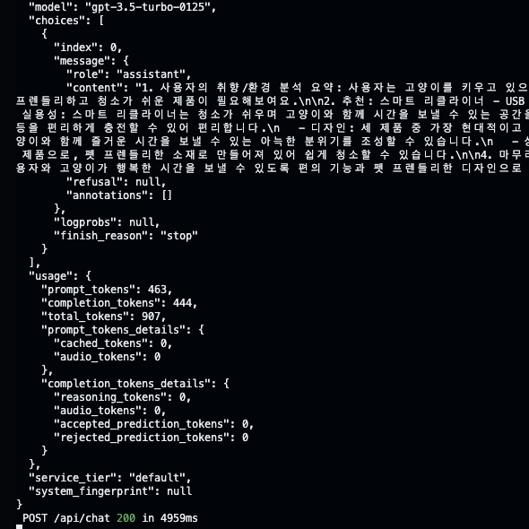
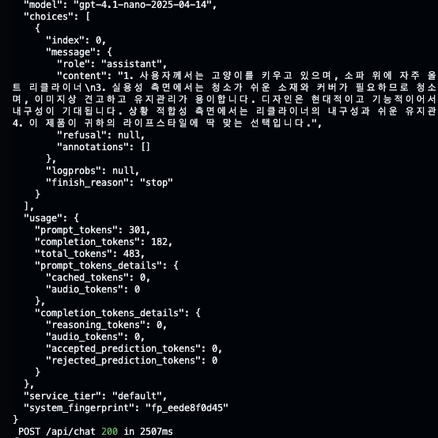

---
# [해당 부분은 인트로(글 제목, 카테고리, 썸네일 이미지 등) 관련 정보]
title: "GPT 3.5 Turbo vs GPT 4.1 nano, 누가 더 나은 친구인 것인가?!"
categories: [AI]
tags: [GPT, AI]
image:
  path: "../assets/img/posting-images/20250527/20250527-thumbnail.jpeg"
  alt: "대황피티.. 내 인생의 빛...."
  width: 1200   # 이미지의 너비 조정
  height: 1200   # 이미지의 높이 조정
  # dark: "/assets/img/dark-cover.jpg"  # 다크 모드에서 다른 이미지 사용
---

난 본격적으로 부트캠프에서 프로젝트를 진행하기 전, Open AI의 GPT API를 활용해서 간단한 테스트를 진행하고자 했다. 그런데, GPT는 정말 수많은 버전의 모듈들이 있다. 그 중 가장 많이 사용 한다고? 들었던 GPT 3.5 turbo와 GPT 4.1 nano를 비교해 보고.. 둘 중 어느 친구가 더 나은지 수치적으로.. 평가해 보고자 한다. 누가 더 빠르고.. 누가 더 저렴하고.. 누가 더 똑똑하고.. 누가 더 답변 스타일이 괜찮은지…!!!에 대해 말이다. 내가 백엔드/AI 팀원들과 팀플할 땐, 내가 이 API를 직접 건드린 적은 없으니 백엔드에서 만들어준 API 갖다 쓴 게 전부 였는데.. 이제 내가 직접 API Key를 가져다 사용해야 할 상황에 직면하니.. 직접 비교해 봐야 직성이 풀릴 것 같아서 오늘의 블로그 글, 또 한 번 시작해본다.

<br>
<br>

## **✨두 모델 사이엔 속도, 정확도 뿐만 아니라 답변 “스타일”에도 차이가 있다.**

LLM을 사용할 때, 많은 사용자가 모델의 정확도나 속도만 주로 비교한다. 하지만, 실제로 해당 기술을 서비스에 직접적으로 적용할 때는 응답의 톤, 표현력, 논리 전개, 심지어는 이 친구가 “어떻게 말하느냐”가 UX에 큰 영향을 미친다. ~~(당연하지, 생각해 봐라. 똑같은 말 반복하는 친구가 좋냐.. 아니면 간단하게 요지만 딱 말하는 애가 좋냐..?)~~

이번 비교에선 동일한 프롬프트를 사용해 API 요청을 진행했을 때, GPT-3.5 Turbo와 GPT-4.1 nano가 어떤 식으로 의도, 구조, 어조를 다르게 표현하는지 분석했다.

우선, 아래와 같은 “동일한 프롬프트”를 입력 했다고 상황을 가정하고 진행했다.

- 사용자 입력 프롬프트(GPT API 요청 시 “role”의 값이 “user”로 설정된 content 값)
    
    ```
    "고양이를 키우고 있으며, 소파 위에 자주 올라가요. 청소가 쉬웠으면 좋겠어요."
    ```
    
- GPT 모델에 미리 전달되는 프롬프트(GPT API 요청 시 “role”의 값이 “system”으로 설정된 content 값)
    
    ```
    "넌 라이프스타일에 맞는 가구를 추천해주는 스마트 인테리어 AI야.
    
    다음은 추천 가능한 소파 제품 리스트야:
    
    1. 모노톤 패브릭 소파 - 부드럽고 미니멀한 디자인
    2. 클래식 가죽 소파 - 고급스러운 브라운톤
    3. 스마트 리클라이너 - USB 충전 가능, 각도 조절
    
    사용자에 대한 설명이 들어오면, 아래 순서로 응답해줘:
    
    1. 사용자의 취향/환경 분석 요약 (1~2문장)
    2. 세 제품 중 가장 적합한 제품을 하나만 선택
    3. 선택 이유를 실용성, 디자인, 상황 적합성 관점에서 설명
    4. 마지막엔 한 문장으로 사용자의 선택에 확신을 주는 마무리 멘트를 해줘
    
    추가 조건:
    - 추천 제품은 오직 하나만 고를 것
    - 분석이 부족하더라도 너만의 추론을 활용해 논리적으로 유도할 것
    - 감정이입은 하지 말고, 분석 중심으로 응답할 것"
    ```
    

각 모델 당 5회씩 테스트를 진행했고, 각 모델에서의 **답변 스타일**은 물론, **입/출력에 사용된 평균 토큰 수**와 **응답 시간**을 추가적으로 측정해서.. 누가 어느 상황에서 더 효율적인 친구인지 알아봤다!

<div class="image-container">
  <figure>
    
    <figcaption>열심히 테스트 했습니다..</figcaption>
  </figure>
  <figure>
    
    <figcaption>진짜 열심히 했습니다..!</figcaption>
  </figure>
</div>


<br>
<br>

## 🤔 **GPT-3.5 Turbo: 형식주의자**

GPT-3.5 Turbo를 테스트 해본 결과, 이 친구… 형식은 참 잘 지키는 친구였다. 별명으로 “형식주의자”라고 불러주고 싶을 정도로…..📌

### 1. 프롬프트에서 요구한 구조 지키는 건 최상급임 ㄹㅇ

내가 프롬프트에서 요구한 4단계 형식을 모든 답변에서 매우 정확히 따른다.

아래의 답변과 같이 말이다.

```
1. 사용자의 취향/환경 분석 요약: 고양이를 키우고 있어 소파 위를 자주 사용하며 청소가 쉽고 편리한 소파를 원하는 것으로 보입니다.
```

1~4까지 번호로 매겨져 있는 응답 순서를 매우 잘 지키고, 포맷 이탈도 거의 없으면서, 항목 번호도 일관된다.

### 2. 답변에서 표현이 다소 반복되고 장황한 면이 있음

아래와 같은 답변에서 볼 수 있듯이, 내용 간에 겹침이 좀 있다. “고양이와 함께 사용하기에 좋습니다”라는 내용은 굳이 필요 없을수도 있는 내용인데… 형식을 지키겠다고 표현이 반복된 느낌이 있다. 이와 동시에, 설명이 다소 장황해지는 느낌도.. 받을 수 있다.

```
실용성: 청소가 쉬운 소재로 고양이 털 제거가 편리합니다.  
디자인: 미니멀한 분위기를 연출합니다.  
상황 적합성: 고양이와 함께 사용하기에 좋습니다.
```

### 3. 마무리 표현은 다정하지만 반복적인 부분이 있음

```
고양이와 함께하는 당신의 생활에 모노톤 패브릭 소파는 완벽한 선택이 될 것입니다.
```

정중하고 따뜻한 톤.. 으로 응답하긴 하는데, 매우 유사한 문장 구조를 반복하고.. 이건 내 요구사항이 없던 건데 굳이 추가한 느낌이 업지 않아 있다!고 볼 수 있다.

<br>
<br>

## **💯 GPT-4.1 nano: 알잘딱깔센**

이어서 GPT-4.1 nano를 테스트 해본 결과, 이 친구는… 간결하게 표현을 응축해서 잘 설명해주는 것 같았다. 알잘딱깔센(알아서 잘 딱 깔끔하게 센스있게)해서 말이다..!!🙃

### 1. 핵심 내용을 추출하는 능력이 아주 뛰어남!

```
사용자는 고양이를 키우며 소파 위를 자주 이용하며, 청소의 용이성을 중요시하는 환경에 있습니다. 실용성과 유지관리 용이성을 중점으로 고려할 필요가 있습니다.
```

위는 GPT-4.1 nano를 이용해서 유도한 답변 중 일부인데, 보면 알 수 있듯, 단 2문장으로 사용자 요구를 요약하고, 선택 기준까지 유도한다. 제공한 프롬프트의 틀을 어느 정도 지키면서, 유두리 있게 답변을 구성하는 것을 알 수 있다.

### 2. 표현은 간결하지만 밀도있는 답변을 제공함!

```
이 선택은 실용성 측면에서 청소가 쉽고 내구성이 좋은 패브릭 소재를 고려했기 때문입니다.
```

위 답변을 보면 알 수 있듯이, GPT-3.5 turbo보다 문장이 짧고 압축적이지만, 담을 내용은 다 담은 것을 확인해볼 수 있다!

### 3. 다양한 판단 시도

GPT-3.5 Turbo를 사용했을 때는 한 가지 선택(`모노톤 소파`)만 계속 하는 경향이 강했다면, GPT-4.1 nano를 사용했을 때는 상황에 따라 다른 선택(`스마트 리클라이너`)를 선택하기도 했다.

ex)

```
USB 충전 기능과 각도 조절이 가능한 스마트 리클라이너는 고양이와 함께 사용하는 환경에 실용성과 현대적 기능을 모두 제공합니다.
```

단순히 키워드 일치만으로 판단하는 게 아니라, 기능의 논리적 맥락까지 고려해서 판단한다는 것을 알 수 있다.

<br>
<br>

## **🥹 답변 스타일 비교 요약**

GPT-3.5 Turbo와 GPT-4.1 nano의 “답변 스타일”을 비교 분석해본 결과.. 아래와 같은 결론을 얻을 수 있었다. 아래의 표로 간단하게 정리해 보고자 한다.

| 항목 | GPT-3.5 Turbo | GPT-4.1 nano |
| --- | --- | --- |
| 형식 준수 | 매우 잘 지킴<br>(무조건적으로 지킴) | 다소 유연하게 답변함<br>(형식을 지키려 노력은 하지만, <br>무조건 지키진 않음) |
| 문장 스타일 | 정중하게, 반복적으로, 설명 (TMI 느낌 약간 있음) | 간결하게, 분석적으로, 논리 중심 |
| 표현 밀도 | 낮음 (길지만 중복되는 느낌 있음) | 높음 (짧고 간결하게, 응축된 표현) |
| 제품 선택 다양성 | **제한적(1~2개 반복)**<br>→‘모노톤 패브릭 소파’라는 답변을 <br>반복적으로 제시했음. <br>정형화된 응답 구조에는 유리하지만, <br>사용자의 조건 해석에 <br>유연성이 부족하다는 인상을 줄 수 있음 | **조건에 따라 달라짐**<br>→동일한 입력에도 ‘스마트 리클라이너’와 <br>‘모노톤 패브릭 소파’를 상황에 따라 <br>번갈아 제안하며 <br>더 다양한 판단을 제공해 줬지만, <br>응답 일관성에선 희생이 따랐음 |
| 마무리 멘트 | 전형적인 멘트(교과서적임) | 적절한 결론화 |

요약하면, GPT-3.5는 단일 조건에 기반한 선택이 비교적 일관되게 나오지만, 설명은 다소 장황한 느낌이 있었다. GPT-4.1은 “고양이가 자주 올라간다”, “USB 충전 편의성” 등의 추가 사항을 결합해서 다차원 판단을 수행해서 일관성을 다소 떨어질 수 있지만, 유연한 답변을 짧고 간결하게 한다는 것을 알 수 있었다.

<br>
<br>

## **💰 응답 효율성과 토큰 사용 분석**

그럼 이제, 답변 스타일만큼 중요하다고 볼 수 있는.. 동일한 프롬프트는 보냈을 때, 응답하는 데 평균 응답 시간이 얼마나 걸리는지, 입/출력할 때 토큰이 얼마나 사용되는지도 따져볼 때다. 제가 직접 각 모델에 대해서 5번씩 요청을 날려보며.. 시간을 평균낸 것이므로 신뢰성 높다고(?) 판단할 수 있으니 아래의 분석 결과 요약을 한 번 같이 살펴보자…!

| 항목 | GPT-3.5 Turbo | GPT-4.1 nano |
| --- | --- | --- |
| 평균 응답 시간 | 4.48초 | 2.69초 |
| 입력 토큰 수 | 463개 | 301개 |
| 출력 토큰 수 | 426개 | 197개 |
| 응답 밀도 | 길지만 반복적인 응답 | 짧고 고밀도 표현을 사용해서 응답 |

결론을 말해보면, GPT-4.1이 토큰 수가 4~50% 정도 더 적음에도, 형식을 유연하게 가져가며 핵심 정보를 더 간결하게 전달한다는 것을 알 수 있었다. 감정적인 면을 더 강조하는 프롬프트를 집어 넣었다면 모르겠지만, 현재의 프롬프트에선 좀 더 간결하게 토큰을 절약하며, 답변을 진행한 것을 알 수 있다.

각 모델별로 과금되는 요금이 다른데, 어떤 것이 더 저렴한 것인지를 계산해 볼 필요도 있을 것 같다. 

계산은 위의 내가 설정한 프롬프트를 기준으로 얼마나 토큰을 사용 했는지를 기준으로 계산했다. OpenAI API 과금 기준(2025년 5월 기준)을 적용해서 비교를 진행했다. 아래의 링크에 나와있는 사이트의 정보를 참고했다.

**OpenAI GPT API Pricing 정보 링크:** [https://platform.openai.com/docs/pricing](https://platform.openai.com/docs/pricing)

- GPT-3.5 Turbo: 100만 토큰마다 $0.5 (입력 시), 100만 토큰마다 $1.5 (출력 시)
- GPT-4.1 nano: 100만 토큰마다 $0.1 (입력 시), 100만 토큰마다 $0.4 (출력 시)
    
    
    | 항목 | GPT-3.5 Turbo | GPT-4.1 nano |
    | --- | --- | --- |
    | 입력 토큰 1회당 비용 | 463 * 0.0005 = $0.000232 | 301 * 0.0001 = $0.0000301 |
    | 출력 토큰 1회당 비용 | 426 * 0.0015 = $0.000639 | 197 * 0.0004 = $0.0000788 |
    | 총 요청 1회당 | **$0.000871** | **$0.0001089** |

GPT-4.1 nano가 GPT-3.5에 비해서.. 논리적으로 생각해서 간략한 답변을 내놔서 그런지… 이 친구가 약 87.5% 더 저렴하게 응답을 생성한다. 속도도 빠르고.. 값도 싸고.. 간결하게 응답해서.. 운영을 하는 데에 있어 효율성 측면에서 우위를 점할 수 있을 것으로 생각된다!!!

<br>
<br>

## **🧪 Fine-Tuning 유효성 분석**

그런데.. 한 가지 부분에 대해서도 추가적으로 짚고 넘어갈 필요성이 있다. 바로, 특정 도메인에 특화된 모델을 만들기 위해서 종종 수행하는 **“Fine-Tuning”**을 할 수 있는지의 여부.. 그리고 그것을 수행했을 때의 과금은 추가적으로 얼마나 드는지 말이다.

아래의 표는, 내가 조사한 내용에 대한 요약본이다.

| 항목 | GPT-3.5 Turbo | GPT-4.1 nano |
| --- | --- | --- |
| Fine-Tuning 지원 여부 | 공식 지원 | 지원 X |
| 훈련 비용<br>(10만 토큰짜리 훈련 데이터로 <br>10회 했다고 가정) | 약 $8 | 미지원 |
| 사용 후 추가 과금 | API 호출 비용 이외의 추가 과금 발생 | - |
| 대체 방안 | 없음 <br>(Fine-Tuning 하려면, <br>이 방법을 사용하는 것 밖에..) | Fine-Tuning을 애초에 <br>지원하지 않기 때문에, <br>프롬프트 엔지니어링으로<br> 이를 극복해야 함 |
| 적합한 사용 예 | 일관된 톤/포맷이 필수인 도메인<br> (고객응대, 매뉴얼형 AI) | 빠른 피드백 반복이 필요한 <br>MVP 개발 단계 |

위의 표에서 알 수 있는 내용을 글로 정리하면, 아래처럼 정리할 수 있다.

- Fine-Tuning은 비용이 많이 발생한다. GPT-3.5 Turbo 기준으로 약 100K 토큰을 10에폭(epoch) 학습할 경우 $8, 여기에 추론 시 추가 과금까지 발생할 수 있다.
- 특정 스타일 고정, 포맷 일관성 확보, 서비스화된 고객 응대를 필요로 하는 서비스에는 반드시 필요한 기능일 수 있다. *(그러나, 이는 직접 사업을 하는 회사에게만 해당되는 내용일수도…..)*
- 반면, GPT-4.1 nano는 Fine-Tuning 기능을 제공하지 않지만, 프롬프트 엔지니어링만으로도 충분히 도메인 맞춤형 응답을 구성할 수 있음을 테스트 결과로 어느 정도 확인했다. *(실제로 내가 진행했던 졸업프로젝트에서도 GPT-4o mini api를 사용했는데, 프롬프트 엔지니어링만으로도 F1 Score 0.9 이상의 높은 정확도를 기록했다)*
- 따라서, 진짜 회사에서 사업을 하며 서비스를 할 거 아닌 이상.. GPT-4.1 nano를 써가지고, 프롬프트 엔지니어링으로 GPT를 잘 구슬리고.. 하는 방안이 훨씬 나아 보인다!

<br>
<br>

## **🥕 마무리**

종합적으로 어떤 상황에서 어떤 모델을 사용해야 하는지를 정리해 보면 아래처럼 정리할 수 있을 것 같다.

| 상황 | 추천 모델 | 이유 |
| --- | --- | --- |
| 감성적/설명 중심 UI | GPT-3.5 Turbo | 정중한 표현, 구조화된? 설명 <br>(다소 TMI 포함될 수 있음) |
| 조건 기반 논리적 추천 시스템 | **GPT-4.1 nano** | 추론 구성력, 응답 속도, 밀도 우수 |
| 도메인 특화된 응답 스타일 필요 | **GPT-4.1 nano**<br>(비용 여유 있다면.. <br>GPT-3.5 Turbo.. <br>근데 여유가 있다면, <br>더 좋은 모델을 쓰지 않을까요?) | Fine-Tuning 못하더라도.. <br>우리 상황에선 <br>프롬프트 엔지니어링으로 <br>충분히 커버 가능 |
| 경량화/모바일 최적화 서비스 | **GPT-4.1 nano** | 토큰 효율 우수, 과금 비용 낮음 |
| 반복 실험, MVP, 빠른 A/B 테스트 | **GPT-4.1 nano** | 프롬프트 기반 유연성 높음 |

위의 내용들을 통해 알 수 있듯이, GPT-3.5 Turbo와 GPT-4.1 nano는 단순히 성능과 속도만이 아니라, 표현의 방식, 운영 비용, 도메인 최적화 가능성, 그리고 Fine-Tuning의 필요성 여부에서도 서로 다른 강점을 보인다. ~~(근데, 내가 봤을 땐, GPT-4o nano 쓰는 게 훨 좋아 보이긴 한다)~~

특정 목적에 따라 어떤 모델이 더 유리할 지.. 매우 심층적으로 테스트 코드까지 짜보며 알아봤던, 뜻깊은 시간이었다. 앞으로도 어떤 API를 사용한다고 했을 때, 단순 응답 품질만이 아니라 비용, 확장 전략(프롬프트 엔지니어링 등)까지.. 다양한 측면을 고려하며 종합적으로 어떤 게 나은지 생각해보는 습관이 필요할 것 같다! *(사실.. 이거 말고도 정말 많은 모델을 OpenAI 측에서 서비스하고 있다. Cached 버전도 만들어서 더 저렴하게 쓸 수 있든.. 모델은 다양하다. 상황에 따라 잘 사용하도록 하자!)*

다음엔, 어떻게 하면 파인 튜닝 말고.. 프롬프트 엔지니어링 만으로 gpt를 잘 구슬릴 수 있는지….에 대해서 한 번 알아보고자 한다! 기대해도 좋다(?)