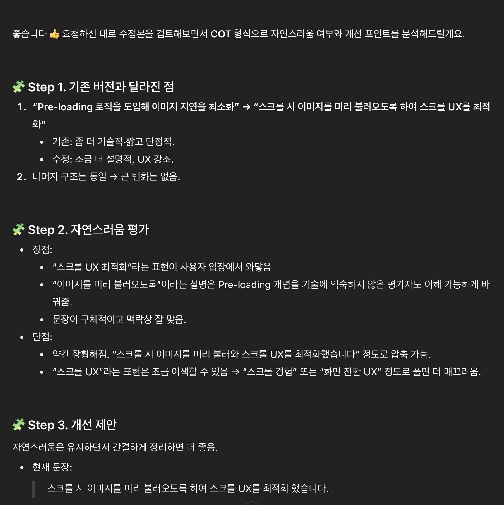

---
# [해당 부분은 인트로(글 제목, 카테고리, 썸네일 이미지 등) 관련 정보]
title: "생성형 AI, 이 친구는 살살 다뤄줘야 해요"
categories: [AI]
tags: [AI]
image:
  path: "../assets/img/posting-images/20250919/20250919-thumbnail.png"
  alt: "AI는 내 소중한 친구, 살살 다뤄줍시다."
  width: 1200   # 이미지의 너비 조정
  height: 1200   # 이미지의 높이 조정
  # dark: "/assets/img/dark-cover.jpg"  # 다크 모드에서 다른 이미지 사용
---

2023년 초기, 내가 복학 하기 직전이었다. 뉴스에서는 한창 “ChatGPT”라는 서비스가 나왔는데, 글쓰기 과제를 명령만 내리면 알아서 잘 해준다고, 교수들은 이걸 막아야 되나 말아야 되나 논의하고 있다고 호들갑을 떨었던 기억이 난다. 난 그때 정말 구시대적 사고방식으로, “인공지능이 잘 만들어 줘봤자 얼마나 잘 만들어줄까?”라는 생각을 가지고 있던 것 같다.

그럼에도 하도 뉴스랑 인터넷에서 떠들어 대길래.. 궁금해서 써봤다. 내가 chatGPT를 처음 가입해서 입력했던 첫번째 프롬프트가 아직도 기억에 생생하다. 

> **“C언어로 Hello World 터미널에 찍어주는 프로그램 하나 만들어줘”**

화면에 타자기가 쳐지듯이 쭈르륵 글자가 입력 되면서, C언어로 구성된 “Hello World” 출력하는 구문이 10초도 안되서 만들어지는 걸 보고, 참 신기하긴 했다. *(일일이 구글링 해서 레퍼런스 코드 찾은 다음에, 그걸 내 상황에 맞게 변형하는 과정이 없어도 된다는 생각이 드니까 더 신기했던 것 같다)*

이러고 2년이 넘게 지난 2025년 지금은 어떨까? 난 생성형 AI 없이는 못 사는 몸이 되어 버렸다. 벌써 쓰고 있는 AI 서비스, 5개나 쓰고 있다. ~~(Gemini 대학생 1년 무료 개꿀)~~ UI 초안을 짜거나, API 명세서가 이렇게 구성되어 있는데, 여기에 맞는 api 함수를 짜달라고 하거나, 테스트를 위해서 더미 데이터가 필요한데 형식에 맞게 더미 데이터를 제공해 달라고 하거나.. 이런 정말 귀찮고, 듣기만 해도 하기 싫은 작업들에서 생성형 AI 서비스는 내 구원자이자 빛이다.

물론 그렇다고 해서, 내가 생성형 AI를 여전히 100% 믿고 있는 건 아니다. 난 언제든 **“이 친구는 항상 실수할 수 있다. 이 친구가 주는 답변엔 오답이 분명히 있으니 검증하고 취할 것만 취하자”** 라는 마인드로 서비스를 사용한다. 챗지피티부터 시작해서 제미나이, 커서에다가 명령 내릴 때에도 항상 같은 마인드다.

오늘은, 내가 생성형 AI 서비스들을 2년 간 사용하면서 짚고 넘어갈 만한 점들을 여기에 체계적으로 한 번 적어보려고 한다. 내가 몸으로 부딪히면서.. 뚜들겨 맞으면서 느꼈던 내용이라 아마 영양가가 조금?은 있을 것이다. 결론부터 말하면 생성형 AI, 이 친구는 살살 다뤄주셔야 합니다. *~~(반박 시 여러분 말씀이 다 맞긴 합니다)~~*

<br>
<br>

## **생성형 AI의 답변도 결국 컴퓨터가 만들어 내는거다.**

컴퓨터공학 전공자라면 항상 low-level 언어를 배울 때 깨닫는 점이 있다. 바로, 결국 컴퓨터는 0과 1로 이루어진 기계어로 된 프로그램을 읽어내는 것에 불과하고, 개발자들은 그렇게 번역될 프로그램을 짜는 것 뿐이라는 걸 말이다. 컴퓨터 프로그램을 동작 시키기 위해 결국 우리가 작성한 소스코드는 일반적으로 “컴파일러”에서 컴파일 되어 어셈블리어가 되고, 어셈블리어는 다시 “어셈블러”를 거쳐 컴퓨터가 읽을 수 있는 기계어가 된다. 그리고, 이러한 기계어가 CPU, GPU와 같은 부품에서 프로세싱 되는 것을 전공자라면 한 번쯤은 다들 들어봤을 것이다. 

생성형 AI의 성능을 높이기 위해서 빅테크 기업들이 엔비디아 GPU를 대량으로 사들이고 있다는 뉴스를 쉽게 접해봤을 것이다. 결국, 생성형 AI를 학습 시키기 위해서, 그들을 똑똑하게 만들기 위해서, 열심히 GPU 위에서 연산을 돌리는 것에 불과하다는 것이다. 

내가 정확하게 생성형 AI의 원리를 아는 것은 아니지만, 유튜브에서 봤던 내용이 있었다. 생성형 AI의 기본적인 것이라 볼 수 있는 거대 언어 모델(LLM)은 기본적으로 **확률(next-token prediction) 모델**이라는 걸 말이다. 입력된 텍스트(프롬프트)를 보고, 그 뒤에 어떤 단어(토큰)가 올 확률이 가장 높은지를 계산하는 친구란 거다.

<div class="image-container">
  <figure>
    
    <figcaption>학교에서 "랜덤프로세스개론" 시간이 이렇게 열심히 했었구나..</figcaption>
  </figure>
  <figure>
    
    <figcaption>근데 이게 생성형 AI들에서 기본 이론으로 그대로 적용된다는 게 좀 신기하긴 해요.</figcaption>
  </figure>
</div>

서론이 길었는데, 결과적으로 하고 싶은 말은, 생성형 AI는 “마법”이 아니라는 것을 꼭 일깨워 주고 싶었다. 요즘 시대에는 결국 이 정확한 예측을 할 “확률”을 높인 모델들이 많이 나왔다고 생각하면 될 것 같다. 지피티 같은 경우엔 학습량이 뭐.. GPT-4 기준 약 1.8조 단위라고 했으니..(이것도 거의 1년 전에 들은 얘기었으니, 지금은 훨씬 더 파라미터 값이 커졌겠지..)라고 하는데, 그러니 성능이 뛰어날 수밖에 없겠다라는 생각이 자연스레 든다.

**이러한 컴퓨터에 대한 기본적인 불신(?)과 생성형 AI에 대한 간단한 배경지식이 있다면, 생성형 AI에 기본적으로 접근하는 태도를 잡을 수 있다.**

<br>
<br>


## **“확률”을 높이려면 결국 자세하게 설명해야 한다.**

생성형 AI의 기본적인 원리는 입력된 프롬프트를 보고, 그 뒤에 어떤 게 올 확률이 가장 높을지를 계산하는 게 기본이라고 했다. 사진, 비디오, 오디오를 생성하는 AI 모두 이 “확률” 계산이 들어가면서 샘플링을 진행한다. 그러면, 생성형 AI 답변의 신뢰성을 높이는 방법은 단순하다. 확률 계산의 토대가 될 소스(프롬프트)가 자세하면 된다. 그러면, 다음에 올 것을 예측하기 쉬워지겠지. 전문적으로 표현하면, “확률분포를 좁히는 제약 조건”으로 프롬프트가 작용하도록 우리가 노력해야 한다는 것이다.

그러면, 반대로 생각해 보자. 예를 들어, 우리 프로젝트의 팀 이름을 지어야 하는데, 작명센스가 없어서 이름을 못 짓고 있다고 가정해 보자. 이럴 경우엔 우리가 이름을 추천받고 싶을 땐, 프롬프트를 어떻게 주어야 할까? 
상황에 따라 아마 다를 것이다. 다양한 이름을 추천받고 싶을 땐, 그냥 “분위기에 맞는 거 추천해줘” 이런 식으로 뭉뚱그려 설명할 수도 있을 것이고, 특정한 분위기·상황을 반영해서 추천받고 싶을 땐 “장작에서 불이 열심히 타고 있는 것 같은 느낌의 따뜻한 단어로 추천해줘”처럼 굉장히 자세하게 프롬프트를 작성할 수도 있을 것이다.

이를 생성형 AI의 기본 원리에 대입해서 이해해 보면 조금 더 본질에 가까이 접근할 수 있다. 다양한 이름을 추천받고 싶은 경우는, 결국 다음에 올 것이 내가 입력한 것과 달라도 상관 없다는 것이다. 즉, 확률이 낮아도 관계 없다는 것이므로, **“확률 공간을 넓게 열어뒀다”**라고 이해해도 되는 것이다. 그 반대의 경우엔, 내가 요구한 프롬프트와 같아야 할 확률이 높아야 하는 것이므로, **“확률 공간을 좁혀뒀다”**라고 이해해도 되는 것이다.

이러한 본질적인 접근을 통해서, 생성형 AI의 답변의 퀄리티를 높일 수 있는 여러 Prompt-Engineering 기법들이 나왔다고 한다. 그 대표적인 기법들이 아래 5가지이다.

- **Chain-of-Thought(CoT)**
- **Few-Shot Prompting**
- **Self-Consistency**
- **Retrieval-Augumented Generation(RAG)**
- **Role-Playing / Contextual Priming**

난 그동안 프롬프팅 기법에 대해서 정확한 개념도 모른 채로 생성형 AI 서비스의 헛소리(Hallucination) 폭탄을 맞아가며.. 그들을 어떻게 하면 헛소리 안할 수 있게, 노하우들을 몸이 기억하게(?) 체계적으로 쌓아왔는데, 내가 이 개념들의 대략적인 내용을 보니까, 내 노하우들이랑 오묘하게 겹치는 것도 있고 그래서 좀 신기하더라. 그래서, 이 기법들에 대해서 한 번 정리해 보고 가도록 하자.

<div class="image-container">
  <figure>
    
    <figcaption>이번에 취업 준비하면서 AI로 자소서 잘 쓰는 법을 이렇게 메모장에 메모해 두고 있다..</figcaption>
  </figure>
  <figure>
    
    <figcaption>궁금한 친구들에게 이렇게 카톡으로 그대로 뿌려주기도 했었다..</figcaption>
  </figure>
</div>

<br>
<br>


## **내 채찍피티(ChatGPT), 잼민이(Gemini) 똑똑하게 만드는 5가지 기법**

본론으로 들어가기 전에, 우리가 개발할 때 많이 사용하는 GPT API와 같은 외부 LLM API와 ChatGPT, Gemini와 같은 AI 챗봇 서비스는 다른 서비스다. 정확히 말하면, ChatGPT와 같은 서비스는 그들이 개발한 LLM 모델에 “미리 세팅된” 시스템 프롬프트와, “사용자가 입력하는” 유저 프롬프트를 적절히 조합하여 넘긴 후, 그에 대한 답변을 받아내는 것이다. 물론, 외부 API를 사용함에 있어서도 아래의 기법들은 매우 유효한 기법들이니 참고해서 프롬프트 엔지니어링에 적용해 보면 좋은 결과를 기대할 수 있을 것이다.

### 1. Chain-of-Thought(CoT): “생각 좀 하면서 대답해라”

생성형 AI가 기본적으로 하는 건, 위에서 열심히 언급했듯 결국.. “다음 단어 맞추기” 하는 거다. 그래서 “정답만 달라” 하면, 중간 과정은 싹 생략하고 그냥 가장 확률 높은 단어(전문적인 용어로 token)을 토해버린다. 문제는 이럴 때, 주어진 근거(프롬프트)가 없으니깐.. AI가 사고를 못한다. 그래서 AI가 생각의 꼬리가 짧아져서 틀릴 가능성이 높다는 거다.

**CoT 기법**은 AI한테 아래와 같이 얘기해 주는 거라고 볼 수 있다:

> **“야, 답만 뱉지 말고 과정도 적어내라. 너 시험 답안지 쓰는 중이라고 생각하삼.”**
> 

예를 들어,

- ❌ 기법 적용 안 한 상태: “이 수학 문제에 대해서 답 내놔.” → 헛소리할 확률 매우 높음
- ✅ CoT 기법 적용: “이 문제를 단계별로 풀이 과정을 설명하면서 답해줘.”

실제로 코딩 테스트 같은 거 얘네들한테 모르겠어서 문제 분석하고 풀어달라 할 때, “풀이 과정을 먼저 글로 정리하고 코드 써줘”라고 하면 정답률이 꽤 올라간다. 추가적으로, AI 서비스에서 중간 과정이 답변에 있다면, 어디에서 AI가 실수 했는지도 쉽게 확인할 수 있어서, 정확한 답변을 도출하는 시간을 단축할 수 있을 것이다.

위와 같은 예시에서는, 프롬프트가 간단하기 때문에 CoT를 적용했을 때의 정확도 향상이 크게 체감이 안 될 확률이 높다. 이 CoT 기법은 입력으로 들어오는 프롬프트의 양이 많아질수록, 그 효과가 어마어마하게 좋아지는데, 난 이러한 효과를 취업 시즌에 자기소개서를 작성할 때 많이 느꼈다. 매번 자기소개서 내용을 복붙해서 AI한테 검토를 받는 경우가 잦다. 이러한 과정에서 “CoT 형식으로 사고해서 진행해줘”라는 멘트를 덧붙인다면, 아래의 사진들과 같이 단계별로 사고해서, 이를 바탕으로 답변을 해주는 것을 실제로 확인할 수 있다.

<div class="image-container">
  <figure>
    
    <figcaption>CoT라는 키워드가 들어가자 마자 이렇게 단계별로 자세히 분석해 주는 걸 볼 수 있다. 참고로, 이러한 단계적인 과정에 대해서도 신뢰도를 높이기 위해서는, 이 "단계"를 직접 명시해 주면 좀 더 효과적인 답변을 얻을 수 있다.</figcaption>
  </figure>
  <figure>
    
    <figcaption>나의 지금 상황이 어떤지 자세히 설명해 주고, 그러한 상황에 가장 잘 맞게 단계적으로 사고해서 질문을 뽑아달라 해주는 위와 같은 예시도, 상당히 신뢰도 높은 답변을 얻을 수 있다는 걸 확인할 수 있다.</figcaption>
  </figure>
</div>


### 2. Few-Shot Prompting: “예시 몇 개 던져주기”

AI는 기본적으로 눈치가 빠른~~(안 빠른 것 같기도 하고)~~ 친구다. 이 친구한테 예시 몇 개만 보여주면, 바로 패턴을 잡아서 비슷한 스타일로 뱉어낸다. 이러한 기법은, 내가 비슷한 양식의 더미 데이터를 수백개 만들어서 테스트를 좀 돌려야 할 때, 정말 자주 썼던 방식이다. 아래는 내가 그동안 썼던 프롬프트 예시다.

```
너는 지금 더미 데이터 생성기임.
아래는 내가 원하는 JSON 형식 예시들이야:

[예시 1]
{
  "id": 1,
  "name": "김철수",
  "email": "chulsoo.kim@example.com",
  "age": 27
}

[예시 2]
{
  "id": 2,
  "name": "이영희",
  "email": "younghee.lee@example.com",
  "age": 31
}

위와 같은 패턴을 따라, id는 3부터 시작해서 20까지, 총 17개의 더미 데이터를 만들어줘.  
형식은 반드시 JSON 배열로 반환해줘.
```

위와 같이 예시를 몇 가지만 들어주면, 저 양식에 맞는 답변들을 잘 뱉어주는 걸 볼 수 있다. 예시 없이 “API 더미 데이터 만들어줘”라고 말하면 형식이 뒤죽박죽일 때가 많다.

정리하면, **Few-Shot 기법**은 AI 보고 이렇게 말하는 거다:

> **"야, 저렇게 양식 있으니까, 저거에 맞춰서 너도 이렇게 해라."**
> 

위와 같이 더미 데이터를 사용하는 상황 말고도, 비슷한 양식으로 다른 내용을 적어야 할 때 등에 자주 사용하는 기법이다. 그리고, 이 기법은 동일한 양식으로 LLM 모델로부터 데이터를 받아야 하는 API 호출 시에도 정말 많이 사용되는 기법이니 프롬프트 엔지니어링 시에 참고하면 좋을 것 같다.

물론, 한 번에 “1000개의 더미 데이터 만들어달라”처럼 한 번에 많은 양의 요청을 하면 안된다. 각 서비스는 한 번에 뱉어낼 수 있는 단어(토큰) 제한 수가 있고, 한 번에 많이 부탁할 수록 AI는 지능이 낮아지기(= 정답을 맞출 확률이 낮아지기) 때문에, “100개가 필요하다면 10개씩 10번에 나눠서 요청하기” 등의 **끊어치기(?)** 기법 등도 잘 활용해 보도록 하자.

내가 이력서를 작성할 때도 이 기법을 종종 활용했다. 예를 들어, 아래와 같은 양식으로 작성되어 있는 간단 활동 정리 내용이 있다고 해보자.

```
대학 중앙힙합동아리 활동, 음악팀장으로 동아리 운영, 다수의 공연·행사 기획과 
무대 경험을 통해 협업·소통 역량 강화
```

이렇게 짧게 줄이는 요약 작업은 이력서 쓸 때마다 참 귀찮은 일이다. 어디는 100자만 적으라 하고, 어디는 글자수 제한 없고, 이렇게 기업마다 요구하는 곳이 다 다르다. 이럴 때, AI한테 내 활동 이력 내용을 pdf나 텍스트로 넘기고, 위와 같은 예시를 제공한 다음, “위와 같은 형식으로 내가 제공한 내용을 CoT 형식으로 사고해서 진행해줘”와 같은 프롬프트를 추가적으로 입력해 보자. 상당히 만족도 높은 답변을 얻을 확률이 높을 것이다.

### 3. Self-Consistency: “여러 개의 답 내놓고, 다수결로 하자”

AI한테 한 번 물어보면 운빨에 따라서 답이 이상할 때가 종종 있다. (특히 수학, 물리 문제……. 물어볼 때마다 답이 달라 이 친구;;) 

여기서, 역발상을 해볼 수 있다. 

> **"야, 그냥 너 이 문제 답 세 번 정도 풀어보고, 공통된 답변 내놔봐."**
> 

이게 바로 **Self-Consistency**다. AI가 여러 방법(전문적인 용어로 reasoning path)을 만들어서 답을 내고, ㄷ그중에 가장 일관된 걸 고르면 정확도가 당연히 올라가겠지. (1트에 맞추긴 힘들겠지만, 3트 해서 1번 맞추기는 조금 더 수월한 것처럼 말이다)

내가 써본 느낌은, AI의 이 “확률”에 의존하는 거 때문에 생기는 헛소리를 다수결로 걸러내는 느낌이다.

여러 개 중에 한 가지 답을 고르라는 이 기법, 왠지 CoT랑 조합하면 좋을 것 같다는 생각이 들지 않는가? 맞다. 나 종종 이렇게 AI 보고 답 여러개 내라고 해놓고, CoT 형식으로 사고해서 내 상황에서 뭐가 제일 좋은지 사고하라 시킨 적이 정말 많았던 것 같다. 
이름 지어달라고 하거나, 이력서 맨 위에 들어갈 헤드라인 같은 거 작성해 달라고 할 때 정말 유용하다. “내 페르소나(특징)를 바탕으로 이력서 상단에 쓸 헤드라인을 정해야 하는데, 몇 가지 후보군을 제공해줘. 그리고, 그 중에서 내 상황에 가장 맞는 헤드라인을 CoT 형식으로 사고해서 정해줘.”라고 프롬프트 해보면, 솔직히 놀랄 거다. 정확도(= 답변 만족도)가 기하 급수적으로 올라간다.

### 4. Retrieval-Augmented Generation (RAG): “밖에서 검색 좀 해오셈”

난 작년에 ChatGPT로 거의 바이브 코딩 형식으로 졸업작품을 했던 기억이 있다. React Native를 도저히 쓸 수 없고, 배울 시간도 없어서 그런 방식을 취했던 것인데, 맨날 이 친구한테 무슨 컴포넌트를 만들어 달라고 할 때마다 느꼈던 점이 있다. 바로, 아주 당당하게 지금 deprecated된 함수를 써 가지고 코드를 구성해서, 내꺼에서 돌려보면 엄청난 오류를 맞이하며 멘탈이 탈탈 털렸던 기억이 생생하다. 
AI는 기본적으로 학습된 데이터로만 다음 예측을 수행한다. 다르게 말하면, 얘 머릿속 기억 외에 다른 것에 대해서 질문을 한다면, 정확한 답변을 낼 확률이 거의 없다는 거다. 여기서 등장하는 게 바로 **RAG**다.

> **"야, 니 머릿속 기억 말고, 밖에서 자료 좀 찾아보고 대답해."**
> 

즉, RAG는 AI한테 **“검색기 달아주기”** 하는 거라고 생각하면 된다. 정확히 말하면, RAG라는 기술은 AI가 답변을 만들 때 자기 머릿속(=학습된 데이터)만 쓰지 않고, 외부 지식원에서 필요한 정보를 찾아 참고하게 만드는 방식이다. 이 지식원은 꼭 인터넷일 필요는 없고, 회사 내부 위키나 프로젝트 문서, 심지어 특정 DB를 붙여놓을 수도 있다.
나는 이걸 프론트엔드 라이브러리나 프레임워크처럼 자주 바뀌는 영역에 활용했다. 특히 내가 많이 쓰는 AI 서비스들은 검색 엔진과 결합된 RAG 서비스들이 많았다. 그냥 RAG가 아니라, 검색 결과를 실시간으로 끌어와서 공식 문서를 지식원 삼아 답변하게 만든 거다. 이렇게 쓰니까 모델이 오래된 기억 대신 최신 정보를 기반으로 답변을 해서, 헛소리를 훨씬 줄일 수 있었다.

내가 체감했던 인터넷 검색 엔진을 붙여 놓은 RAG의 포인트는 이거다.

- **헛소리가 확실히 줄어든다** (진짜 최신 문서 기반)
- **도메인 특화 가능하다** (회사 문서, 프로젝트 위키 링크 붙여버리면 정확도 올라가겠죠?)
- **내 스트레스 줄어든다** (일일이 구글링 할 필요 없음 / 실제로 나는 이 검색 기능이 도입된 후엔, 검색 엔진으로 종종 활용하기도 함)

아래는 위키백과에 있는 RAG의 개념을 그대로 복붙해 온 것이다. 이해하기 힘들면 그냥 **“AI한테 머릿속에 있는 거 말고, 바깥 자료 좀 참고하라고 시키는 기술”**이라고 생각하면 편할 것 같다. 

>**검색 증강 생성(Retrieval-augmented generation, RAG)**은 대형 언어 모델 (LLM)이 새로운 정보를 검색하고 통합할 수 있도록 하는 기술이다. RAG를 사용하면 LLM은 지정된 문서 집합을 참조할 때까지 사용자 쿼리에 응답하지 않는다. 이 문서들은 LLM의 기존 훈련 데이터의 정보를 보완한다. 이를 통해 LLM은 훈련 데이터에서 사용할 수 없는 도메인 특정 및 업데이트된 정보를 사용할 수 있다. 예를 들어, 이는 LLM 기반 챗봇이 내부 회사 데이터에 접근하거나 권위 있는 출처를 기반으로 응답을 생성하는 데 도움이 된다.


### 5. Role-Playing / Contextual Priming: “너는 이제 ○○ 전문가야” (== 가스라이팅)

요즘 내가 이력서 작성, 면접 준비 같은 거 하면서 가장 애정하면서, 재밌는 기법이다. 효과가 너무 바로바로 보여서 말이다. AI한테 그냥 “이거에 대해서 예상질문 좀 뽑아줘”라고 하면, 그냥 그 인터넷에 나돌아 다니는 뻔한 예상질문을 뱉어준다. 근데 내가 이렇게 말한다 해보자.

> **“너는 지금부터 20년차 삼성전자 인사담당자야. 지원자의 기술 스택과 프로젝트 경험을 기반으로, 날카롭게 질문할 만한 포인트를 뽑아내줘.”**
> 

이러면 답변이 확실히 달라진다. 말투부터가 진짜 삼성전자에서 20년차 정도 재직한 인사담당자처럼 근엄해지고, 진짜 사람이 질문 리스트를 정리한 것처럼 보이게 만든다.

이게 바로 Role-Playing, 쉽게 말하면 **AI 가스라이팅**이다.

<div class="image-container">
  <figure>
    
    <figcaption>난 솔직히 이 기법을 가장 좋아한다. 종종 스트레스 풀 때, 이렇게 AI랑 놀곤 한다. 무서운 녀석이다.</figcaption>
  </figure>
  <figure>
    
    <figcaption>AI는 누구보다 갈대같은 친구다. 입력에 따라서 이렇게 가스라이팅을 당하니.. 내 입맛대로 부릴 수 있어서 오히려 좋아.</figcaption>
  </figure>
</div>


이건 확률이랑 뭔 관계냐 싶은 생각이 들 수도 있다. 그러나, 조금만 깊게 생각해 보면 이것 또한 확률을 올리는 하나의 요인이 될 수 있다는 걸 알 수 있다.
그냥 “예상질문 뽑아줘”라고 하면, 제일 흔히 나오는 “면접 예상질문 리스트” 확률 분포를 따라간다. 그러니 뻔한 답이 나오는 거다. 그런데, “너는 지금 인사담당자야”라고 역할을 설정해 주면, 확률 공간이 달라진다. 인사담당자에 해당하는 **“확률 공간”으로 범위가 좁혀지는 거**라 볼 수 있다. 이제 모델은 “인사담당자의 톤과 관점”이라는 제약 조건 속에서 단어를 고르게 된다. 이러니 결과적으로 답변이 훨씬 전문적이고, 내가 원하는 방향에 가까워질 수 있다.

내가 실제로 써먹었던 케이스는 대표적으로 아래 3가지를 예로 들 수 있을 것 같다.

1. **이력서 문구 수정**
    - 일반: “이 문장 좀 매끄럽게 바꿔줄래?”
    - 수정본: “너는 삼성전자에서 모두가 존경하는 20년차 채용담당자야. 내 이력서 문장이 지원자의 강점을 잘 드러내고, 기업 입장에서 매력적으로 보이도록 다듬어줘.”
    - 결과: 훨씬 깔끔하고 “지원자 포지션 맞춤형” 문장 탄생.
2. **모의 면접 질문 뽑기**
    - 일반: “면접 예상 질문 내놔.”
    - 수정본: “너는 네카라쿠배에서 20년 정도 굴러먹은 CTO이자 면접관이야. 프론트엔드 개발자 지원자에게 기술·협업·성장 관련 질문을 뽑아줘.”
    - 결과: 뻔한 질문 대신, 진짜 면접장에서 나올 법한 디테일한 질문들 제공.
3. **코드 리뷰**
    - 일반: “내가 지금 제공한 코드에 대해서 코드 리뷰해줘.”
    - 수정본: “너는 Github에서 팔로워가 만명이 넘어가는 유명 시니어 프론트엔드 개발자야. 성능, 가독성, 유지보수성 기준으로 코드 리뷰해줘.”
    - 결과: 체크리스트 같은 피드백이 아니라, 진짜 선배 개발자한테 받은 듯한 코멘트 등장함.

난 종종 AI한테 자기소개서 첨삭을 받을 때, “감정 다 빼고, 20년차 채용담당자 답게 냉철하게 분석해서 알려줘”라고 프롬프트를 입력할 때가 많았다. 이것 또한 AI를 **“가스라이팅”** 하는 과정이라 볼 수 있던 거다. 이거 생각보다 효과 좋으니, AI 활용할 때 참고하면 좋을 것 같다.

> 기본적으로 채팅 서비스로 제공되는 대부분의 생성형 AI 서비스들은 사용자를 “상담”하는 **“상담사”** 모드로 설정되어 있다고 널리 알려져 있다.  
> 따라서, 고칠 부분이 있는 데에도 불구하고 괜찮다면서 낙관적인 답변을 제공할 확률이 높다.  
> 이러한 옵션을 무시하도록 프롬프트에 옵션을 달아놓고 AI를 가스라이팅 시키는 게 이 **“Role-Playing”** 기법인 것이다.  
> 기본적인 ChatGPT, Gemini의 시스템 프롬프트의 내용을 Role-Playing 기법을 사용할 경우, 해당하는 값으로 재설정/덮어쓰기 한다.  
> 사용자가 요구하는 형식에 맞춰 답변을 진행하도록 하여, 조금 더 신뢰도 높은 답변을 기대할 수 있다.

<br>
<br>

## **👶생성형 AI는 살살 다뤄야 잘 커요.**

내 뇌피셜도 많고, 이번 글을 쓰기 위해서 각 기법에 대해서 구글링도 해보고, 자료도 찾아보면서 어려운 내용도 있었는데, 생성형 AI의 정확한 원리 같은 건 몰라도 된다(더 자세히 알고 싶다면, 유튜브나 구글링 참고하자. 좋은 내용 많더라). 결국 내가 하고 싶은 말은 단순하다. AI는 그냥 **“확률 잘 맞추는 기계”**다.우리가 프롬프트를 어떻게 주느냐, 어떤 기법을 쓰느냐에 따라 똑같은 모델도 멍청이가 되기도 하고, 진짜 전문가처럼 변하기도 한다.

내가 지난 2년 동안 느낀 건, 얘는 아직 철 안 든 친구를 보는 것 같다는 거다. 가끔은 똑똑하게 답변 잘하고, 가끔은 헛소리를 지껄인다. 그래서 더더욱 **“살살 다뤄줘야”** 한다. 바로 믿지 말고, 그게 맞는 말인지 검증하고, 상황에 맞게 다뤄줘야 할 필요성이 다분하다.

앞으로 생성형 AI는 더 강력해지고, 더 정교해질 거다. 그치만, 결국엔 “확률을 더 잘 맞추는 기계”가 될 뿐이다. 사용자의 태도와 활용법에 따라서, 이 친구는 생산성이 100만배 높아질 수도, 아니면 오히려 떨어질 수도 있다. 무턱대고 믿는 사람이 아니라, 잘 다루는 사람이 요즘 시대의 가장 큰 수혜자일 것이다.


끝으로, 내가 그동안 몸으로만 기억하고 있던, AI를 사용하면서 염두해 둬야 할 몇 가지 사항들을 기억나는 대로 적어보고 마무리 해보고자 한다. 순전히 개인적인 깨달음이니, 너무 맹신하진 말자. 그래도 도움이 될 것 같다면, 메모해 가는 것도 좋을수도…? 이상입니다. (추가적으로 공유하고 싶으신 팁이 있다면, 댓글 환영합니다 🤗)

> **[✏️생성형 AI 사용 행동 강령(?)]**
>
>1. **★★★AI에서 나온 답변을 “절대로” 그대로 사용하지 않는다. 초안 정도로 생각하고, 검증은 필수다.★★★**
>2. **★AI는 기본적으로 입력 안하면 모를 것이다.★**
>3. 파일을 직접 건드리는 AI Agent 기능은 무조건 파일 수정·삭제 시, **“자동 수락” 기능을 꺼놓는다.** (’자동 수락’ 기능을 켜놓으면, 내가 수정한 파일이 아닌, 다른 파일도 건드려 대참사가 발생할 수도 있음)
>4. 프론트엔드 개발을 진행할 때는 무조건 관련한 프레임워크·라이브러리의 **공식 문서 링크**를 프롬프트로 입력한 후, 거기의 내용을 참고해서 구성하라는 workflow를 가져간다.
>5. 입력하는 프롬프트는 **최대한 자세하게 적는다.**
>6. 글을 작성해야 할 때, outline(글의 전체적인 뼈대)는 무조건 **사람이 짠다.** *(도저히 아이디어가 생각 안 날 경우에만 아이디어 정도만 물어보고, 그 아이디어를 바탕으로 내 입맛에 맞게 수정해야 한다, 글의 퀄리티를 높이는 꿀팁)*
>7. 단계적인 사고가 필요할 경우엔 무조건 **“CoT 형식으로 사고해서 분석해줘”**를 프롬프트의 마무리 멘트로 입력한다.
>8. **민감한 데이터는 로컬 모델 또는 private 환경에서만 사용한다.** *(회사 코드, 고객 데이터, 이런 거를 그냥 채찍피티 이런 데다가 던지면.. 대참사가 난다. 필요하다면 사내 배포된 전용 모델이나 로컬 LLM을 활용해 보도록 하자)*

<figure style="width: 100%;">
	
	<figcaption>AI가 주는 답변에 의존하지 말고, AI 위에서 AI를 당근과 채찍으로 지휘하는 마에스토로가 되도록 하자!</figcaption>
</figure>