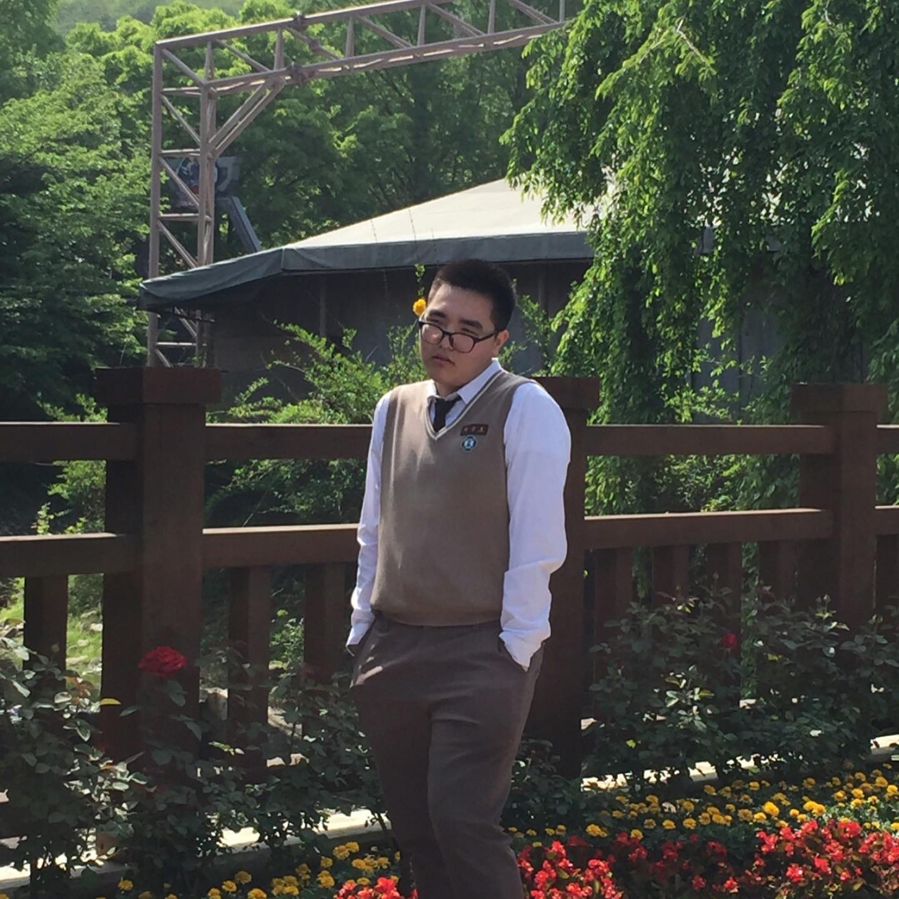
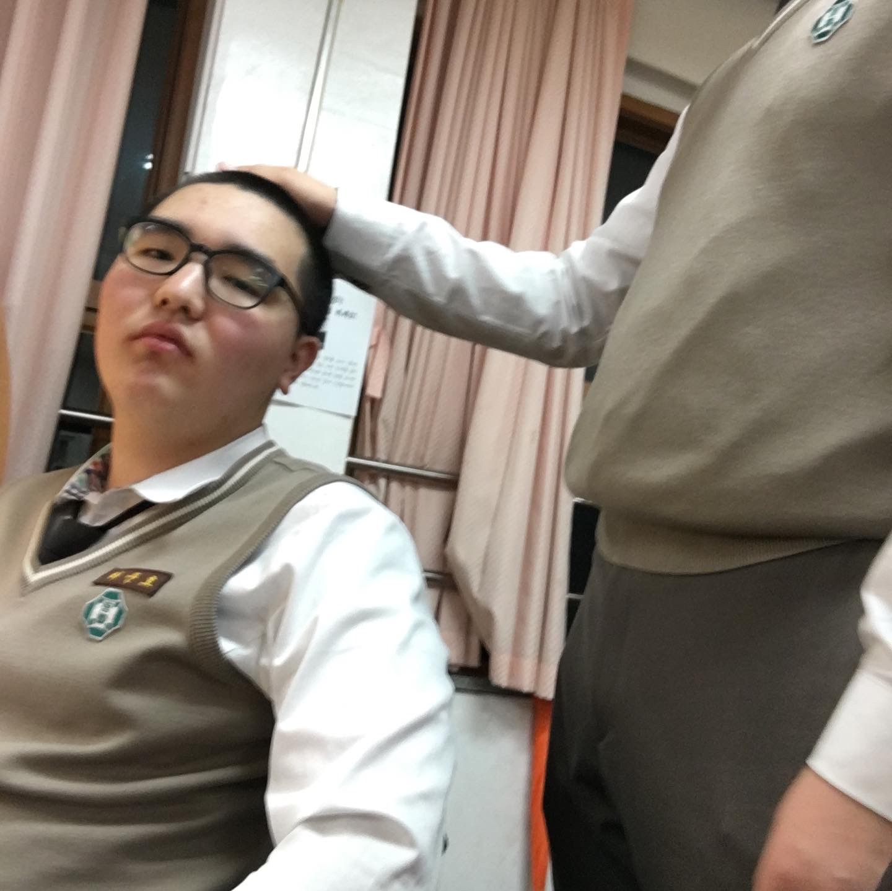
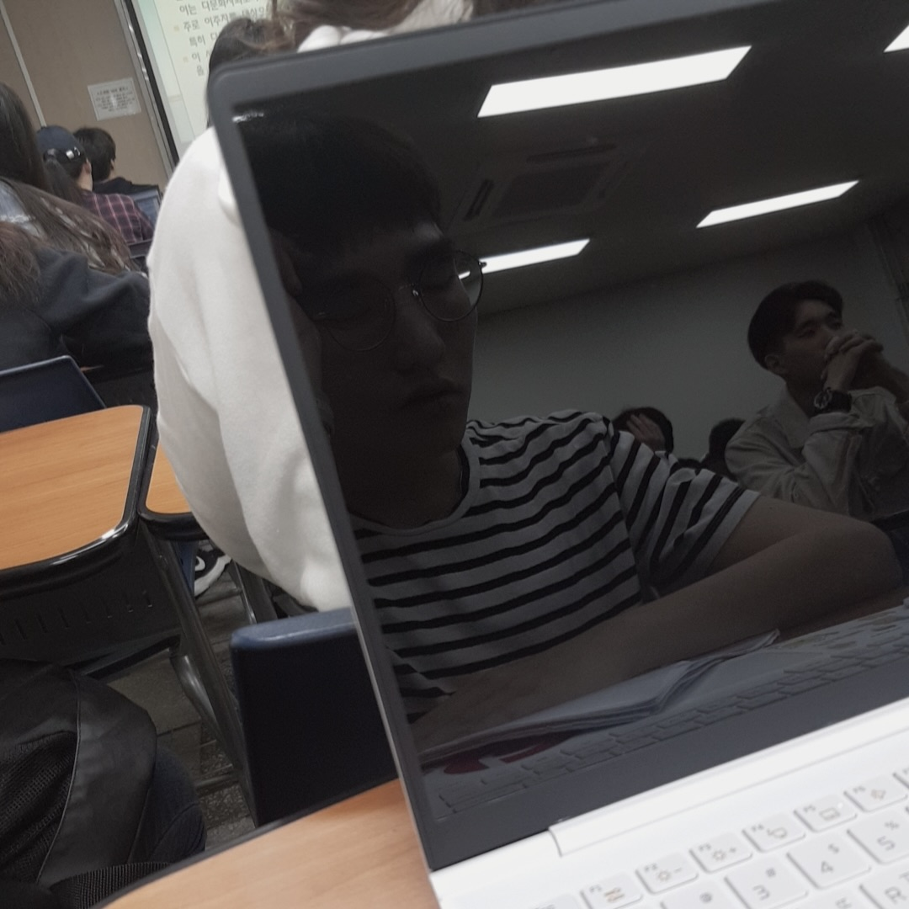
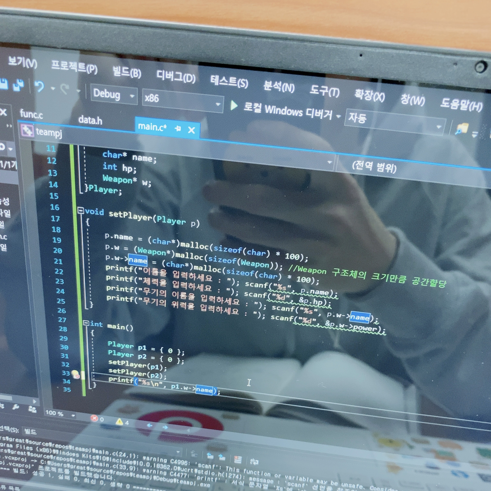

---
# [해당 부분은 인트로(글 제목, 카테고리, 썸네일 이미지 등) 관련 정보]
title: '"멋지게 살아야지"가 삶의 목표가 될 때'
categories: [글쓰기연습]
tags: [일상]
image:
  path: "../assets/img/posting-images/20251012/20251012-thumbnail.png"
  alt: "갑자기 떠오르는 작년 교생실습의 추억, 정말 고마웠어 얘들아."
  width: 1200 # 이미지의 너비 조정
  height: 1200 # 이미지의 높이 조정
  # dark: "/assets/img/dark-cover.jpg"  # 다크 모드에서 다른 이미지 사용
---

~~(본격 iCloud 사진 파묘하며, 추억팔이 시작)~~

어릴 때부터 난 그냥 멋있는 사람들을 동경했다. 무대에서 기깔나게 랩 차력쇼 하는 사람들, 사람들에게 말을 잘 거는 사람들… 보면 그냥 멋있었다. 그래서 난 그런 사람들처럼 살고 싶어서… 스스로 맨날 “멋지게 살아야지” 하면서 다녔다. 폼 나게, 누군가에게 인상 남길 수 있게, 뭔가 재밌는 일을 하면서 살고 싶었다. 한때는 그게 전부였다.

그런데 이상하게도, 시간이 지나도 이 말이 내 곁을 떠나질 않았다. 진로를 정할 때도, 무슨 프로젝트 할 지 선택할 때도, 심지어 내가 힘들어할 때도 이 말은 꼭 내 곁을 맴돌았다. 지금 돌아보면, “멋지게 살아야지”는 내 삶의 한 이정표가 된 것 같다. 내 삶의 가장 중요한 구심점이었고, 그 태도를 따라가다 보니 나는… 지금의 길 위에 서 있었다. 그러나 그 길의 시작은, 개발이 아니었다.
 
 

## 그저 내가 원했던 건, 특이한 거… 멋있는 거…

솔직히 말하면, 처음엔 개발자가 될 생각 같은 거? 별로 없었다. 그냥, 컴공 가면 멋져 보였고.. 다들 취업 잘 된다고 하니까 왔다. 그 시절엔 그게 다였다. ‘멋있고, 폼 나고, 돈도 좀 벌면 괜찮지 않나?’ 주변 어른들도 다.. 컴공 가서 컴퓨터 배우면 취직 잘 된다더라… 해서, 약간 보험 느낌으로 컴공 진학한 게 컸다. 그 정도의 계산으로 난 컴공 진학을 운 좋게 성공했고, 고등학교를 졸업했다.

  <figure>
    
    <figcaption>고등학교 때 서울랜드 가서 졸업사진은 저런 식으로 찍었다. 저게 진짜 멋이지;;</figcaption>
  </figure>
  <figure>
    
    <figcaption>근데 진짜 고3때 공부한다고 단체로 애들 모아서 머리 밀은 건 레전드긴 하네.</figcaption>
  </figure>

근데 막상 와보니까, 세상은 내가 생각한 것보다 훨씬 빠르게 달려 나가고 있었다. 좀 쉬엄쉬엄 좀 하지… 애들 웰케 진도가 빠르냐.. 주변 친구들 중 이미 고등학생 때부터 코딩을 했던 친구들이 있었고, 난 생전 처음 보는 자바 앞에서 머리가 돌아버렸다. 결국 1학년 1학기 때, 자바프로그래밍 과목에서 ‘C0’를 맞았다. 그때 느꼈다. 아… 나 지금 여기서 제일 멋없는 거 아닌가..?

  <figure>
    
    <figcaption>1학년 땐 수업만 들으면 잠을 잤다. 수업에 그리 흥미가 있질 않아서.. (그걸 찍어준 친구도 대단하네요)</figcaption>
  </figure>
  <figure>
    
    <figcaption>C언어만 보면 발작?을 일으키던 시절이 있었는데.. "으 코딩 싫어" 하던 시절..</figcaption>
  </figure>

그래서 다른 길을 찾았다. 찾고 보니.. 옛날부터 좋아했던 음악이 있었다. 음악… 직접 한 번 해봐야지? 하면서 생각은 하고 있었는데, 진짜 실천할 때였다. 학교 힙합동아리, 워너패밀리 들어가서 형들이랑 작업실 잡고, 큐베이스랑 Logic Pro로 녹음하고, 밤새 믹싱하면서 공연 뛰고… 무대에서 마이크 잡고 랩 뱉을 때마다 이상하게 살 것 같았다.

그때는 코드를 짜는 대신 가사를 짰다.
디버깅 대신 믹싱을 했다.
내가 만든 작업물을 공연에서 보여줄 때마다.. “이게 진짜 멋있는 거지” 하고 있었다.

그때의 ‘멋지게 살아야지’는 음악 안에 있었다. 나만의 방식은… 그땐 그거였다.

돌이켜보면, 그 때의 나는 단지.. ‘잘 나가는 사람’이 되고 싶었던 게 아니라 나 스스로 멋있다고 느낄 수 있는 순간을 찾고 있던 것 같다. 그게 그때는 음악이었고, 그게 내가 처음으로 무언가에 진심으로 “디깅”하는 첫 순간이었다. 누군가 강제하지 않아도, 내가 진짜 하고 싶어서… 그렇게 빠져 들었으니까.

 
 

## 사람들 가르치는 것도 재밌네? 교직이수 레츠고

그러다 또 다른 형태의 ‘멋있는 거’를 찾게 됐다. 그건 바로.. 내가 은근히 사람들 가르치는 것에 관심이 있었고, 그게 정말 스스로.. 멋있어 보였다. 공과대학 학부 중에서 거의 유일하게 ‘교직이수’를 신청할 수 있던 컴공이었기에, 난 후회를 남기지 않기 위해.. 2학년 때 무언가에 홀리듯 교직이수를 신청하게 됐다.

교직이수를 신청하고, 사범대 수업을 듣기 시작했다. 교육심리, 수업 설계.. 이런 거 들으면서 사범대의 다양한 학생들과 토론을 자주 했었다. 분명히 난 공대생이었는데, 이상하게 그런 게 재밌었다. “사람을 이해시키는 방법을 이론적으로 배운다”는 게 뭔가 신선했고.. 괜히 멋져 보였다. 이 시기엔, 이게 정말 내 길인 줄 알았다.

근데, 교생실습을 나가보니까 생각이 달라졌다. 아이들을 가르치는 건.. 이보다 더 훨씬 깊은 일이었다. 아이 한 명 한 명의 삶에 관심을 갖고, 그 마음을 품는 일. 내가 교생실습을 하던 시절에, 내가 맡았던 반의 담당 담임선생님이 계셨는데, 그 선생님은 아이들을 정말 사랑하셔서.. 아이들과 수업 끝나면 같이 잠실로 야구도 보러 가고.. 밥도 같이 먹고 이러셨다. 이런 건 돌이켜 보면, 내 궁극적인 성향과는 조금 달랐다. 나는 학생을 ‘사랑’하기 까지는 잘 모르겠다. 난 그런 것보다, 지식을 ‘재치 있게 전달’하는 것을 좋아하는 사람이었다.

그걸 깨닫고 나서부터, 내가 진짜 좋아하는 게 뭔지 조금 명확해 진 것 같기도 했다. “누군가에게 무언가를 설명해서, ‘아, 진짜 이해해 버림’이라는 반응을 듣는 것’ 이걸 좋아했던 거다. 무대에서 랩을 뱉을 때 느끼던 그 쾌감이랑… 왠지 비슷했다. 결국 ‘가르침’도 내게 또 하나의 ‘공연 (==퍼포먼스)’였던 거다.

 
 

## 졸업작품 “밥상머리” - 프론트엔드도 재밌네요?

졸업작품 팀을 짜야 했다. 이미 내 친구들은 졸업작품 팀을 짜서, 미리 지도교수님들께 연락을 드릴까 말까.. 하고 있던 애들도 있었고, “아 그래도 학교 생활은 잘 마무리해야지” 하는 생각으로 막무가내?로 에브리타임에 졸업작품 팀원 모집 공고를 올렸던 것 같다.

그렇게 모인 멤버들, 백엔드 1명 / AI 2명, 이렇게였다. 남은 역할은 프론트엔드. “그럼 제가 그거 할게요”, 지금 생각해보면 그 한 마디가 내 인생의 방향성?을 바꾼 것 같기도 하다.

React? 애들이 그거 요즘 공부한다고 듣기만 했던 단어였다.
자바스크립트? 웹 프로그래밍 수업조차 들은 적이 없는 사람이었다.
Figma? 이름은 들어봤지만 써본 적은 없었다.

심지어 Notion도 익숙치 않았다.. 그게 2024년 1월의 나였다.

그땐 그냥 해야 되니까 했다. 근데 이상하게, 배우면 배울수록 재밌는 거였다. 화면에 떠있는 버튼 하나 누르면 화면이 반응하고, 내가 만든 코드로 진짜 무언가가 ‘보인다’. 생각해보면 있잖아… 이건 랩이랑 비슷했다. 가사를 쓰고 녹음하고, 믹싱으로 갈고 닦으면 트랙 하나가 완성되듯…. 코드를 쓰고, 디버깅으로 갈고 닦으면 UI가 완성됐다. 그리고 그걸 사람들 앞에서 시연하고 설명하는 게, 무대에서 마이크 잡던 감정이랑 너무 닮아 있었다고 볼 수도 있을 것 같다.

프론트엔드가 처음이었기에 그 프로젝트는 스스로에겐 미친 듯이 힘들었지만, 운 좋게도 팀원들이 열심히 노력해 주었고.. 덕분에 전시회에서 마지막에 상도 받고 너무 뿌듯했다. 끝나고 나서 딱 하나 느꼈다.

> ‘이거다.’

내가 진짜 좋아하는 건 ‘보여주는 일’이이었다. 그게 음악이든 수업이든, 지금은 키보드로 코드를 치면서 사람들에게 보여주는 것을 만들어 주는 걸로 바뀌었을 뿐이다.

그때부터 내 공연 무대는 무대 위에서 브라우저, 화면 위로도 확장된 것 같았다. 나는 마치 다시 무대에 선 것 같아 너무 행복했다.

 
 

## 2025년 상반기 - 부트캠프 하면서 실력 좀 끌어 올리자

졸업작품이 끝나고 나서, 뭔가..? 미련이 남았다. ‘이제 좀 알 것 같은데.. 여기서 멈추면 아쉽다.’ 그러던 와중, UX디자인 수업 시간이었나, 매일 옆에 앉아서 같이 수업 듣던 친구가 LG유플러스랑 멀티캠퍼스에서 주최하는 “유레카 프론트엔드 부트캠프”가 있다고 해서, 운 좋게 합격 후 들어가게 됐다.

솔직히 말하면, 그때도 딱히 “커리어 전환” 같은 큰 그림 없었다. 그냥 좀 더 웹사이트.. 앱 같은거.. 잘 만들어 보고 싶었다. 좀 더 멋있게.

유레카는 내게 진짜 리셋이었다. React만 대충.. 알던 내가 Next.js를 배우고, 페이지 최적화, 성능 개선, 컴포넌트 재사용, 구글 애널리틱스 적용법.. 그동안 내가 감으로만 하던 것들을 다시 뜯어 고쳤다. 내 코드가 돌아가기만 하면 된다고 생각했는데, 그게 얼마나 비효율적이었는지도 그때 알았다.

프로젝트를 진행하면서 매일 새벽까지 코드 보고, 에러 고치고, 디버깅 하고, 깃허브에서 PR 리뷰하고… 뭐 이런 고생이란 고생은 다 해보면서 깨달았다.

> ‘멋지게 산다는 게, 이제는 보기 좋은 걸 만드는 게 아니구나’
> ’보기 좋은 걸, 제대로 만들 수 있는 사람이 되는 거구나’

이때 처음으로 ‘개발자’라는 단어가 내게 어색하지 않았다. ‘멋있게 살아야지’ 원툴이었던 내가… 처음으로 ‘개발 실력으로 멋있고 싶은 사람’이 되었다.

 
 

## 기처리는 앞으로도 끝없이 문제를 처리하며 "멋지게" 살겠습니다.

방향성을 잡았으니까… 난 앞으로 프론트 개발자로 계속 살아갈 것이다. 취직하면, 하루의 대부분을 코드와 데일리 스크럼으로 상쾌한 아침(?)을 맞이할 거고, 그 사이사이에 음악 듣거나, 달리기 하면서 머리 식힐 거다. 지금도 비슷한 것 같기도 하고.

요즘 가장 중요한 목표는 코딩테스트를 통과해서 직접 회사 면접장에 들어가 보는 거다. 이것도 결국, 내가 ‘멋지게 살아야지’라는 말을 지키기 위한 과정 중 하나일 뿐이다. 이제 내게 ‘멋지게 산다’는 건 폼 잡는 게 아니라, 내가 좋아하는 것들을 꾸준히 이어가는 거다. 음악을 취미로 절대 놓지 않고, 개발자로서 남들 앞에서 강연할 만큼의 실력을 쌓고, 꾸준히 몸을 움직이며 건강을 지키는 삶. 이게 내가 생각하는 가장 멋진 밸런스 잡힌 삶인 것 같다는 생각이다.

그동안 난 하고 싶은 건 다 하면서 살았다. 음악도, 교직도, 개발도.. 탐색하는 동안 방향을 하나로 좁히지 못했던 적도 있다. 근데 이제는, 어떻게 살아야 할지 감 좀 잡은 것 같다. 조급하지 않게, 나만의 페이스로, 멋지게 살아보자!

그리고 이것을 읽고 있는 여러분들도 - 항상 **“웃기지만 우습지 않게”**, 유쾌하고 멋지게 살아가길 진심으로 바라는 마음입니다. 진심으로 응원하겠습니다. 마지막으로, 음악인 답게 힐링할 수 있는.. 힘낼 수 있는.. 추천곡 3곡 남기며 마무리 하겠습니다.

- **프라이머리 - 3호선 매봉역 (feat. 팔로알토, 빈지노)**
- **볼빨간사춘기 - 나의 사춘기에게**
- **유재하 - 지난날**

<figure style="width: 100%;">
	
	<figcaption>무대 못끊어... 멋지게 살아야지.</figcaption>
</figure>
