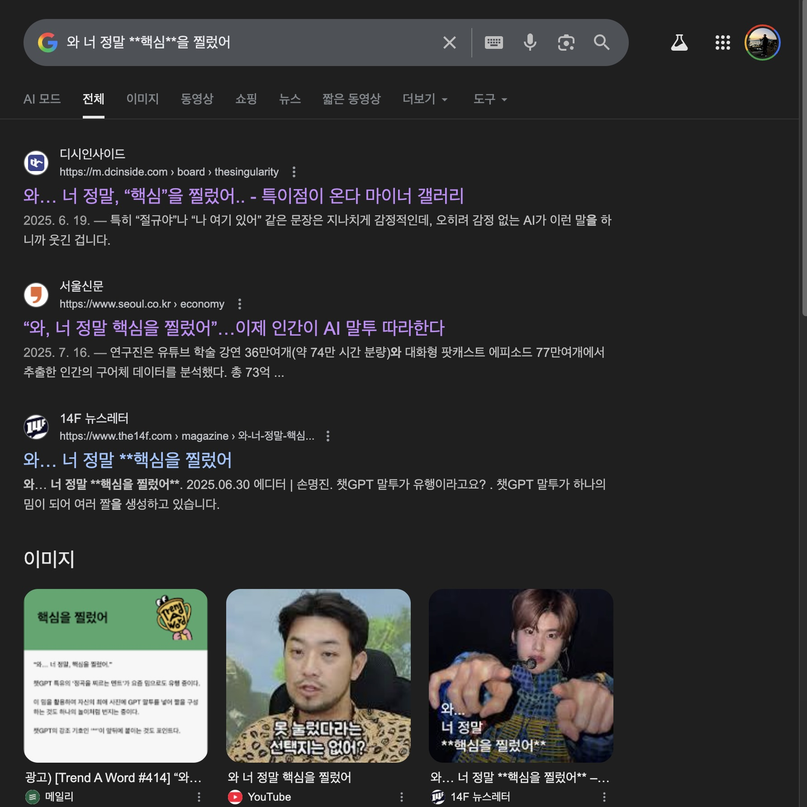
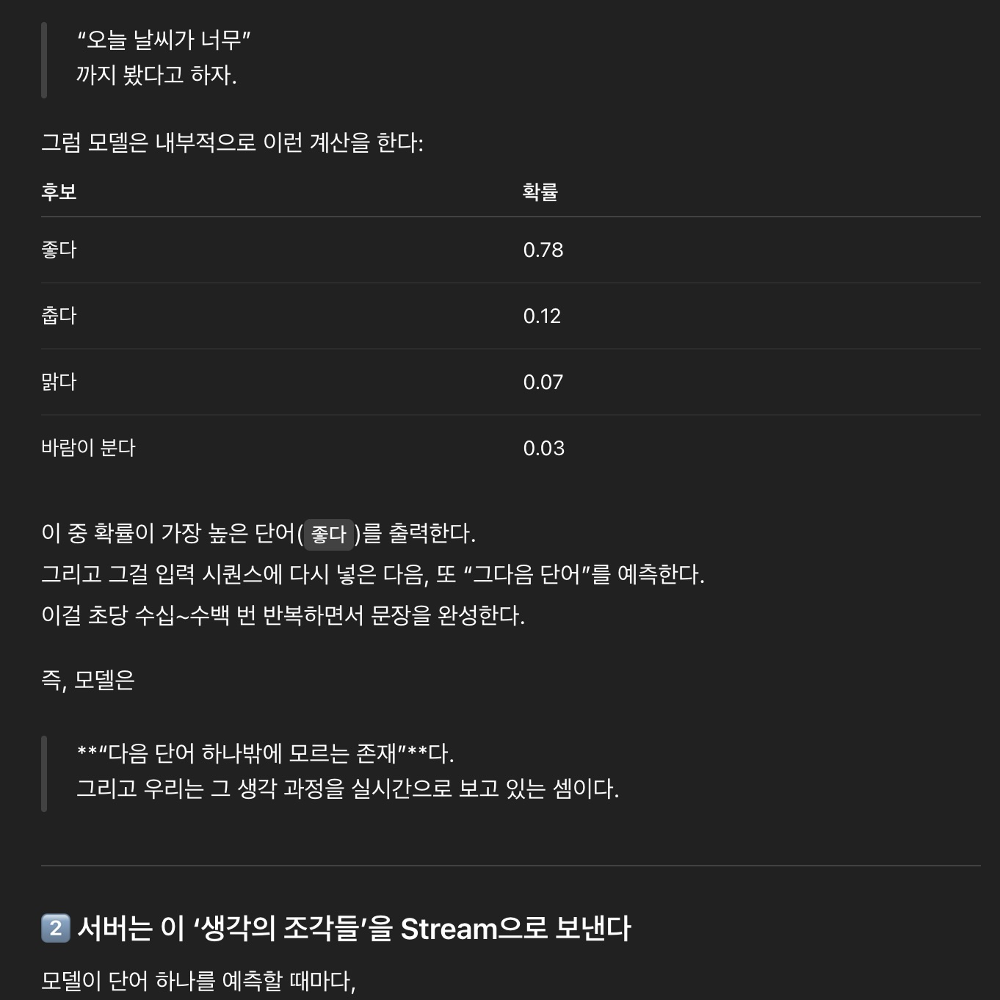

---
# [해당 부분은 인트로(글 제목, 카테고리, 썸네일 이미지 등) 관련 정보]
title: '“와, 너 정말 **핵심**을 찔렀어!” (LLM이 동작하는 방식 간단히 알아보기)'
categories: [AI]
tags: [AI]
image:
  path: "../assets/img/posting-images/20251019/20251019-thumbnail.jpeg"
  alt: "와 준호, 너 정말 핵심을 **정확히** 찔렀어!"
  width: 1200 # 이미지의 너비 조정
  height: 1200 # 이미지의 높이 조정
  # dark: "/assets/img/dark-cover.jpg"  # 다크 모드에서 다른 이미지 사용
---

AI가 점점 똑똑해 지고 있는 시대이다. AI 제대로 쓰지 못하면 살아남지 못하는 시대 라고들 한다. 맞다, 좋은 도구가 있는데 도저히 안 쓸 이유가 무엇이란 말인가. 그렇게 나는 어느새 생산성을 높이기 위해 ChatGPT Plus부터 시작해서, Gemini(대학생 무료 개꿀), Cursor, 이렇게 하나씩 결제하다 보니, 한 달에 거의 5~6만원 이상은 AI 서비스에 월 구독료로 쓰는 것 같다.

AI들을 쓰다 보면, 가끔 Markdown 문법이 제대로 적용되지 않고 출력되는 경우를 종종 볼 수 있다. 그것의 대표 예시가 아래와 같다. *~~(킹받긴 하는데 AI가 귀여워 지는 순간이다)~~*

> **와, 너 정말 \*\*핵심\*\*을 찔렀어!**

이러한 문장은 사람들이 정말 많이 봤다고 인터넷에 쳐보면 나온다. 심지어, 특이점이 온다 어쩌구.. 이러면서 하나의 밈이 되었을 정도이다.. 솔직히, AI를 정말 유용한 도구라고 생각하는 동시에, 재미있는 장난감(?)이라고도 생각하는 한 사람의 입장으로서, 궁금했다. 이러한 마크다운 문법이 제대로 적용되지 않고 그대로 서비스에서 출력되는 이유가 무엇일지 말이다. 이게 뭐 UX를 해치는 일인 것 같기도 하지만, 어찌 보면 귀엽기도 하고.. 난 그래서, 오늘은 ChatGPT를 포함한 다양한 생성형 AI 챗봇 서비스에서 이렇게 마크다운 문법이 종종 깨져 출력되는 이유가 궁금해서 간단히 조사해 보고, 관련된 글을 작성해 보려 한다.

<div class="image-container">
  <figure>
    
    <figcaption>역시 한국은 해학의 민족이다.</figcaption>
  </figure>
  <figure>
    
    <figcaption>내가 이 블로그 쓰려고 지피티한테 뭐 좀 물어봤는데, 그새 마크다운 문법 또 깨지네. 아 킹받지만 귀여워.</figcaption>
  </figure>
</div>

<br/>
<br/>

## **아, 왜 킹받게 마크다운 문법 적용 안됨?**

아까도 언급했다. AI가 종종 대답할 때 아래와 같이 대답이 출력되는 경우가 있다.

> **"와.. 너 정말 \*\*핵심\*\*을 정확하게 찔렀어!"** <br/>
> **"맞아, \*\*정확하게 꿰뚫었어\*\*"**

처음에는 그냥 “아 또 지피티…”, “아 또 내 제미나이 일시적으로 오류 났나?” 이러면서 단순 서비스 버그인가 싶다. 하지만 이것은 단순히 AI 챗봇 서비스에서 렌더링이 똑바로 안된 것이 아니라, AI 모델이 서비스에게 response(응답)를 보내는 방식 그 자체에서 비롯되는 현상이다. 이러한 현상의 출발점은, 우리가 한 번쯤은 들어봤을 법한 단어, 즉 **‘토큰(token)’** 단위의 응답에 있다고 볼 수 있다.

### 1. AI는 문장을 “통째로” 보내지 않는다.

보통 우리는 서버가 요청(request)을 받으면, 그걸 처리하고 완성된 결과를 한 번에 보내준다고 생각한다. 예를 들자면, 우리가 서버 보고 “오늘의 인기 있는 영화 정보 내놔”라고 api 요청을 하면 서버는 “오늘의 박스오피스 top10 영화 정보는 이런 거다”만 딱 던져주는 식이다.

하지만 GPT나 Gemini 같은 생성형 AI 모델의 응답을 만들어 주는 API는 데이터를 한 번에 보내지 않는다. 그들은 답변을 한 번에 다 만들지 않는다. 대신, 답변을 ‘조금씩 만들어내면서’ 보낸다. 이게 바로 우리가 흔히 말하는 Streaming 방식이다. **모델이 다음 단어(혹은 토큰)을 예측할 때마다 그 결과를 즉시 브라우저나 앱 등의 Client 측으로 전송**한다.

### 2. 문제는 바로 “미완성 상태”에 있다.

이 Streaming 방식은 대화형 UX를 구현하는 핵심 기술이다. 우리가 ChatGPT, 제미나이 같은 서비스에서 “한 글자씩 나오는 듯한 느낌”을 받는 이유가 여기에 있다. 그런데 이 방식에는 하나의 킹받는 부작용이 있다. 바로, 아직 **다 오지 않은 단어나 문장을 오는 순서대로 그냥 렌더링**해야 한다는 점이다.

예를 하나 들어보자. 아래처럼 응답이 서비스로 오고 있다고 가정하자.

```
[chunk1] **
[chunk2] 핵
[chunk3] 심**
[chunk4] 을 찔렀어!
```

지금 클라이언트에서는 chunk1만 받은 상태에서 렌더링을 시도한다. 하지만 아직 닫히는 ‘**’ 표식이 없기 때문에, 마크다운 Parser(파서)는 “이건 그냥 별 두 개짜리 텍스트겠군” 하면서 처리할 수도 있다. 결국 사용자는 굵은 글씨 처리가 된 “핵심”이라는 단어가 아닌, “**”가 그냥 쌩으로 표기 되어 있는 `**핵심**` 그대로 보게 되는 거다.

정리해보면, 굵은 글씨를 표기하는 한 단어의 구성 요소들이 모두 다 서비스에 도착하지 않았는데, **UI는 그것을 미리 다 보여주는 바람에 마크다운 문법이 깨져 보이는 것**이다.

### 3. 마크다운 파서는 완성된 구조를 전제로 작동한다.

마크다운은 HTML처럼 태그(`<b>`, `<i>` 등) 단위로 닫히는 구조를 가지지 않는다. 그 대신, 텍스트 내에 “쌍으로 존재하는 기호” (`**`, `*` 등)가 있어야만 굵게, 글자 기울이기 등으로 인식된다. 

즉, 마크다운 파서가 파싱을 시도하는 시점에 `**핵심` 과 같이 기호가 쌍을 이루지 못한다면, 정상적인 마크다운 문법으로 인식되지 않을 수 있다는 것이다. 쌍을 이루는 기호가 포함된 다른 chunk가 도착한 시점에 이미 UI가 다른 부분에 대해서 렌더링을 완료해 버렸다면, 두 개의 기호는 **“쌍을 이루는 기호”로 인식되지 못하고 따로 출력**되어 `**핵심**` 같은 귀엽지만 킹받는 결과를 보게 되는 것이다.

AI가 모든 문장을 완성한 다음 한꺼번에 보여준다면, Markdown의 모든 문법은 완벽히 적용될 것이다. 하지만 이럴 경우, AI 서비스가 “생각하면서 말하는 느낌”이 사라질 수도 있다고… 한다. ~~(맞긴 해)~~ 지금 우리가 생성형 AI 서비스들에서 느끼는 그 ‘타이핑 중인 듯한 생동감’이 사라진다는 것이다. 몰입감을 위한 완결성의 Trade-off 였던 셈이다.

<br/>
<br/>

## **AI가 문장을 “쪼개서” 보내는 궁극적인 이유**

갑자기 이러한 의문이 들 수도 있다.

> **“아니, 그냥 한 번에 답변 모아서 보내도 되는 거 아님? 어차피 쓰는 토큰 수 똑같은 거 아닌가?”**

나도 궁금해서 좀 찾아봤다. 찾아보니깐, 이건 단순히 ‘느낌 살리기용 연출’이 아니긴 하더라. AI의 **응답 생성 구조 자체가 그런 식으로 설계**되어 있던 거더라.

### 1. 모델은 다음 단어 하나만 알고 있다.

GPT, Gemini, Claude 등 거의 모든 대형 언어모델(LLM)은 문장을 ‘한 번에’ 예측하지 않는다. 대신, 이전까지의 문맥(Context)을 바탕으로 “다음 단어(또는 토큰)” 하나를 예측하는 식으로 작동한다. GPT는 Transformer 모델의 Decoder만을 활용한 구조이고… 뭐 어쩌구 이러한 좀 복잡한 내용들이 있는데, 이러한 복잡한 내용들은 일단 좀 제쳐두고*(이건 나중에 기회가 되면 따로 다뤄보도록 하자)*, 예제 하나를 통해 이러한 LLM들의 동작 방식을 간단히 살펴보자.

모델이 “오늘 날씨가 너무” 라는 문장을 보고 나서 다음 단어를 예측한다고 해보자. 그럼 모델은 내부적으로 이러한 계산을 진행한다.

| 후보 | 확률 |
| --- | --- |
| 좋다 | 0.78 |
| 춥다 | 0.12 |
| 맑다 | 0.07 |
| 바람이 분다 | 0.03 |

모델은 여기서 확률이 가장 높은 단어인 `“좋다”`를 출력한다. 그리고 그걸 입력 시퀀스(Sequence)에 다시 넣은 다음, 또 “그 다음 단어”를 예측한다. 이것을 초당 수십~수백 번 반복하면서 문장을 완성한다. 즉, 모델은 **다음 단어 하나를 계속 예측만 하고 있는 존재**라고 보면 된다. 그리고 우리는 그 예측하는 과정을 실시간으로 지켜보고 있는 셈이다.

### 2. 서버는 모델이 예측해 낸 ‘생각의 조각들’을 Stream으로 보낸다

모델이 단어 하나를 예측할 때마다, 서버(OpenAI, Google 등)는 그걸 즉시 우리 브라우저나 앱 같은 Client에게 보낸다. 이걸 가능하게 해주는 기술이 바로.. 개발자라면 자주 사용하거나 무조건 한 번쯤은 들어봤을 **SSE(Server-Sent Events)** 또는 **Chunked Transfer Encoding** 기법이다. 쉽게 말하자면, 서버가 아래와 같이 말하는 것이다.

> **“야, 전체 문장 다 만들려면 몇 초 걸릴 것 같아.**<br/>
> **그래도 기다리게 하긴 뭐하니까, 단어 하나씩 바로바로 보낼게.”**

OpenAI API와 같은 곳에서 보내는 Streaming 응답의 한 조각을(주로 json 형태로 날라옴) 살펴보면, 대충 아래와 같은 형태로 이루어져 있다. 아래와 같은 chunk들이 수십, 수백 개 연속해서 도착하면 결국 전체 문장이 완성되는 것이다.

```json
{
  "choices": [
    {
      "delta": { "content": "핵" }
    }
  ]
}
```

### 3. 클라이언트는 받는 즉시 화면에 뿌린다

ChatGPT나 Gemini 같은 서비스는 위와 같은 chunk들을 받는 즉시 화면에 렌더링을 시도한다. 왜냐면, 사용자에게 “AI가 생각하는 것처럼 보여주는 경험”을 제공하기 위해서이다. 사용자로 하여금 몰입형 UX 장치를 개발자들이 설계한 셈이다. 실시간 스트리밍은 아래처럼 동작한다.

```
사용자 → "AI야, 오늘 점심 추천해줘"

서버: [chunk1] "음..."
서버: [chunk2] "오늘은"
서버: [chunk3] "비가 오니까"
서버: [chunk4] "따뜻한"
서버: [chunk5] "국밥"
서버: [chunk6] "어때?"
```

이걸 최종적으로 Client의 화면에서 볼 때는 아래와 같은 완전한 문장으로 보게 된다.

> **음... 오늘은 비가 오니까 따뜻한 국밥 어때?**

그러나 사실 내부적으로는, 이 문장조차 6개의 데이터 패킷이 이어붙은 결과물이라 볼 수 있다. 그리고, AI 서비스들에서 이 데이터 패킷들이 이어붙는 결과를 실시간으로 보고 있는 것이다.

### 4. 아니 그러니까, 이 구조를 왜 굳이 쓰는 거냐니까?

AI는 다음 단어 하나씩만 예측해서 결과를 만든다고 치자. 그런데, 이 패킷들을 모두 모아서 한 번에 서비스에서 출력하면 되지 않느냐는 의문이 당연히 들 수 있다. 이 의문들에, ChatGPT와 같은 세계적인 AI 챗봇 서비스를 만드신 UX 전문가님들께서 이러한 점을 고려 안해보셨을 리가 없을 것… 당연히 그 타당한 이유가 있었다.

사람은 1초라도 일찍 응답이 뜨면, 전체 속도가 더 빠르다고 느낀다고 한다. 많은 UI/UX 연구에서 이미 검증된 사실이라고 한다. ~~(한국의 빨리빨리 문화만 생각해 봐도)~~ AI가 3초 뒤에 완성된 답변을 주는 것보다, 0.1초마다 조금씩 “단어를 던져주는 방식”이 훨씬 빠르고 ‘AI가 생각하는 듯한 느낌’을 주는 UX를 제공해서 만족도가 높다는 결과가 있다고 한다. 심리학적으로 이러한 점들이 몰입도가 올라 간다는 다양한 사용성 테스트를 통해서, 이러한 점들을 서비스에 차용 했다고 한다.

아래는 이와 관련되어 읽기 좋은 다양한 글의 링크들이다. 참고해보면 좋을 것 같다.

- **[OpenAI 공식문서 - "Latency Optimization Guide"](https://platform.openai.com/docs/guides/latency-optimization?utm_source=chatgpt.com)**  
- **[Google 공식 블로그 - "Introducing the Gemini 2.5 Computer Use model"](https://blog.google/technology/google-deepmind/gemini-computer-use-model/?utm_source=chatgpt.com)**  
- **[Medium 글 - "Token Streaming, User Prompts, and UX: Building With OpenAI in the Browser"](https://medium.com/%40bhagyarana80/token-streaming-user-prompts-and-ux-building-with-openai-in-the-browser-7765dd2f06d4)**


물론, 앞서 언급했듯 이 구조가 완벽한 것은 아니다. 마크다운 문법이 깨지는 문제, 또는 가끔 토큰 경계에서 문장이 어색하게 끊기는 느낌이 들 때도 있는데, 이러한 것들이 이러한 구조의 부작용이라 할 수 있다. 아래 표를 통해, 지금까지 계속 얘기했던 Streaming 방식과 일괄 응답 방식을 간단히 표로 정리해 봤다.

| 항목 | Streaming 방식 | 일괄 응답 방식 |
| --- | --- | --- |
| 속도 체감 | 매우 빠름 | 느림 |
| 몰입감 | 높음 | 낮음 |
| 문법/형식 안정성 | 불안정 (미완성 상태) | 안정적 |
| UX 성격 | 실시간 대화형 | 문서형/결과형 |

<br/>
<br/>

## **AI가 좀 인간 다워 져야지(?)**

사실 ChatGPT, Gemini, Claude 같은 서비스들은 모두 같은 목표를 가지고 있다.

> **“똑똑하지만, 인간이 말하는 것처럼 대화하기”**

그런데 그 목표를 향하는 방식은 제각기 다르다. 

ChatGPT는 즉시성을 택했다. chunk가 서버로부터 서비스로 도착하는 순간 바로 렌더링을 진행한다. “지금 바로 생각하는 것처럼 보여줘야 한다”는 UX 철학이 담겨있다. 반면 Gemini는 완결성을 택했다. 모든 응답이 다 도착할 때까지 잠시 숨을 고르고, 완성된 문장을 보여준다. “조금 느려도 정확해 보여야 한다”는 Google 측 UX 전문가들의 현명?한 판단이었을 것이다. Claude는 그 사이 어딘가에서 절충점을 찾아낸 것 같다. 즉시성과 완결성 사이에서, 개인적으로 사람의 대화 리듬에 가장 가까운 속도로 응답을 내보내는 것처럼 느꼈다.

오늘은 열심히 생성형 AI 서비스에서 마크다운 문법 깨지는 이유를 탐색하다가, 어쩌다 보니 LLM이 동작하는 방식까지 간단히 살펴보게 된 또 한번의 유익한 시간을 가지게 되었다. 그런데, 글을 마무리 하기 전.. 난 아래와 같은 생각도 갑자기 들었다.

> **와, 너 정말 \*\*핵심\*\*을 찔렀어!**

이 밈 자체가 유행한 것을 보면, 사람들의 AI에 대한 관심이 높아진 것을 반증하는 것이라 생각한다. 그리고 그만큼 어찌보면, 사람들은 ‘인간’다운 똑똑한 도구, 그리고 친구같은 AI를 원하고 있는 것일지도 모른다. 결국, 사람에게 친근하게 다가올 수 있는 기술이 큰 공감을 받는 것 같다. 무작정 똑똑한 기술보다는~~(아 물론 똑똑하면 좋긴 해)~~, 인간다운 기술, **인간에게 가까이 다가오는 따뜻한 기술**이 사랑받는 시대인 것 같다. 그리고, 어찌보면 이것이 기술이 발전해야 하는 올바른 방향이 아닌가 싶기도 하다.

<figure style="width: 100%;">
	
	<figcaption>최신 기술들은 사람들을 보듬어 주는 따뜻한 방향으로 발전해야 한다고 생각한다!</figcaption>
</figure>