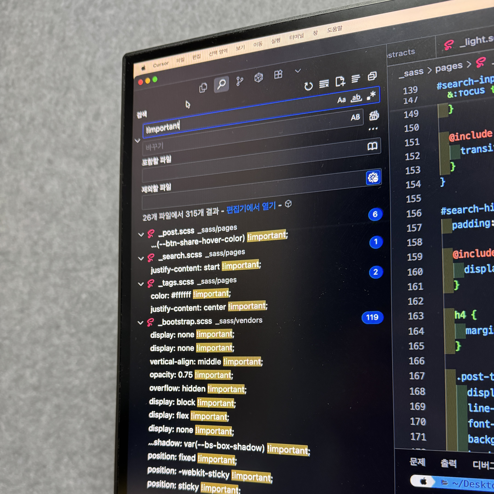
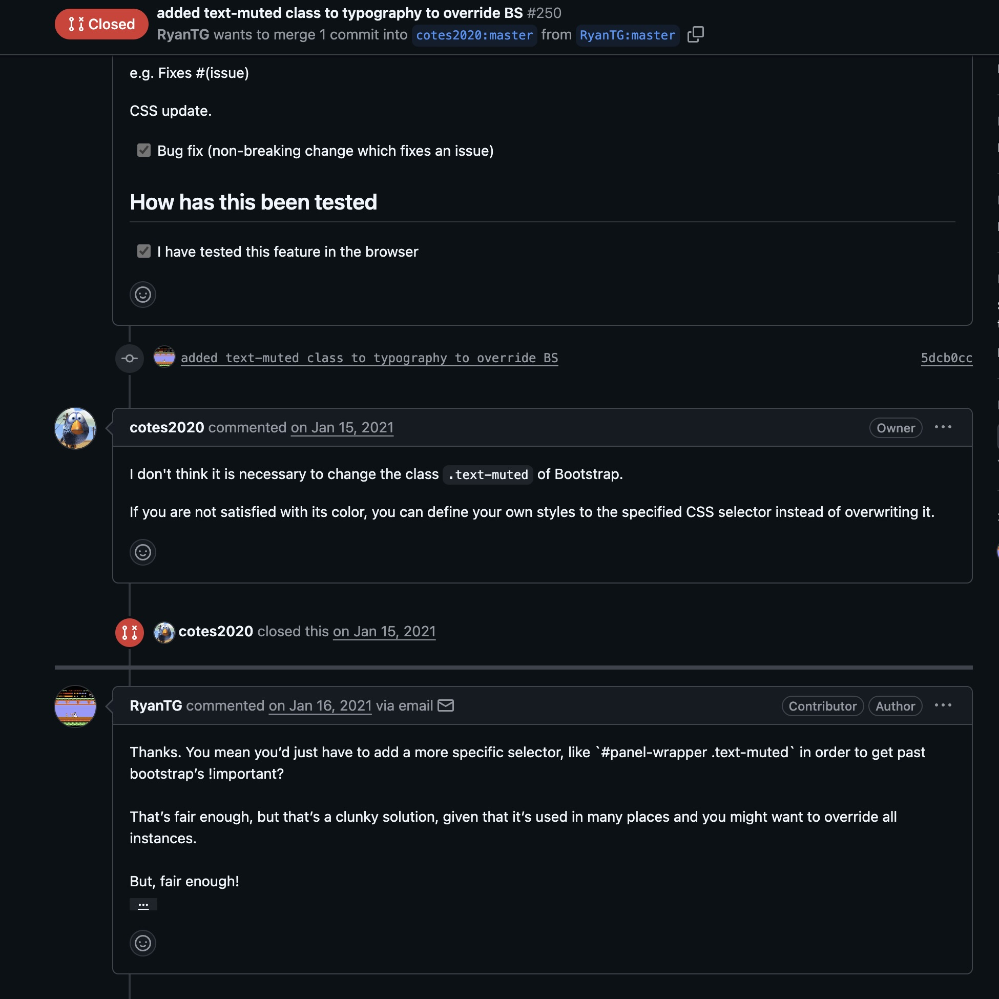
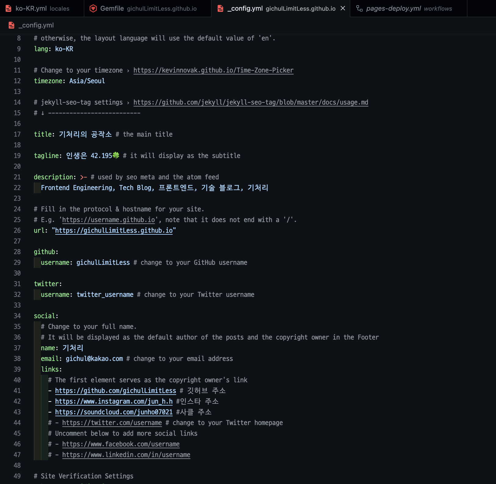
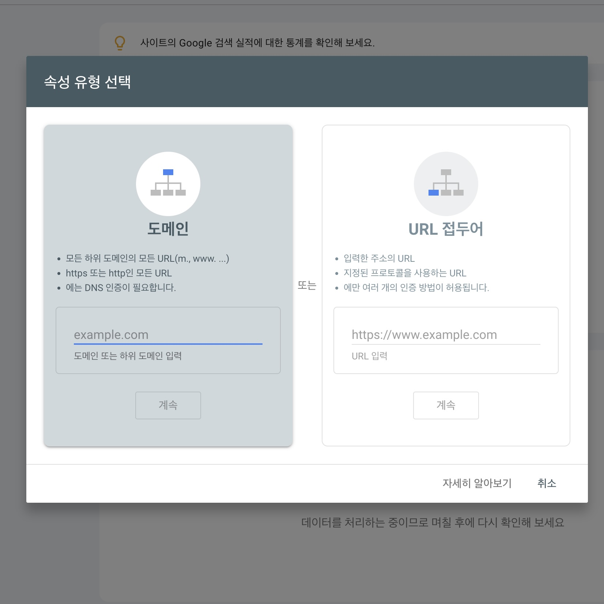
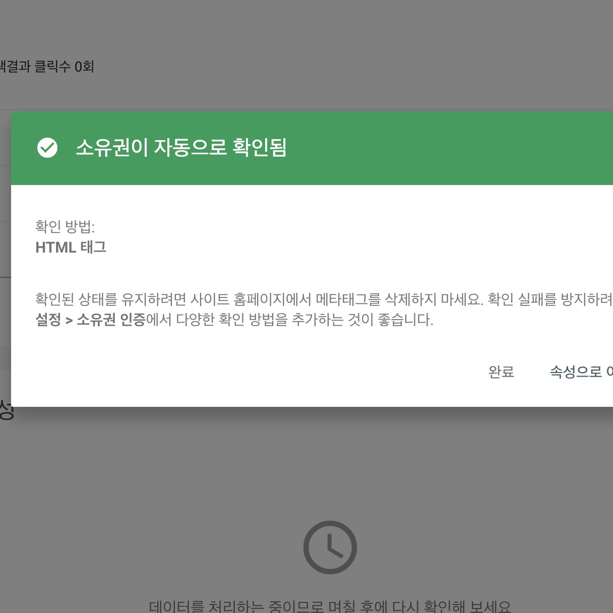
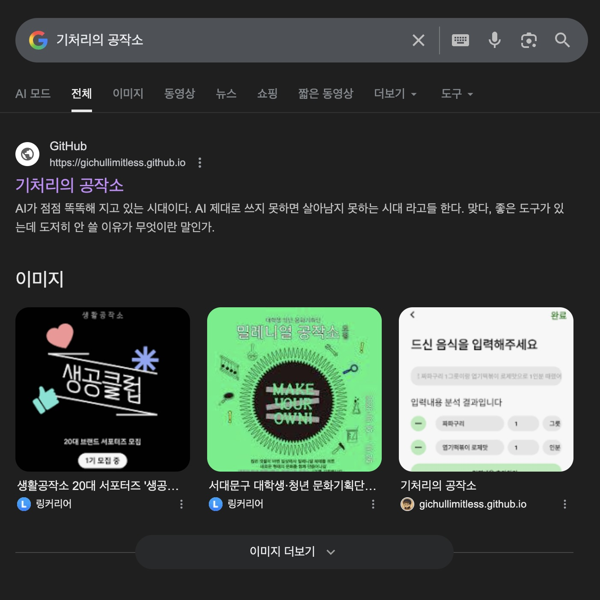
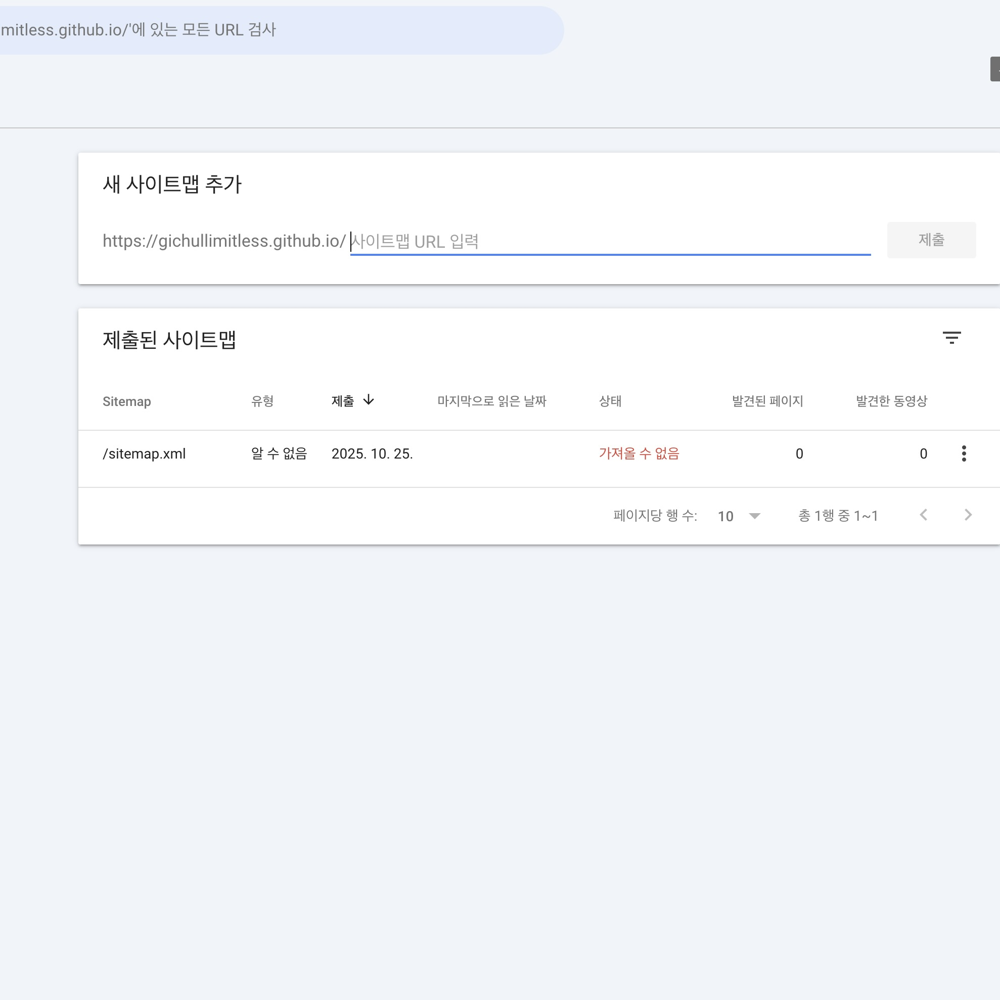
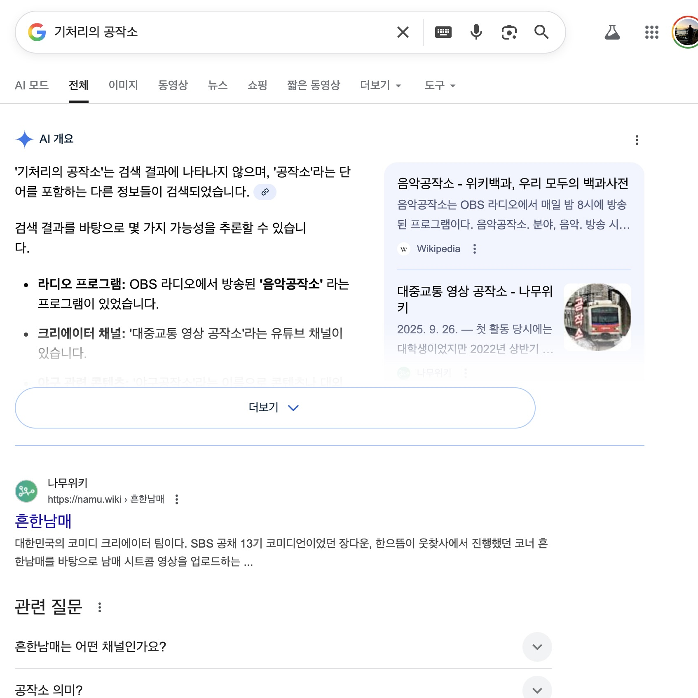
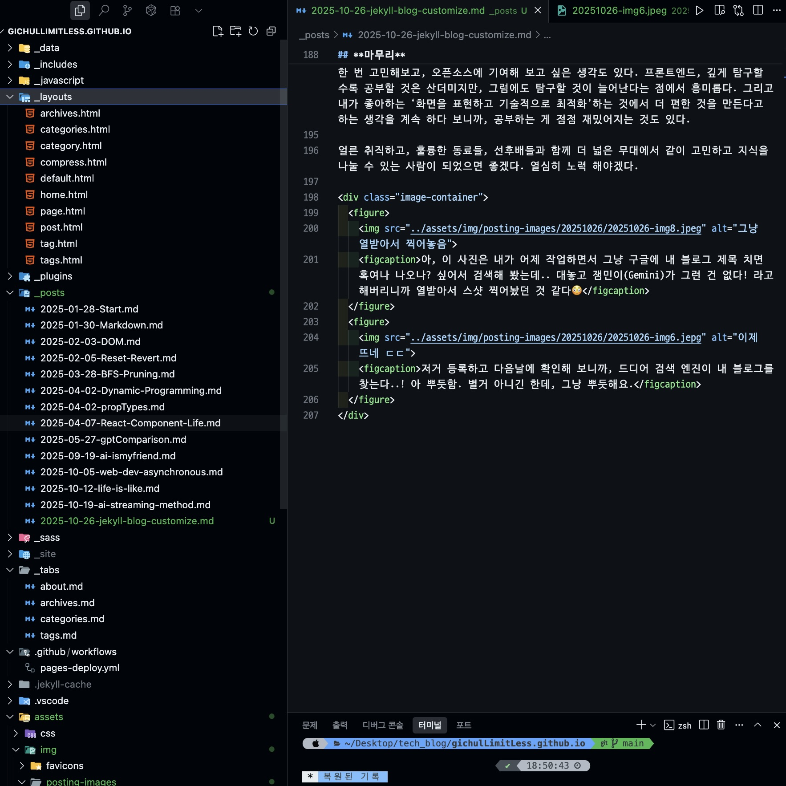

---
# [해당 부분은 인트로(글 제목, 카테고리, 썸네일 이미지 등) 관련 정보]
title: 'Jekyll 블로그 커스터마이징 깔짝 해보기!'
categories: [웹]
tags: [정적 사이트, SEO]
image:
  path: "../assets/img/posting-images/20251026/20251026-thumbnail.jpeg"
  alt: "아이고 두야..."
  width: 1200 # 이미지의 너비 조정
  height: 1200 # 이미지의 높이 조정
  # dark: "/assets/img/dark-cover.jpg"  # 다크 모드에서 다른 이미지 사용
---

요즘 내 블로그의 활성화를 위해서, 그리고 내 자신의 무궁한 발전을 위해서 일주일에 하나씩 기술 블로그 글을 작성하고 있다. 덕분에 내 ‘기처리의 공작소’ 블로그는 점점 풍성해 지고 있다고 생각하는데, 이 블로그를 개설하고 나서, 이 블로그의 디자인에 대해서 너무 손을 안 본 것 같다는 생각도 들었다. 그래서, 난 간단히 일부 부분에 색깔이랑 배경도 좀 바꿔보고 싶어서 프로젝트의 HTML/CSS/JS 파일에 손을 직접 대보았다. 그 과정에서 겪은 몇 가지 시도와 좌절, 그리고 희망(?)에 대해서 여기에 간단힌 남겨 보고자 한다.

## **CSS, 가뜩이나 힘든데.. 우선순위 추적 하다가 머리 터지겠다!**

난 단순히 내가 열심히 운영하고 있는 이 블로그의 오른쪽 “인기 태그” 색깔이랑 “태그” 섹션에 있는 태그 색깔을 `hover` 시에 초록색 뜨도록 바꾸고 싶었을 뿐이다. 이렇게 커스터마이징 하려고 `github.io` 이용해 가지고 나만의 사이트 만들고, 블로그 운영하는 것일 거다. 나만의 공간 꾸미기.. 생각만 해도 재밌지 않은가?!!

그런데, 문제가 발생했다. 물론 알고 있는 것이 별로 없는 나지만, 해당 블로그는 Jekyll 정적 블로그 테마 중 유명한 테마 중 하나인 ‘Chirpy’ 테마를 그대로 가져와서 운영중인 블로그여서, 폴더 구조가 매우 복잡했던 것. 테마를 그대로 가져와서 블로그 포스팅만 올릴 때에는 몰랐는데, 블로그 자체의 디자인을 바꾸려다 보니 블로그 자체에 생각보다 복잡한 기능들이 많았던 것. 

### 블로그 태그 색깔 변경하는 데 하루를 쓰는 사람이 있다? 근데 어쩔 수 없었어요...

CSS 스타일을 바꾸는 데에도 서로 의존해 있는 스타일들이 정말 많아서, CSS 우선순위 파악이 너무 힘들었다. 특히, 개발 의도가 전체적인 스타일을 잡은 다음에, 각 세부 스타일들에는 각기 다른 스타일을 적용하기 위해서 `!important` 옵션을 다양한 scss 파일에 넣어 놓은 것인지는 모르겠으나, 300개가 넘는 속성에 적용되어 있는 `!imporant` 옵션 때문에 CSS 우선순위 추적이 너무 힘들었다. 하루종일 태그 색깔 하나 바꾸려고 스타일 우선순위를 추적하고 있는 게 내겐 너무 비용이 낭비되는 느낌이었다. 해당 페이지의 버튼에만 스타일을 적용하려고 `!imporant` 를 적용하니까 계속 적용 안되서 보니까, 렌더링 순서상 나중에 로드된 SCSS의 `!imporant` 가 우선 적용되고 있었고… 이것보다 상위 스타일시트에도 `!important` 가 박혀 있었고, 아주 난리도 아니었다.

<div class="image-container">
  <figure>
    
    <figcaption>해당 사진을 보고 심각성을 인지하셨다면 키보드를 흔들어 주세요.</figcaption>
  </figure>
  <figure>
    
    <figcaption>내가 쓰고 있는 Chirpy github 리포지토리 가서, PR에 기여한 사람들이 어떻게 기여 했는지 궁금해서 한 번 살펴봤다. 최근 2~3년 PR에는 !important 사용해서 불필요한 스타일 변경하려는 PR은 merge 잘 안 해줬던 것을 확인할 수 있었는데, 아무래도 지금 !important로 도배되어 있는 것은 내가 모르는 무슨 디자인 시스템이 있었던 게 아닐까.. 하는 생각이 들기도 한다. 아 근데, 어쨌든 가져다 사용하는 사람이 불편한 건 팩트잖아요...</figcaption>
  </figure>
</div>

### `!important` 는 왠만하면 쓰질 말아야지, 몸으로 체감해 버렸다.

내가 이 블로그 운영에만 하루종일 시간을 쓰고 있는 것도 아니고, 다른 해야할 일이 산더미인 상황에서 이 블로그 구조를 모두 뜯어 보면서 전면 리팩토링 하기엔 시간이 없었다. 그래서 난 이러한 상황에서 그냥 ‘태그’ 탭에 있는 ‘태그’ 요소들이 기존에는 `<a>` 태그로 모두 작성되어 있었는데, 따로 태그 버튼을 `<div>` 로 만든 다음에, 클릭 시에 원래 `<a>` 태그로 수행했던 역할을 동일하게 할 수 있도록 아래와 같이 `tags.html` 파일을 수정했다. `<div>` 에 `onclick` 이벤트를 추가했다.

```html
---
layout: page
# All the Tags of posts.
---

<div id="tags" class="d-flex flex-wrap mx-xl-2">
  
  
    
  

  

  
    <div class="tag-wrapper">
      <div
        class="tag-item"
        role="link"
        tabindex="0"
        onclick="location.href='{{ t | slugify | url_encode | prepend: '/tags/' | append: '/' | relative_url }}'">
        {{ t -}}
        <span class="text-muted">{{ site.tags[t].size }}</span>
      </div>
    </div>
  
</div>

```

결과적으로 아래와 같이 내가 의도한 대로 hover 시에 초록색 배경이 뜨면서 넘어가는 스타일을 구현할 수는 있긴 했다. 하루종일 삽질 하면서 문득 이전에 프론트엔드 개발을 배우면서 들었던 내용이 하나 스쳐 지나갔다.

> **`!important` 옵션은 왠만하면 사용하지 마세요. 프로젝트 크기가 커지면 우선순위 추적이 힘들어서 모두가 힘들어져요.**

블로그에 태그 스타일 하나 바꾸려다가 이것을 몸소 느끼고 온 것이다. 내가 고작 스타일 하나 바꾸려고 이렇게 거의 하루를 고통 받았는데, 더 복잡한 서비스·시스템에서는 얼마나 많은 사람들이 고통 받을까 싶다.

체계적인 협업의 중요성이 여기서도 드러나는 것이라 느꼈다. 물론 내가 실무 경험이 없지만, 만약 회사 가서 이러한 코드를 본다면 정말 난감할 것 같다. 프로젝트 할 때, PR을 하는 가장 큰 이유 중 하나가 이런 거 아닐까. 미래의 닥칠 재앙을 예방하기 위해, 이러한 점들을 미리 잡아내려고.

<br/>
<br/>

## **그럼에도, 테마를 가져다 쓰는 것은 매우 편한 일이었다.**

난 여기서 궁금증이 생겼다. 나만의 공간 하나 만들어 보겠다고 열심히 지피티 붙잡고 Jekyll이랑 그 위에 돌아가는 Chirpy 테마를 가져다가 포스팅 몇 개 올리면 뿌듯하고 막 이랬던 건데… 그럼 궁극적으로 이 Jekyll의 역할은 무엇인지, 그리고 그 위에서 돌아가는 Chirpy 테마는 무슨 역할을 하는지 말이다.

### Jekyll, 너는 누구인가?

블로그 같은 정적 사이트를 직접 만들고 싶었던 개발자라면, Jekyll 이라는 것은 한 번쯤 들어본 프레임워크일 것이라 생각한다. Jekyll에 대해서 정확히 말해 보자면, 루비(Ruby) 언어 기반의 **정적 사이트 생성기**다. 

간단히 말하자면, Jekyll은 우리가 마크다운으로 포스팅 하면, **그것을 구조화된 ‘HTML’로 생성해 주는 통역가**라고 생각하면 편할 것 같다. 우리가 쓴 글을 구조화 해서 정적 사이트 생성해주는 그냥 생성기라고 이해하고 넘어가면 될 것 같다.

더 자세한 내용은 아래에 있는 링크를 한 번 참고해 보자.

[Jekyll 공식 사이트 (공식 문서 포함)](https://jekyllrb-ko.github.io/)

### Jekyll 위에서 돌아가는 테마들은 무엇인가?

Jekyll 위에 돌아가는 테마는 단순히 디자인이 아니라, **Jekyll 위에 얹힌 작은 프레임워크**의 느낌을 가지고 있다. (그렇다고 프레임워크는 아니다. **“템플릿”**이라 생각하면 편하다) 

물론 테마니까, 디자인이 모두 세팅되어 오픈소스로 공개되어 있다. 사람들 보고 가져다 쓰라고 말이다. 그러나, 그 안에 보면 스타일링을 위한 수많은 SCSS 파일 뿐만 아니라, Jekyll 빌드 및 배포 자동화를 위해 CI/CD 자동화 스크립트 또한 미리 `.github/workflows/pages-deploy.yml` 파일에 포함되어 있었다. 

Jekyll만 쓰면 이것을 내가 수동으로 직접 써야 작성해야 했던 내용들을, 테마를 통해서 내가 직접 스크립트를 짜지 않아도 되게끔 되었던 것이다. 그래서 난 그동안, 사이트 유지보수에 기술적으로 힘을 쓰지 않고도 열심히 마크다운으로 글쓰기에만 집중할 수 있었던 거다.

내가 이 Jekyll 설정들 다 직접 한다고 생각해 보자. 생각만 해도 끔찍하다. 고마워요 Chirpy 개발자 형님들. ~~(그냥 jekyll을 안쓰면 되지 않을까, 사실 요즘 Next.js로 블로그 만들고 Vercel로 배포 많이 하던데.. 맞긴해)~~

<figure style="width: 100%;">
	
	<figcaption>세팅 미리 해놔 주셔서 감사합니다, 천재 개발자님들. 덕분에 포스팅만 쓰고 push 하면 블로그가 자동으로 업데이트 되서 너무 편해요.</figcaption>
</figure>

<br/>
<br/>

## **SEO 최적?화 해보기**

난 부트캠프를 다니면서 처음 배웠고, 여전히 생소한 개념이 하나 있다. 바로 **SEO(Search Engine Optimization)**이라는 개념인데, 이거 개념 자체는 매우 단순하다. 그냥 웹사이트를 검색 엔진 결과에서 상위에 노출 시키도록 개선하는.. 말 그대로 “내 사이트 여깄어요!” 하는 것을 검색 엔진 보고 더 잘 보여줄 수 있게 최적화 하는 과정들을 모두 일컫는 말이다.

이게 말은 정말 쉬운데, 정말 많은 전략들이 있어서 지식이 부족한 나에게는 참 그 전략들이 몸으로 와닿지가 않는다. 그래서, 그냥 구글링 해서 대표적으로 Jekyll로 생성한 사이트들이 SEO 최적화를 어떻게 하면 좋을지 찾아 보기로 했다.

### Chirpy 테마가 이미 70%는 해놔 주었다?

Chirpy 테마가 생각보다 똑똑하게 SEO 세팅을 이미 다 해놔 주었다는 것을 구글링 통해서 알게 되었다. Chirpy 테마를 사용하게 되면, 프로젝트의 루트 폴더에 `_config.yml` 파일이 있는데, 거기에 기본값만 잘 채워놔도 핵심 3가지 내용이 자동으로 생성 되도록 테마가 구성되어 있다.

| 기능 | 설명 | Chirpy의 상태 |
| --- | --- | --- |
| **메타 태그 자동 생성** | `<meta name="description" ...>` 등 자동 삽입 | `jekyll-seo-tag` 플러그인 내장 |
| **사이트맵 생성** | `/sitemap.xml` 자동 빌드 | `jekyll-sitemap` 내장 |
| **크롤러 접근 제어** | `/robots.txt` 자동 생성 | 자동 |

내가 해야 할 일의 본질은 결국, 블로그의 기본 정보만 명확히 알려주면 되는 거였다. 이제 남은 건 **‘이 사이트가 진짜 내꺼임’**을 구글에게 증명(?)만 해주면 되는 거다.

### 구글에게 “이건 내 사이트임!”라고 말하기

SEO의 시작은 “이거 내꺼임!” 하고 소유권 인증을 하는 거라고들 한다. 즉, “이 블로그의 주인은 나다!”라고 구글에게 Show and Prove 하면 되는거다. 이를 위해서, 우리는 [Google Search Console](https://search.google.com/search-console) 이라는 곳에 들어가야 한다.

해당 사이트에 들어가면 “속성 추가”라는 버튼이 있다. 그 버튼에서, Github Pages를 사용하고 있던 나는 “URL 접두어”를 사용하는 게 훨씬 편할 것 같아서 거기에다가, `https://gichullimitless.github.io` 를 입력해 주었다. 참고로 도메인 방식은 DNS 설정이 필요하기 때문에 Github Pages에선 비추천 한다고 구글링 하니까 그러더라고요.

<figure style="width: 100%;">
	
	<figcaption>속성 유형 중에서 'URL 접두어' 옵션을 선택하고, 거기에다가 내 블로그 기본 주소를 입력해 주었다. 그런 다음, "HTML 태그" 옵션을 클릭해, 거기에 'content' 부분에 적혀 있는 키를 복사한 다음, 프로젝트에 집어넣고 push 한 다음, 다시 확인 요청을 해주면 된다.</figcaption>
</figure>

해당 접두어를 입력하고 나서 구글은 소유권 확인을 위해서 여러 가지 옵션을 제공해 준다. 여러 옵션 중에서 나는 “HTML 태그” 옵션을 선택했다. 이 옵션을 선택한 이유는, Chirpy 테마를 사용하는 내 입장에서는, 이 태그에서 사용하는 content 키를 `_config.yml` 에다가 등록만 하고 github에 push만 해주면 끝이었기 때문이다. Chirpy 테마에는 github에 push만 하면, 배포는 알아서 잘 되는 자동화 스크립트가 내장되어 있어 편하다.

```html
<meta name="google-site-verification" content="[고유 키값]" />
```

위와 같은 태그에서 content 뒤에 있는 값을 프로젝트 루트 폴더에 있는  `_config.yml` 에 있는 아래와 같은 부분에 붙여 넣어주면 끝이다.

```yaml
webmaster_verifications:
  google: [고유 키값]
```

이렇게 하면, Chirpy 테마가 알아서 `<head>` 에다가 위의 `<meta>` 태그를 심어준다. 이것을 저장하고, 커밋하고, github에 push 해주면 끝이었다. 

이러한 과정 이후, Google Search Console에서 “확인”을 클릭하면, 아래의 왼쪽 사진과 같이 창을 확인할 수 있다. 이제 구글은 **“아, 이 블로그는 진짜 기처리 거다!!”** 하고 자기네들 시스템에 등록하게 된다. 물론 바로 뜨진 않는 것 같다. 난 이거 등록하고 바로 인터넷에다가 내 블로그 이름을 검색하니까, 그러한 블로그는 존재하지 않는다고 떴었다. 다음날에 이를 확인해 보니, 드디어 아래의 오른쪽 사진과 같이 떠있더라. 아 뿌듯해.

<div class="image-container">
	<figure>
		
		<figcaption>히히, 이제 내 블로그도 구글에 등록된 것 같은 뿌듯함?을 느낄 수 있다!! 아 물론, 바로 적용되는 건 아니고, 시간이 좀 걸린다. 기달려보자.</figcaption>
	</figure>
  <figure>
    
    <figcaption>저거 등록하고 다음날에 확인해 보니까, 드디어 검색 엔진이 내 블로그를 찾는다..! 아 뿌듯함. 별거 아니긴 한데, 그냥 뿌듯해요.</figcaption>
  </figure>
</div>

### Sitemap 제출: 구글에게 “길 안내판” 주기

사이트 인증이 끝나면 이제 구글에게 길을 알려줘야 한다. 그것은 바로, Chirpy 테마에 기본적으로 내장되어 있는 `sitemap.xml` 이다. Chirpy 테마는, 내가 블로그 포스트를 쓸 때마다, 포스팅이 생성되는데, 이때마다 빌드하면 자동으로 `sitemap.xml` 이 업데이트 된다. 이거 원래는 일일이 설정해 줘야 하는 걸로 아는데, 이 얼마나 편한 일인가. 역시 테마 쓰는 게 좋은 것 같기도 해요.

사이트맵은 정상적으로 배포된 사이트라면, 사이트의 기본 url 뒤에 `/sitemap.xml` 을 추가로 입력하면 확인할 수 있다. 아 물론, 사이트맵 접근 정책은 서비스마다 다를 수 있다. 네이버 등의 사이트에서는 직접 url로 입력해서 들어가지 못할 수도 있다. 우리가 배포한 사이트에서는 아마 접속이 잘 될 것이므로, `sitemap.xml` 이 잘 배포 되었는지 확인하려면 아래와 같이 입력해 보도록 하자.

> https://[자신의 사이트 기본 url]/sitemap.xml
- *예시) https://gichullimitless.github.io/sitemap.xml*

이것을 Google Search Console의 좌측 메뉴에서 ‘색인 → 사이트맵’ 선택한 다음에 각자 해당하는 `sitemap.xml` 주소를 입력한 다음에 제출하면 된다. 이것을 통해서 구글봇은 우리의 블로그 글들을 하나씩 색인해서 검색창에 띄워주게… 된다고 한다.

<figure style="width: 100%;">
	
	<figcaption>분명히 내 sitemap.xml 웹사이트로 접속도 되는데, 왜 Google Search Console에 등록이 안되고 '가져올 수 없음' 뜨는지 모르겠다. 근데 이것에 대해서는, 인터넷을 찾아보니 시간이 좀 걸린다는 이야기가 있어서, 인내심을 가지고 조금 더 기다려 보기로 했다. 그래도 안되면, 또 왜 안되는지 원인을 찾아봐야 할 것 같다.</figcaption>
</figure>

## **마무리**

요즘 Next.js랑 Vercel 조합으로도 정적 사이트 많이 만든다고들 한다. 사실 그것이 더 좋은 선택일 수도 있겠다는 생각이 들었다. 기본적인 템플릿, 특히 그 템플릿이 복잡해서 내가 건드리기 어려운 상황이라면, 유지 보수에서 비용이 클 것이라 생각하기 때문이다. 이번에 몸소 느낀 점이기도 하다 그것은…! 그렇지만, 어떻게 보면 legacy 해 보이고, 불편해 보일 수 있는 이러한 jekyll을 이용한 블로그에서도 분명히 배울 점이 많다고 생각한다.

언젠가 내가 취직에 성공하고, 조금 여유로워질 때면, 지금 내 기처리의 공작소 블로그 프로젝트를 일일이 해부해 가며, 어떻게 개선하면 더 좋을지 한 번 연구해 보고 싶기도 하다. 이에 나아가 내 블로그의 캐릭터성에 맞는 기능을 추가할 수 있다면 과감히 추가하고, 거기서 또 한 단계 성장했으면 좋겠다.

그리고, 조금 더 시간이 남는다면.. 이 블로그 Chirpy 테마의 오픈소스에 좋은 아이디어를 한 번 고민해보고, 오픈소스에 기여해 보고 싶은 생각도 있다. 프론트엔드, 깊게 탐구할 수록 공부할 것은 산더미지만, 그럼에도 탐구할 것이 늘어난다는 점에서 흥미롭다. 그리고 내가 좋아하는 ‘화면을 표현하고 기술적으로 최적화’하는 것에서 더 편한 것을 만든다고 하는 생각을 계속 하다 보니까, 공부하는 게 점점 재밌어지는 것도 있다.

얼른 취직하고, 훌륭한 동료들, 선후배들과 함께 더 넓은 무대에서 같이 고민하고 지식을 나눌 수 있는 사람이 되었으면 좋겠다. 열심히 노력 해야겠다.

<div class="image-container">
	<figure>
		
		<figcaption>아, 이 사진은 내가 어제 작업하면서 그냥 구글에 내 블로그 제목 치면 혹여나 나오나? 싶어서 검색해 봤는데.. 대놓고 잼민이(Gemini)가 그런 건 없다! 라고 해버리니까 열받아서 스샷 찍어놨던 것 같다😳</figcaption>
	</figure>
  <figure>
    
    <figcaption>언젠간 내 블로그.. 내 입맛대로 고쳐버린다. 너 딱 기다려. 복잡하지만.. 정복 하고야 만다!</figcaption>
  </figure>
</div>