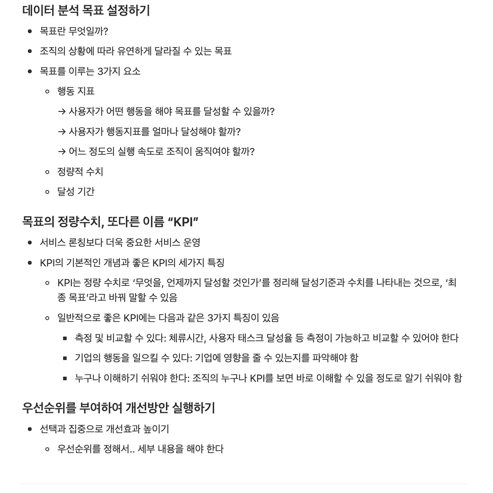
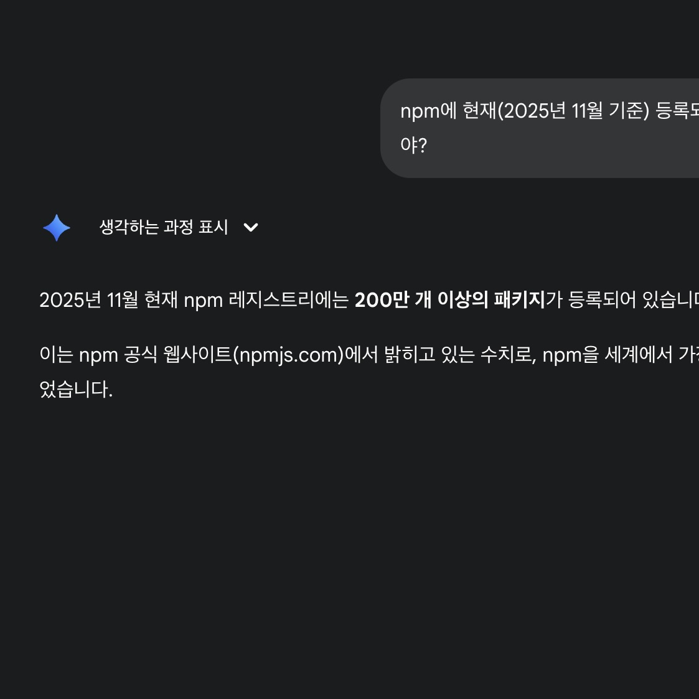
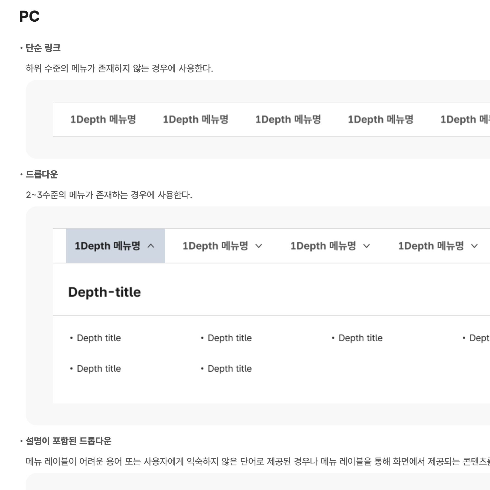
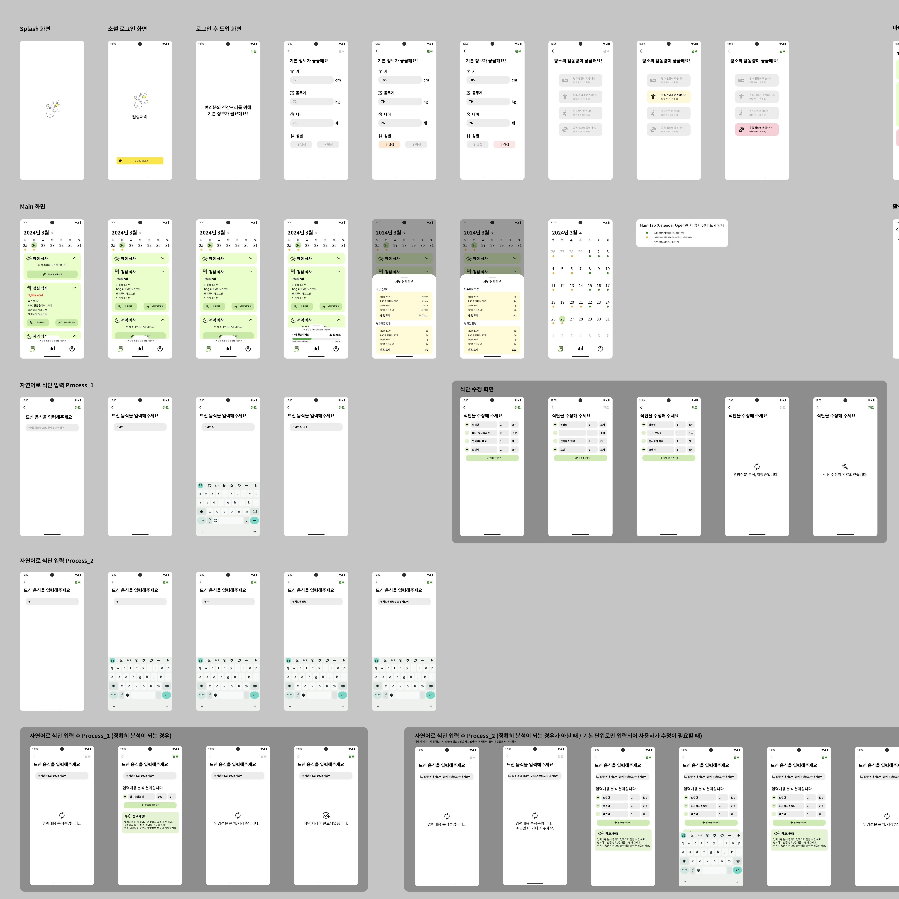
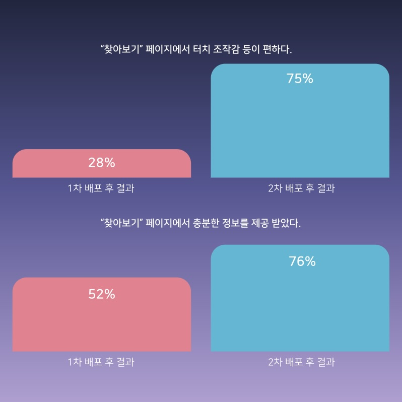
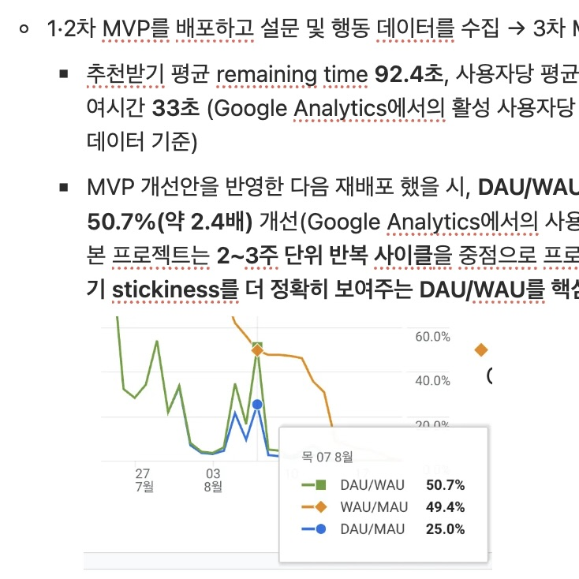
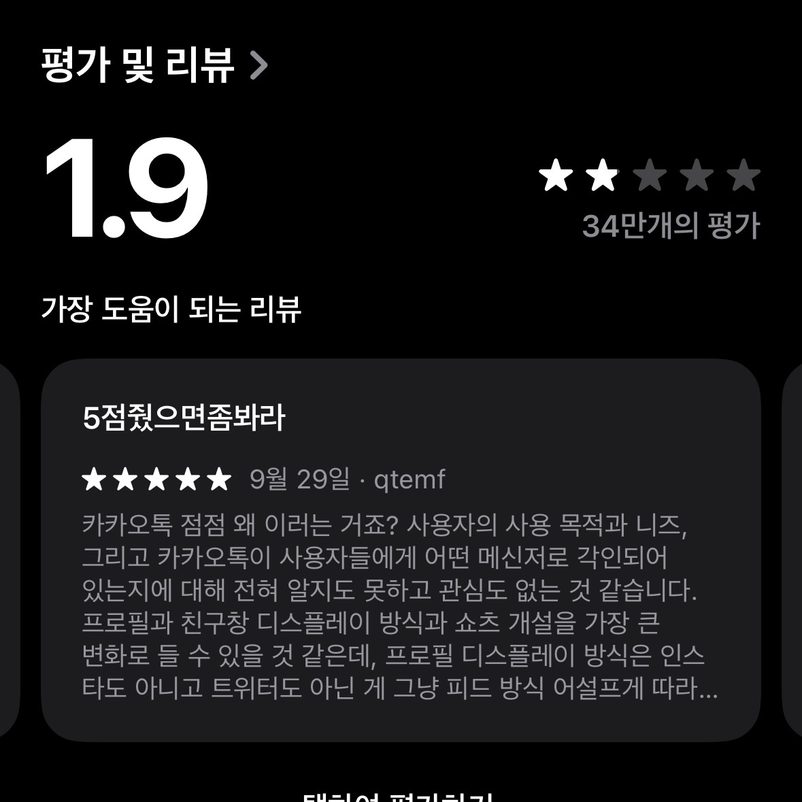
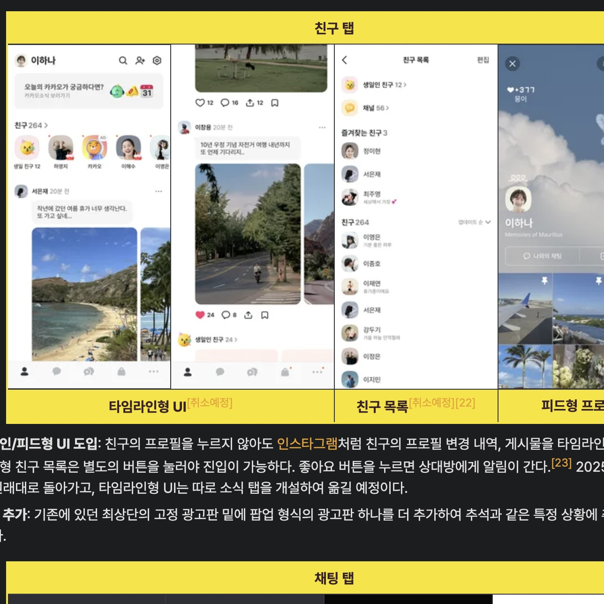

---
# [해당 부분은 인트로(글 제목, 카테고리, 썸네일 이미지 등) 관련 정보]
title: '“기술은 결국 사람을 향해야 한다” - 쓰기 좋은 걸 만들어야지'
categories: [기획]
tags: [웹, UI/UX]
image:
  path: "../assets/img/posting-images/20251109/20251109-thumbnail.jpg"
  alt: "사람들은 쓰기 불편하면 가혹하게 쳐낸다"
  width: 1200 # 이미지의 너비 조정
  height: 1200 # 이미지의 높이 조정
  # dark: "/assets/img/dark-cover.jpg"  # 다크 모드에서 다른 이미지 사용
---

난 지난 1~2년 동안, 전공 수업 내외로 다양한 프로젝트를 경험하며 정말 다양한 기술들을 접했다. 프론트엔드에 입문하며 대표적인 크로스플랫폼 프레임워크인 React Native, 웹 프론트엔드 환경에서 CSS 사용에 대해 개발자로 하여금 부담을 줄여주면서 className 기반으로 빠르게 프로토타이핑 할 수 있는 Tailwind CSS, AI 모델에 특정 프롬프트와 함께 request를 요청해, 그에 대한 응답을 받을 수 있는 다양한 AI 모델에 대한 API도 사용해 봤던 경험이 있다.

세상에는 정말 천재같은 개발자들이 많다. 그들은 더 나은 개발자 환경(Developer eXperience)를 위해서 꾸준히 라이브러리를 만들어 npm에 배포하는 등 세상에 정말 많은 기여를 하고 있다. 오죽하면, 프론트엔드 개발 시장에서 **‘하루 단위로 변하는 프론트엔드’**라는 이야기도 있겠는가.

백엔드에 대해서는 정확하게 모르겠지만, 프론트엔드 개발을 해보며 정말 많은 라이브러리가 시중에 있다는 것을 깨달을 수 있었다. 그리고, 프로젝트 초기 세팅을 할 때마다, 혼자 또는 팀원들과 이 라이브러리를 사용해야 하는지 여부를 매번 고민한다. 포트폴리오를 쌓고 있는 취준생이 많았던 환경이었으니, 자신이 쓰고 싶은 기술을 많이 들고 오는 편이다. 그런데 가끔 보면, 해당 서비스를 구현하는 데에 **‘굳이 필요한가?’**라는 생각이 드는 기술을 써보자고 하는 경우가 많다고 생각했다.

  <figure>
    
    <figcaption>UX디자인 수업 때 교수님이 매번 강조하셨던 게 있다. 일단 '사용자들이 쓰기 편해야 한다'라고 했던 것 같은데 말이다. 요즘 다양한 플젝 하면서 뼈저리게 느끼는 부분이다.</figcaption>
  </figure>
  <figure>
    
    <figcaption>npm 라이브러리가 200만개가 넘어간다더라. 진짜 기술 홍수의 시대구나..</figcaption>
  </figure>

패션이 유행을 타는 것처럼, “요즘 이 기술 많이 사용한다니까, 한 번 도입해 보는 건 어때?” 라고 이야기하는 친구들을 많이 경험했다. 특히, 생성형 AI를 생산성을 높이는 도구로서 많이 사용하는 요즘, 이러한 경향이 더 심해진 것 같다. 나는 이러한 것이 잘못 되었다고 생각하진 않지만, 결국 내가 하고 있는 이 프로젝트가 누군가에게 **‘사용될 수 있는 제품’**이 될 수 있다면, 이에 대해서는 도입 전에 곰곰이 생각해 볼 필요성이 있다.

이는 기술 도입 뿐만이 아니다. 서비스의 전체적인 UI 디자인, 추가 기능 개발 등 프로젝트의 모든 부분에서, **‘이것을 쓰는 사람이 편한가?’**에 대한 질문을 던지고 시작해야 한다고 생각한다.

 
 

## **UI/UX 가이드라인 - 괜히 쓰는 게 다 비슷비슷한 게 아니다**

프론트엔드 개발자로서 프로젝트의 프로토타입을 제작하기 전, 디자인을 맡은 경우가 종종 있었다. 처음 프론트엔드 개발에 입문했던 졸업작품부터 얼마 전에 다녔던 부트캠프 까지 말이다. 아무래도 전문 디자이너가 아니다 보니, 시각적으로 화려한 모션 그래픽을 설계 한다던가 하는 ‘디자인’ 적인 측면에서는 강점을 발휘할 수 없었다.

그렇지만 생각보다 프론트엔드 개발자로서도 ‘사용자들이 사용하기 편한 프로덕트’를 만들 수 있는 방법은 있었다. 바로 구글이나 애플 같은 빅테크 기업들이 만들어 놓은 **UI/UX 디자인 가이드라인**을 보고 UI/UX 디자인을 진행해 보는 것이다. 생각보다 많은 기관에서 해당 디자인 가이드라인을 제공하고 있다. 아래는 내가 그동안 프로젝트를 진행하며 유용하게 참고했거나, 참고했으면 좋을 법한 몇 가지 문서들의 링크다.

- [디지털 정부서비스 UI/UX 가이드라인](https://v04.krds.go.kr/guide/index.html) - “대한민국 공식 전자정부 누리집”에 공통으로 적용되는 UI/UX 디자인에 대한 가이드라인을 정리해 놓은 공식 문서
- [애플 Human Interface Gudielines](https://developer.apple.com/design/human-interface-guidelines/) - Apple 생태계에서 동작하는 앱·웹 등의 애플리케이션을 제작하는 데의 UI/UX 디자인에 대한 가이드라인을 정리해 놓은 공식 문서
- [구글 Material Design](https://m3.material.io/) - 구글 생태계에서 동작하는 앱·웹 등의 애플리케이션을 제작하는 데의 UI/UX 디자인에 대한 Material Design에 대한 소개 및 가이드라인을 정리해 놓은 공식 문서
*(이외에도 네이버페이 등 각 기업의 서비스를 연동해야 할 때의 가이드라인 또한 많이 있다)*

정말 이정도까지 자세하게 설명해 놨다고? 라고 놀랄 정도로 자세히 적어놨다. 각 운영체제에 어울리는 아이콘 모양을 어떻게 구성해야 하는지부터 시작해서, 기본적으로 제공되는 Figma용 컴포넌트 디자인 프리셋들도 사용해볼 수 있다.

  <figure>
    
    <figcaption>일반 기업들 뿐만 아니라, 이렇게 정부 누리집을 운영하는 데에 있어서도 UI/UX 가이드라인이 존재한다.</figcaption>
  </figure>
  <figure>
    
    <figcaption>Google 머티리얼 디자인, 애플 가이드라인 덕분에 위와 같이 꽤 그럴싸한 UI/UX 디자인을 나 혼자서 피그마로 완성해볼 수 있었다.</figcaption>
  </figure>

물론, 전문 디자이너가 있는 규모가 있는 기업들이라면 전문 디자이너들을 통해 독특한 아이콘, After Effect와 Lottie를 활용한 모션 그래픽 자체 제작 등을 통해 정말 화려한 디자인을 만들어 볼수도 있을 것이다. 하지만, 그렇지 않은 프로젝트라면, 이러한 프리셋 아이콘 또는 컴포넌트들만을 가지고 충분히 디자인을 진행해볼 수 있다. 내가 제작했던 졸업작품도 Google Material Design과 Apple 가이드라인을 참고해 아이콘과 전체적인 컴포넌트들을 디자인 했다. 그리고, 실제 베타 테스트를 해본 유저들에게 UI가 깔끔하다는 평을 많이 받을 수 있었다.

그리고, 전문 디자이너 조차도 아이콘, 모션 그래픽 등은 따로 제작하더라도 메뉴 버튼의 위치, 오류를 알려주는 modal 창의 팝업 방식 등의 여러 앱들의 동작 방식에 대해서는 각 운영체제에 최적화된 UI/UX 디자인을 위해 가이드라인을 반드시 참고한다. 왜냐면, 좋은 UI/UX는 사용자들이 해당 서비스를 사용하는 데에 있어 최대한 추가적인 학습 없이 무의식적으로도 기대하는 대로 익숙한 사용자 흐름(User flow)이 진행 되어야 하기 때문이다.

> **사용자 흐름(User Flow):** 사용자가 제품에 진입한 시점을 시작으로 취할 수 있는 모든 행동을 뜻함

쉽게 예를 들어보자. 사용자들은 ‘종’ 모양의 아이콘을 누르면 ‘알림’에 관한 정보가 나온다고 무의식적으로 생각한다. 그런데, 그 종 모양을 눌렀을 때 갑자기 마이 페이지가 나온다고 생각을 해보자. 사용자는 그 ‘종’ 모양 버튼을 눌렀을 때 여기서는 ‘마이페이지’가 나오고, 다른 버튼을 눌러야 ‘알림’으로 갈 수 있구나 하는 추가적인 학습이 필요하면서 불편함을 느낄 것이다.

이러한 가이드라인에 맞추어 UI/UX 디자인이 진행되기 때문에, 무의식적으로 우리는 “디자인은 다 다른데, 쓰는 건 다 비슷비슷하네” 라는 생각을 가지게 되는 것이다.

 
 

## **기획 관점 - 사용자들이 “진짜로” 필요로 하는 게 뭔데?**

내가 부트캠프에서 최종융합프로젝트를 하면서 초반에 가장 많이 고민 되었던 부분이 있다. 바로, ‘최대한 많은 기능을 추가해야 한다’라고 생각하는 측과, ‘꼭 필요한 기능만 완벽하게 돌아 가도록 한 다음에 생각해도 된다’ 측으로 나뉘었기 때문이다.

부트캠프에서 진행했던 프로젝트이므로, 사용성이 아닌 기술을 뽐내는 프로젝트로 만들고 싶은 일부의 니즈는 이해 되었으나, 이에 대해서 나는 ‘사람들이 굳이 필요로 하지 않는 것까지 해야 되려나?’라는 의문이 많이 들었다. 결과적으로 해당 상황에서 팀원들과 여러 번 의견 조율을 함으로서 ‘필수 기능부터 구현하고 사용자들의 반응을 보자’로 결론이 났지만, 이에 대해서 걱정하는 팀원들이 많았다.

그런데, 이러한 선택은 내게 ‘사용자들이 궁극적으로 필요한 것을 제공해 줘야 한다’라는 생각을 가지게 해준 큰 계기가 되었다. 왜냐면, 우리가 선택한 방향으로 프로젝트를 제작하고 MVP를 배포한 다음, Google 설문과 애널리틱스 통계를 보았을 때, 해당 서비스가 지향하는 핵심 목표를 달성만 한다면 사용자들이 해당 서비스를 많이 사용한다는 것을 확인할 수 있었기 때문이다.

물론 정확한 정보는 아닐 수 있다. 겨우 6주 하는 프로젝트에, 에타나 오픈 카톡방 등 다양한 무작위의 커뮤니티에 링크를 돌려 사용하게 한 다음 정보를 수집한 것이지만, 유의미한 수치를 얻을 수 있었다. 회원들의 ‘재접속률’이 높은 것을 확인할 수 있었기 때문이다.

  <figure>
    
    <figcaption>실질적으로 서비스의 핵심 기능들에 대해서 집중적으로 개선을 하니, 서비스 전체의 만족도가 올라갔다.</figcaption>
  </figure>
  <figure>
    
    <figcaption>짧은 기간이었지만, MVP를 지속적으로 배포해서 개선하고 다시 배포했을 때, 사용자들의 재방문률이 올라간 것을 확인할 수 있었다.</figcaption>
  </figure>

해당 프로젝트를 진행하면서, 지속적으로 Google 설문에 넣어 놓았던 질문이 하나 있다. ‘추가적인 기능이 필요하다고 생각 하시나요?’라는 질문이었다. 기능이 많은 게 과연 사용자들에게 어떻게 다가갈까? 라는 궁금증에 팀 전체의 합의 하에 넣어 놓았던 질문이다. 놀랍게도 ‘필요없다’ 라는 답변이 80% 이상이었다. 사용자들은 결국, 해당 서비스의 핵심 기능만을 거의 사용하고, 나머지는 불필요하다고 생각하는 것이다.

우리 팀이 제작했던 이 프로젝트의 궁극적인 기획 의도는 ‘60초 안에 내가 진짜 보고 싶은 OTT 콘텐츠를 추천해 주는 스와이프 기반 개인화 콘텐츠 추천 서비스’ 였다. 그리고, 이 기획 의도에 맞게 프로젝트를 진행했고, 그 의도에 맞게 사용자들은 사용했으며, 좋은 반응을 얻을 수 있던 것이다.

 
 

## **기술 관점 - 사용자들을 “진짜로” 편하게 만들 수 있는 거라면 좋지요**

- 요즘 서버로부터 오는 정보 캐싱 하면 좋다던데, TanStack Query 사용해야 하지 않겠어?
- React보다 Next.js가 사용하기 훨신 편하다던데, Next.js 쓰는 거 어떰?
- 요즘 모노 레포 유행이라던데, 모노 레포로 한 번 프로젝트 구성해볼까?

난 위 질문들이 ‘공학자’로서 하면 안되는 질문들이라 생각한다.

내가 프로젝트들을 하며 느꼈다. 항상 기술을 도입할 때, “이것을 왜 도입해야 하는가?”에 대해서 한 번 더 생각해보고, 그 근거가 타당할 때만 도입해야 한다는 것을 말이다.

오버 엔지니어링이라는 것이 컴퓨터 공학을 포함한 모든 엔지니어링 분야에서 자유로울 수 없다고 생각한다. 실제 필요한 것보다 복잡한 시스템 구조나 설계 방식을 사용하면 오히려 프로젝트의 유지 보수성, 사용성 저하 등의 문제를 불러올 수 있다고 생각하는 사람으로서 여기에서 우리 같은 컴퓨터 공학자들은 기술 선택을 할 때 중심을 확실히 잡고 가야 한다고 생각한다.

> ***이걸 도입하면 사용자들이 편해질까?***

이 질문에 대한 답에 “맞아요”라는 답변이 나왔을 때, 난 적극적으로 도입해야 한다고 생각한다. 물론 저 질문에 대해서 다양한 세부 근거들이 붙을 것이다. 서버로부터 오는 응답을 캐싱하면, “응답을 받는 데 70%가 향상된다” 등의 세부 근거들 말이다. 그런데, 난 이러한 질문들에 대해, 특히 프론트엔드 개발자라면 아래와 같은 질문으로 치환해서 단순하게 생각해 보는 건 어떨까.

> ***그래서 궁극적으로, 사용자들이 쓰는 데 만족도가 높아지는가?***

예를 들어보자. TanStack Query를 사용 한다면 queryKey와 일치하는 캐시 데이터가 있으면 서버에 요청을 안하고 캐시된 데이터를 사용할 수 있다. 이를 조금 더 단순히 생각해보면, “TanStack Query를 사용함으로서, 서버에 요청 안 날려도 되니, 사용자들이 불필요하게 안 기다리고 빠르게 데이터를 볼 수 있다”로 생각해볼 수 있다. 난 프론트엔드 개발자라면 항상 이렇게 ‘사용자’ 입장에서 편해지면 기술 도입을 하고, 아니라면 과감히 서비스에 도입을 반려해야 한다.

기술 유행이 정말 빠르게 바뀌는 지금 이 시점에서, 난 위와 같은 물음을 지속적으로 해보며 기술 도입에 신중해야 하는 것이 프론트엔드 개발자로서 정말 중요한 자세하고 생각한다.

 
 

## **사용자들은 제품이 쓰기 불편하면 안쓰려 한다**

우리가 사이트를 만들고, 앱을 만들고 이러는 건 결국 ‘사용자들이 사용하는 제품’을 만드는 것이다. 사용자는 제품이 쓰기 편하면 유용하게 사용할 것이고, 사용하기 불편하다면 사용을 꺼려할 것이다. 우리는 ‘사용하기 편한 제품’을 만든다고 생각하고 프로젝트에 임해야 할 것이다.

이러한 대표적인 실패 사례를 얼마 전에 봤다. 바로 뉴스에서도 떠들썩 했던 ‘카카오톡 사태’이다. 불필요한 친구 목록 UI 변경과 과도한 광고 노출로 인해 기존 사용자들의 질타를 받고 있다. 구글 플레이 스토어와 애플 앱스토어에서 평점 1.0을 기록 했던데, 정말 대단한 기록이다. (다시 확인해보니 1.9로 올랐더라)

그리고 얼마 전, 카카오 측 인터뷰에서 ‘사용자들의 체류 시간이 늘어서 해당 UI 개편은 성공적이었다’라고 평가한 기사를 봤는데, 이는 유저 사용 데이터를 잘못 해석한 것이라 판단된다. 사용자 풀 자체가 줄었는데, 체류 시간이 늘은 것이 의미가 있냐는 생각이 개인적으로 든다. 사실 **락인(Lock-in) 효과** 때문에 마땅한 대체제가 없어, 배짱 장사 하는 것 같기도 해서 괘씸한 면도 있다.

  <figure>
    
    <figcaption>평점 언제 이렇게 올라갔냐. 아, 이제 5점 줘서 시위하는 거구나.</figcaption>
  </figure>
  <figure>
    
    <figcaption>근데 진짜 다시 생각해봐도, '메신저'라는 핵심 기능에서 이건 너무 벗어난 거 아니냐</figcaption>
  </figure>

아무리 개발자가 많은 기술을 사용할 수 있고, 정말 코딩 능력이 뛰어나서 최적화를 기가 막히게 하더라도, 그러한 개발자들이 만든 ‘제품’이 사용하기 불편하다면 사용자들은 그 제품을 꺼려할 것이다. 그리고, 그러한 제품은 성공할 수 없을 것이다. 
시중에 나와있는 다양한 가이드라인, 사용자 설문과 애널리틱스 등을 활용한 수치화된 사용자 이용 데이터를 정확히 분석하여 어떤 것이 궁극적으로 필요한 것인지부터 우선순위를 잡고 프로젝트를 해보면, 사용자들이 만족할 만한 서비스를 만드는 데 한걸음 더 가까워 지지 않을까? 그리고, 그것이 결과적으로 프로젝트 전체에 드는 비용을 절약해 주는 현명한 선택이지 않을까?