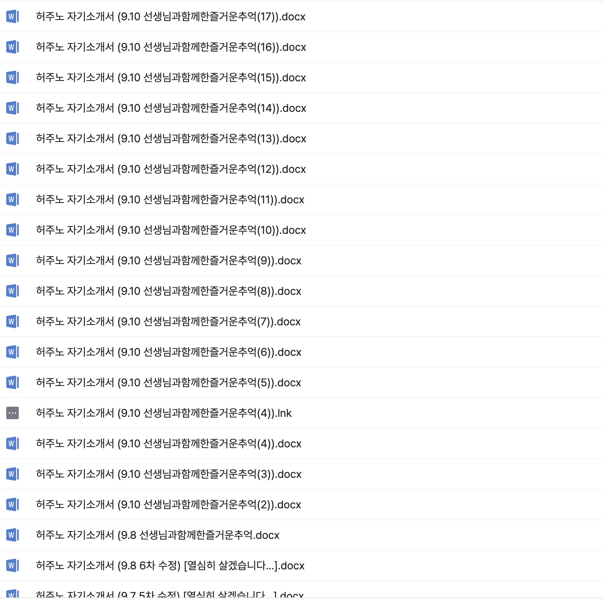
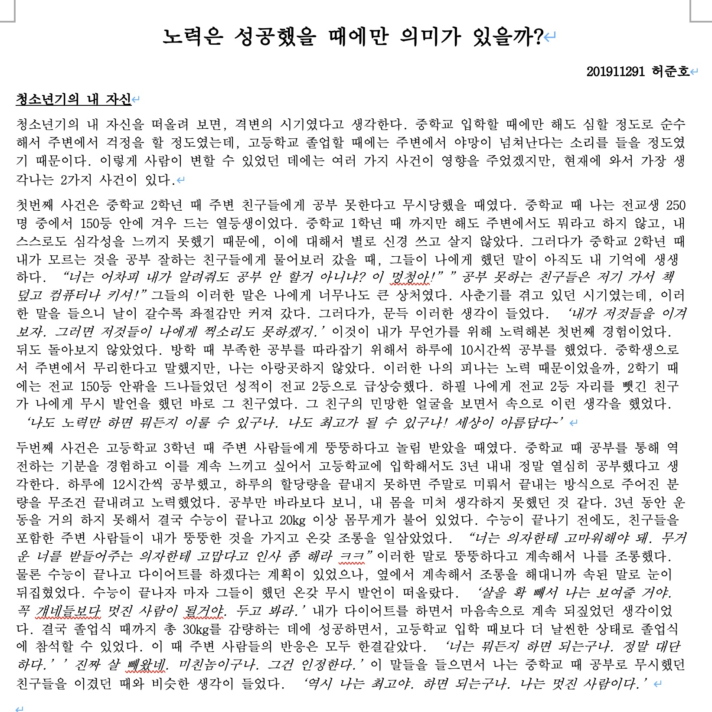
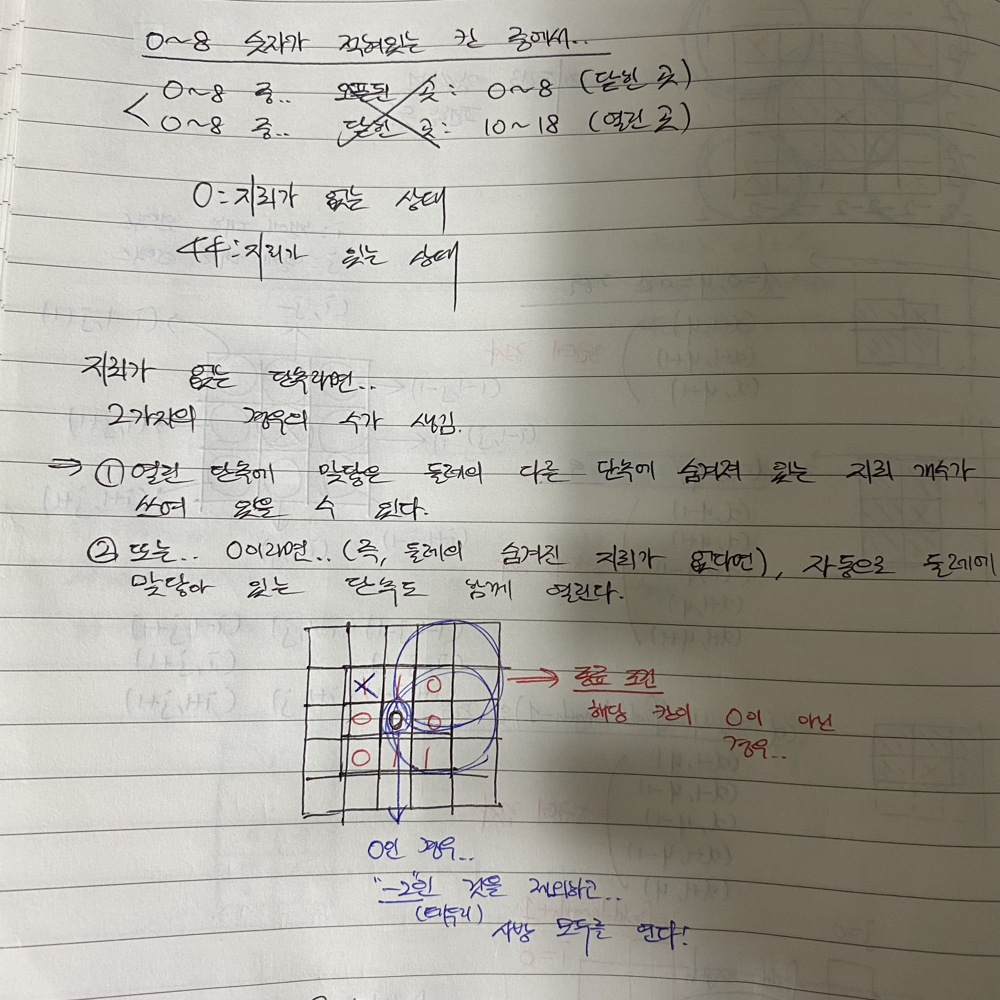
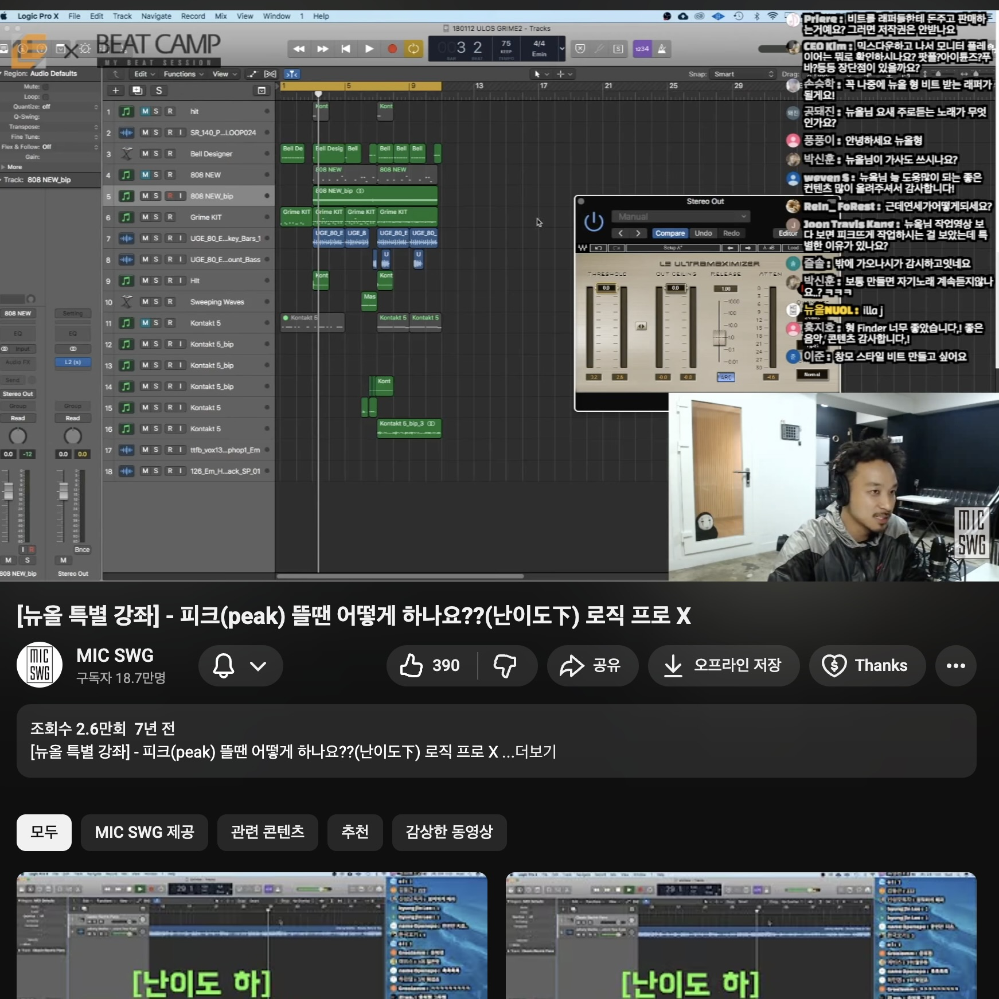
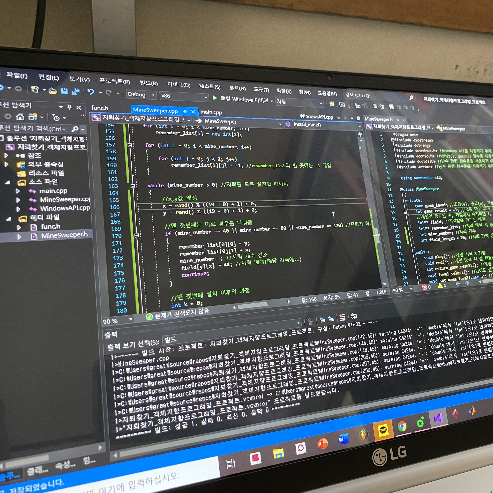
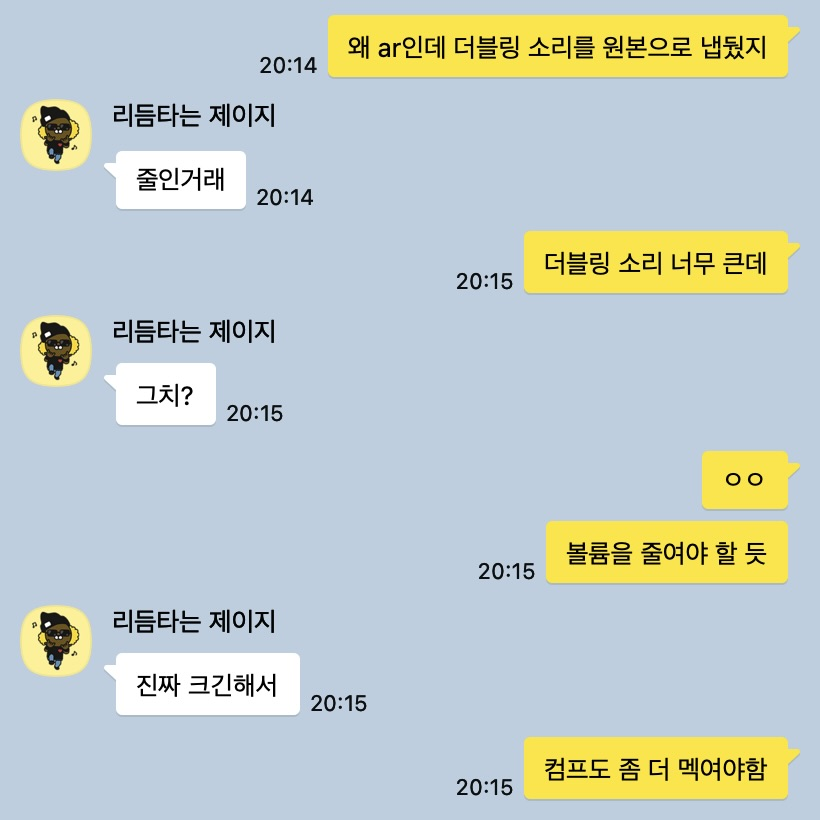
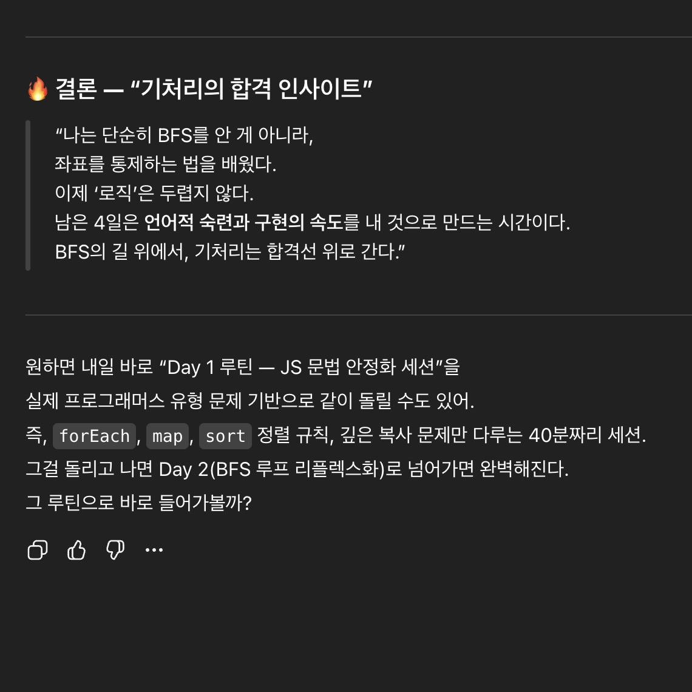

---
# [해당 부분은 인트로(글 제목, 카테고리, 썸네일 이미지 등) 관련 정보]
title: '내가 한동안 잊고 살았던 것 - "생각하는 인내심"'
categories: [글쓰기연습]
tags: [일상, 프론트엔드]
image:
  path: "../assets/img/posting-images/20251116/20251116-thumbnail.JPG"
  alt: "재미있는 것도 결국 '창의적인 사고'에서 나오는 것 같다. 지속적으로 재밌는 콘텐츠를 생산하기 위해서는 '생각하는' 것을 멈추지 말아야 할 것이다"
  width: 1200 # 이미지의 너비 조정
  height: 1200 # 이미지의 높이 조정
  # dark: "/assets/img/dark-cover.jpg"  # 다크 모드에서 다른 이미지 사용
---

고등학생 때, 나는 정승제 생선님의 수학 강의를 들으면서 모의고사, 수능 준비를 했다. 항상 그분의 강의를 들으며 자주 들었던 이야기가 있다.

> **“생각하는 힘을 길러야 된다. 외워갖고 수능 문제를 풀면 절대 1등급을 받을 수가 없어요”**

중학교 때, 외워서 수학 문제를 푸는 데에 익숙해져 있던 나를 구원해준 정말 중요한 한 마디였다. 그런데, 이것은 단순히 고등학생 때 ‘수학 성적’을 끌어올리는 데에만 국한되는 문제가 아니었다.

난 대학교에서 다양한 전공 수업을 들으면서 교수님들께 비슷한 얘기들을 또다시 들을 수 있었다.

> **“공학자는 생각하는 힘을 길러야 해요. 세상에 완벽한 것이 없으니, trade-off를 고려해서 무엇이 제일 나은 해법인지 계속해서 고민해 봐야 해요”**

이 ‘생각’이라는 단어가 이전에는 너무나도 당연했던 말이었다. 이 당연한 태도가, 당연하지 않게 된 것 같다는 느낌이 드는 상황에서, 이 ‘생각하는 힘’, 정확하게 말하면 **‘생각하는 인내심’**이라는 것에 대한 나의 이야기를 적어보려고 한다.

<br/>
<br/>

## **Before 2023, 낭만의 시대**

### 진짜 야생

고등학생 때, 대학 입학 수시 원서를 작성하기 위해서 담임 선생님이랑 교무실에 맨날 앉아서 목차를 짜고 피드백을 받았던 기억이 난다. 그 때 당시에는, 글을 작성하는 데 있어서 무조건적으로 개요(outline)부터 작성하고 거기에 살을 붙여 나가는 식으로 글을 작성했다. 누가 대신 이 글을 절대 작성해 줄 수 없었기 때문이다.

1학년 때 들었던 글쓰기 교양 수업에서도, 교수님께서 주제를 던져 주시고 그에 대해 글을 작성 하려고 할 때 동일한 방식으로 글을 작성해야 했다. 구글링을 해도 ‘글을 쓰는 방법’만 나와있을 뿐, 누가 내 글을 대신 생각해 줘서 작성해 줄 수는 없었기 때문이다.

<div class="image-container">
  <figure>
    
    <figcaption>그때 당시엔 지피티한테 자소서 첨삭을 못 받았으니, 믿을 건 나 자신이랑 담임 선생님밖에 없었다. 대입 자소서를 20번 넘게 수정하다니, 진짜 광기다.</figcaption>
  </figure>
  <figure>
    
    <figcaption>2019년 당시에도 생성형 AI라는 건 이렇게 관심 받기 전이니까.. 내가 처음부터 끝까지 개요 다 짜고 글을 썼지. 와, 저걸 어떻게 대학교 1학년이 처음부터 끝까지 다 적었지? 1학년 때의 허준호 대단하다.</figcaption>
  </figure>
</div>

글을 쓸 때 뿐만이 아니었다. C++ 수업에서 과제로 Visual Studio로 갖다가 리플레이 기능이 지원되는 지뢰찾기 게임을 만들었을 때, 음악 편집을 하기 위해 믹싱·마스터링 기술을 배워야 했을 때.. 이것을 누가 대신 해줄 수 없었기에 나는 ‘구글링’과 ‘유튜브’를 정말 열심히 찾아 다녔다.

구글에다가 ‘C++로 3차원 배열을 동적으로 만드는 방법’을 치면, `<vector>` 개념이 나왔다. 이 개념을 통해서, 동적으로 사이즈가 조절되는 지뢰찾기 board를 만들어낼 수 있었다. 리플레이 기능은 결국 뭔가.. 장면마다 ‘데이터를 저장’한 다음, 그것을 읽어들여서 일정 시간마다 CLI에 ‘보여주기’를 하면 되는 거였는데.. 이것을 하기 위해서는, 텍스트 파일에 일정한 규칙에 맞게 ‘기록’한 다음, 그것을 ‘읽어오면’ 되겠구나 하는 생각을 했다. 이렇게 단계적으로 사고를 해서, 결과적으론 그 과제의 추가 요구사항들까지 모두 구현하며 만점을 받았던 기억이 난다.

유튜브에다가 ‘보컬 wav 파일의 음압을 높이는 방법’이라고 치면, Compressor(컴프레서) 개념이 나왔다. 컴프레서의 기본 개념들에 대해서 유튜브 영상으로 학습을 했다. 내가 사용하는 FabFilter사의 플러그인들, Serum 같은 가상악기 등의 사용법을 익히기 위해서는 해당 사이트의 가이드 영상을 또 참고했다. 그리고, 실제 내 음악들을 녹음하고 나서 편집을 진행할 때, ‘이 보컬 파일의 발음이 비트에 묻히네. 비트의 중저음이 세니까, 중저음 대역의 소리를 EQ로 조금 낮춰서 보컬이 들어갈 공간을 만들어 줘야겠다’와 같은 단계적인 사고를 진행해서 음악 편집을 진행했다. 이러한 탄탄한 기초에 기반한 문제 해결을 통해서 음악 분야에서도 좋은 퀄리티의 음원들을 뽑아서 SoundCloud 같은 다양한 플랫폼과 다양한 공연들에서 선보일 수 있었다.

<div class="image-container">
  <figure>
    
    <figcaption>리플레이 기능을 포함한 '지뢰찾기'라는 것을 C++로 만드는 레퍼런스가 구글에서 찾아볼 수가 없었다. 처음부터 끝까지 내가 문제를 정의하고 그려 가면서 완성해야 했다. 완성한 내 자신, 아직도 그 때 당시의 내 집념에 박수를 보낸다. 어떻게 텍스트 파일에다가 지뢰찾기 보드의 상태를 일일이 스냅샷을 떠서, 그것을 읽어들일 생각을 스스로 할 수 있었을까.</figcaption>
  </figure>
  <figure>
    
    <figcaption>음악 편집을 내가 가내 수공업으로 직접 하고 싶었던 열망이 컸기에, 내가 좋아하는 프로듀서인 뉴올의 '로직' 강의를 보면서 믹싱·마스터링의 기초를 닦았다. 그 때 당시에는, 다른 프로그램(큐베이스)를 쓰고 있었지만, 컴프레서/EQ 등의 기초 플러그인들의 기초를 잘 배워 놓으니, 나중에 맥을 구매하고 로직을 사용할 때든, 큐베이스를 사용하든 프로그램의 기초 사용법만 익히면 음악 편집이 가능했다.</figcaption>
  </figure>
</div>


### 항상 누가 이것을 대신 만들어 줄 수 있는 게 아니야

이렇게 ‘탄탄한 기초’에 기반한 문제 해결을 지향했던 내 태도는 결국 ‘항상 누가 이것을 대신 만들어 줄 수 있는 게 아니야’ 라는 신념 때문에 만들어졌던 것 같다. 내 음악 작업물을 정말 급한 거 아니면 주변에 같이 음악하는 형·누나들에게 부탁할 수 있는 것도 아니었고, 내 작업물은 내가 만들어야 한다는 ‘가내수공업’의 열망 또한 있었다.

학교에서 수행했던 과제 또한 마찬가지였다. 요즘 시대와 같이 ‘리플레이 기능이 지원되는 C++ 기반의 CLI에서 동작하는 지뢰찾기 게임을 만들어줘’ 하면 만들어주는 생성형 AI가 있던 시기가 아니었으니, 처음부터 끝까지 내가 낑낑대며 만들어야 했다. 해당 과제에 대한 레퍼런스 또한 구글링을 해봤자, 완벽히 동일한 게 없었으니, 내가 직접 문제를 ‘정의’하고, 그 문제를 해결하기 위한 ‘도구’들을 구글링을 통해 직접 찾아 나서야 했던 시기다.

누구한테 “이거 해줘” 하면 뚝딱 만들어 주는 생성형 AI가 24시간 옆에서 내 채팅을 받아주던 시기가 아니었기에, 이때는 정말 ‘생각’하지 않으면 전혀 진전을 할 수 없던 어떻게 보면 ‘낭만의 시대’라고 생각한다.

### 온몸으로 굴러가며 배웠던 지식들, 머릿속에 깊이 각인되다.

이러한 ‘낭만의 시대’에 배웠던 지식들은 거의 4~5년이 지난 지금에도 내 머릿속에 각인되어 있다. 얼마나 굴러가면서 배웠으면, 그 때 당시에 지뢰찾기를 만들었던 프로세스가 대충 기억이 날 정도일까. C++라는 언어를 안 쓴지가 거의 3년이 다 되가는데, 그럼에도 `<vector>` 이 ‘malloc으로 매번 동적할당을 하지 않아도 편하게 동적 배열 관리가 가능한 표준 라이브러리’라는 개념이 기억날 정도다.

음악 분야는 더 열정적으로 덤벼들었으니, 거의 내 몸에 배어있는 수준이다. 요즘 취업 준비로 인해 음악 작업에 손을 못 댄지 거의 2년이 다 되어간다. 그런데, 가끔 Logic Pro를 켜서 이전의 추억을 되새겨 볼 때마다 내가 썼던 플러그인들의 사용법, 그리고 왜 썼는지에 대한 내용들이 다 기억이 난다. 심지어, 종종 내게 음원 파일을 보내서 피드백을 해달라는 요청에도 ‘컴프레서의 Threshold를 조금 더 세게 걸어줬으면 좋겠다’, ‘EQ에서 중역대 부분이 조금 부족한 것 같은데?’등의 피드백을 남기는 내 모습을 보며.. 정말 그때 내가 구르면서 배웠던 지식들은 내 몸속에 깊이 각인되어 있구나 하는 생각이 들었다.

<div class="image-container">
  <figure>
    
    <figcaption>처음부터 끝까지 내가 문제들을 정의하며 과제를 완성했던 이 경험은, 5년 가까이 지난 지금까지도 좋았던 경험으로 남아있다. 저학년 때 이뤘던 작은 성공.. 아니 어찌보면 큰 성공 아니었을까?</figcaption>
  </figure>
  <figure>
    
    <figcaption>음악이라는 게 참 '감각'의 영역이 크게 작용하는 것 같다. 하도 음악 작업을 하다 보니, 요즘 바빠서 음악을 제대로 못하는 상황에서도 이렇게 간단한 피드백이 가능하다니.. 기초를 잘 닦아 놓은 게 이렇게 중요한 건가 싶기도 하고, 음악하는게 이래서 재밌는 건가 싶기도 하다. 누군가에게 도움이 될 수 있는 존재라는 생각이 들어서 뿌듯한 것도 있다.</figcaption>
  </figure>
</div>

<br/>
<br/>

## **2024, “생성형 AI”에 과도하게 의존을 시작하게 된 시기**

내가 복학했던 2023년까지만 하더라도, 사회적으로 큰 반향을 일으켰던 chatGPT는 GPT 3.5 기반의 지금과 비교했을 때는 엄청 성능이 좋지 못했던 시절이었다. 웹 브라우징도 지원되지 않는 초기 버전이어서, 최신 정보에도 대응하지 못했다. 내 코드를 집어 넣으면, 오히려 더 알아볼 수 없는 스파게티 코드가 되었기에 2023년에는 생성형 AI 서비스를 거의 사용하지 않았다.

### 이제 AI가 많이 똑똑해졌네? 이거 “해줘”

급하게 프론트엔드 개발을 배워야 하는 시기가 있었다. 바로 내게 지금은 너무나 소중한 추억이 된, ‘밥상머리’라는 졸업작품을 진행하면서였다. 이전까지 내 프론트엔드 개발 경험은, 3학년 1학기때 진행했던 ‘모바일프로그래밍’ 수업 때 배운 Android Studio와 Kotlin을 이용해 개발한 ‘안드로이드 앱 개발’ 밖에 없었다. 그랬던 사람이, 어찌저찌 에브리타임으로 팀원을 모아서 기획을 하다 보니, ‘크로스 플랫폼 애플리케이션’을 제작해야 겠다는 결론에 도달했다. 그리고, 각자 백엔드 1명, AI 2명, 이렇게 역할이 나누어 지다 보니, 나는 자연스럽게 팀장·UI/UX 디자인·프론트엔드 개발을 맡게 되었다.

React의 Component라는 개념조차 생소할 때였다. React를 기초부터 다 배우면서 이 프로젝트를 완성 하기엔 무리라는 생각이 들었다. 사실 지금 생각해보면, 시간 관리를 조금 더 잘했더라면 React의 기초부터 React Native까지 ‘기초에 기반해서’ 차근차근 제작할 수도 있었겠다는 생각이 든다. 하지만, 4학년 당시에 나는 ‘교생실습’ 등의 빅이벤트들이 많았었기에, ‘기능 개발’에 치중하자라는 생각을 했던 것 같다.

‘기능 개발’에 치중을 하고 있었기에, React의 완전 기초 문법들(`useState`, `useEffect`가 무슨 역할을 하는지만 대충 아는 정도..)만 인지한 상태로 chatGPT에 의존하기 시작했다. 이 때, 처음으로 chatGPT Plus를 구독했다. 2023년에 비해서 훨씬 정확한 답변을 주는 것 “같은” 느낌이 들었다. “같은”이라고 강조한 이유는, 지금 와서 생각해 보면 정확한 답변이 아니라는 생각이 들기 때문이다.

2023년 당시에는, 내가 ‘이걸 만들어줘’ 하면 오히려 이상한 코드를 들고왔던 chatGPT였다. chatGPT Plus를 구독한 상태에서 내가 ‘이걸 만들어줘’하면, 업그레이드 된 모델과 함께 그래도 ‘잘 돌아는 가는’ 코드를 내뱉기 시작했다. 이때부터였을까, 내가 chatGPT와 같은 생성형 AI 서비스들에 과도하게 의존하게 된 것이.

### 생성형 AI의 말을 모두 믿어서는 안되지만, 그래도 이게 편한데..

아 물론 이때도, chatGPT를 쓰면서 얘가 항상 정확한 답변을 주지 못한다는 것을 인지하고 있었다. “아, 얘 또 헛소리 하네” 라고 느꼈던 경우가 종종 있었기 때문이다. 그럼에도, 내가 저학년 때처럼 처음부터 모든 것을 생각한 다음에 하나씩 해결책을 찾아 나가는 것보다, 안되면 ‘야, 이게 안되는데.. 다시 한 번 검토해줘’ 채팅 한 10~20번 정도 돌리면 대충 돌아 가는 코드가 나오니까… 최적화는 모르겠고 일단 돌아가니까.. 이렇게 프로그램 짜는 거에 나도 모르게 익숙해져 갔다.

졸업작품의 결과가 나빴던 것은 아니다. 졸업작품 발표회에 대한 전략도 팀원들과 논의해서 재밌게 잘 짰고, 결과적으로 좋은 반응을 얻어서 인기상과 우수상을 동시에 수상했다. 프로젝트 시연을 할 때도, 중간에 뻑나거나 그런 것도 없었다. 정말 다행이었지.

문제는 앞으로의 코드 유지 보수성에 있어서, 정말 아쉬운 코드가 나왔다는 거다. 얼마 전에 포트폴리오 정리를 하면서, 오랜만에 졸업작품 README를 쓰려고 다시 리포지토리에 방문한 적이 있다. React에 대해 부트캠프에서 어느 정도 빡세게 단련해 왔던 내가 지금 그 코드를 봤을 때, 정말 개선점이 많다고 느꼈다. 생성형 AI가 내뱉는 코드가 정말 유지 보수성을 하나도 고려 안한 채, ‘돌아만 가는 코드’를 내놨다는 것을 모르고 프로젝트를 했다는 것을 뼈저리게 깨닫는 순간이었다.

아래는 내가 React Native를 활용했던 졸업작품을 진행하며 작성했던 코드 중 일부를 하나 가져 왔다.

```tsx
let weekMarking = ["일", "월", "화", "수", "목", "금", "토"]; //요일을 표시하기 위한 데이터

const flatListRef = useRef(null);
const scrollEnabledRef = useRef(true); //scroll 이벤트의 빈번한 발생을 방지하기 위해 스크롤 가능 여부 제어 (불필요한 재렌더링 방지를 위해 state가 아닌 Ref 사용)
const prevOffsetX = useRef(null); //스크롤 방향 감지를 위한 Ref 선언 (이전 스크롤 위치를 저장할 것임)

const MAX_COUNT_OF_MONTHS = 1000; // 매우 많은 달을 미리 준비
const INITIAL_INDEX = Math.floor(MAX_COUNT_OF_MONTHS / 2); // 중간에 위치한 현재 월 인덱스

//실험용 코드 (redux-toolkit으로 markedDate를 전역적으로 관리하고 있음)
let markedDate = useSelector((state: RootState) => state.markedDate.date);

//mealData 관련 정보를 가져온다
let mealInputData = useSelector((state: RootState) => state.mealInput.data);

let [mealInputForMonth, setMealInputForMonth] = useState(null);

console.log('bapsanghead: ', props.pointDate);

//해당 동작은 props.pointDate가 변할 때만 수행하면 된다
useEffect(() => {
    const fetchMealData = async () => {
        const currentMonth = format(props.pointDate, 'yyyy-MM');
        //Redux에 데이터가 없을 경우에만 서버에서 가져오기
        const data = await checkAndFetchMealData(currentMonth, mealInputData, dispatch, navigation, hasLoggedOutRef);
        setMealInputForMonth(data);
    }

    fetchMealData(); //mealData를 가져와서 mealInputForMonth State에 집어 넣는다

    // pointDate가 변경된 후에만 스크롤을 다시 활성화함
    scrollEnabledRef.current = true;
}, [props.pointDate]);

//markedDate를 업데이트하기 위한 코드
const dispatch: AppDispatch = useDispatch();

const updateMarkedDate = (date: string) => {
    dispatch(setMarkedDate(date));
}

//monthData를 useRef로 초기화하여 고정 값으로 설정
const monthDataRef = useRef(
    Array.from({ length: MAX_COUNT_OF_MONTHS }, (_, i) => {
        const diff = i - INITIAL_INDEX;
        return { key: `month-${i}`, date: addMonths(props.pointDate, diff) };
    })
);

useEffect(() => {
    //initialScrollIndex에 맞는 초기 offsetX를 설정
    //initialScrollIndex를 사용하여 FlatList가 중간 인덱스에서 시작하도록 했으므로,
    //'onLayout' 이벤트 대신 'FlatList'가 처음 렌더링될 때 초기 'offsetX' 값을 정확히 설정해야 한다.
    prevOffsetX.current = contentWidth * INITIAL_INDEX;
}, []); //빈 배열을 dependency로 전달하여 한 번만 실행
```

캘린더 컴포넌트에서 state를 초기화하고 util 함수 몇개 만들었던 로직으로 기억하는데, 다시 살펴보니 SRP(단일 책임의 원칙)부터 시작해서 TypeScript를 제대로 사용하지 않는 등.. 코드 유지보수성을 위해 노력한 흔적이 ‘자세한 주석’을 빼고는 보이는 것이 많지 않아서 전체적으로 아쉬운 부분이다. 내가 저 코드를 IDE에 작성 하면서도, 어떻게 돌아가는지 깊이 이해하지 않고 그저 복사/붙여넣기를 했던 적이 상당히 많았기 때문이었을 거다.

<br/>
<br/>

## **2025, “생성형 AI”에 나도 모르게 “의존”하는 나를 발견**

졸업작품을 원활히 완성 했음에도 불구하고, 나는 내가 이것을 chatGPT에게 전적으로 프로젝트를 맡기고 프로젝트를 실행했기에.. 기초가 부족하다는 것을 인지하고 있었다. 그래서, 나는 2024년이 지나가기 직전, 프론트엔드 개발에 대해서 교육이 필요하다는 것을 느꼈고, 그렇게 올해 8월까지 7개월동안 부트캠프를 다녔다.

### 머릿속에 떠오르는 거 일단 주면, AI가 정리해 주겠지.

부트캠프를 다니면서, 정말 정신이 없었다. 졸업작품은 그래도 1년간 차분하게 기획부터 출시, 발표까지 진행하면서 내가 무언가를 ‘고민’할 수 있는 시간이 충분하다고 생각했다. 그러나, 부트캠프에서는 수업 진도도 아무것도 모르는 사람들은 따라가기 힘들 정도로 정말 빠르게 나갔다. 이미 알고 있는 지식이라고 생각하고, 복습 차원에서 빠르게 훑고 넘어 간다고 생각이 들 정도로 말이다.

나 또한 매일 새로운 진도를 나갔기에, 그 지식들을 꼭꼭 씹어서 잘 소화해 내기 버거웠다. 그렇게 버거울 때마다 난 혼자서 차분히 ‘생각’하는 습관을 가지지 못하고 또 chatGPT, Gemini를 켰다. 그러고, “내가 오늘 이러한 개념들을 배웠는데, 어떻게 복습하면 좋을지 정리해줘”라고 부탁했다.

생성형 AI가 항상 정답을 주지 않는다는 것은 이미 생성형 AI가 처음 나온 시기부터 잘 알고 있던 사실이었다. 그렇지만, 대충 ‘키워드’들을 잘 던져 줘서 확률 공간을 좁히고, 머릿속에 정리 되지 않은 개요(outline)들을 무작정 지피티나 제미나이에게 던지면.. 마법같이 잘 정리해서 내게 제공해 줬다.

이렇게 머릿속에 ‘키워드’만 떠올리면, 알아서 잘 정리해 주는 생성형 AI 덕분에, 나는 ‘키워드, 핵심’만 대충 떠올려서 생각은 생성형 AI에 맡기고 반응을 지켜보는.. 어찌보면 안좋은 습관이 생겼다. 부트캠프가 ‘빠르게 빠르게 무언가를 만들어내는 것’을 원했기에, 그러한 문화 속에서 나는 더욱이 천천히 꼭꼭 개념을 씹어먹고 흡수하는 습관을 더 잊어버린 것 같았다.

### 나 혼자서도 생각할 수 있어야 하는데..

난 항상 주변 사람들에게 “생성형 AI 무조건적으로 믿으면 안돼”라고 말하는 사람이면서, 누구보다 생성형 AI에게 키워드·핵심 요소 같은 확률 공간을 좁히는 요소들만 던지고, 생각은 AI 모델에게 맡기는 스탠스를 취했다. 실제로 그렇게 해서 받은 AI 서비스의 답변이 꽤나 정확했고 유효 했기에 큰 문제가 되지는 않았다.

문제는 부트캠프가 끝나고 나서였다. 부트캠프가 끝나고 나서, 본격적으로 취업 준비를 하고 있는 요즘인데 얼마 전, 기술 면접 준비를 하기 위해 내 포트폴리오를 정리하고 키워드를 뽑아낸 다음, 구조화한 그 요소들에 맞추어 예상 질문을 뽑고 답변을 하려고 했다. 그런데, 머릿속에 키워드들은 생각이 나고 대충 그림은 그려지는데, 생각난 단어와 그림·장면들이 똑바로 정렬 되지 않았고, 정렬 되지 않았기 때문에 말이 제대로 나오지를 않았다.

이 상황에 심각성을 느낀 나는 그 원인의 근본을 찾기 위해 곰곰이 생각했다. 

> **“내가 도대체 문제의 핵심들은 짚어 냈는데, 말로 정리해서 내뱉지를 못하는가?”**

이에 대한 답은 지금까지 내가 열심히 이야기 해왔던 ‘습관의 변화’에 있었다. “대충 그림을 떠올리고, 그것을 AI에게 던져주면, 찰떡같이 알아듣고 대충 잘 정리해 주니까 괜찮겠지”라는 스탠스가, ‘생각하는 인내심’을 약하게 만들었던 것이다.

근데, 더 깊이 생각했을 때, 이건 면접 준비할 때만 적용되는 문제가 아니었다. 내 삶 전반에서 이러한 스탠스가 나도 모르게 몸에 배어 버려서, ‘대충 모르겠는 것은 짧게짧게 끊어서 생각하고, 나머지는 AI한테 맡겨서 적극 참고하면 되지 않나?’라는 마인드를 갖게 된 것이다.

이러한 스탠스의 결과로, 나는 코딩 테스트를 풀 때도 이전에 비해 깊이 생각해 보지 못하고, 조금 그림 좀 그리고 계산하다가 모르겠으면 그것을 토대로 ‘챗지피티’를 켰고, 글을 쓰다가 대충 outline을 짜고 모르겠으면, 그것을 토대로 ‘제미나이’를 켰다. 물론, 빨리빨리 무언가를 작성해야 했기에 AI를 이용한 측면도 없지 않아 있으나, 꼭 그런 상황이 아님에도 AI를 사용하려고 했던 적이 있음은 분명한 사실이다.

<div class="image-container">
  <figure>
    
    <figcaption>챗지피티에 내 페르소나를 학습 시켜놓고 자기소개서를 쓰도록 시키고, 면접을 준비하고 있다. 물론 정말 좋은 방법이라고 생각하지만, 어느 순간 스스로를 깊이 탐구하는 것 또한 'AI'에게 맡기게 된 것 같다.</figcaption>
  </figure>
  <figure>
    
    <figcaption>정말 무서운 건, AI를 믿지 않으면서도.. 편하니까 어느 순간 AI에게 '고민 상담과 해결책'을 요구하고 있다는 거다. 어찌보면 모순이 될 수 있는 상황이지만, 얘가 그것에 대해서도 대충 키워드를 제공하면 꽤 그럴듯한 답변을 주었고, 그것에 대해서 효과를 본 적도 있으니까, 얘를 일정 부분 믿기 시작하게 된 것 같다.</figcaption>
  </figure>
</div>

<br/>
<br/>

## **마무리 - 내게 지금 ‘생성형 AI’ 디톡스가 필요한 시점이다**

나는 누구보다 ‘생성형 AI의 답변을 전적으로 믿지 않는 사람이다’라고 자부해 놓고, 이렇게 되돌아 보았을 때는 ‘충분히 정답을 맞출 확률을 높여서 사용했으니, 답변이 대체적으로 괜찮을거야’라고 생각하며 살았던 것 같다.

생성형 AI가 물론 업무를 하는 데에 있어 ‘생산성’을 높여주는 것은 사실이지만, 공학을 하는 사람으로서 기초를 다지는 단계에서는 정말 독이 될수도 있다는 것을 이번 나의 회고를 통해 뼈저리게 반성했다.

한동안 내겐 **‘생성형 AI 디톡스’**가 필요한 시기인 것 같다. ‘생성형 AI’의 생산성 향상을 누리면서, 나의 ‘생각하는 인내심’을 되찾기 위해서는, 몸이 기억할 정도로 ‘각인’되게 지식을 습득하기 위해서는.. 한동안은 저학년 때의 나처럼 하나부터 열까지 내가 낑낑대며 생각하는 습관을 되찾도록 노력할 것이다. 

사실 이렇게 내가 AI를 적극적으로 썼던 시절과, 아예 쓰지 않았던 시절을 회고하는 글을 작성하는 것 또한 생성형 AI 디톡스(Detox)를 하는 일환이라고 본다. 난 그동안 기술 블로그를 작성하면서 outline과 그 주에 작성할 주제 후보들을 대충 지피티 혹은 제미나이에게 던진 다음, “이거 토대로 단계적으로 사고해서 내 블로그 테마에 맞는 형식으로 outline 작성하고, 초안 좀 작성해줘”를 밥먹듯이 명령 하면서, 그것을 토대로 블로그 글을 작성했다. 그러나, 이번에는 처음부터 끝까지 하나하나 낑낑대며 내가 outline을 작성하고, 외부의 생성형 AI 도움 없이 모든 글을 작성했다.

정말 오랜만에 모든 글을 처음부터 끝까지 작성해 보니 깨달은 점이 있었다. 열심히 운동해 놓고 길러 놓은 근육도 쓰지 않으면 도태 되듯이, 열심히 이전에 갈고닦아 놓은 코딩 지식·글쓰기 능력도 자꾸 쓰지 않고, ‘생각하지 않는’ 버릇을 들이면 도태 된다는 것을 말이다. 예전에는 처음부터 끝까지 글을 다 쓰는 것이 당연시 되었는데, 오랜만에 AI 도움없이 다 쓰려다 보니까 생각보다 너무 힘들었다.

차분히 지식을 꼭꼭 씹어먹으며, 나만의 것으로 소화 시켰던 고등학생 때, 대학교 저학년 때의 초심을 되찾아야 할 것이다.

> **“공학자는 생각하는 힘을 길러야 해요. 세상에 완벽한 것이 없으니, trade-off를 고려해서 무엇이 제일 나은 해법인지 계속해서 ★스스로★ 고민해 봐야 해요”**

<div class="image-container">
  <figure>
    
    <figcaption>포트폴리오 정리를 할 때, 키워드만 떠올려 놓고 차분히 내 머릿속에 떠올린 그림을 자신있게 설명하는 연습을 하고 있다. 면접 연습 겸, 내 머릿속 '생각하는 인내심'을 기르기 위해서..!</figcaption>
  </figure>
  <figure>
    
    <figcaption>코딩 테스트를 풀 때도 마찬가지다. 공식을 모르는 건 공식을 흡수해야 하다만.. 문제를 직접 정의하고, 이러한 경우엔 무슨 알고리즘으로 풀어야 하지? 하는 '생각하는 인내심'을 기르기 위해서.. 노력중이다</figcaption>
  </figure>
</div>