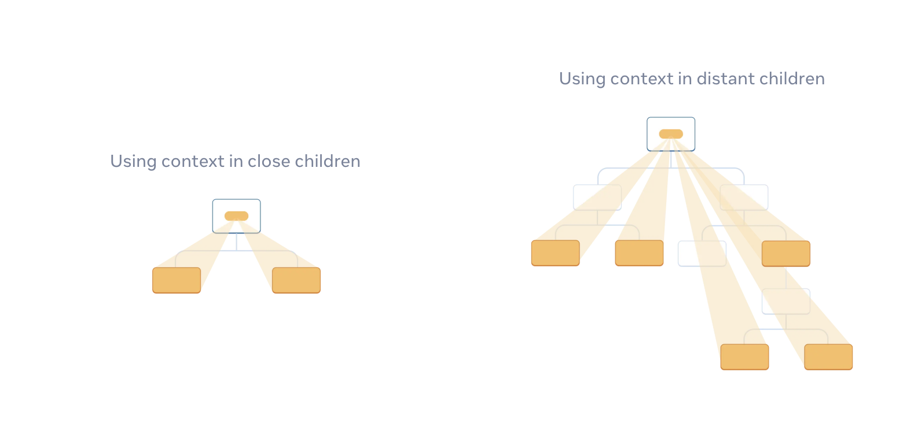

---
# [해당 부분은 인트로(글 제목, 카테고리, 썸네일 이미지 등) 관련 정보]
title: '우리 Context API도 아껴주세요.'
categories: [React]
tags: [프론트엔드]
image:
  path: "../assets/img/posting-images/20251130/20251130-thumbnail.jpeg"
  alt: "'전역'이라는 단어를 들으면 짜릿함(?)부터 드는 게 사실이다. 언제 어디서 터질 지 모르는 이런 스릴 어디서 느껴보겠는가!"
  width: 1200 # 이미지의 너비 조정
  height: 1200 # 이미지의 높이 조정
  # dark: "/assets/img/dark-cover.jpg"  # 다크 모드에서 다른 이미지 사용
---

프론트엔드 개발자의 기술 면접에서 React 관련 질문이 나오면, 자주 출제되는 질문 중 하나가 있다.

> **“React에서 Context API는 무엇인가요? 그것을 사용하는 이유는 무엇이죠?**

이에 대한 질문을 받게 되면, 많은 개발자들은 기계적으로 **‘Props drilling 예방’, ‘전역 상태 관리’** 등의 키워드를 떠올리고 답을 하려고 한다. 그리고, 그렇게 답을 하는게 정답이기도 하다. 실제로 Context API는 일일이 컴포넌트에 props 넘기는 수고로움을 덜고, React에서의 ‘전역 변수’ 같은 느낌으로 사용 하고자 할 때 자주 등장하는 개념이기 때문이다.

그런데, 내 주변에서 이 Context API를 정작 프로젝트에 적용하는 사례는 잘 보지 못했다. 내가 많은 프로젝트를 겪어본 것은 아니지만, 내가 거쳤던 부트캠프, 학교 텀프로젝트 등에서 이 Context API를 사용해서 전역 상태 관리를 진행했다는 이야기는 거의 들어보지 못했다. 그런 이유는 생각보다 단순하다. 전역 상태 관리를 진행하는 라이브러리가 너무 잘되어 있기 때문이다. Redux Toolkit, Zustand 등 전역 상태 관리를 위해 사용할 수 있는 좋은 라이브러리를 상황에 맞게 골라서 갖다 쓰면 된다.

문득 나는 궁금해졌다. Context API라는 것이, 아무래도 React 자체에 기본으로 내장 되어 있는 기능인데, 아무래도 Redux랑 Zustand보다 조금이라도 가볍지 않을까? 이런 친구도 알고만 있는 것보다는, 한 번 사용해 보는게 React 사용자로서의 예의(?)이지 않을까 싶어서 말이다.

<br/>
<br/>

## **Context는 결국 “데이터가 지나 댕기는 통로”**

### Context API의 정확한 정의

우선 React 공식 문서에 적혀 있는 Context API의 정확한 정의가 무엇인지부터 짚어보고 가자.

> *Context* lets the parent component make some information available to any component in the tree below it—no matter how deep—without passing it explicitly through props.

번역하면, **“Context는 부모 컴포넌트가 어떤 정보를 props로 일일이 전달 안해줘도, 그 아래 트리 어디든 깊이에 상관없이 해당 정보를 사용할 수 있도록 해주는 기능”**이라고 명시되어 있다.

<figure style="width: 100%;">
  
  <figcaption>React 19 공식 문서에 나와있는 Context의 사용 목적에 대한 그림 캡처본 (부모 컴포넌트 밑에 어떤 자식 컴포넌트든 해당 정보를 사용할 수 있도록 해주는 기능이라고 한다)</figcaption>
</figure>


중요하게 짚고 넘어가야 할 것은, 이 Context의 궁극적인 사용 목적이 “상태 관리”가 아닌, **“상태 전달”**이라는 것이다. 상태 관리 자체는 React의 다른 Hook들인 `useState`, `useReducer`가 수행하고 Context는 그렇게 관리 되고 있는 상태들을 자식 컴포넌트들로 내려주는 역할만 한다는 것을 기억해야 한다. 

다시 말하면, **Context API와 Redux, Zustand는 엄밀히 따졌을 때 태생부터 다른 목적을 가지고 있다는 것**이다.

### Context API vs Redux/Zustand 비교

| **구분** | **Context API (React Built-in)** | **Redux / Zustand (External Library)** |
| --- | --- | --- |
| **핵심 정의** | **의존성 주입(Dependency Injection)** 도구 | **상태 관리(State Management)** 도구 |
| **데이터 위치** | React 컴포넌트 트리 내부 (Provider) | React 컴포넌트 트리 외부 (External Store) |
| **리렌더링** | Provider 값이 바뀌면, **구독하는 모든 하위 컴포넌트**가 리렌더링 됨 (최적화 필요) | **Selector**를 통해 선택한 값이 바뀔 때만 해당 컴포넌트 리렌더링 (자동 최적화) |
| **주요 용도** | 테마, 유저 정보, **컴포넌트 간 결합도가 높은 상태 공유 (Compound Component)** | 서버 데이터 캐싱, 복잡한 비동기 로직, **앱 전반에 걸친 빈번한 상태 변화** |

앞서 React 개발팀은 Context를 “트리의 깊이와 상관없이 값을 전달하기 위한 방법”이라고 소개 한다고 했다. 즉, Context의 본질은 상태를 관리하는 매니저가 아니라, **A에서 B에서 데이터를 쏴주는 통로**에 가깝다고 봐야 한다.

`useContext`로 구독되어 있는 곳마다 통로를 연결해주고, 통로를 연결해 줬다면 거기로는 데이터가 모두 흐르게 되는 꼴이다. **따로 리렌더링을 방지하는 안전장치가 없기에, Context에 의해 관리되는 상태가 변하면, 연결해준 통로에 있는 컴포넌트는 죄다 재렌더링 되는 것**이라 보면 된다. 

이를 방지하려면 `React.memo`나 `useMemo` 같은 별도의 ‘밸브 잠금 장치’를 개발자가 직접 설치해야 한다. 그래서, “성능 최적화가 좀 어렵다”라는 말이 나오는 것이다.

반면, Zustand와 같은 라이브러리는 **‘외부 저장소(Store)’**에 상태를 두고 전문적으로 상태를 관리한다. 이들은 **구독 모델을 기반으로 작동**한다.

컴포넌트가 이 외부 저장소에 “나는 count값만 필요함!”이라고 요청하면, 라이브러리는 정확히 count가 변할 때만 해당 컴포넌트를 깨운다. user 객체 같은 다른 값이 변해도 count만 바라보고 있는 컴포넌트는 굳이 일어나지 않고, 자고 있는 거다. 

이렇게 알아서 라이브러리가 필요한 경우에만 컴포넌트 깨우고 이러니까, Context 대신에 라이브러리를 썼을 때 성능이 좋다! 라고 얘기 나오는게 이런 이유에서다.

<div class="image-container">
  <figure>
    
    <figcaption>Context API는 단순히 Provider에서 상태를 ‘관리’하며, useContext를 통해서 ‘통로를 뚫는다’라는 느낌으로 가져가면 이해하기 편할 것이다. 즉, **‘상태 전달’**이 가장 큰 목적 (위 그림은 Gemini의 Nano Banana Pro 모델로 생성됨)</figcaption>
  </figure>
  <figure>
    
    <figcaption>Zustand 같은 전역 상태 관리 라이브러리는 외부 저장소(Store)에서 상태를 관리하며, 앱 전체의 각 컴포넌트에서 필요한 것만 “구독”해서 가져다 쓰는 것이라 생각하면 이해하기 편할 것이다. 즉, ‘상태 관리’가 가장 큰 목적 (위 그림은 Gemini의 Nano Banana Pro 모델로 생성됨)</figcaption>
  </figure>
</div>

> **아니, 그러면 역시 성능 좋은 Zustand 써야 하는 거 아님?**

이런 질문 당연히 해볼 수 있다. 스스로도 실제로 많이 했던 질문이기도 하다. 그러나, 이는 반만 맞는 소리다. 만약 우리의 목적이 “앱 전체에서 빈번하게 바뀌는 데이터를 효율적으로 뿌리는 것”이라면 이건 맞는 소리다. 그런데, 우리 목적이 만약 **“특정 기능(도메인) 안에서만 유효한 데이터를 안전하게 가두고, 상태를 공유할 수 있도록 하는 것”**이라면 어떨까? *(내 앱 안의 다른 컴포넌트가 함부로 데이터를 건드리지 못하게 막는 거를 말하는 거다)*

이때부터 Context의 진짜 존재 가치가 드러난다. 전역 저장소라는 넓은 ‘광장’이 아니라, 우리끼리만 공유하는 ‘아지트’가 필요할 때, Context는 최고의 도구가 될 수 있다. 단순히 생각해 봐도, 회원가입할 때 입력 받는 정보를 다른 도메인(ex. 도구 생성 등)에서 가져다 쓸 수 있다면, 이거 굳이? 싶지 않을까?

<br/>
<br/>

## **Context로 만들 통로는 필요한 곳에만 뚫어줘야 한다**

회원가입 정보가 ‘도구 생성’ 페이지 같은 전혀 관련 없는 페이지까지 흘러 들어갈 이유가 전혀 없다. 그런데 우리는 무의식적으로 Context API라는 ‘우리만의 아지트 생성 도구’를 가지고 자꾸만 거대한 ‘광장’을 지으려고 한다.

혹시 우리 프로젝트 루트 파일(`App.tsx` 또는 `layout.tsx` 파일에..)에 아래와 같은 코드가 있지는 않은가 확인해 보도록 하자.

```tsx
// 모든 것을 품은 거대한 '광장'을 만든 예시
const GlobalProvider = ({ children }) => {
  // 서로 "관련 없는" 상태들이 한 곳에 모여 동창회를 하고 있다!
  const [user, setUser] = useState(null); // 유저 정보
  const [theme, setTheme] = useState('light'); // 테마
  const [isModalOpen, setModalOpen] = useState(false); // 모달
  const [cartItems, setCartItems] = useState([]); // 장바구니
  
  const value = { user, theme, isModalOpen, cartItems };
  return (
    <GlobalContext.Provider value={value}> 
      {children} 
    </GlobalContext.Provider> 
  );
}
```

이렇게 "일단 다 때려 넣고 보자" 식으로 Context를 사용하면, 앞서 말한 거대한 ‘광장’을 자꾸 지으려고 하는 문제가 터진다. 장바구니(`cartItems`)에 물건을 하나 담았을 뿐인데, 뜬금없이 다크 모드 토글 버튼(`theme` 상태)이나 프로필 카드(`isModalOpen` 상태) 까지 "어? 무슨 일 있어?" 하며 리렌더링 검사를 받게 된다. 즉, 쓸데없는 것들이 자꾸 연관 되어져서 불필요한 리렌더링이 반복 된다는 것이다.

**우리만의 아지트 만들 도구로, 왜 자꾸 모두가 나올 수 있는 광장을 지으려 하는가?** 우리 Context API는 잘못이 없다(?). 범위(Scope)를 제한해야 할 도구를 전역(Global)으로 써버린 설계 미스인 것이다. 이렇기에 Context API의 불필요한 재렌더링 관리가 힘들었던 것이다.

### Context API의 진짜 무기(1): 데이터 은닉화 (Encapsulation)

Context API를 도메인별로 쪼개서 사용하면, 우리는 **“강제적인 데이터 접근 제어”**라는 강력한 무기를 얻게 된다. 전역 스토어(Store)는 기본적으로 **‘언제 어디서든 꺼내 쓸 수 있음’**을 기본 철학으로 갖고 있다. 하지만, 우리의 프로젝트가 커질수록 “여기서는 여기로 접근하면 안됨”을 보장하는 게 더 중요해질 수 있다.

```tsx
// 좋은 예: 필요한 곳에만 '아지트'를 건설하기
// '인증/회원가입' 관련 도메인
<AuthProvider>
  <Header /> {/* 유저 정보 접근 가능 */}
  <Main />
  <Footer />
</AuthProvider>

// '결제' 관련 도메인
<PaymentProvider>
  <PaymentPage /> {/* 결제 정보 접근 가능 */}
</PaymentProvider>
```

위 구조에서 `<PaymentProvider>` 내부에 없는 컴포넌트들(`<Header/>`, `<Main/>`, `<Footer/>`)은 죽었다 깨어나도 결제 정보(`PaymentProvider`로 감싸져 있는 곳 의미)를 조회하거나 수정할 수 없다. React의 트리 구조 자체가 데이터가 밖으로 새 나가는 것을 막아주는 **방화벽** 역할을 해주는 것이다. 이는 개발자가 실수로 엉뚱한 곳에서 상태를 조작하는 것을 원천적으로 차단하게 된다. 

그렇다고 뭐 해커가 여기 데이터를 볼 수 없다! 이런 건 아니다. 아지트에 도둑이 들 수도 있으니깐 말이다. 궁극적인 목적은, **Context를 활용하면 관련 없는 컴포넌트가 데이터를 오염시키는 것을 구조적으로 막을 수 있다!**가 가장 큰 이유인 것이다.

### Context API의 진짜 무기(2): 구조적 유연성과 생명주기 (LifeCycle)

내가 생각하는 Context API의 가장 큰 장점? 매력?은 바로 “컴포넌트와 운명을 함께한다”는 점이다. 다시 말하면, 컴포넌트가 죽으면 같이 죽는거고, 살면 같이 살고 뭐 이런 느낌?인 것이다. *(전문적으로 말해, “컴포넌트의 생명주기를 따라간다”라고 우아하게 표현해볼 수 있습니다)*

Redux나 Zustand의 전역 Store는 앱이 켜져 있는 동안 계속 살아있다. 그래서 페이지를 나갔다 다시 들어오면 이전 데이터가 남아있어, `useEffect`로 수동 초기화를 해줘야 하는 번거로움이 종종 있을 수 있다.

반면, Context는 **Provider가 마운트될 때 생겨나고, 언마운트되면 메모리에서 깨끗하게 사라진다.** 쉽게 말하면, 아까 계속 Context를 ‘통로’에 비유했는데, Provider가 마운트될 때 통로가 생기는 거고, 언마운트되면 통로가 없어지는 것이다. 이 특성 덕분에 같은 로직을 가진 컴포넌트를 동시에 여러 개 띄워도 서로 간섭하지 않는다는 장점을 가질 수 있다.

예를 들어, 같은 로직을 가지는 투두 리스트인데, A팀이랑 B팀 상태를 다르게 관리하고 싶다고 하자. 이를 Zustand와 같은 전역 상태 라이브러리로 “독립된 2개의 투두 리스트”를 구현하려면 아래와 같이 구성해야 한다.

```tsx
// 전역 상태로 구현 시 복잡도 증가
interface GlobalStore {
  todos: {
    [teamId: string]: Todo[]; // ID를 키(Key)로 관리해야 함
  };
  addTodo: (teamId: string, todo: Todo) => void; // 액션마다 ID를 넘겨야 함
  deleteTodo: (teamId: string) => void;
}
```

위에서 보면, 액션함수인 addTodo, deleteTodo 등에 ‘어떤 팀’의 투두 리스트를 지워야 하는지 알아야 하므로 teamId를 인자로 넘겨줘야 하고, 데이터를 꺼낼 때도 ID를 참조해야 한다. 별로 복잡하게 생각 되지 않을 수 있지만, 구분해야 하는 인자가 막 늘어 난다고 생각해보자. 상당히 귀찮은 작업이 될 것이다.

하지만, 이를 Context API를 사용하게 된다면 내부 로직(`TodoList`, `TodoInput` 등)은 teamId 등의 구분인자가 무엇인지 알 필요가 없어지게 된다. 그저 **“나를 감싸고 있는 Provider의 상태”**를 쓰기만 하면 되기 때문에 구현할 때 훨씬! 덜 귀찮아질 수 있다.

```tsx
// Context API의 강력한 점: 같은 로직이어도, 각각 컴포넌트는 다른 상태를 가질 수 있음
<div className="flex gap-4">
  {/* Team A의 투두 리스트 */}
  {/* 이 Provider 내부의 상태는 오직 Team A만을 위해 존재한다. */}
  <TodoProvider teamId="A">
    <Header>Team A 업무</Header>
    <TodoList />
  </TodoProvider>
  {/* Team B의 투두 리스트 */}
  {/* 이 Provider 내부의 상태는 오직 Team B만을 위해 존재한다. */}
  <TodoProvider teamId="B">
    <Header>Team B 업무</Header>
    <TodoList />
  </TodoProvider>
</div>
```

아래는 위 투두 리스트를 구현하기 위한 `TodoContext.tsx` 파일과, `<TodoList>`의 예제 코드이다. Context API의 사용 방법을 이를 통해서 대충 감을 잡는 데 도움이 될 것이라 판단 되어, 여기에 남겨 놓는다. ~~(내 복습용 코드)~~

- `TodoContext.tsx`

```tsx
// Todo 관련 Context(데이터 흐름 통로)를 관리하기 위한 TodoContext.tsx 파일
import React, { createContext, useContext, useState, ReactNode } from 'react';

// Context 타입 정의
interface TodoContextType {
  teamId: string;
  todos: string[];
  addTodo: (text: string) => void;
}

const TodoContext = createContext<TodoContextType | null>(null);

// 핵심: Provider 컴포넌트
// 이 컴포넌트가 마운트될 때마다, 내부의 useState도 '새롭게' 생성된다.
export function TodoProvider({ children, teamId }: { children: ReactNode; teamId: string }) {
  const [todos, setTodos] = useState<string[]>([]);

  const addTodo = (text: string) => {
    setTodos((prev) => [...prev, text]);
  };

  return (
    <TodoContext.Provider value={{ teamId, todos, addTodo }}>
      {children}
    </TodoContext.Provider>
  );
}

// 나중에 가져다 사용하기 편하도록 useTodo() 
export function useTodo() {
  const context = useContext(TodoContext);
  if (!context) throw new Error('Cannot find TodoProvider');
  return context;
}
```

- `TodoList.tsx`

```tsx
// TodoList를 UI에 띄워주는 TodoList.tsx
import { useTodo } from '../contexts/TodoContext';

export function TodoList() {
  // props로 id를 받지 않아도, 나를 감싼 Provider의 상태를 가져온다
  // useTodo()의 반환값은 TodoContext 관련 context 값 
  // --> 이를 통해 <TodoList>에도 TodoContext 관련하여 '데이터가 지나가는 통로'를 개통!
  const { teamId, todos, addTodo } = useTodo();

  return (
    <div className="p-4 border rounded-lg shadow-sm bg-white">
      <h3 className="font-bold text-lg mb-2">Team {teamId}의 할 일</h3>
      <ul className="list-disc pl-5 mb-4">
        {todos.map((todo, idx) => (
          <li key={idx}>{todo}</li>
        ))}
      </ul>
      <button
        onClick={() => addTodo('새로운 업무 추가')}
        className="bg-blue-500 text-white px-3 py-1 rounded text-sm hover:bg-blue-600"
      >
        + 업무 추가
      </button>
    </div>
  );
}
```

<br/>
<br/>

## **Context는 착하고 강력한 친구입니다.**

이번 글에서 내 주장의 핵심은 ‘Redux나 Zustand를 갖다 버리자’라는 게 절대 아니다. 이들은 복잡한 비동기 상태 관리와 전역 데이터 공유에 있어 최고의 솔루션인 것은 부정할 수 없다. 내가 궁극적으로 이야기 하고 싶은 것은, **“습관적인 전역 상태화를 멈추자”**라는 것이다.

우리는 그동안 아마? ‘상태 관리’라는 단어에 매몰되어서, Context API가 가진 ‘의존성 주입’과 ‘범위 제한’이라는 본질적인 가치를 잊고 살았을 수도 있다. 일단 나부터 말이다.

<figure style="width: 100%;">
  
  <figcaption>어려운 말로 이해하기 힘들다면, 위 그림을 머릿속에 넣어보자. Zustand 같은 전역 상태 관리 라이브러리는 ‘광장’, Context는 ‘우리만의 아지트’ 구축이라는 것을 말이다 (위 그림은 Gemini의 Nano Banana Pro 모델로 생성됨)</figcaption>
</figure>

마지막으로, 내가 생각하는 ‘이럴 땐 무조건 Context API를 써야한다!’ 하는 상황들을 정리하며 글을 마무리해 보고자 한다. Gemini가 어떤 상황에서 쓰면 좋을지 같이 고민을 도와주었다.

### Context API, 이럴 때 적극적으로 사용해 보자.

1. **‘데이터 은닉’이 필요한 도메인 영역**
    - 특정 페이지나 기능 덩어리(Feature) 안에서만 상태가 돌아가야 할 때.
    - ex) 복잡한 회원가입 마법사(Multi-step Form): 1단계에서 입력한 정보가 3단계까지 유지되어야 하지만, 다른 페이지에서는 알 필요가 없을 때.
2. **복합 컴포넌트 패턴**
    - 부모와 자식 컴포넌트가 강하게 결합되어 하나의 UI를 형성할 때.
    - ex) **Tabs, Accordion, SelectBox**: `<Tabs.Root>`에서 현재 선택된 탭 정보를 관리하고, `<Tabs.Item>`들이 이를 구독할 때. 이곳에 Redux 같은 친구를 끌어들이는 건 소 잡는 칼로 닭을 잡는 격임.
3. **주입되는 데이터의 변경 빈도가 낮은 경우**
    - 앱 전반에 걸쳐 필요하지만 자주 바뀌지는 않는 데이터.
    - ex) 테마(Theme), 다국어 설정(i18n), 로그인한 사용자 기본 정보(User Session): 이런 데이터는 Context API만으로도 차고 넘친다. 거의 바뀔 일이 없기 때문.

### 도구는 죄가 없다.

Gemini와 함께 이 글에 대해서 탐구를 하면서 읊어준 비유가 참으로 인상 깊었다.

> "망치를 든 사람에게는 모든 것이 못으로 보인다"라는 말이 있습니다. <br/> 혹시 우리는 Zustand라는 강력한 망치를 들고, 나사(Context로 조여야 할 곳)까지 억지로 때려 박고 있지는 않았을까요?

망치 들고 나서, 살살 나사로만 조여야 할 곳도 다 때려 박았던 것은 아닐지, 이 글을 쓰면서, 그리고 이 글의 내용에 대해서 공부를 하면서 반성을 좀 하게 되는 부분이 있다. 앞으로는 Context, Zustand 뿐만 아니라 도구의 명확한 사용 목적을 이해하고 사용하는 습관을 계속 가져야 겠다.

글 진짜 마치기 전에, 글 시작할 때 던졌던 질문 다시 갖고 와보겠다.

> **“React에서 Context API는 무엇인가요? 그것을 사용하는 이유는 무엇이죠?**

우리가 오늘 살펴봤던 내용을 바탕으로, 아래와 같이 답변하면 완전 프론트엔드 바닥에서 5년 이상 살아남은 고수 같아 보여서 좋지 않을까? 아님 말고(?)

> "네, Context API는 기본적으로 컴포넌트 트리 깊숙한 곳까지 데이터를 전달하여 Props Drilling 문제를 해결해 주는 도구입니다.<br/> 하지만 저는 이를 단순한 '전역 상태 관리자'로 보기보다는, '상태의 범위(Scope)를 정의하는 도구'로 사용합니다. Zustand나 Redux 같은 라이브러리가 앱 전체가 공유하는 '광장'이라면, Context API는 특정 도메인이나 기능 단위로 데이터를 격리하여 '아지트'를 만드는 데 최적화되어 있기 때문입니다. <br/> 이를 통해 불필요한 데이터 접근을 막는 '은닉화'를 구현하고, 컴포넌트의 생명주기와 함께하는 독립적인 상태 인스턴스를 관리할 수 있다는 점이 제가 Context API를 사용하는 가장 큰 이유입니다."