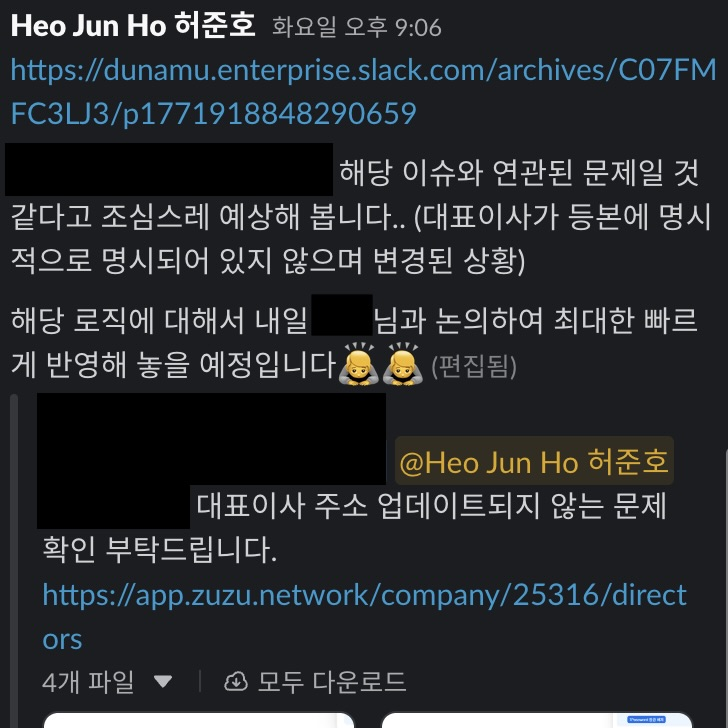
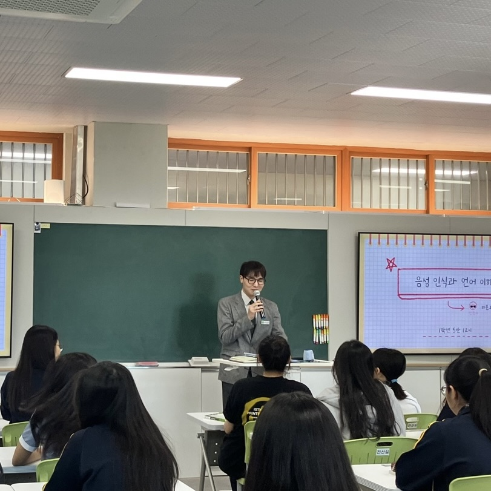
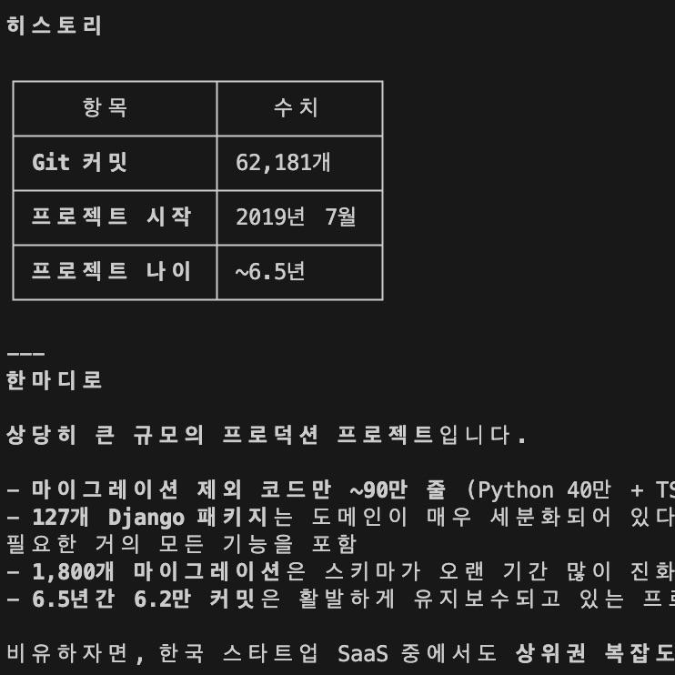

---
# [해당 부분은 인트로(글 제목, 카테고리, 썸네일 이미지 등) 관련 정보]
title: '같이 좋은 제품을 만드는 것 - 생산성을 올리는 “협업” 요령 (지극히 개인적인.)'
categories: [기획]
tags: [협업, 커뮤니케이션]
image:
  path: "../assets/img/posting-images/20260302/20260302_thumbnail.JPG"
  alt: "2026년은 힘차게 달리고 있는 중입니다."
  width: 1200 # 이미지의 너비 조정

  height: 1200 # 이미지의 높이 조정
  # dark: "/assets/img/dark-cover.jpg"  # 다크 모드에서 다른 이미지 사용
---

2월이 다 끝나가던 금요일, 회사에서 테크 리드분과 함께 지난 2달 간의 내 회사 생활을 옆에서 지켜 보시면서 좋았던 점, 아쉬웠던 점, 그리고 앞으로 어떻게 개선해 나가면 좋을지 커피챗 시간을 가졌다. 테크 리드분께서 내게 말해 주셨던 주요 내용들은 아래와 같았다.

- **기술적 측면**
    - 기능 구현을 하는 데만 너무 치중하고 있다 → 코드 유지보수성 뿐만 아니라, 쉽게 얘기해서 ‘다른 개발자가 읽고 쓰기 편한, 멘탈모델에 맞는 코드’를 작성하기 위해 집중해야 할 것 같다.
- **커뮤니케이션적 측면**
    - 자꾸 개발자 동료를 설득 시키듯이 다른 파트의 사람들을 설득 시킨다 → 아무리 그래도 다른 파트 사람들은 알아듣지 못한다
    - 다른 파트에서 제시한 의견을 있는 그대로 받아 들이면 안된다 → ‘개발’ 측면에서 어려운 부분이 있다면 바로바로 합당한 근거를 제시하며 쳐낼 줄 아는 능력도 필요하다. (개발해야 할 기능의 “우선순위”를 명확히 파악하고 조정해야 한다)
    - 코드베이스에 익숙하지 않아서 작업 속도가 느린 것을 부끄러워 하지 말아라 → 충분히 레거시 코드는 복잡한 것이고, 그것을 물어보기 부끄러워서 주저하는 것 자체가 생산성을 무너뜨린다

이외에도 피드백 해주셨던 내용들이 많았지만, 주요 내용들을 정리해 보면 위의 3가지 정도로 축약할 수 있을 것 같다. 그동안 내가 기술적으로 헤매는 모습을 많이 보였기에 기술적인 피드백이 훨씬 많을 것으로 생각했지만, 생각보다 ‘커뮤니케이션’ 측면에서 고칠 부분이 더 많다고 말씀해 주셨다.

특히, 한 기능을 담당하는 스쿼드의 다른 파트와의 회의를 진행할 때 다른 파트가 가져온 사항들에 대해서 제시한 의견 그대로 받아 들이는 것에 대해서 가장 아쉽다고 하셨다. 그것이 이번에 2월달 간 열심히 준비했던 기능 개발에 있어 가장 생산성을 저해한 것 같다고 판단 되었기 때문이라 하셨는데, 나도 그래서 되돌아 보며 어떤 점이 잘못 되었는지 회고를 해보았다.

## **다른 파트의 사람도 알아듣기 쉽도록.**

예를 들어보자. 개발자의 입장에서, 화면에 ‘성공’ 컴포넌트를 하나 띄워야 하는 경우를 생각해 보자. 이 경우는, 기술적으로는 크게 어려운 부분이 아닐 수 있다. if-else 문, 혹은 삼항 연산자 하나 넣어서 해결하면 그만일 것이다. 그런데, 이 똑같은 것을 ‘사업전략팀’, 혹은 ‘디자인팀’에게 그대로 설명 한다고 해보자. 만약, ‘사업전략팀’에서 특정한 액션이 성공했을 때 ‘성공’ 또는 ‘실패’ 관련 문구를 각각 싶다고 한다고 해보자. 아래는 실제 내가 ‘사업전략팀’, ‘디자이너’와 특정 기능을 가지고 커뮤니케이션을 진행했던 내용이다.

```
[사업전략팀]: 준호님, 지금 웰컴백 프로모션 기능 중에서 성공했으면 '성공' 관련 멘트를, 실패했으면 '실패'
         멘트를 배너에다가 띄웠으면 좋겠는데, 해당 내용을 기능에 반영하려면 얼마 정도 걸릴까요?
[나]: 네, 해당 내용에 대해서는 코드 자체에서 조건 분기 관련 코드 몇 줄 추가하면 되기에 오늘 안에 구현
      가능할 것 같습니다!
[디자이너팀]: 준호님, 그러면 저는 해당 내용에 대해서 배너 관련 작업들만 진행하면 될까요? 배너랑 텍스트
           제외하고 제가 또 도와드릴 내용은 없을까요?
[나]: 배너 관련 스타일링만 진행해주면, 거기에 들어갈 로직들은 제가 직접 구현하면 되니까, 또 그렇게 어렵지
     않으니까 얼른 작업해서 PR 올려 드리겠습니다!
[사업전략팀]: 넵, 감사합니다!
```

난 내가 최대한 기술적인 내용들을 빼고 답했다고 생각했는데, 사업팀 리드분끼리 회의를 했을 때 이야기가 나왔다고 했다. 내가 답변한 부분들에 대해 이해하기 힘든 부분들이 있어, 가끔 그냥 “네, 감사합니다”라고 답했던 부분들이 있었다고 말이다. PR, 조건 분기, 이런 단어들을 최대한 배제하고 그냥 “어려운 작업 아니니까 금방 해드릴 수 있을 것 같습니다” 라고 말하거나, 아니면 “해당 작업은 시간이 좀 걸릴 것 같아서, 일정을 좀 미룰 수 있을까요?” 뭐 이런식으로 누구나 알아듣기 쉬운 방향으로, 그리고 용건만 간단히 말해 보라고 하는 것이 피드백의 핵심이었다.

어떤 것 때문에 지연이 될 것 같다, 뭐 이런 사족 필요 없이 간단하게 Yes/No만 말해도 되고, 그에 대해서 “왜 안되냐?”라는 질문이 들어왔을 때만 추가적으로 근거를 말하면 된다고 하는 것이었다(그리고, 왠만하면 추가적인 정보를 요청하지도 않는다고 했다) 

나도 모르게, 모든 파트의 사람들이 이해를 할 수 있도록 최대한 근거를 들어, 기술적인 이야기를 풀어서 설명하려고 노력을 했었는데, 그냥 “필요한 내용”만 딱 얘기하고 커뮤니케이션을 효율적으로 하는 것이 생산성을 오히려 끌어 올린다는 리드분의 중요한 “협업 스킬” 중 하나였던 것이다.

<div class="image-container">
  <figure>
    
    <figcaption>그래, 내가 이렇게 설명하면 코딩 모르시는 분들은 알아 듣기 힘들었을 것 같다.</figcaption>
  </figure>
  <figure>
    
    <figcaption>나도 코드 보기 힘든데, 이 작업을 안하시는 분들은 더 힘드시겠지, 딱 필요한 얘기만 하도록 요점 정리를 잘해야 할 것 같다.</figcaption>
  </figure>
</div>

## **내 선에서 알아서 잘 짜를 줄 알아야 한다.**

난 이번 2월달 동안 회사 사업전략팀에서 요구하는 의견의 대부분을 수용하고, 그리고 그 기능들을 모두 구현하기 위해 많은 시간을 쏟았다. (설날 연휴 직전에는 주 4회 자정 이후까지 야근을 한 적도 있다) 그렇게 해서 출시한 기능(”웰컴백 프로모션”)은 생각보다 반응이 저조했다.

지금 사실 돌이켜 보면, 해당 기능은 투입되는 개발 역량에 비해 실제로 발생하는 유입 효과가 많지 않다는 것이 문제점이었다. 사업전략팀에서는 churn(서비스를 사용하다가 이탈한 고객을 의미)된 유저들에 대해 이메일을 발송하면 ‘웰컴백 프로모션’이 우선순위가 높다고 판단했지만, 오히려 그 뒤에 존재하는 “법인정보 업데이트 자동화” 기능이 우선순위가 더 높았던 것이었다.

‘법인정보 업데이트 자동화’라는 기능은 기존에 사용하던 유저들도 직접적으로 편리함을 느낄 수 있는 기능인데, 이를 뒤로하고 앞선 ‘웰컴백 프로모션’ 기능에 치중을 두다 보니, 우선순위가 밀려 전체적인 기능 출시 프로세스가 밀린 것이 아쉽다는 평이었다. 물론 기술적으로도 아직은 경력이 부족하기에 속도가 느린 부분은 분명히 있지만, 이러한 우선순위를 설정하는 데에 있어서 빠르게 프로토타이핑을 진행하지 못한 것이 더 큰 원인이라고 지적해 주셨다. 

이렇게 된 원인을 생각해 보니, 난 내가 “다른 사람들에 비해서 아는 것이 많지 않다”라고 생각한 것이 컸던 것 같다. 난 내가 주요 태스크들을 잡고 있긴 하지만, 이 회사에 더 많은 경력을 가지고 계신 분들이 더 많은 것을 알고 있다고 판단하고 의견을 많이 못 냈던 것도 사실이다. 이런 것을 주저하지 말고, 내 선에서 애매하다 판단되면 그에 대한 의견을 내고 고쳐 나가는 것이 더욱 효율적인 우선순위 선정, 더 나아가 더 나은 제품을 만드는 데에 일조하는 방법이라는 깨달음을 얻을 수 있었다.

## **모르는 것을 부끄러워 하지 말아라.**

내게 가장 어려운 부분이다. 최대한 ‘아는 척’을 하고 ‘포장’을 해야 했던 취준 기간을 오래 겪어서 그런가, 이게 몸에 배어 버린 것 같다. 내 허점이 드러나면 안되고.. 뭐 이런 것이 잘못된 것을 알면서도 계속 내 허점을 드러나지 않았으면 하는 게 마음 속 한 켠에 계속 있는 것 같다.

그래서 뭐라도 모르는 것이 있다면, 다른 사람들에게 물어보지 않고 최대한 클로드에게 물어보고 답을 구하려 했던 것 같다. 그러는 와중에, 잘못된 정보를 얻어서 일이 원하는 방향으로 흘러가지 않았던 적도 있고, 오히려 생산성이 저해 되었던 게 컸던 것 같다. 잘못된 것을 알면서도, 내 습관이 “그냥 내가 최대한 해봐야지”라고 굳어져 버려서 그런지, 이걸 뜯어 고치는 게 쉽지 않았다.

“신입이 알아봤자 얼마나 알겠는가?”라는 마인드가 정말 중요한 것 같다. 특히 나처럼 개발에 대해 많이 배워야 하는 입장에서 아는 것이 많이 없는 것은 당연한 거고, 그러니까 최대한 다른 분들께 모르는 것이 조금이라도 있다면 슬랙이든, 구두로든 직접 물어보러 가서 정확한 정보를 얻고 생산성을 올리는 것이 중요한 것이었다. 생각보다 내가 문제를 잡고 해결하려 하는 습관이, 생산성을 떨어뜨리는 큰 요인이었다.

AI한테 물어보는 것도 물론 좋지만, 인프라가 어떻게 되어있고, 해당 팀의 컨벤션이 무엇인지, 이 기능을 구현하기 위한 커스텀 훅이 이미 구현되어 있는지 등의 질문을 하는 것을 부끄러워 할 필요가 없는 것이었다. 그냥 모르는 것이 있다면, 두려워하지 말고 물어보자.

<div class="image-container">
  <figure>
    
    <figcaption>내가 교사를 지망했을 때에, 애들한테 항상 "모르는 거 있으면 물어봐"라는 얘기를 입에다가 달고 살았는데.. 내가 이걸 실천 못하고 있었다. 초심으로 돌아가야 할 것 같다.</figcaption>
  </figure>
  <figure>
    
    <figcaption>클로드가 10분 가량 프로젝트 분석하고 오니까, 어려운 거라고 정신승리(?) 시켜줬다. 아니 그리고, 실제로 어려운 거 맞으니까 모르는 거 있으면 반드시 물어봐야지.</figcaption>
  </figure>
</div>

## **결국은 제품은 사람이 만들어내는 것이다**

얼마 전에 링크드인을 서핑하며, 봤던 글 중에서 하나 인상적인 구절이 있었다.


> 그런데 요즘, AI 시대를 살아가며 역설적으로 깨닫는다.
> 결국 사람이 AI에 대체될 수 없는 최후의 영역은 정확함도, 효율도, 빠름도 아닌 진심과 다정함이라는 것을.
>
> - 류재언 변호사

요즘 AI Agent가 멀티 모달로 돌리면 10분만에 쇼핑몰을 만들고, API 명세서를 찍어낼 수 있다고 한다. 결국 사람이 감정 없이 코드를 높은 효율로 찍어내는 AI를 기술적으로 이기기엔 힘들 것이라고 나도 생각이 든다. 그러나, “진심”이랑 “다정함”이라는 감정적인 영역까지 AI가 과연 침범할 수 있을까? 우리가 종종 AI가 쓴 글을 보고 “기계 냄새 나는 글이다”라고 이야기를 하고 다니지 않는가.
아무리 AI가 좋은 제품들을 찍어낸다고 한들, 결국 그것을 사용하는 것은 “사람”이다. 그것을 사용하는 최종 대상자들이 “사람”인 만큼, 그것을 만들어내는 과정 또한 “사람”이 개입 되어야 좋은 제품이 될 수 있다는 것은 부정할 수 없는 사실이다. 동시에, 이러한 제품을 만드는 프로세스 중에서 생산성을 높이는 것 또한 결국, “사람” 간의 이해를 더 깊게 하는 방향으로 가야 하는 것 아닐까? 내가 피드백을 받았던 것들이 “커뮤니케이션” 역량 측면에서 더 많이 받았던 것이 이를 반증하는 게 아닐까 하는 생각이 든다.

기술적인 측면은 AI가 이미 충분히 잘하고 있다. AI가 생산성을 충분히 높여주고 있다. 그럼 개발적인 측면에선 AI에 대한 생산성을 끌어올릴 수 있다 가정하면, 다른 부분에서 생산성을 끌어 올리기 위해선, “협업”을 잘하는 개발자가 되기 위해서 노력해야 하지 않을까? 말은 간단 하지만, 부트캠프 같은 실무교육에서 이런 점들을 매번 가르쳐 주긴 하지만, 실제로 일을 해보니 적용이 쉽지 않은 부분이 있다.

다른 사람의 관점에서 생각해 보는 **“공감”** 능력이 너무 중요한 것 같다. 이게 단어 자체는 너무 익숙한 단어인데, 실천하는 게 너무 어려운 것 같다. 그 능력을 키우며, 더 “협업하고 싶은 사람”이 되기 위해 노력해야 겠다.