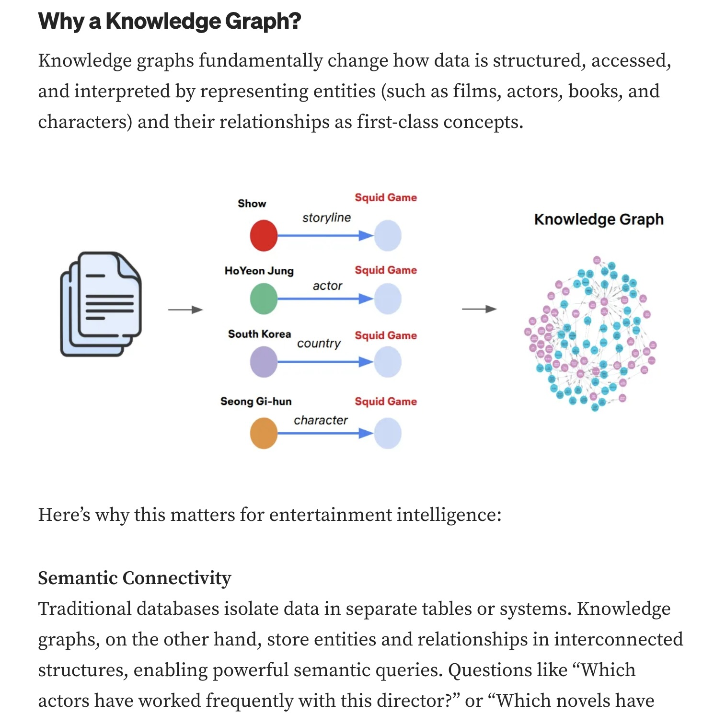
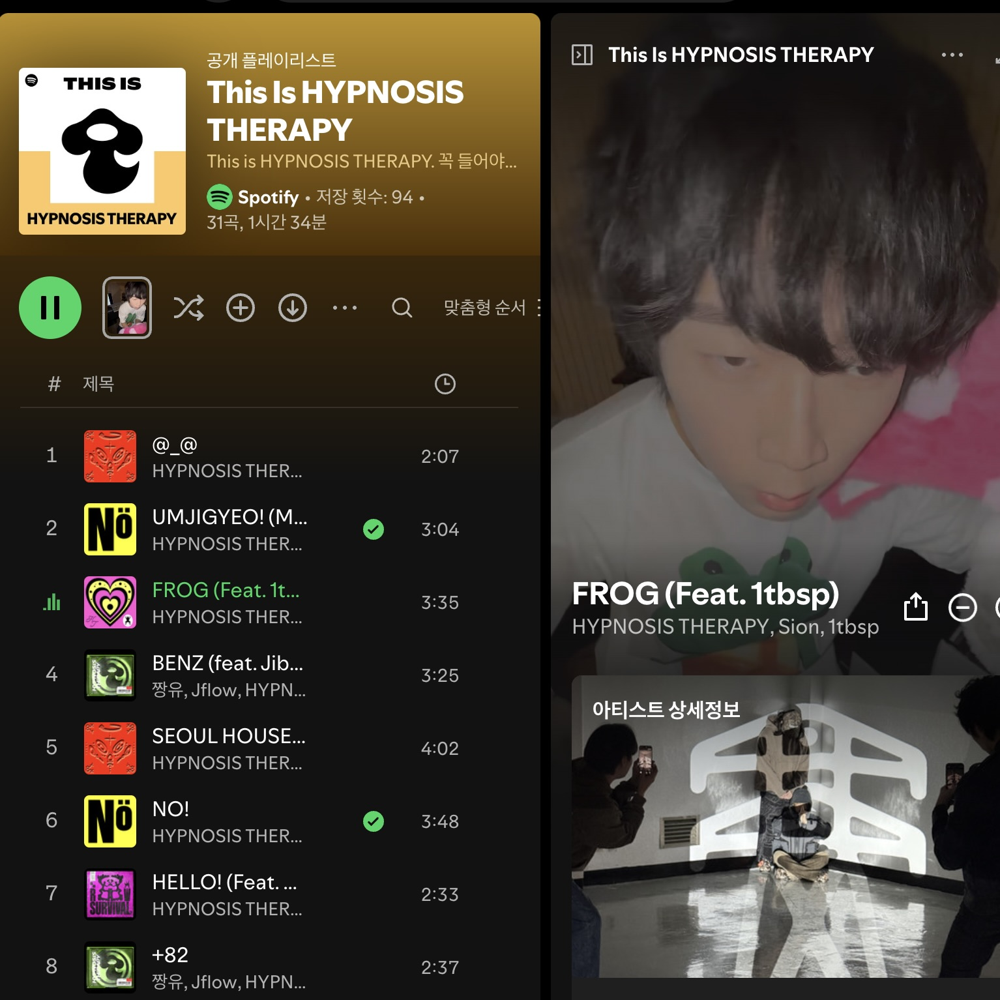

---
# [해당 부분은 인트로(글 제목, 카테고리, 썸네일 이미지 등) 관련 정보]
title: '왜 내가 쓰는 AI는 멍청할까? - AI 시대에 ‘온톨로지’라는 단어가 주목받는 이유'
categories: [AI]
tags: [온톨로지, AI 잘 쓰기]
image:
  path: "../assets/img/posting-images/20260308/20260308_thumbnail.png"
  alt: "AI를 더 똑똑하게 만드는 법.. 데이터들끼리 어떻게 이어져 있는지 지도 하나 쥐어주면 더 똑똑해질 수 있다!"
  width: 1200 # 이미지의 너비 조정
  height: 1200 # 이미지의 높이 조정
  # dark: "/assets/img/dark-cover.jpg"  # 다크 모드에서 다른 이미지 사용
---

웹개발 전반을 다루는 소프트웨어 엔지니어로 일하고 있는 요즘, 최근 항상 소프트웨어 엔지니어 미팅이나 주변 개발자 친구들이랑 자주 이야기하다 보면 가장 많이 이야기하거나, 많이 들어오는 요구사항이 있다. 그건 바로, “우리 서비스에도 AI 좀 붙여보자”는 것이다.

나 역시 생산성을 높여 보고자, 코 전무님(Codex), 클 대표님(Claude Code), 잼민이 사원(Gemini) 등에 매달 구독료를 바치고 있는 입장으로서, 내 손으로 직접 OpenAI API 등을 서비스에 연동해 보는 작업은 꽤나 흥미로웠다. 프론트엔드에서 타이핑 효과(Streaming) 같은 거 구현해보면서(사실 이것도 우리 클 대표님이 다 해주셨다), “나도 좀 치네(?)” 하면서 어깨가 조금? 올라가 있을 때 쯤, 막상 사내 데이터나 특정 비즈니스 로직 같은 거에 맞춰 AI를 테스트 해봤을 때 하나 좀 큰 골칫거리가 있었다.

> “AI가 대답은 그럴싸하게 좀 치는데, 이 정보 어디서 갖고 왔는지 ‘출처’를 모르겠는데? 이거 사용자한테 그대로 전달해도 되는 거 맞나?”

클라이언트 측에서 아무리 UI를 이쁘게 깎아놓고, 넘어온 데이터 현란하게 렌더링 해줘도, AI 생성한 답변은 ‘출처’를 명확히 대지 못한다. 뭐 예를 들어보면, 사내 혹은 프로젝트 매뉴얼을 물어봤을 때 갑자기 없는 부서 지어 내거나, 심지어 존재하지도 않는 규정 막 갖고 와서 그럴싸하게 말 꾸며내는 Hallucination을 일으키며 아무말 대잔치를 해버렸다. ~~(아 내 피같은 API 요금)~~

맨날 뉴스에서 어떤 모델이 최고 성능을 갱신 했냐느니, 뭐 이렇게 경쟁적으로 모델이 나오는 세상에서 왜 내가 하는 프로젝트에서는 다른 곳에서 사용하는 것보다 멍청하게 동작하는 것 같을까?

결론부터 말하자면, LLM은 말빨은 기가 막히는데, 우리 데이터 이면에 숨겨진 ‘관계’와 ‘비즈니스 맥락’을 이해하는 지도? 같은 거를 가지고 있지 않기 때문에 그런 거다. 그리고 오늘 이야기할 ‘온톨로지(Ontology)’가 바로 그 지도의 역할을 해주는 핵심이다.

## **온톨로지, 음… 이름부터 너무 학술적인 거 아님?**

'온톨로지'라는 단어를 처음 들으면, 왠지 철학 책에서나 나올 법한 고리타분한 느낌이 든다. 사실 나도 처음에 이 단어를 들었을 때, "아니, 지금 AI 시대에 웬 온톨로지?"라고 생각했다. 하지만 지금 시대의 온톨로지는 학술적 단계를 넘어 실용적인 **'지식 그래프(Knowledge Graph)'** 와 **'시맨틱 레이어(Semantic Layer)'** 로서 완전히 새롭게 부활했다고 한다.

어려운 말 다 빼고, 아주 직관적인 비유를 들어보자.

우리가 흔히 쓰는 데이터베이스(DB)나 텍스트 문서들이 수천 줄짜리 **'아무 감정 없는 엑셀(Excel) 표'** 라면, 온톨로지는 영화나 드라마에서 형사들이 범인 잡을 때 벽에다가 막 만들어 놓은 **'실로 연결된 수사 보드'** 다.

단순한 엑셀 표에는 '허기철', '결제 시스템', '오류 발생'이라는 데이터가 각기 다른 행(Row)에 뚝뚝 떨어져 있다. 하지만 형사들의 수사 보드(온톨로지)에는 이 단어들이 압정으로 꽂혀 있고, 그 사이를 실이 이어준다.

조금 더 개발자스럽게 표현해 보자면…. 우리가 React에서 컴포넌트 트리를 구성할 때 부모-자식 관계와 Props의 흐름을 명확히 정의하는 것처럼, 데이터에도 그저 텍스트만 띡 던져두는 게 아니라 **[개체] --(관계)--> [개체]** 의 형태로 엮어주는 것이다.

> **예시:** `[허기철(사원)]` --(담당함)--> `[결제 시스템]` --(발생함)--> `[치명적 오류]`

이런 식으로, **개념(Concept), 속성(Property), 관계(Relationship)** 를 통해 데이터에 '의미(Semantics)'를 꾹꾹 눌러 담아 AI가 맥락을 단번에 이해할 수 있게 떠먹여 주는 기술. 이게 바로 온톨로지이자 지식 그래프다.

## **RAG(검색 증강 생성)만 쓰면 다 되는 거 아니었나?**

> **"어? 잠깐만. 우리는 사내 문서 다 벡터 DB(Vector DB)에 넣고 RAG 구축해서 꽤 쏠쏠하게 쓰고 있는데요?"**
> 

물론 기존의 RAG(Retrieval-Augmented Generation) 방식도 훌륭한 도구다. 텍스트를 숫자로 변환(Embedding)해서 뭉탱이로 저장해 두고, 질문이 들어오면 "이 질문이랑 제일 비슷한 숫자 덩어리 가져와!" 하는 방식은 문서 검색에 아주 탁월하다. 하지만 이 벡터 DB 기반의 단순 RAG는 기본적으로 **'키워드와 의미의 유사성'** 에만 크게 의존한다는 치명적인 한계가 있다.

### 1. 동음이의어와 뉘앙스의 대환장 파티
예를 들어, 우리 회사에 '애플'이라는 사내 비밀 프로젝트가 있다고 치자. 사용자가 "최근 애플 프로젝트 이슈가 뭐야?"라고 물었을 때, 단순 벡터 검색은 문맥 없이 '과일 사과'의 효능이나 '아이폰'을 만드는 Apple 사와 관련된 사내 뉴스 스크랩 문서를 뒤적거릴 확률이 높다. 기업 내부의 고유 명사, 은어, 특정 도메인에서만 쓰이는 뉘앙스를 벡터 값만으로는 완벽히 구분하기 힘들기 때문이다.

<figure style="width: 100%;">
	
	<figcaption>단순하게 '애플'이라는 동음이의어가 있으면, 유사도 검색 기반으로 검색을 때리니.. 헛소리를 할 확률이 높다는 것이다.</figcaption>
</figure>

### 2. 꼬리에 꼬리를 무는 질문(Multi-hop reasoning)에 쥐약
기존 RAG는 "A는 B다"라는 1차원적인 문서는 기가 막히게 잘 찾는다. 하지만 **"A와 C의 관계는 뭐야?"** 같은 복합적인 질문이 들어오면 AI는 뇌 정지가 온다.
마치 프론트엔드에서 `userId`를 가지고 `Team API`를 찔러서 `teamId`를 얻은 다음, 다시 `Project API`를 찔러야 최종 결과를 알 수 있는 상황인데, 단순 RAG는 한 번의 검색으로 끝내버리려 하니 "A가 B랑 연관되어 있고, B가 C랑 연관되어 있으니 A와 C도 관계가 있겠네!"라는 논리적 연결 고리를 스스로 찾아내지(추론하지) 못하는 것이다.

<figure style="width: 100%;">
	
	<figcaption>유사도 기반 검색과 다르게.. 정보들끼리 이어 놓으면, 우리가 삼단논법 어쩌구 할 때처럼.. AI도 정보들끼리 연결되어 있는 걸 타고타고 넘어가다 보면, A->C 관계를 더 정확히 찾아볼 수 있다는 것이다!</figcaption>
</figure>

## **우리가 매일 쓰는 넷플릭스와 스포티파이는 이미 '온톨로지' 맛?집**

사실 이 온톨로지 기반의 '지식 그래프(Knowledge Graph)'는 갑자기 하늘에서 뚝 떨어진 뜬구름 잡는 기술이 아니다. 우리가 매일 월정액을 지불하며 사용하는 글로벌 IT 빅테크 기업들은 이미 이 기술로 우리의 삶을 윤택하게 만들어 주고 계신다. 공식 기술 블로그와 관련 연구들을 보면 그들의 깊은 고민이 잘 드러난다.

### 🎬 넷플릭스(Netflix): "어? 이 형들, 내가 지브리 애니 좋아하는 거 어떻게 알았지?"

넷플릭스는 전 세계에서 지식 그래프를 가장 변태같이(?) 잘 활용하는 기업 중 하나다. [넷플릭스 기술 블로그](https://netflixtechblog.medium.com/unlocking-entertainment-intelligence-with-knowledge-graph-da4b22090141)에 공개된 그들의 '엔터테인먼트 지식 그래프(Entertainment Knowledge Graph)' 구조를 들여다보면 입이 떡 벌어진다. 이들은 수많은 영화, 배우, 감독, 장르, 심지어 영상의 색감이나 시청자의 세세한 선호도까지 복잡한 노드(Node)와 엣지(Edge)로 거미줄처럼 엮어 놨다.

단순 RDB였다면 `WHERE genre = '스릴러'` 인 영화만 쭉 뽑아서 추천했겠지만, 넷플릭스의 온톨로지는 이렇게 추론한다.
**"이 유저(A)는 어두운 분위기(B)의 영화를 좋아하고, 그 분위기의 영화에 자주 나오는 주연 배우(C)가 이번에 새로 찍은 신작(D)이 있으니, 장르가 좀 달라도 무조건 이걸 추천하자!"** 우리가 넷플릭스를 켤 때마다 느끼는 그 상당히 정확한 맞춤형 카테고리가 바로 이 거대한 데이터들의 '관계성'에서 나오는 것이다.

### 🎵 스포티파이(Spotify): "이 집 플레이리스트 좀 잘 말아주긴 함"

스포티파이 역시 추천 시스템에 지식 그래프를 적극적으로 활용하고 있다. 이들이 직접 운영하는 [스포티파이 공식 연구 블로그](https://research.atspotify.com/)의 다양한 글들을 살펴보면, 음악과 팟캐스트 추천 등 다양한 영역에서 온톨로지 개념을 어떻게 찰지게 적용하고 있는지 상세히 밝히고 있다.

예를 들어, 2022년에 스포티파이 연구팀이 발표한 자료를 보면 이들은 **'팟캐스트 지식 그래프(Podcast Knowledge Graph)'** 를 별도로 구축했다. 단순히 'A 유저가 들었던 방송 목록'을 저장하는 것을 넘어, 팟캐스트에서 다루는 주제(Topic), 게스트(Guest), 호스트(Host) 같은 다양한 개체들을 그래프로 엮어 놓은 것이다. 

이를 통해 **"네가 어제 들었던 방송의 게스트(Entity)가 새롭게 출연했고, 네가 평소 좋아하는 주제(Topic)를 다루는 팟캐스트"** 를 귀신같이 찾아내어 내 출근길 귀에 꽂아준다(솔직히 스포티파이 음악, 팟캐스트 추천 폼 미치긴 했다) 게다가 이 거대한 지식 그래프 위에서 사용자들의 최적의 추천 경로를 찾아내기 위해 강화 학습까지 돌린다고 하니, 감탄이 나올 수밖에 없다. 박수 짝짝.

  <figure>
    
    <figcaption>넷플릭스 기술 블로그는 처음 들어가 봤는데.. 내 내심 그들의 추천 알고리즘이 정말 신기할 것 같다는 생각은 했었는데, 이렇게 그래프 형태로 다 이어놨다는 건 참 신기한 일이네.</figcaption>
  </figure>
  <figure>
    
    <figcaption>나 얼마 전까지만 해도 유튜브 뮤직 겁나 썼었는데, 스포티파이가 플레이리스트 말아주는 실력 보고, 얘로 갈아탔다. 얘네도 수많은 양질의 콘텐츠 데이터들을 가지고 그렇게 추천해줄 수 있는 시스템을 구축했다는 게 참 대단하다.</figcaption>
  </figure>

## **"RAG는 죽었다?" AI와 온톨로지가 만났을 때 벌어지는 마법 (GraphRAG)**

최근 해외 개발자 커뮤니티나 링크드인, 혹은 유튜브 개발 영상들을 보다 보면 심심치 않게 아주 자극적인 제목들을 볼 수 있다.

> **"RAG is Dead (RAG는 죽었다)"** 처음엔 나도 *"엥? 다른 회사들 RAG 도입하려고 아키텍처 다 짜놨다는 소리 어디서 들었던 것 같은데?"* 하며 좀 놀랐다. 하지만 그들의 주장을 자세히 들여다보면 꽤 납득이 간다.
> 

문서를 무지성으로 잘게 쪼개어(Chunking) 벡터 DB에 때려 넣고, 단순 텍스트 유사도만으로 검색하는 **'전통적인 RAG(1.0)' 방식은 한계에 다다랐다는 것**이다. 심지어 최근에는 모델들의 컨텍스트가 수백만 토큰 단위로 커지면서 *"그냥 책 열 권 분량의 문서를 프롬프트에 통째로 때려 넣으면 되는데, 뭣하러 귀찮게 RAG를 구축해?"* 라는 주장이 힘을 얻기도 했다.

하지만 진짜 RAG가 끝났을까? 전문가들의 결론은 하나같다. **"단순한 Vector RAG는 죽어가고 있지만, 지식 그래프와 결합된 RAG는 이제 진짜 시작이다."** 뭐 그렇다고 하더라.

이러한 지식 그래프의 강력한 연결성을 최근의 LLM과 결합하여 등장한 구원자가 바로 요즘 가장 핫한 **GraphRAG** 기술이다. (마이크로소프트에서도 이를 오픈소스로 대대적으로 공개하며 밀고 있다!) 벡터 DB의 장점과 수사 보드 같은 지식 그래프가 결합된 이 기술을 쓰면, 앞서 내가 API를 연동하며 겪었던 킹받는 문제들이 마법처럼 해결된다.

### 1. "너 그거 어디서 들었음?" (설명 가능한 AI, XAI)

프론트엔드 단에서 가장 답답했고 비즈니스적으로 치명적이었던 '출처' 문제가 완벽히 해결된다. 온톨로지가 구축되어 있으면 AI는 답변을 생성할 때 지식 그래프의 노드와 엣지를 타고 이동한 '경로'를 가지고 있다.
즉, **"내가 아무렇게나 지어낸 게 아니라, 수사 보드의 빨간 실을 따라가 보니까 A 노드에서 출발해서 '소속됨' 관계를 타고 B 문서(사내 규정집 34페이지)에서 이 내용을 찾았어!"** 라고 명확한 근거를 제시할 수 있다. 콘솔 창에 에러 로그가 명확히 찍히듯, AI의 사고 과정을 투명하게 추적할 수 있게 되는 것이다.

### 2. "아, 그게 그거랑 연결된 거였어?" (정확도 & 추론 극대화)

단순 키워드 검색을 넘어, 지식 그래프를 탐색하며 논리적 연결 고리를 찾아 LLM에게 완벽한 '맥락'을 쥐여준다.
"허기철 사원이 참여했던 프로젝트의 작년 예산안 찾아줘"라는 복잡한 질문을 던져도, GraphRAG는 `[허기철]` -> `[참여함]` -> `[결제 시스템 프로젝트]` -> `[관련 문서]` -> `[2026년 예산안]` 이라는 그래프를 타고 넘어가 흩어져 있던 사내 데이터들을 논리적으로 묶어버린다. AI에게 단편적인 텍스트 덩어리를 던져주는 게 아니라, "이게 이런 관계야"라는 완벽한 요약판 지도를 손에 쥐여주니 Hallucination 없이 정확한 답변이 나올 수밖에 없다.

<figure style="width: 100%;">
	
	<figcaption>데이터들끼리 연결해 놨으니까.. AI가 맥락을 쭉 파악하고, 설명 가능한 이런 GraphRAG의 시대에 온 것이다. 어차피 요즘 LLM들 Context양도 많이 늘어나서 이게 좀 더 효과적으로 사용되고 있지 않나 하는 생각도 든다.</figcaption>
</figure>

## **결론: 단순 저장(Storage)에서 연결(Connect)의 시대로**

내가 한창 졸업 프로젝트를 하던 2024년, 그 때 당시 학교에 새로이 조교수로 부임 하셨던 분이 “미래에는 Graph로 이루어진 DB가 유용해지는 시대가 반드시 올 것이다”라고 말씀 하셨던 게 아직도 기억난다. 그때 당시엔 이쪽에 거의 지식이 없어서 그냥 그렇구나.. 했는데, 2년만에 전 세계적으로 이렇게 이야기가 많이 나오다니… 그 분의 선구안이 정말 대단하셨던 것 같다.

지금까지 우리는 쏟아지는 데이터를 그저 데이터베이스에 예쁘게 쌓아두는(Storage) 데에만 집중해 왔다. 하지만 AI 시대에 진정한 가치는 데이터의 무식한 양이 아니라 **'데이터 간의 연결(Connect)'** 과 **'맥락의 부여(Semantics)'** 에서 나온다.

이전 글에서도 한 번 인용했던 말이 있다. "망치를 든 사람에게는 모든 것이 못으로 보인다."
혹시 우리는 '단순 RAG'라는 강력하고 트렌디한 망치만 믿고, 데이터 간의 섬세한 연결과 추론(온톨로지)이 필요한 곳까지 억지로 단순 벡터 검색으로 때려 박고 있지는 않았을까? (AI의 등장으로, 개발 쪽도 트렌드를 정말 잘 따라가야 하는 직종이라는 것을 느낀다)

파라미터가 몇 조 개네, 컨텍스트 윈도우가 몇 백만 토큰이네 하는 AI 모델 자체의 '엔진 크기' 경쟁은 오픈AI나 구글 같은 빅테크 기업들의 몫이다. 소프트웨어 엔지니어로서 우리가 해야 할 일은, 그 강력한 AI 엔진이 우리 서비스와 도메인 위에서 제대로 돌아갈 수 있도록 **좋은 품질의 데이터랑 정교한 네비게이션(온톨로지)** 을 설계하고 뚫어주는 것이다.

혹시 지금 프로젝트에서 사용하는 데이터로 AI를 연동하고 있는데 출처도 없고 엉뚱한 대답만 내놓아서 클라이언트 단이든.. 서버 단이든.. 예외 처리하느라 땀을 빼고 있다면, 한 번쯤 근본적인 질문을 던져보자.

*"우리의 데이터는 그저 흩어진 엑셀 표인가, 아니면 서로 유기적으로 촘촘히 연결된 수사 보드인가?"*

우리, 이제는 다른 것들 최적화만큼이나 온톨로지적 사고방식에도 찐하게 관심을 가져보는 것은 어떨까.

### 📚 참고가 많이 되었던 자료들 (References)

- [RAG is Dead … Long Live RAG](https://suedbroecker.net/2025/12/14/rag-is-dead-long-live-rag/) (Thomas Suedbroecker's Blog, 2025)
- [Stop Saying RAG Is Dead](https://hamel.dev/notes/llm/rag/not_dead.html) (Hamel Husain's Blog, 2025)
- [Unlocking Entertainment Intelligence with Knowledge Graph](https://netflixtechblog.medium.com/unlocking-entertainment-intelligence-with-knowledge-graph-da4b22090141) (Netflix Technology Blog, 2024)
- [Model Once, Represent Everywhere: UDA (Unified Data Architecture) at Netflix](https://netflixtechblog.com/model-once-represent-everywhere-uda-unified-data-architecture-at-netflix-6a6aee261d8d) (Netflix Technology Blog, 2024)
- [Researching how less-streamed podcasts can reach their potential](https://research.atspotify.com/researching-how-less-streamed-podcasts-can-reach-their-potential) (Spotify Research, 2022)
- [Sequence-aware Reinforcement Learning over Knowledge Graphs](https://research.atspotify.com/spotify-at-recsys-2019) (Spotify at RecSys 2019, Spotify Research)
