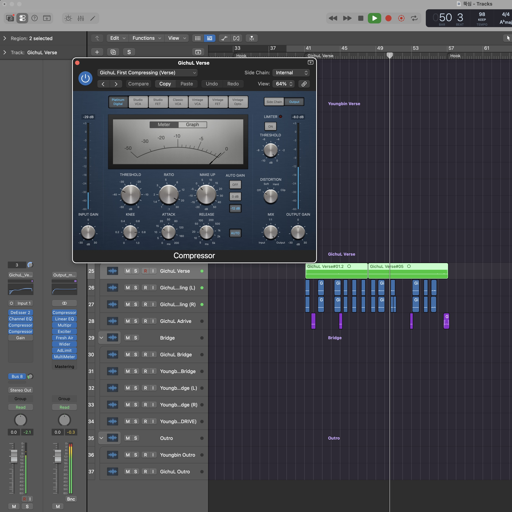
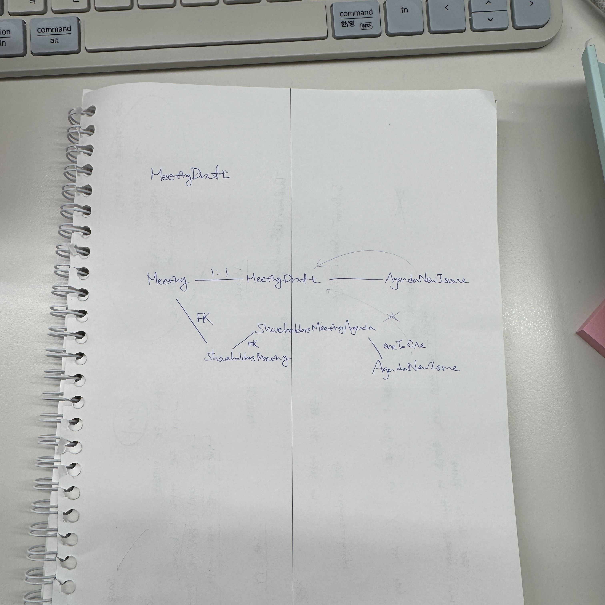

## **들어가며 — "URL 없는 소프트웨어는 대체 어떻게 만들지?"**

솔직히 말하면, 이 글을 쓰게 된 건 엄청난 계기가 있어서가 아니다. 그냥 어느 날 갑자기 궁금해진 거다.

평소에 내가 취미생활을 할때 자주 켜는 Logic Pro나 일할 때 Slack을 킬 때마다, 프로그램이 실행되는 걸 아무 생각 없이 봤는데, 어느 날 갑자기 이런 생각이 들었다.

> "어? 이거 어떻게 만든 거지? 내가 만드는 것처럼 React 쓰는 건 아닐 텐데."

나는 지금까지 Python, JavaScript, 그리고 React, Django 같은 웹 중심의 기술 스택만 다뤄왔다. 브라우저 위에서 돌아가는 서비스들, `https://` 로 시작하는 URL이 있는 것들만 만들어온 셈이다.

그러다 보니 'URL이 없는 소프트웨어들' — 그러니까 포토샵, 카카오톡 PC버전, VS Code 같은 것들은 나에게 그냥 당연히 존재하는 물건이었지, 직접 만드는 대상으로 생각해본 적이 없었다. ~~(마치 전기를 쓰면서 발전소가 어떻게 돌아가는지 안 궁금해하는 것처럼)~~

이 글은 그 궁금증에서 출발한다. **웹 개발이랑 응용 소프트웨어 개발은 대체 뭐가 다른 걸까?** 언어는 뭘 쓰는지, 생태계는 어떻게 다른지, 그리고 웹이 넘쳐나는 세상에서 굳이 '설치가 필요한 소프트웨어'를 만드는 매력은 뭔지 — 한 번 파헤쳐봤다.

---

## **응용 소프트웨어 개발이 뭐야? — 일단 개념부터 잡고 가자**

일단 용어를 정리하고 넘어가야 할 것 같다. '응용 소프트웨어'라는 단어 자체가 좀 딱딱하게 느껴지니까.

쉽게 말하면 이거다. 컴퓨터나 스마트폰에 **직접 설치해서 쓰는 프로그램들**. 카카오톡, Logic Pro, VS Code, 배달의민족, 스팀 게임 클라이언트 같은 것들 — 이런 것들이 다 응용 소프트웨어다.

> 운영체제(OS) 위에서 직접 돌아가는 소프트웨어. 브라우저가 필요 없다.

비유하자면 이렇다. 웹 서비스가 **임대 건물에 입점한 가게**라면, 응용 소프트웨어는 **직접 땅을 사서 지은 건물**이다. 임대 건물(브라우저)의 규칙을 따라야 하는 웹과 달리, 응용 소프트웨어는 그 땅(OS)의 규칙만 따르면 된다. 자유도가 높은 대신, 처음 지을 때 손이 많이 간다.

응용 소프트웨어 개발은 크게 두 가지로 나눌 수 있다.

**모바일 앱 개발** — 스마트폰에서 실행되는 앱. 우리가 앱스토어나 플레이스토어에서 다운받는 것들이 다 여기 해당한다. 카카오뱅크, 인스타그램, 토스 같은 것들.

**데스크톱 앱 개발** — PC나 맥에서 실행되는 프로그램. VS Code, Slack, Figma 데스크톱 버전 같은 것들이다. ~~(사실 VS Code랑 Slack은 Electron이라는 웹 기술로 만들어져서 좀 애매하긴 한데, 이건 나중에 다시 나온다)~~

그리고 하나 더, 요즘은 경계가 꽤 흐릿해지고 있다. PWA(Progressive Web App)라고, 웹인데 앱처럼 설치해서 쓸 수 있는 형태도 있고, React Native나 Flutter처럼 하나의 코드베이스로 iOS/Android 양쪽을 다 커버하는 크로스플랫폼 프레임워크도 있다. 순수 네이티브 vs 웹 기반이라는 이분법이 점점 무너지는 추세이긴 하다.

어쨌든 핵심은 이거다. **브라우저를 거치지 않고, OS와 직접 대화하는 소프트웨어를 만드는 것** — 이게 응용 소프트웨어 개발이다.

---

## **언어 생태계가 이렇게 달라? — 지도 한 번 펼쳐보자**

웹 개발을 하면서 느꼈던 것 중 하나는, 결국 다 JavaScript로 수렴된다는 거였다. 프론트는 당연하고, 백엔드도 Node.js로 JS 쓰고, 요즘은 React Native로 앱까지 JS로 만드니까. ~~(JS 제국의 야망은 끝이 없다)~~

그런데 응용 소프트웨어 쪽 지도를 펼쳐보면, 분위기가 좀 다르다. 플랫폼마다 각자의 '주류 언어'가 따로 있는 느낌이다.

### 📱 모바일 앱 개발

**iOS**: Apple이 밀고 있는 **Swift**가 주력이다. 예전엔 Objective-C가 왕이었는데 2014년에 Swift가 나오면서 빠르게 교체됐다. 문법이 꽤 현대적이라 Python 써본 사람이면 거부감이 덜한 편이다.

**Android**: **Kotlin**이 공식 언어다. Java가 오랫동안 Android의 언어였는데, Google이 2017년에 Kotlin을 공식 지원하면서 주류가 바뀌었다. 그래도 레거시 코드베이스엔 Java가 여전히 많다.

**크로스플랫폼**: iOS랑 Android를 코드 하나로 커버하고 싶으면 **React Native**(JavaScript/TypeScript 기반)나 **Flutter**(Dart 언어)를 쓴다. React Native는 Meta가 밀고 있고, Instagram·Shopify·Discord도 이걸로 만들었다. 웹 개발자 입장에서는 React Native가 제일 진입하기 편하다 — 어차피 React 문법이니까.

### 🖥️ 데스크톱 앱 개발

데스크톱 쪽은 선택지가 좀 더 다양하다.

**C#**: Windows 생태계에서는 절대적인 강자다. Microsoft의 .NET 프레임워크와 함께 쓰이고, 윈도우 전용 앱을 만들 때 가장 자연스러운 선택이다.

**C++**: 성능이 최우선일 때 등장한다. 게임 엔진, 영상 편집 소프트웨어, 시스템 소프트웨어 같은 곳에서 여전히 현역이다. 배우기가 험난하기로 유명하지만, 그만큼 할 수 있는 게 많다. ~~(C++는 개발자에게 무한한 자유를 준다. 발을 쏠 자유도 포함해서.)~~

**Rust**: 요즘 뜨는 언어다. C++처럼 빠른데, 메모리 안전성을 컴파일 단계에서 잡아준다. Stack Overflow 개발자 설문에서 몇 년째 '가장 사랑받는 언어' 1위를 달리고 있다. 아직 시장이 크진 않지만, 관심이 빠르게 늘고 있다.

**Electron (JavaScript)**: 사실 이게 제일 재밌는 케이스다. VS Code, Slack, Figma, Discord — 이 앱들이 전부 내부적으로는 웹 기술로 만들어졌다. Electron은 Chromium 브라우저를 앱 안에 통째로 내장시키는 방식이라서, HTML/CSS/JS로 데스크톱 앱을 만들 수 있다. 웹 개발자 입장에선 "어? 나도 할 수 있겠는데?" 싶은 영역이다. ~~(JS의 침략은 여기까지 왔다)~~

---

정리하면 이렇다.

| 영역 | 주요 언어 |
|---|---|
| iOS 앱 | Swift |
| Android 앱 | Kotlin (Java) |
| 크로스플랫폼 모바일 | React Native (JS), Flutter (Dart) |
| Windows 데스크톱 | C#, C++ |
| 고성능 소프트웨어 | C++, Rust |
| 크로스플랫폼 데스크톱 | Electron (JS), Qt (C++) |

웹 개발자가 이 지도를 보면 느끼는 게 있을 거다. **아예 모르는 언어들이 많지만, 아는 것도 꽤 있다.** JS는 여기저기 끼어 있고, Python도 데스크톱 앱에 쓰이는 경우가 있다. 완전히 다른 세계는 아닌 셈이다.

---

## **웹 개발이랑 구체적으로 뭐가 다른 거야? — 비유로 쉽게**

개념은 알겠는데, 막상 "그래서 개발할 때 뭐가 달라요?"라는 질문엔 뭉뚱그려지기 쉽다. 핵심적인 차이를 몇 가지만 짚어보자.

### 1. 브라우저라는 '중간 관리자'의 존재

웹 앱은 브라우저 위에서 돌아간다. 당연한 소리 같지만, 이게 생각보다 많은 걸 결정한다.

비유하자면 이렇다. 웹 개발자는 **건물 임대 계약서에 사인한 세입자**다. 건물주(브라우저)가 정해놓은 규칙 — 보안 정책, 렌더링 방식, API 접근 제한 — 안에서 영업해야 한다. 건물 구조를 내 맘대로 바꿀 수 없고, 건물주가 리모델링하면(브라우저 업데이트) 내 가게도 영향을 받는다.

반면 응용 소프트웨어 개발자는 **땅을 직접 매입해서 건물을 올리는 건축주**다. OS라는 땅의 법규(API)만 따르면, 건물 구조부터 내부 인테리어까지 전부 내 결정이다. 자유도가 높은 대신, 기초 공사부터 직접 해야 한다.

### 2. 배포 방식 — URL vs 설치

웹은 서버에 코드 올리면 끝이다. 사용자는 URL 하나로 최신 버전을 즉시 만난다. 업데이트도 서버에서 배포하면 새로고침 한 번으로 반영된다.

응용 소프트웨어는 다르다. **앱스토어 심사**를 통과해야 하고(모바일의 경우), 사용자가 업데이트를 직접 다운받아 설치해야 한다. iOS 앱의 경우 Apple 심사에 평균 1~3일이 걸린다. 긴급 버그 픽스 하나 배포하는데 며칠이 걸릴 수 있다는 뜻이다. ~~(웹 개발자 입장에선 상상하기 어려운 답답함이다)~~

그래서 모바일 앱 개발에서는 "어떤 기능을 어떤 버전에 넣을 건지" 훨씬 신중하게 계획하는 문화가 있다. 배포 한 번 한 번이 무거운 의식에 가깝다.

### 3. 하드웨어 접근 수준

이게 응용 소프트웨어의 핵심 강점 중 하나다.

웹은 브라우저가 보안상 샌드박스를 쳐놓기 때문에, 카메라·GPS·블루투스 같은 하드웨어에 접근하려면 브라우저가 허락해주는 범위 안에서만 가능하다. 그것도 매번 사용자에게 권한 요청 팝업을 띄워야 하고, 지원 범위도 브라우저마다 다르다.

반면 네이티브 앱은 OS 레벨에서 하드웨어와 직접 대화한다. 백그라운드 위치 추적, 정밀한 카메라 제어, AR 경험, 블루투스 연결 — 이런 기능들이 네이티브에서 훨씬 자연스럽게 구현된다.

> 웹은 브라우저가 허락한 것만 할 수 있고, 네이티브는 OS가 허락한 것을 할 수 있다. 그리고 OS는 브라우저보다 훨씬 많은 걸 허락한다.

### 4. 성능과 반응성

브라우저라는 레이어가 하나 더 있다는 건, 그만큼 성능의 오버헤드가 있다는 뜻이다. 물론 요즘 브라우저 엔진이 워낙 빨라져서 일반적인 웹 서비스에서 체감하기는 어렵다. 하지만 고사양 게임, 영상 편집 툴, 실시간 3D 렌더링 같은 영역에서는 네이티브와의 차이가 확연히 드러난다.

쉽게 말하면, 통역사를 끼고 대화하는 것(웹)과 직접 모국어로 대화하는 것(네이티브)의 차이라고 생각하면 된다. 통역이 아무리 훌륭해도, 직접 대화하는 속도를 따라잡기는 어렵다.

---

| | 웹 | 응용 소프트웨어 |
|---|---|---|
| 실행 환경 | 브라우저 | OS 직접 |
| 배포 | 서버 업로드 → 즉시 | 스토어 심사 → 사용자 설치 |
| 업데이트 | 새로고침으로 반영 | 다운로드 후 재설치 |
| 하드웨어 접근 | 브라우저가 허락한 범위 | OS 수준의 전면 접근 |
| 성능 | 브라우저 오버헤드 있음 | 하드웨어에 최적화 가능 |

---

## **웹 개발 시장, 진짜 포화됐을까? ~~(매우 동의하는 부분)~~**

솔직히 이 질문, 커뮤니티에서 꽤 자주 보인다. "지금 웹 개발 배워도 되나요?" 같은 글들. 정답부터 말하면 — **반은 맞고 반은 틀리다.**

### 진입장벽이 낮아서 생긴 일

웹 개발이 다른 분야보다 시작하기 쉬운 건 사실이다. HTML 파일 하나 열면 뭔가 화면에 뜨고, YouTube 튜토리얼 몇 개면 그럴듯한 페이지를 만들 수 있다. 유튜브, 부트캠프, 인터넷 강의 — 학습 자료도 차고 넘친다.

그 결과로 **"HTML, CSS, 기본 React 정도 할 줄 안다"는 사람이 굉장히 많아졌다.** 이게 공급 과잉의 핵심이다. 가장 가르치기 쉬운 기술이 가장 경쟁이 치열한 시장을 만든 것이다.

실제로 2024년 기준으로 미국에서 엔트리레벨 기술직 채용이 전년 대비 25% 줄었다는 데이터도 있다. 체감상으로도 "신입 포지션이 없다"는 얘기는 한국에서도 자주 들린다.

> 웹 개발 시장이 포화된 게 아니라, 웹 개발 **입문자** 시장이 포화된 거다.

미드레벨, 시니어 개발자는 오히려 여전히 부족하다. 복잡한 상태 관리, 성능 최적화, 대규모 서비스 아키텍처 설계를 다룰 수 있는 사람은 공급이 수요를 따라가지 못한다. 기술의 문제가 아니라 **깊이의 문제**다.

### 그럼 응용 소프트웨어 개발은?

비교해보면 분명히 다른 게 있다. Swift나 Kotlin을 배워서 네이티브 앱을 만들려면, 웹보다 진입장벽이 높다. 언어 자체도 낯설고, Xcode나 Android Studio 같은 IDE 환경에 익숙해지는 것도 시간이 걸린다. iOS 앱 개발을 시작하려면 맥도 있어야 한다. ~~(이 시점에서 벌써 필터링이 된다)~~

C++이나 Rust로 시스템 소프트웨어를 만드는 건 더 말할 것도 없다. 메모리 관리를 직접 신경 써야 하는 언어들이니까.

이 진입장벽이 양날의 검이다. 배우기 어렵다는 건 단점이지만, 그만큼 **경쟁자 수가 자연스럽게 걸러진다**는 뜻이기도 하다. 수요 대비 공급 과잉이 웹만큼 심하지 않다.

물론 이게 "응용 소프트웨어 개발이 더 좋다"는 결론은 아니다. 단순히 시장 구조가 다르다는 얘기다. 어느 쪽이든 깊이를 갖추면 가치는 있다. 다만 **"쉽다는 이유만으로" 웹을 선택한 사람들이 모인 시장**과 **언어 장벽을 넘은 사람들이 모인 시장**의 분위기는 다를 수밖에 없다.

---

## **그럼 '설치 장벽'이 있는 앱의 매력은 뭔데?**

웹의 가장 큰 장점이 뭐냐고 물으면, 다들 비슷하게 답한다. "그냥 링크 클릭하면 되잖아요." 설치 없이, 앱스토어 없이, 저장 공간 걱정 없이. 진입 마찰이 거의 없다.

그러면 반대로 생각해보자. **설치라는 번거로운 과정을 감수하고도 앱을 쓰게 만드는 것** — 이게 오히려 가치가 있는 게 아닐까?

### 설치는 필터다

웹 서비스는 URL만 있으면 누구나 들어온다. 이탈도 쉽다. 탭 닫으면 끝이다.

반면 앱은 다르다. 앱스토어에서 검색하고, 다운받고, 설치하고, 권한 허용하는 과정을 거친 사용자는 이미 **"이 서비스를 쓰겠다"는 의사결정을 한 번 한 사람**이다. 설치라는 행위 자체가 일종의 약속이다.

그래서 숫자도 다르게 나온다. 모바일 앱은 웹 앱 대비 전환율이 최대 157% 높다는 데이터가 있다. 모바일 인터넷 사용 시간의 약 90%가 앱에서 발생한다는 통계도 있다. 진입 장벽이 오히려 더 진지한 사용자를 걸러주는 필터 역할을 하는 셈이다.

> 마찰이 없다는 건 떠나기도 쉽다는 뜻이다.

### 웹이 못 하는 걸 한다

기술적으로도 앱이기 때문에 가능한 경험들이 있다.

**오프라인 동작.** 지하철에서 인터넷이 끊겨도 카카오톡 메시지는 작성할 수 있고, 스포티파이 오프라인 재생은 돌아간다. 웹도 PWA 기술로 일부 구현할 수 있지만, 네이티브만큼의 완성도를 내기는 아직 쉽지 않다.

**하드웨어 밀착 경험.** 대표적인 게 Nike Run Club 같은 러닝 앱이다. 달리는 내내 GPS 센서를 실시간으로 물고 있어야 하고, 화면을 끄고 주머니에 넣은 상태에서도 백그라운드로 계속 위치를 기록해야 한다. 브라우저는 보안 정책상 백그라운드에서 이런 하드웨어 접근을 허용하지 않는다. "웹으로 만들면 안 되나요?"라는 질문에 가장 직관적인 답이 되는 사례다. 블루투스로 연결되는 스마트워치 연동, 카메라 센서를 직접 제어하는 AR 필터도 마찬가지다. 브라우저 레이어를 끼고는 도저히 완성도 있게 만들기 어려운 경험들이다.

**플랫폼 네이티브 UX.** iOS 앱은 iOS스럽고, Android 앱은 Android스럽다. 시스템 폰트, 제스처, 애니메이션이 OS와 딱 맞아 떨어진다. 사용자는 이 느낌을 무의식적으로 "완성도 있는 앱"으로 인식한다. 웹 앱이 아무리 잘 만들어도 이 '네이티브 느낌'을 완벽하게 흉내 내기는 어렵다. ~~(그래서 하이브리드 앱을 쓰다 보면 뭔가 2% 부족한 느낌이 드는 거다)~~

### 앱스토어 생태계

무시하기 어려운 부분이 하나 더 있다. 앱스토어라는 플랫폼 자체의 힘이다.

앱스토어와 플레이스토어에는 매일 수억 명의 사용자가 들어온다. 검색 노출, 추천 알고리즘, 랭킹 — 이 안에서 노출되는 것만으로도 마케팅 채널이 하나 생기는 셈이다. 웹 서비스는 SEO와 광고를 직접 챙겨야 하지만, 앱은 스토어 최적화(ASO)를 통해 이 생태계의 수혜를 받을 수 있다.

결국 응용 소프트웨어 개발의 매력은 이거다. **더 깊은 경험, 더 충성도 높은 사용자, 그리고 플랫폼이 만들어주는 생태계.** 설치 장벽은 단점이기도 하지만, 그 장벽을 넘어온 사용자와는 훨씬 단단한 관계를 만들 수 있다.

---

## **AI 시대, 웹이든 앱이든 공통적으로 가져가야 할 자세**

여기까지 읽었으면 이런 생각이 들 수도 있다.

> "그래서 나는 웹 개발자인데, 앱 개발도 할 수 있는 건가요?"

결론부터 말하면 — **할 수 있다. 그리고 요즘은 그 경계가 점점 더 흐려지고 있다.**

### 웹 개발자가 앱을 만들 수 있을까?

React를 다룰 줄 안다면 React Native는 생각보다 가까이 있다. 문법 자체가 React에서 크게 벗어나지 않는다. 컴포넌트 개념도, 상태 관리 개념도 그대로 쓰인다. 물론 `
` 대신 `<View>`, `
` 대신 `<Text>` 같은 낯선 컴포넌트들이 등장하고, 모바일 특유의 제스처나 네비게이션 개념을 새로 익혀야 하지만 — 아예 다른 세계를 배우는 느낌은 아니다.

Electron도 마찬가지다. HTML/CSS/JS로 데스크톱 앱을 만들 수 있으니, 웹 개발자 입장에선 비교적 낮은 진입 비용으로 "내 앱이 있다"는 경험을 할 수 있다.

반대로 **네이티브 앱 개발자가 웹으로 오는 것도** 충분히 가능하다. Swift나 Kotlin을 다룰 줄 안다면 TypeScript는 어렵지 않게 익힐 수 있고, OS API를 다루던 감각은 오히려 웹의 브라우저 API를 이해하는 데 도움이 된다.

결국 **언어는 도구일 뿐이고, 소프트웨어를 설계하고 문제를 푸는 사고방식은 공통**이다. 한 분야에서 충분히 깊어졌다면, 다른 분야로 건너가는 것이 처음 배우는 것보다 훨씬 빠르다.

### AI가 이 경계를 더 빠르게 허물고 있다

그리고 여기서 AI 얘기를 안 할 수가 없다.

"Swift 문법을 모르는데 iOS 앱을 만들 수 있을까?" — 2년 전이라면 쉽게 "어렵다"고 했을 질문이, 지금은 좀 다르게 느껴진다. AI에게 "Swift로 이런 기능 만들어줘"라고 물으면, 동작하는 코드가 나온다. 물론 그걸 이해하고 수정하고 디버깅하려면 기초 개념은 있어야 하지만 — **언어 문법 암기가 진입장벽이 되던 시대는 빠르게 끝나가고 있다.**

Stack Overflow 설문에 따르면 2026년 기준 개발자의 65%가 자신의 역할이 "루틴 코딩에서 아키텍처·통합·의사결정으로 바뀌고 있다"고 느낀다. 가장 필요한 능력은 문법을 외우는 것이 아니라, **무엇을 만들어야 하는지 정의하는 것**이 됐다.

> AI는 코드를 짜줄 수 있다. 하지만 어떤 문제를 풀어야 하는지는 여전히 인간이 정해야 한다.

웹 개발자든 앱 개발자든, AI 시대에 공통적으로 가져가야 할 자세는 결국 비슷해 보인다.

**첫째, 도구에 집착하지 말 것.** React가 내 정체성이 되면 곤란하다. React는 지금 내가 쓰는 도구일 뿐이고, 좋은 도구가 나오면 갈아탈 준비가 되어 있어야 한다. Swift도, Kotlin도 마찬가지다.

**둘째, 레이어를 이해할 것.** 브라우저 위에서만 개발하던 사람이 OS 레벨에서 어떤 일이 일어나는지 알게 되면, 웹을 보는 시야도 달라진다. 계층을 이해하는 개발자가 AI가 짜준 코드도 제대로 리뷰할 수 있다.

**셋째, 문제를 정의하는 능력을 키울 것.** AI한테 좋은 결과를 뽑아내려면, 좋은 질문을 던져야 한다. 결국 "이 기능을 왜 만드는지, 어떤 사용자 경험을 목표로 하는지"를 명확히 아는 사람이 AI를 제대로 쓸 수 있다. ~~(AI는 방향을 못 잡는다. 방향은 우리가 잡아야 한다.)~~

---

## **마무리 — 웹 밖을 기웃거려봐도 괜찮다**

이 글을 쓰면서 느낀 게 있다.

나는 지금까지 "웹 개발자"라는 타이틀 안에서만 생각해왔던 것 같다. React를 더 잘 쓰고, Django를 더 깊이 알고, 성능을 더 최적화하는 방향으로만 성장을 그려왔다. 그게 나쁜 건 아니다. 깊이는 분명히 중요하니까.

그런데 웹 바깥을 잠깐 들여다봤을 뿐인데, 내가 당연하게 여기던 것들이 새롭게 보이기 시작했다. 브라우저가 얼마나 많은 걸 대신 해주고 있는지, URL 하나로 배포된다는 게 얼마나 편한 일인지, 반대로 그 편함 뒤에 어떤 제약이 따라오는지.

---

이쯤에서 개발이랑 전혀 관계없는 얘기를 잠깐 꺼내도 될까.

나는 20대 초반에 힙합 음악을 직접 만들고 싶다는 생각에 무작정 유튜브에서 "믹싱 기초"를 찾아봤다. EQ(특정 음역대의 소리를 깎거나 올려주는 도구), 컴프레서(음량의 튀는 부분을 눌러 전체 음압을 안정시키는 도구), 딜레이와 리버브(소리에 공간감을 더해주는 효과) 같은 것들이었다.

처음엔 그냥 따라 하는 수준이었다. 그런데 각 도구가 **왜** 그렇게 작동하는지를 이해하고 나니, 파생이 됐다. EQ로 특정 음역대만 남기면 라디오 효과음처럼 만들 수 있다는 걸 알게 됐고, 컴프레서를 잘 걸면 왜곡 없이 음압을 높일 수 있다는 걸 깨달았고, 리버브가 결국 딜레이의 일종이라는 것도 이해했다. 마스터링(완성된 음원을 어떤 기기에서 들어도 일관되게 잘 들리도록 다듬는 최종 작업)도 결국 이 기초들의 응용이었다.

그 '이해'는 아직까지 남아 있다. 지금도 취미로 음악을 만들고, 새로운 플러그인을 처음 봐도 "이거 컴프레서 계열이네"라는 감이 먼저 온다. 기초가 체화되면 낯선 것도 빠르게 자기 것으로 만들 수 있게 된다.

소프트웨어 개발도 다르지 않다고 생각한다.

CS 기초(자료구조, 알고리즘, 네트워크, 운영체제), 소프트웨어 개발 방법론, 그리고 *Clean Code*에서 말하는 것들 — 불필요한 주석을 달지 말 것, 함수는 하나의 일만 할 것, 일관된 변수명을 쓸 것 같은 원칙들. 이것들이 웹이든 앱이든 어떤 언어든 바뀌지 않는 기반이다.

언어는 바뀐다. 프레임워크는 유행을 탄다. AI가 코드를 대신 써주는 시대가 왔다. 그런데 **"왜 이렇게 짜야 하는가"를 이해하는 사람**은 어떤 환경이 와도 흔들리지 않는다. AI가 짜준 코드도 기초가 있는 사람이 리뷰해야 제대로 걸러진다.

> 기초는 지식의 첫 번째 계단이 아니다. 어디서든 빛을 발하게 해주는 뿌리다.

웹 밖을 기웃거려 보는 것도 좋다. 새로운 언어를 들여다보는 것도 좋다. 다만 그 탐험이 의미 있으려면, 뿌리가 단단해야 한다. 믹싱을 처음 배울 때 EQ 하나를 제대로 이해했던 것처럼.

  <figure>
    
    <figcaption>신기하네... 코로나 터지고 나서 음악 하고 싶다고 기초 강의 유튜브에서 겁나게 찾아 봤던 거가 기반이 되어서 내가 어떤 툴, 플러그인을 쓰던 간에 두려워하지 않고 음악 편집을 감각적으로... 이해를 바탕으로 할 수 있다는 게...🙇‍♂️</figcaption>
  </figure>
  <figure>
    
    <figcaption>앱이든, 웹이든, 프론트든 백이든... 결국 우리는 탄탄한 컴퓨터공학 기본 지식을 바탕으로 헤쳐나갈 수 있다. 언어 문법이 각각 다르다는 진입장벽은 이전에 비해 AI의 등장으로 많이 허물어진 것 같다. 기초 지식만 있다면 다양한 분야에 도전할 수 있는 좋은 세상이 된 것 같다.</figcaption>
  </figure>

---

## 참고자료

- [Web Apps vs Native Apps: Complete Comparison Guide 2025](https://natively.dev/web-apps-vs-native-apps)
- [Top Programming Languages for Desktop Applications in 2026](https://www.decipherzone.com/blog-detail/top-programming-languages-for-desktop-apps-in-2021)
- [Is Web Development Saturated? The Real Market Truth for 2026](https://medium.com/@social_53910/is-web-development-saturated-the-real-market-truth-for-2026-199195c73a7c)
- [Native Apps vs. Web Apps: Why Native Still Wins on Mobile](https://www.qyrus.com/post/native-apps-decisive-edge/)
- [2025 Stack Overflow Developer Survey - Technology](https://survey.stackoverflow.co/2025/technology)
- [The Future of the AI Era for Developers](https://www.awongcm.io/blog/2026/01/04/the-future-of-the-ai-era-for-developers-what-2026-really-means-for-software-builders/)
- [Software developers are the vanguard of how AI is redefining work](https://www.weforum.org/stories/2026/01/software-developers-ai-work/)
